# 利用人工智能对图书进行分类

> 原文：<https://medium.com/mlearning-ai/using-ai-to-classify-a-book-c9dd21146759?source=collection_archive---------3----------------------->

## 从头到尾构建一个 NLP 项目


Photo by [Michael Dziedzic](https://unsplash.com/@lazycreekimages?utm_source=medium&utm_medium=referral) on [Unsplash](https://unsplash.com?utm_source=medium&utm_medium=referral)

**自然语言处理(** [**NLP**](https://en.wikipedia.org/wiki/Natural_language_processing) **)** 是人工智能的一个分支，其技术目标是从人类语言中处理和提取有价值的信息。用一种简单得多的方式，我们可以说，我们将努力让机器“理解”人类语言。

在这篇 medium 文章中，我将从头到尾告诉你创建 NLP 项目的过程。我希望这能帮助你更好地理解我们的计算机、智能手机和物联网小工具似乎“神奇地”完成了什么。

这篇文章将用对新手有意义的语言来写。尽管如此，如果你想更深入地了解这项工作，我将链接[收集的数据](https://www.kaggle.com/tanguypledel/science-fiction-books-subgenres)和[用 Python 编写的代码](https://www.kaggle.com/tanguypledel/sf-books-eda-genre-classification)。

**我是谁？**
em Lyon 商学院四年级学生，业余爱好数据科学和其他领域，如天体物理学、生物学、物联网和网络安全。未来，我希望以负责任的方式使用数据，让世界变得更美好。

如果你对我的工作有任何疑问，你可以通过我的 [LinkedIn](https://www.linkedin.com/in/tanguy-pledel/?locale=en_US) 联系我。

## 项目的情境化

我们将致力于 NLP 的一个特定子任务，称为文本分类，这是识别文本中的模式并为其分配标签的过程。

在你的日常生活中，你甚至不会注意到的例子包括垃圾邮件检测(在你的邮箱中)、情感分析(当你评论一个产品或留下评论时)和标记客户查询(当你在网站上填写联系表格时)。

我们要做的是根据情节将科幻书籍分类为不同的亚类(反乌托邦、赛博朋克、太空歌剧……)。最后，我们想要一个模型，它能够将一个**图书情节作为输入**并且**输出在文本**中检测到的子分类以及检测到子分类的模型的置信度。在文章的最后，我们的工作会是这样的:

[**< <打开演示器> >**](https://sf-books-analyser.herokuapp.com/)

 [## 科幻小说-分析器

### 演示器

单击此处尝试模型演示](https://sf-books-analyser.herokuapp.com/) 

演示程序可能需要 1 分钟才能打开，因为我使用免费版本的 Heroku 来托管我的应用程序，因此当没有人使用它时，它会进入睡眠状态，这对地球更好！

这种算法可以帮助在线市场对他们收到的书籍进行分类，以提供更具性能的推荐，或者帮助图书管理员按照子类别而不是字母顺序来组织书籍，以创建一种图书馆体验。

# 数据

*进入矿井…*


Ted Holloway, Testing for Gas 1956\. Gemini-Collection, Zurbaran-Trust. Photo © Colin Davison

数据是数据科学中最重要(如果不是最重要)的东西之一。数据的质量将决定模型的大部分性能及其可解释性。

在处理 NLP 模型时更是如此。

> “NLP 的准确性主要基于大量多样的训练数据，这是许多组织所不具备的。合成训练数据只能到此为止。”

**我们项目的数据是如何获得的？**

自己提取数据有助于你发展与数据的特殊关系。你确切地知道它的**弱点**(因为总是有)以及在数据清理和预处理期间你必须注意的点。

为了这个项目，我从 goodreads.com 网站提取了真实数据，这个网站让人们对他们读过的书进行评价和讨论。任何用户都可以通过给书籍添加标签来为社区做贡献，这些标签可以是“冒险”、“极地”、“神秘”、“经典”，也可以是“反乌托邦”、“太空歌剧”、“外星人”、…


Tags for **1984 (Georges Orwell)** on goodreads.com

为了收集这些数据，我编写了一个 Python 脚本，**截取**goodreads.com 公开的网页，并返回我想要提取的信息。

**网页抓取**是主要使用 HTML 标签(构建网页信息的语言)来提取信息的技术集合。

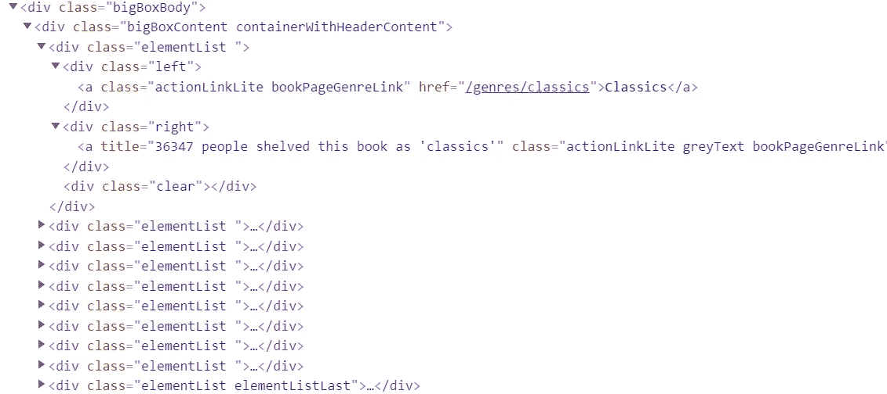

The HTML code corresponding to the web page section above

在没有完全理解这段代码的情况下，您可以理解它的含义。每一行都是一个可以包含子元素的元素。例如，名为“

的第一个元素包含关于我们的第一个流派“Classics”的子元素，包括它的名称和将这个标签添加到这本书的用户数量。

你可以在这里找到网络抓取[得到的最终数据集。它拥有超过 10，000 本科幻书籍的数据。这些数据包含了你能在图书展示页面上找到的最相关的信息，用户评论除外。这些数据所代表的时间段从乔纳森·斯威夫特(1726 年 10 月 28 日)的《格列佛游记》(游历了世界上几个偏远的国家)到安德烈·苏亚雷斯(2021 年初)的《先行者:反之亦然》系列。](https://www.kaggle.com/tanguypledel/science-fiction-books-subgenres)

我们的数据有哪些弱点？

我们数据的一个主要弱点是标签是由人类给出的，正如我们所知，**人类并不是完美无缺的，目标**。另一个弱点是数据的数量，即使 10，000 本书对一个人来说看起来很多，但它可能不足以让机器得出结论。

我们可以处理的另一类弱点是一些书籍上缺失和不相关的信息。这就是为什么我们需要清理我们的数据。请注意，网刮得越好，我们最终需要做的清洁工作就越少。

## 清理数据集

*清洗宝石……*

清理我们的数据与收集正确的数据一样重要，因为如果我们的数据集中有不相关的信息，我们的模型将表现不佳，并且在对其进行训练后会有偏差。

以下是我在数据集上运行的简单操作(没有数据集是完全相同的，因此需要不同的清理操作)。

*   从数据集中删除缺失的数据
*   从数据集中删除所有重复项
*   在我们的子分类数据集中可视化标签，以确定哪种类型可以被识别并用作我们模型的相关子分类

例如，时间旅行数据集的书籍分布表明，时间旅行很难与全球数据集的其他子类别重叠，因此可以被视为科幻小说的一个强有力的子类别。

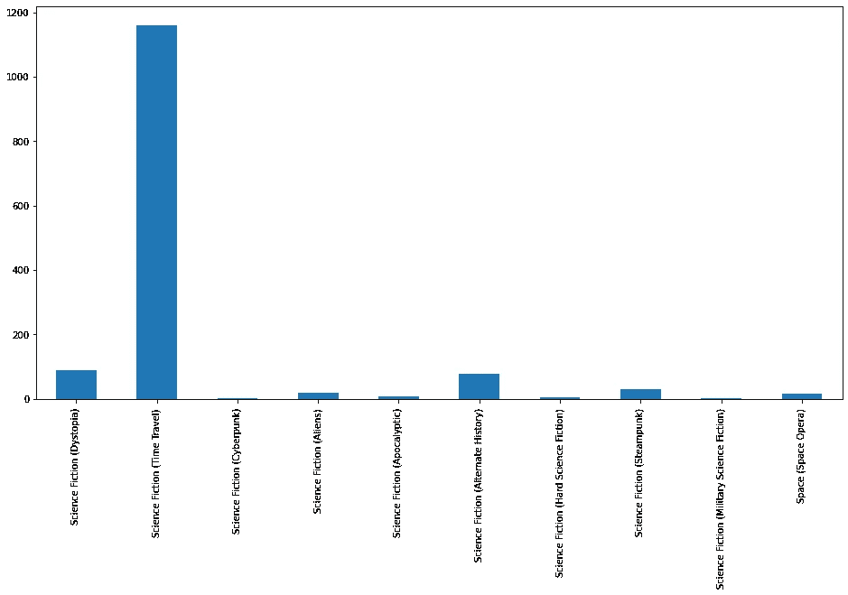

Subgenre distribution of the time travel dataset

另一方面，交替宇宙的书籍分布显示，这个子分类几乎从未被用户分配给一本书(~50 /1200+本书)。这可能有很多原因。这要么是因为网站的用户更喜欢(或被网站所引导)将关于交替宇宙的书籍添加到另一个类别中。或者在文献中根本没有很多关于交替宇宙的书。

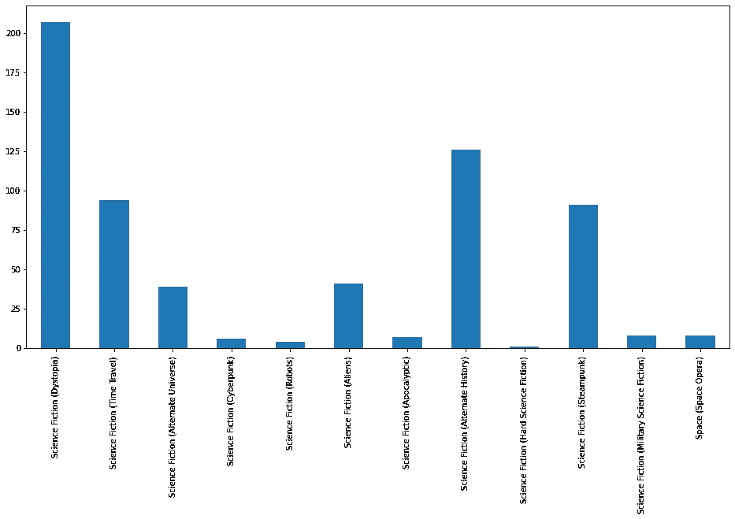

Subgenre distribution of the alternate universe dataset

无论如何，这意味着我们的模型试图预测这种类型是没有用的，因为我们没有很多数据，而且它似乎与其他子类型重叠。

*   因此，我们从数据集中删除硬 SF 和交替宇宙子分类
*   我们进行一些手动清理，去掉非英文的书籍描述。
*   我们还可以通过给一本书加标签(我们之前收集了这些信息)的最少 5 个人来过滤子类别，以减少由人为填充的数据引入的主观性偏差。

在这里，我们现在可以可视化我们的数据，这将帮助我们更好地了解我们的数据弱点，并加强我们与它的关系。

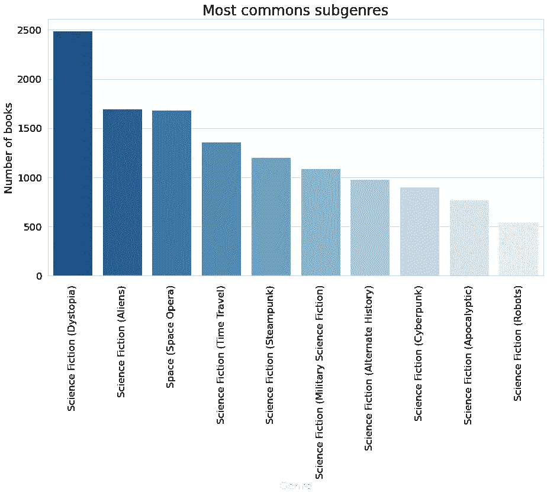

Plotting the distribution of subgenres of our dataset

我们可以注意到**我们的数据集是不平衡的**，属于反乌托邦子类别的书籍和属于机器人子类别的书籍之间的比例是 1:5。

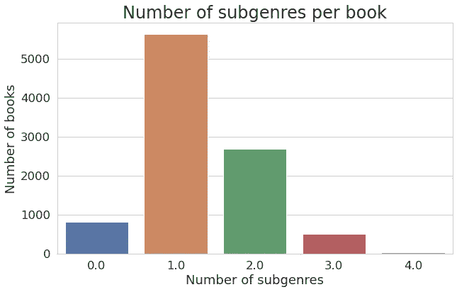

Plotting the number of subgenres per books of our dataset

从上面的可视化，我们了解到我们的数据集中的大多数书籍属于一个或两个科幻小说的子类。

然而，这种形象化告诉我们，一些书籍包含 0 个与科幻小说相关的子类别。虽然我知道我是按子类提取数据的。这些新信息增加了我们对数据提取的了解(因为我们自己做的)，帮助我们确定正在发生什么。

要么这些书被归类为特定的科幻小说子类别，但网站没有决定展示它，因为与其他类别相比，它不够重要，要么**还没有用户对这些书进行分类**，它们被网站放在这里，由网站自己对书籍进行分类。请注意，可能有另一种解释，一个好主意是浏览网站找到正确的解释。

无论如何，这些零账本都不是可信的数据。它们可能是不对应于任何流派的书籍，或者它们可能有一个没有出现的流派。
我把这个数据弱点留到现在，向你展示**可视化是更好地理解你的数据**的一个很好的方式，以及当它被添加到你的数据知识中时它会变得多么强大。

通过这个简单的操作，我们几乎将最终模型的准确性提高了 5%,这在商业环境中意义重大。

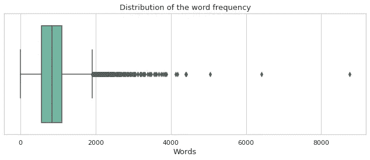

Plotting the number of words per book description

这个方框图告诉我们，我们的模型将主要在包含 0 到 2000 个单词的文本上进行训练。它可能会给我们一个未来的解释，为什么我们的文本在这种大小的文本上更有性能。

我们来打印一些数据吧！
以下是一本书的可用数据示例:

```
Book: Obsidian by Jennifer L. Armentrout (2011)Starting over sucks.When we moved to West Virginia right before my senior year, I’d pretty much resigned myself to thick accents, dodgy internet access, and a whole lot of boring… until I spotted my hot neighbor, with his looming height and eerie green eyes. Things were looking up.And then he opened his mouth.Daemon is infuriating. Arrogant. Stab-worthy. We do not get along. At all. But when a stranger attacks me and Daemon literally freezes time with a wave of his hand, well, something… unexpected happens. The hot alien living next door marks me.You heard me. Alien. Turns out Daemon and his sister have a galaxy of enemies wanting to steal their abilities, and Daemon’s touch has me lit up like the Vegas Strip. The only way I’m getting out of this alive is by sticking close to Daemon until my alien mojo fades. If I don’t kill him first, that is.Science Fiction (Aliens) : 1.0
Science Fiction (Dystopia) : 0.0
Science Fiction (Time Travel) : 0.0
Science Fiction (Cyberpunk) : 0.0
Science Fiction (Robots) : 0.0
Science Fiction (Apocalyptic) : 0.0
Science Fiction (Alternate History) : 0.0
Science Fiction (Steampunk) : 0.0
Science Fiction (Military Science Fiction) : 0.0
Space (Space Opera) : 0.0
```

这里我们有粗糙的钻石般的数据。它已经准备好进行预处理，以释放其真正的潜力。

## 所需的预处理步骤

*打磨钻石……*


Photo by [George Pagan III](https://unsplash.com/@gpthree?utm_source=medium&utm_medium=referral) on [Unsplash](https://unsplash.com?utm_source=medium&utm_medium=referral)

文本对机器来说不是有用的信息，就像我们看计算机的二进制代码没有用一样，0 和 1 是我们一眼就能看到的。

**这就是我们需要预处理的原因。**

首先，我们将转换文本，只保留对计算机有意义的信息。

*   删除文本描述中的干扰:标点符号、数字、单个字符、多个空格。
*   删除停用词

> **停用词**是任何语言中对句子没有多大意义的词。它们可以被安全地忽略，而不会牺牲句子的意义。对于一些搜索引擎，这些是一些最常见的短功能词，如，是，在，这，等等。

对于这个预先存在的停用词列表，我们添加了个性化的停用词，这些停用词对于确定我们的书籍的子类别没有用处，只会在我们的数据中添加噪声。例如(从、作者、小说、系列、卷……)。

这是删除停用词后的文本，你可以看到它对人类来说失去了一些意义，但实质意义仍然存在。

```
['starting', 'sucks', 'moved', 'west', 'virginia', 'right', 'senior', 'year', 'pretty', 'much', 'resigned', 'thick', 'accents', 'dodgy', 'internet', 'access', 'whole', 'lot', 'boring', 'spotted', 'hot', 'neighbor', 'looming', 'height', 'eerie', 'green', 'eyes', 'things', 'looking', 'opened', 'mouth', 'daemon', 'infuriating', 'arrogant', 'stab', 'worthy', 'get', 'along', 'stranger', 'attacks', 'daemon', 'literally', 'freezes', 'time', 'wave', 'hand', 'well', 'something', 'unexpected', 'happens', 'hot', 'alien', 'living', 'next', 'door', 'marks', 'heard', 'alien', 'turns', 'daemon', 'sister', 'galaxy', 'enemies', 'wanting', 'steal', 'abilities', 'daemon', 'touch', 'lit', 'like', 'vegas', 'strip', 'way', 'getting', 'alive', 'sticking', 'close', 'daemon', 'alien', 'mojo', 'fades', 'kill', 'first']
```

*   使文本词汇化

> 而词干算法的工作原理是，考虑到在屈折词中可以找到的常见前缀和后缀的列表，切断单词的结尾或开头。这种不分青红皂白的切割在某些场合可以成功，但并不总是如此。
> 
> 在我们的例子中，“开始”会变成“开始”。
> 
> **另一方面，词汇化**考虑了单词的形态分析。为此，需要有详细的字典(如 WordNetLemmatizer ),算法可以通过这些字典将表单链接回其引理。
> 
> 有了词汇化，“更好”就会变成“好”。

这一步将更容易将相同性质的概念和单词重新组合在一起。这是我们的例子在变元化后的样子:

```
['start', 'suck', 'move', 'west', 'virginia', 'right', 'senior', 'year', 'pretty', 'much', 'resign', 'thick', 'accent', 'dodgy', 'internet', 'access', 'whole', 'lot', 'boring', 'spot', 'hot', 'neighbor', 'loom', 'height', 'eerie', 'green', 'eye', 'thing', 'look', 'open', 'mouth', 'daemon', 'infuriate', 'arrogant', 'stab', 'worthy', 'get', 'along', 'stranger', 'attack', 'daemon', 'literally', 'freeze', 'time', 'wave', 'hand', 'well', 'something', 'unexpected', 'happens', 'hot', 'alien', 'living', 'next', 'door', 'mark', 'heard', 'alien', 'turn', 'daemon', 'sister', 'galaxy', 'enemy', 'want', 'steal', 'ability', 'daemon', 'touch', 'lit', 'like', 'vega', 'strip', 'way', 'get', 'alive', 'stick', 'close', 'daemon', 'alien', 'mojo', 'fade', 'kill', 'first']
```

然后我们可以用词云来形象化我们的词频。

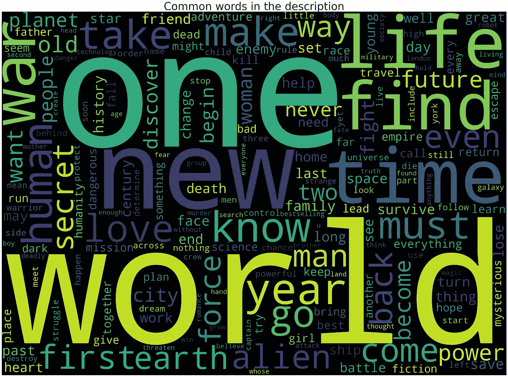

我们预处理的最后一步将是**单词嵌入**。
这基本上意味着我们将把我们的文本转换成一个数字向量，这样机器就可以对它进行操作。

我们可以给每个单词分配一个随机数，但是我们也可以使用这个步骤来增强每个数字中包含的信息。为此，我们将使用名为 **TF-IDF、**的单词嵌入技术，尽管您必须知道还有其他单词嵌入方法，如 BOW、GloVe、Word2Vec、ELMo…

> **TF，**词频的简称，定义为一个词在文档中出现的总次数。TF 的计算方法是使用术语在文档中出现的次数除以术语总数。一个术语在文档中出现得越多，这个术语对文档的重要性就越大。
> 
> 由于 **TF 有时倾向于强调错误的术语**，所以引入 IDF 来平衡术语权重。
> 
> **IDF，**是逆文档频率的缩写，被定义为包含该单词的图书图的[对数标度](https://en.wikipedia.org/wiki/Logarithmic_scale)逆分数。换句话说，它衡量这个术语提供了多少信息。

TF-IDF 得分通过 TF 乘以 IDF 获得。
**TF-IDF 得分越大，该词在图书情节中的相关性越大。**

在我们的例子中，我们将 TF-IDF 限制为 10，000 个单词，以便减少我们的模型的计算时间，并且只保留最重要的单词。

我们的数据现在可以交给机器学习算法了。

# 使用的机器学习模型

*创造一个良好的环境来放大我们的钻石……*


Photo by [Sabrinna Ringquist](https://unsplash.com/@sabrinnaringquist?utm_source=medium&utm_medium=referral) on [Unsplash](https://unsplash.com?utm_source=medium&utm_medium=referral)

在这一部分，我将只向您展示一个达到良好精度的模型，尽管其他模型会达到更好的精度，稍后我将向您展示。

**分割我们的数据集**

在建立模型之前，我们需要做的第一件事是划分数据集。因为我们没有太多的数据，所以我们将坚持 80/20 规范，将数据集分成训练集和验证集。

我们将使用 80%的数据集来训练我们的模型，20%用于验证，以查看模型如何处理它以前从未见过的数据。这种方法的目的是，我们不会认为我们的模型在接受训练时表现很好。这就像给学生一个已经在课堂上看过的练习作为考试，你不会验证他是否学到了什么，只会验证他对以前看过的例子的记忆。

如果我们想要更加严格，我们还可以保留一部分数据集，用以前从未见过的数据“一次性”测试模型。但我不会这样做，因为我只有一些数据，测试将在您尝试演示器时完成。

PS:在我们的例子中，我们可以使用分层抽样在两个输出数据集中保持不平衡数据集的表示。

**逻辑回归**

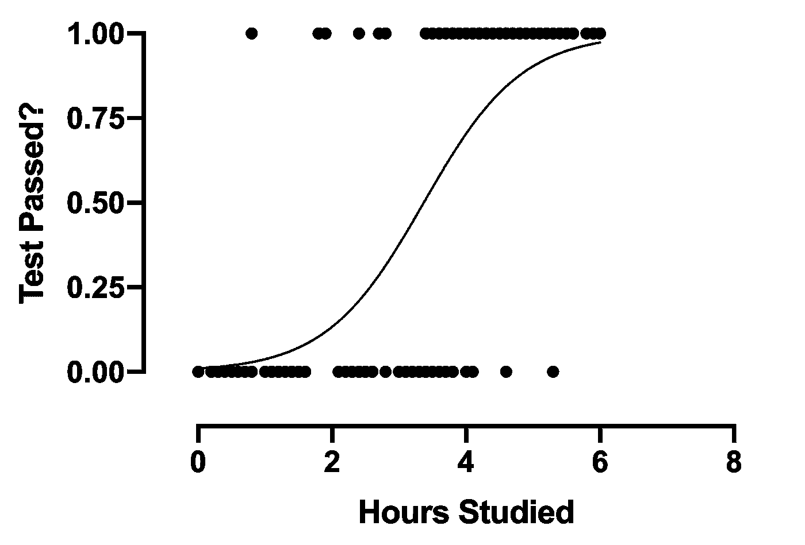

1-Feature Logistic Regression

> 逻辑回归(也称为 Logit 回归)通常用于估计实例属于特定类别的概率(例如，此电子邮件是垃圾邮件的概率是多少？).如果估计的概率大于 50%，则模型预测该实例属于该类(称为正类，标记为“1”)，否则它预测它不属于该类(即，它属于负类，标记为“0”)。这使它成为一个二元分类器。
> **用 Scikit-Learn 和 TensorFlow 进行动手机器学习
> 【奥雷连·盖伦】**

因此，我们的算法将尝试创建 sigmoid 曲线，以给出最佳结果来匹配点的最大值。在上图中，逻辑回归仅应用于单要素数据集，但它可以推广到我们想要的任意多个要素(即维度)。

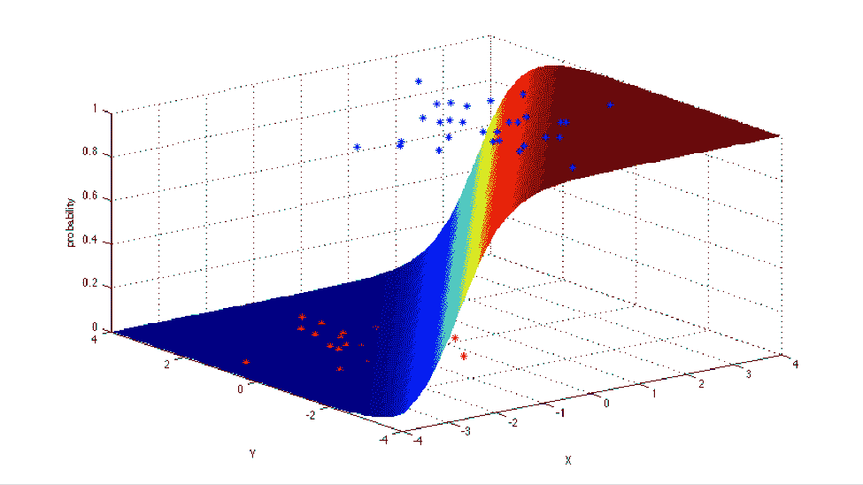

2-Features Logistic Regression

上面，你可以看到有两个特征的逻辑回归。在我们的例子中，我们有 10，000 个输入要素。我只能让你想象这种表现的复杂性，因为我们生活在一个 3D 世界。

一旦完成训练，逻辑回归模型将计算 10，000 个输入特征的加权和(加上一个偏差项)，并输出该结果的逻辑(0 到 1 之间的分数)。默认情况下，如果这个分数优于 0.5，那么我们的模型的确定性输出将是 1(意味着该文本被分类为对该 SF(子分类)是肯定的)，否则输出将是 0(该文本不属于该子分类)。

现在我们有了模型，我们可以优化它了！


由于我们的模型将使用不平衡数据(正如我们之前看到的)，所以使用**“class _ weight”超参数**是个好主意。如果算法在不平衡的子分类上做出错误的预测，它将对算法造成更大的惩罚。

这种技术用于对抗逻辑回归可以选择将一切分类为 0 并获得 90%准确性的事实，因为我们的数据中一半的子类别包含少于 1000 个出现。对于“机器人”子类别，算法将所有事物分类为 0 并达到 95%的准确率(9500/10000)将非常容易，但它没有预测能力。

**C 是正则化强度的倒数**。像在 SVM(支持机器向量)，较小的值指定更强的正则化。这将有助于我们避免适配不足/适配过度。

0.5 的**概率阈值**可以改变为 0 到 1 之间的任何值。它将改变我们的分类性能。
一方面，接近 0 的概率阈值将会把更多的图书情节分类为对某个子分类为肯定的，这意味着在我们的结果中可能会有更多的假阳性(子分类在它不存在时被检测到)。
另一方面，接近 1 的概率阈值将更具选择性，并且只对其有很大把握的图书情节进行分类，但是这将导致我们的结果中更多的假阴性。

**评估我们的算法** *评估珠宝价值……*


以下是我们将用来评估模型性能的指标。

*   **准确性** —准确性是最常见的指标。然而，这在很大程度上是由我们在这个案例和大多数商业案例中拥有的大量真正的负面因素造成的。

> *准确度(A):每个实例的准确度被定义为预测的正确标签与该实例的标签总数(预测的和实际的)的比例。总体准确性是所有实例的平均值。*

*   **F1 分数** —如果我们需要在精确度和召回率之间寻求平衡，并且存在不均匀的类别分布(大量实际否定)，F1 分数可能是一个更好的衡量标准。

> *Precision (P): Precision 是正确预测的标签占实际标签总数的比例，是所有实例的平均值*
> 
> *召回率(R):召回率是在所有实例上平均的预测标签总数中正确预测的标签的比例。*

*   **海明损失** —被错误预测的标签的比例。在不平衡数据集的情况下带来额外的信息。

> *汉明损失(HL):汉明损失报告平均有多少次错误地预测了实例与类别标签的相关性。因此，汉明损失考虑了预测误差(预测了不正确的标签)和缺失误差(未预测的相关标签)，在总类数和总样本数上进行归一化。*

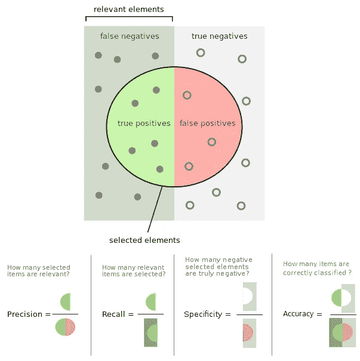

Metrics representation

准确度、精确度、召回率和 F1 分数的值越高，学习算法的性能越好。

理想情况下，我们期望汉明损失 HL = 0，这意味着没有错误；实际上，汉明损失的值越小，学习算法的性能越好。

以下是我们模型的结果(一个子属一个模型):

```
Science Fiction (Dystopia) 
Accuracy =  0.8613402061855671
F1 =  0.8613402061855671
Hamming loss =  0.138659793814433

Science Fiction (Time Travel) 
Accuracy =  0.9422680412371134
F1 =  0.9422680412371134
Hamming loss =  0.0577319587628866

Science Fiction (Cyberpunk) 
Accuracy =  0.9412371134020618
F1 =  0.9412371134020618
Hamming loss =  0.058762886597938144

Science Fiction (Robots) 
Accuracy =  0.9690721649484536
F1 =  0.9690721649484536
Hamming loss =  0.030927835051546393

Science Fiction (Aliens) 
Accuracy =  0.9211340206185566
F1 =  0.9211340206185566
Hamming loss =  0.0788659793814433

Science Fiction (Apocalyptic) 
Accuracy =  0.9577319587628866
F1 =  0.9577319587628866
Hamming loss =  0.042268041237113405

Science Fiction (Alternate History) 
Accuracy =  0.934020618556701
F1 =  0.9340206185567009
Hamming loss =  0.06597938144329897

Science Fiction (Steampunk) 
Accuracy =  0.9458762886597938
F1 =  0.9458762886597938
Hamming loss =  0.05412371134020619

Science Fiction (Military Science Fiction) 
Accuracy =  0.95
F1 =  0.9500000000000001
Hamming loss =  0.05

Space (Space Opera) 
Accuracy =  0.9360824742268041
F1 =  0.9360824742268041
Hamming loss =  0.06391752577319587
```

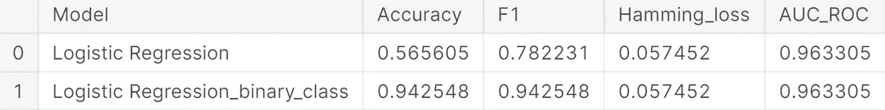

在上表中，我们可以看到平均的 10 个二元分类器逻辑回归的评估指标，其给出了独立预测每个流派的 93.5%的准确度**。**

**该表的第一行显示了 10 个逻辑回归模型一起的性能。0.529 的准确度意味着该模型能够在 53%的时间里准确预测一本书的每 10 个流派**。77%的 F1 分数更难解释，但我们仍然可以说，即使我们没有完美地预测每 10 个流派，**我们经常选择正确的子流派**(大量的真阳性)。****

**在下图中，我们可以看到，将我们的模型的概率阈值增加到 0.5 以上，会略微增加其准确性和 f1 分数。**

**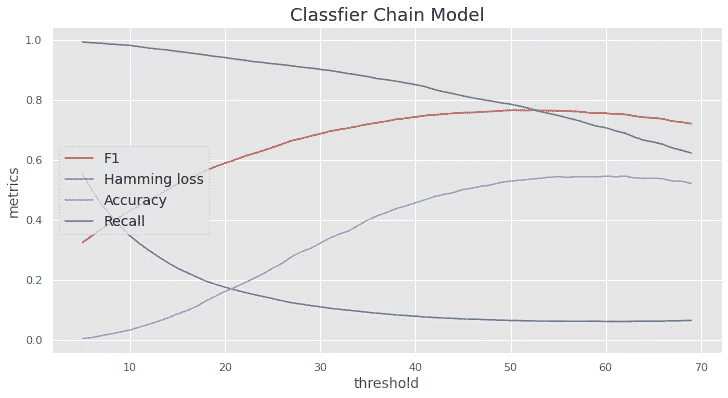**

# **特征重要性:我们模型的解释**

***了解珠宝背后的故事……***

**获得一个高性能的模型是一回事。能够解释它是另一回事。**

**解释一个模型的一种方式是**探索它的特性重要性**(意味着哪些特性对模型是最具决定性的)。在我们的例子中，我们可以查看最具决定性的单词来说明某个文本是某个特定子类别的一部分，也可以查看决定性的单词来说明某个文本不属于某个特定子类别。**

**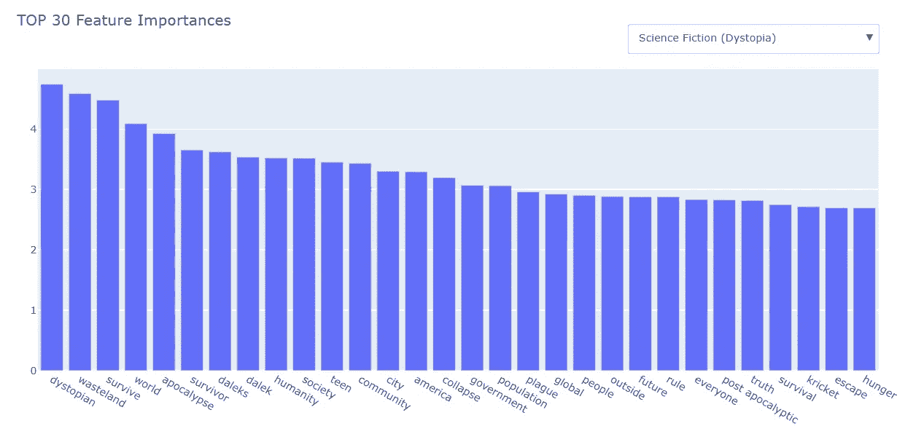****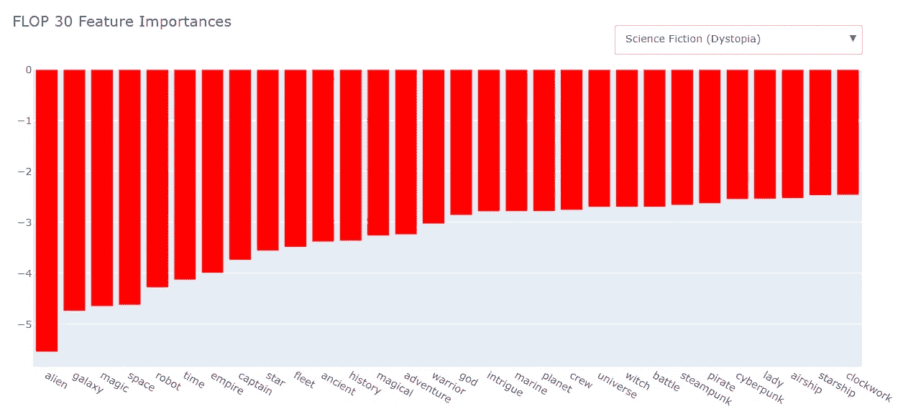**

**对于反乌托邦类型，正如我们所料，如果有人让我们思考反乌托邦，我们会想到像“荒地”、“生存”、“天启”、“统治”这样的词。**

**但是也有其他的词让我们更好的理解这个模型是如何工作的，并且可能是有偏见的。它整合了达雷克斯(神秘博士的外星种族)、青少年、美洲和蟋蟀与反乌托邦的联系。**

**这是一个双重对冲能力，因为这个模型已经整合了我们文化的元素，达雷克斯的流行文化，启示录(蟋蟀)和反乌托邦文学的现状(主要是关于美国青少年的)。但是并不是每本关于青少年的书都是关于反乌托邦的(反之亦然)。美洲、蟋蟀或许还有达雷克斯也是如此。**

**同样的批评也适用于 30 个最不重要的特征。**

# **结论**

**现在，您已经更好地理解了创建这种 NLP 模型的整个过程，您将能够更好地理解用 Flask(一种用于构建 web 应用程序的 python 框架)构建的演示器上显示的信息。**

 **[## 科幻小说-分析器

### 演示器

单击此处尝试模型演示](https://sf-books-analyser.herokuapp.com/)** 

**我已经在这个数据集上尝试和调优了 10 多个模型，尽管逻辑回归是实现起来最简单的模型之一，它排名第四。**

****分类器链** 第三个性能最好的模型(分类器链)也是使用逻辑回归。分类器链的基本思想是**建立二元分类器链**(在我们的例子中是逻辑回归模型)C0，C1。。。，Cn。**

**链中的每个新分类器使用先前分类器的预测来进行新的预测。**该方法允许模型考虑标签相关性。在我们的情况下，这是一个游戏规则的改变，因为一些标签是相关的，也就是说，太空歌剧故事可能有更多的机会也涉及外星人。****

**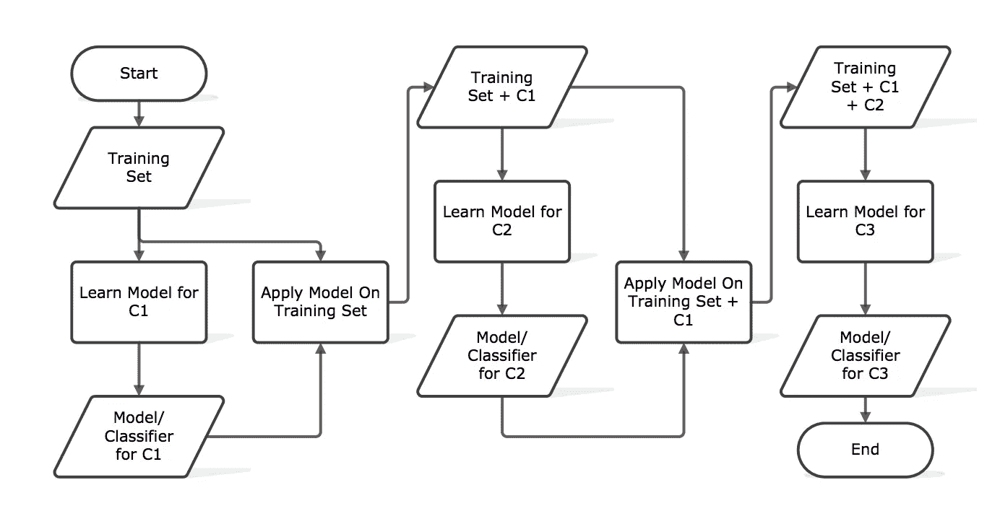**

**Scheme of the way a classifier chain works**

**这项技术比简单的逻辑模型获得了更好的准确性分数(+3%)，即使它降低了 f1 分数。如果你想知道这是否是一个可接受的权衡，我会说这取决于模型的目标。在我们的情况下，接受它似乎很好。**

**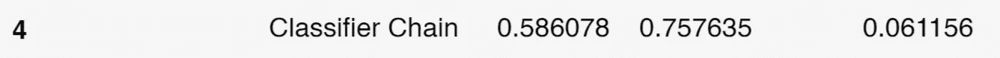**

****Bert 模型** 我们任务中性能最好的模型是一个叫做 Bert 的深度学习模型。BERT(***B****I directional****E****n coder****R****presentations from***transformers)*是最先进的型号。它可以比以前的模型表现得更好，因为它学习文本中单词(或子单词)之间的上下文关系。***

> ***与顺序读取文本输入(从左到右或从右到左)的方向模型相反，Transformer 编码器一次读取整个单词序列。因此，它被认为是双向的，虽然说它是非定向的会更准确。这一特性允许模型基于单词的所有周围环境(单词的左侧和右侧)来学习单词的上下文。***

***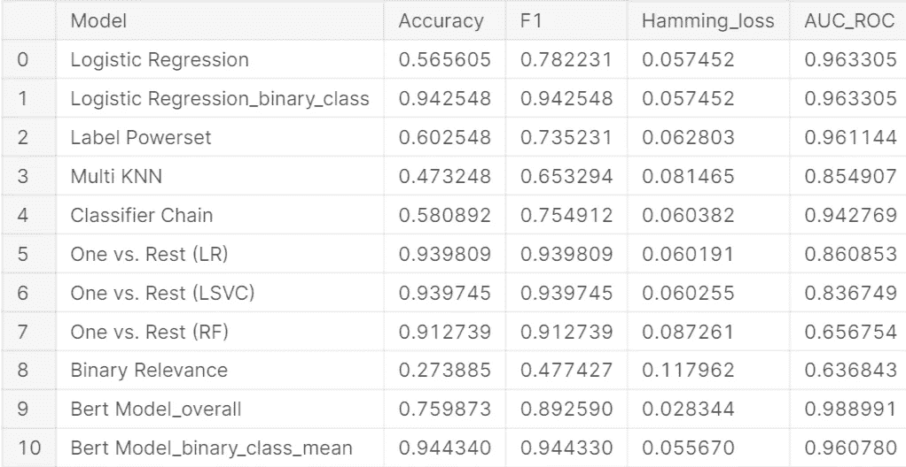***

***我希望你在给我读书的时候过得愉快，并且学到了一些东西。
如果你做到了，不要犹豫，拍拍 x50！***

*****轮到你从头到尾建立自己的机器学习项目了！**
你可以在 [LinkedIn](https://www.linkedin.com/in/tanguy-pledel) 上和我分享你的数据科学项目。***

******

***Photo by [Katarzyna Pe](https://unsplash.com/@kasiape?utm_source=medium&utm_medium=referral) on [Unsplash](https://unsplash.com?utm_source=medium&utm_medium=referral)***

***如果你认为这篇文章有任何可以改进的地方，请告诉我。***

***[数据集链接](https://www.kaggle.com/tanguypledel/science-fiction-books-subgenres) [笔记本链接](https://www.kaggle.com/tanguypledel/sf-books-eda-genre-classification)
[演示者链接](https://sf-books-analyser.herokuapp.com/)***