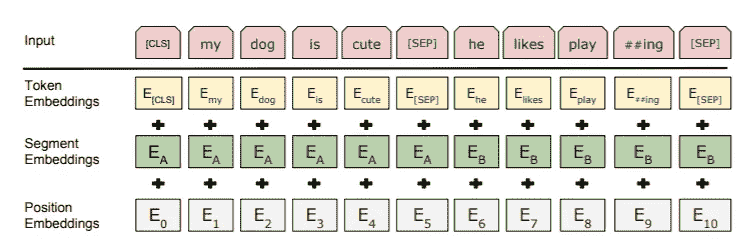
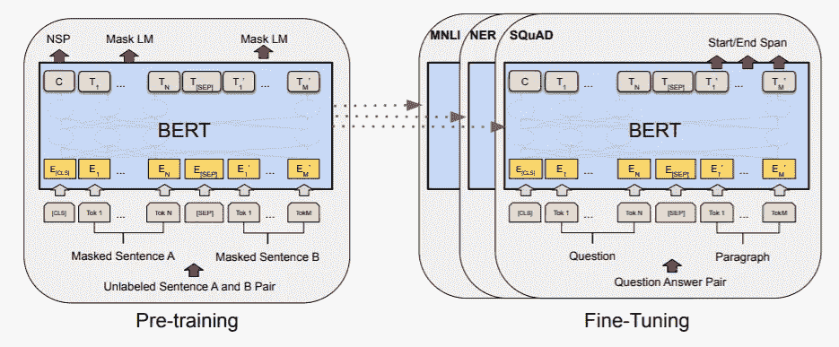

# 通过 Pytorch 使用 BERT

> 原文：<https://medium.com/mlearning-ai/using-bert-with-pytorch-b9624edcda4e?source=collection_archive---------0----------------------->

## 一个超级简单实用的指南，使用 Pytorch 构建你自己的基于 BERT 的架构。


Bert image — sesame street

在这篇文章中，我假设你知道 BERT 模型和原理。如果没有，我强烈建议你阅读这篇文章[1]和这篇文章,或者听听我关于情境化嵌入的演讲。如果您仍然缺少一些背景知识，您可能需要阅读位置嵌入和转换器。

在本帖中，你会发现一个超级简单实用的指南，其中包含使用 Pytorch 构建你自己的微调过的基于 BERT 的架构的代码示例。我们将使用 https://github.com/huggingface/pytorch-pretrained-BERT[的](https://github.com/huggingface/pytorch-pretrained-BERT)奇妙套装。

如果你理解 BERT，你可能会发现你需要在你的代码中采取这两个步骤:标记样本和构建你自己的微调架构。

1.  对样品进行标记(BPE):

伯特使用了一种特殊的词汇化(BPE)。此外，根据你的任务，每个句子可以在第一句的开头用[CLS]填充，在每个句子的结尾用[SEP]标记填充。
【CLS】标记主要用于分类任务，而【SEP】标记用于 SNLI 或问答等任务的多个句子。



BERT input presentation [1]

```
**from** pytorch_pretrained_bert.tokenization **import** BertTokenizertokenizer = BertTokenizer.from_pretrained(args.bert_model, do_lower_case=args.do_lower_case)def get_tokenized_samples(samples, max_seq_length, tokenizer):
    *"""
    we assume a function* ***label_map*** *that maps each label to an index or vector encoding. Could also be a dictionary.* ***:param***samples*: we assume struct {.text, .label)* ***:param*** *max_seq_length: the maximal sequence length* ***:param*** *tokenizer: BERT tokenizer* ***:return****: list of features
    """* 
    features = []
    for sample in samples:
        textlist = sample.text.split(' ')
        labellist = sample.label
        tokens = []
        labels = []
        for i, word in enumerate(textlist):
            token = tokenizer.tokenize(word) #tokenize word according to BERT
            tokens.extend(token)
            label = labellist[i]
            # fit labels to tokenized size of word
            for m in range(len(token)):
                if m == 0:
                    labels.append(label)
                else:
                    labels.append("X")
        # if we exceed max sequence length, cut sample
        if len(tokens) >= max_seq_length - 1:
            tokens = tokens[0:(max_seq_length - 2)]
            labels = labels[0:(max_seq_length - 2)]

        ntokens = []
        segment_ids = []
        label_ids = []
        # start with [CLS] token
        ntokens.append("[CLS]")
        segment_ids.append(0)
        label_ids.append(label_map(["[CLS]"]))
        for i, token in enumerate(tokens):
            # append tokens
            ntokens.append(token)
            segment_ids.append(0)
            label_ids.append(label_map(labels[i]))
        # end with [SEP] token
        ntokens.append("[SEP]")
        segment_ids.append(0)
        label_ids.append(label_map(["[SEP]"]))
        # convert tokens to IDs
        input_ids = tokenizer.convert_tokens_to_ids(ntokens)
        # build mask of tokens to be accounted for
        input_mask = [1] * len(input_ids) 
        while len(input_ids) < max_seq_length:
            # pad with zeros to maximal length
            input_ids.append(0)
            input_mask.append(0)
            segment_ids.append(0)
            label_ids.append([0] * (len(label_list) + 1))

        features.append((input_ids,
                              input_mask,
                              segment_ids,
                              label_id))
    return features
```

2.基于 BERT 构建您自己的架构

与传统的嵌入不同，BERT 嵌入是与上下文相关的，因此我们需要依赖预训练的 BERT 架构。在完整句子分类任务中，我们在[CLS]标记的输出之上添加一个分类层。在序列标记中，我们需要序列的完整输出。这个简单的例子是一个序列标签。



Fine Tune BERT pre-training to your task [1]

```
from pytorch_pretrained_bert.modeling import BertPreTrainedModel, BertModelclass MyBertBasedModel(BertPreTrainedModel):
    *"""
    MyBertBasedModel inherits from BertPreTrainedModel which is an abstract class to handle weights initialization and
        a simple interface for downloading and loading pre-trained models.
    """* def __init__(self, config, num_labels):
        super(MyBertBasedModel, self).__init__(config)
        self.num_labels = num_labels
        self.bert = BertModel(config) # basic BERT model
        self.dropout = torch.nn.Dropout(config.hidden_dropout_prob)
        self.classifier = torch.nn.Linear(config.hidden_size, num_labels)
        self.apply(self.init_bert_weights)

    def forward(self, input_ids, token_type_ids=None, attention_mask=None, labels=None):
        sequence_output, _ = self.bert(input_ids, token_type_ids, attention_mask, output_all_encoded_layers=False)
        # now you can implement any architecture that receives bert sequence output
        sequence_output = self.dropout(sequence_output)
        logits = self.classifier(sequence_output)

        if labels is not None:
            loss_fct = MyLoss()
            # it is important to activate the loss only on un-padded inputs
            active_loss = attention_mask.view(-1) == 1
            active_logits = logits.view(-1, self.num_labels)[active_loss]
            active_labels = labels.view(-1, self.num_labels)[active_loss]
            loss = loss_fct(active_logits, active_labels)
            return loss
        else:
            return logits
```

3.这一切是如何结合在一起的

```
train_tokenized_samples = get_tokenized_samples(
    train_samples, args.max_seq_length, tokenizer)model = MyBertBasedModel.from_pretrained(args.bert_model,
          num_labels = num_labels)model.train()
for range(n_epochs):
    for sample in train_tokenized_samples:
        input_ids, input_mask, segment_ids, label_ids = sample
        loss = model(input_ids, segment_ids, input_mask, label_ids)
        loss.backward()
        optimizer.step()
```

我希望这使得在 Pytorch 中使用预先训练好的 BERT 模型更加容易。

[1]伯特:语言理解深度双向变形金刚前期训练:雅各布·德夫林，张明蔚，肯顿·李，克里斯蒂娜·图塔诺娃:[https://arxiv.org/abs/1810.04805](https://arxiv.org/abs/1810.04805)，2018

[](/mlearning-ai/mlearning-ai-submission-suggestions-b51e2b130bfb) [## Mlearning.ai 提交建议

### 如何成为 Mlearning.ai 上的作家

medium.com](/mlearning-ai/mlearning-ai-submission-suggestions-b51e2b130bfb) 

[成为 ML 写手](/mlearning-ai/mlearning-ai-submission-suggestions-b51e2b130bfb)