# 用数据科学揭示可可的开发。

> 原文：<https://medium.com/mlearning-ai/using-data-science-to-uncover-the-exploitation-of-cocoa-604d9bd1c60e?source=collection_archive---------4----------------------->

> “在某种程度上，不发达是一个悖论。世界上许多自然资源丰富的地区实际上是贫穷的，而土壤和底土资源不那么丰富的地区却享受着最高的生活水平。”
> 
> 沃尔特·罗德尼

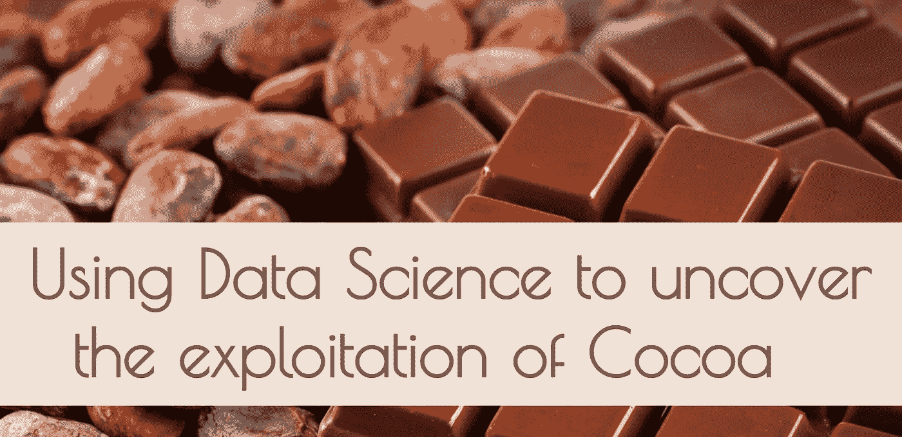

Using Data Science to uncover the exploitation of Cocoa

# 介绍

不知道是什么激发了你的好奇心，让你看到了这篇文章，也许是对可可的兴趣，也许是对数据科学的兴趣，不管是什么，我肯定这与我为什么决定做这个分析有关。我来自喀麦隆，它也是一个可可出口国，我们也生产自己的巧克力，只是没有比利时巧克力受欢迎，但对我来说味道肯定更好。

在我成长的过程中，我总是听父亲提到出口可可的价格是多么不公平，不值得投资。所以我决定挖掘数据，为自己找到真相，并想与其他好奇的人分享我的发现。享受，请留下反馈和/或你自己的意见。

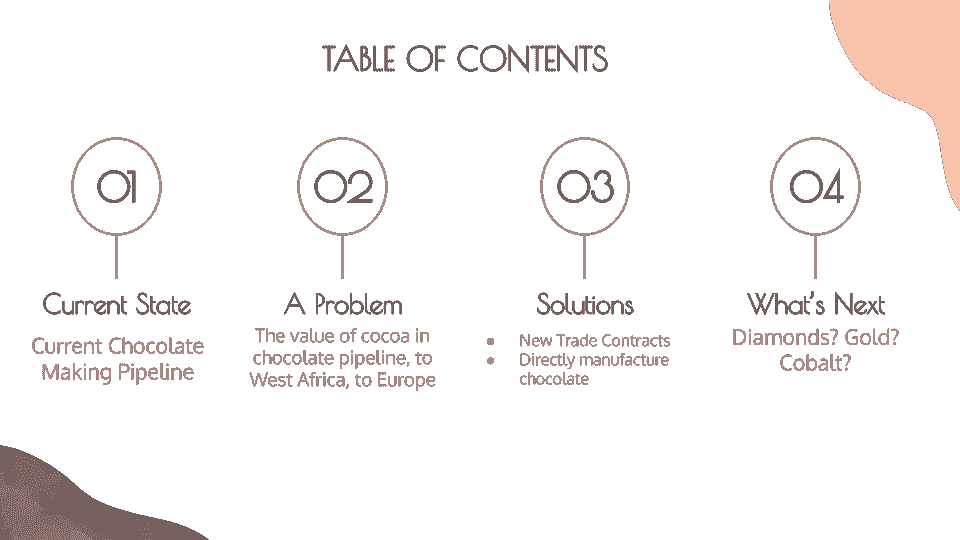

Table of Contents

# 1.初速电流状态

回顾 20 年的可可贸易数据，我发现在过去的 20 年中，世界可可供应量的 70%来自非洲，其中仅象牙海岸和加纳就供应了约 50%。而这种可可的最大进口国是欧洲，荷兰、德国和欧洲联盟约占总进口量的 80%。

遵循贸易数据(价值和数量)并关注最大出口和进口国的当前巧克力管道的简化模型如下所示:

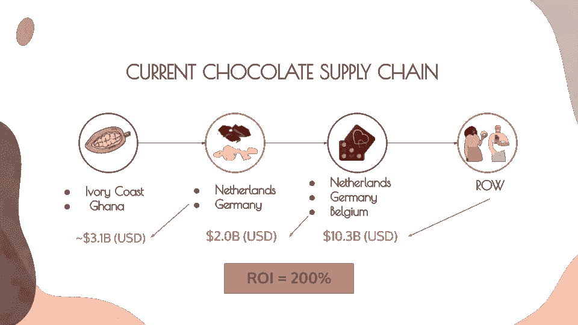

chocolate supply chain

# 2.一个问题

沿着可可到其主要终端产品“巧克力”的旅程，我有了四个主要发现；

一、尽管可可是巧克力最重要的成分(约占巧克力含量的 75%)，但它仅占巧克力管道贸易价值的 20%。

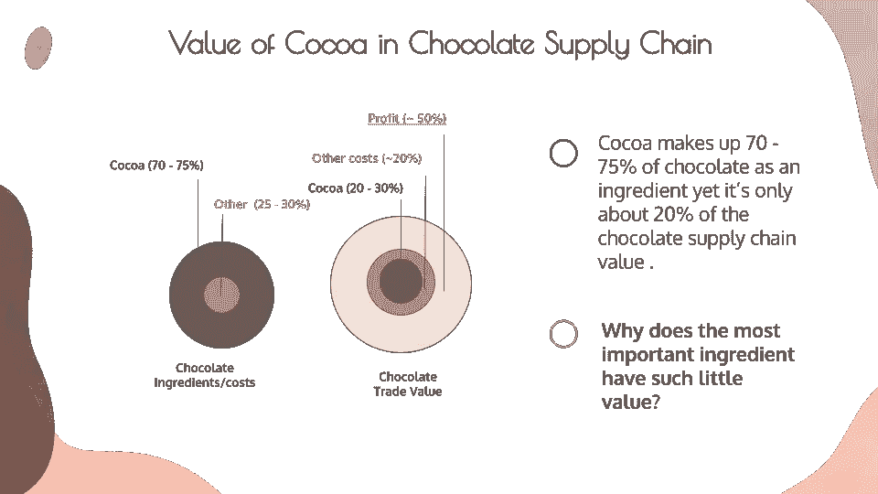

***二世。可可对其出口商的 GDP 的影响比巧克力对其出口商的 GDP 的影响更大，然而他们从可可中获得的利润是次优的。***

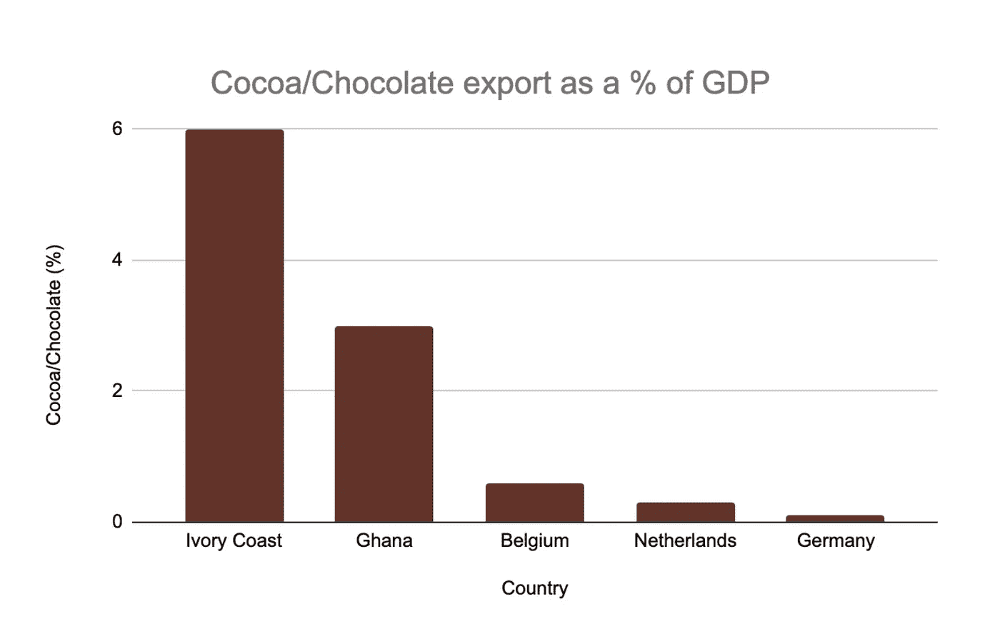

Cocoa/Chocolate as a % of GDP

***三世。非洲错过了巧克力生意的投资回报。***

下面的图表显示了德国、比利时和荷兰进口的以美元计的可可进口值，以及这些国家生产的以美元计的巧克力出口值，仅这一项就显示了巧克力行业的利润有多高，而对可可的投资却很少。

*   **【注意:将它们垂直堆叠，以便更好地查看标签，并为更多上下文添加标题】**

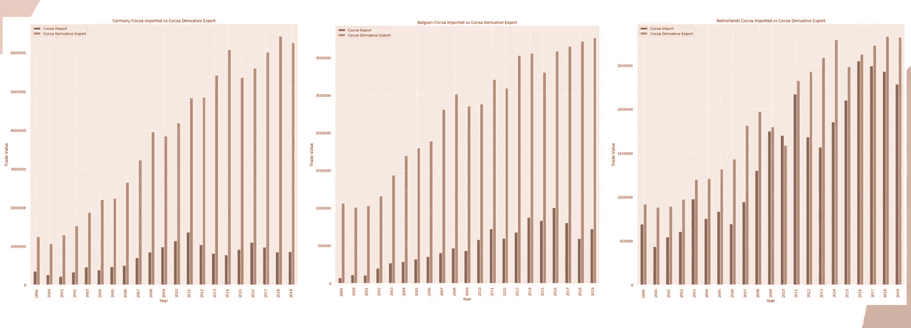

***四世。欧洲在制作巧克力甚至可可方面比非洲在种植可可方面获得了更多的文化认可。***

首先，直接食用巧克力自然比可可更受欢迎，但更有趣的是，即使是对可可的搜索也与非洲以外的国家相关，正如下面的谷歌趋势图所示，尽管约 70%的可可来自非洲。

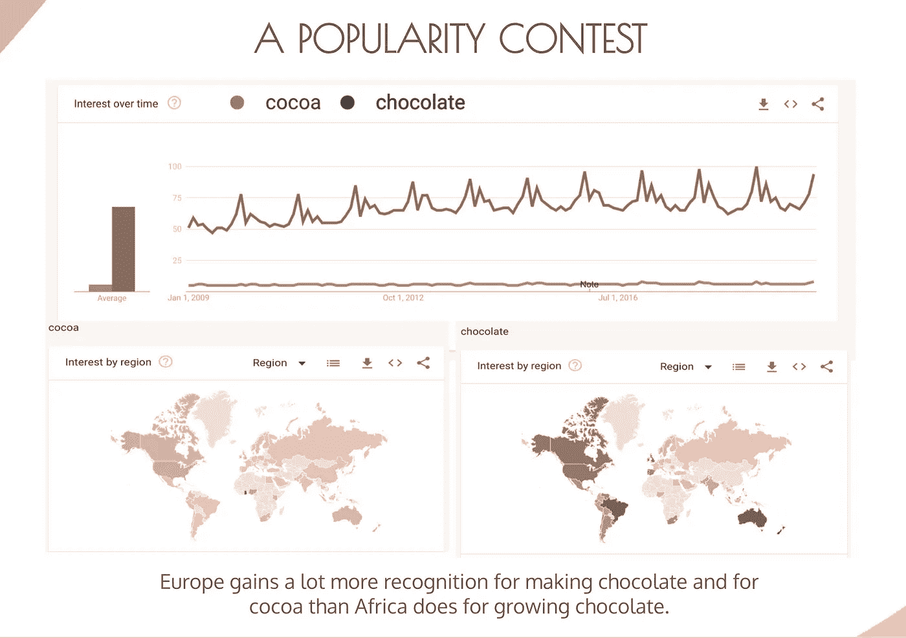

Comparison between Europe’s chocolate recognition vs Africa’s cocoa recognition

# 3.解决方法

回顾象牙海岸和加纳贸易改革的影响，以及 2012 年至 2013 年间发生的可可短缺(如下图所示)，我们可以推断出如果象牙海岸和加纳要么提高可可豆价格，要么停止出口可可豆并生产自己的巧克力，将会发生两件事。

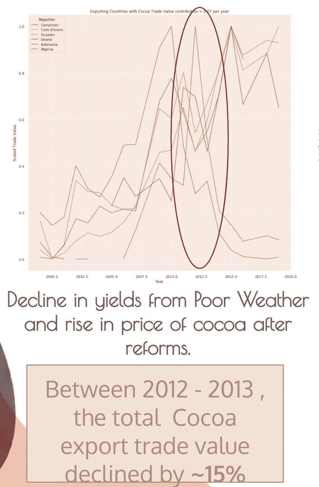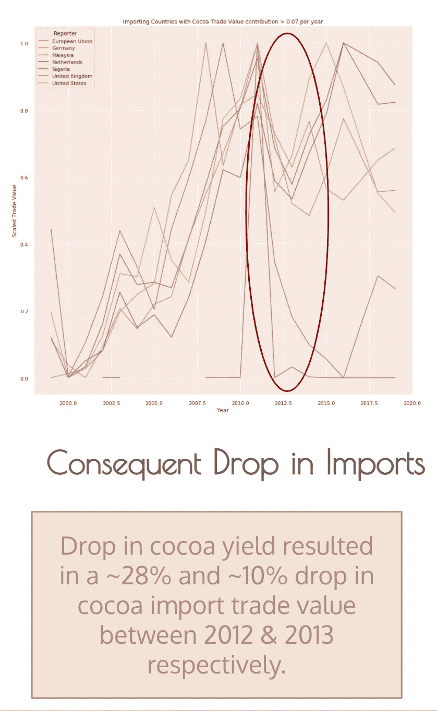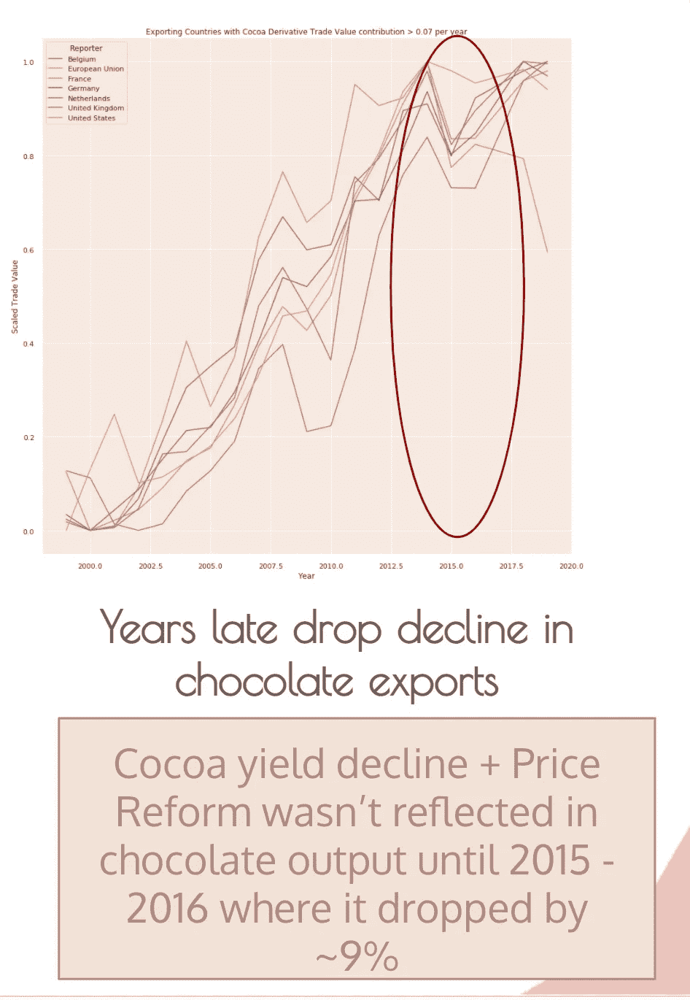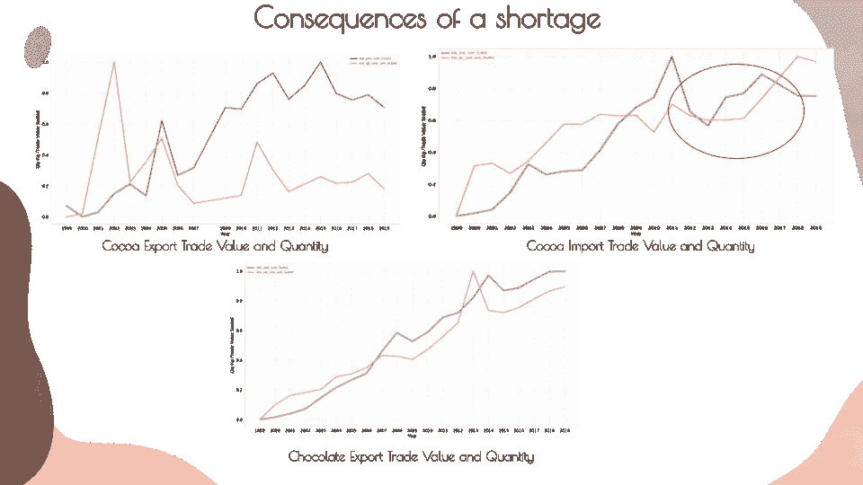

1 如果 2019 年占可可出口总量约 23%的加纳停止出口可可并开始生产自己的巧克力，我们可以预计在加纳做出决定后的两年内，在大多数未来合同到期后，欧洲对**的巧克力出口将下降** **13.8%** 。这也将导致加纳可可对 GDP 的贡献增加 100 个基点，而欧洲最大的巧克力出口国的 GDP 几乎保持不变。

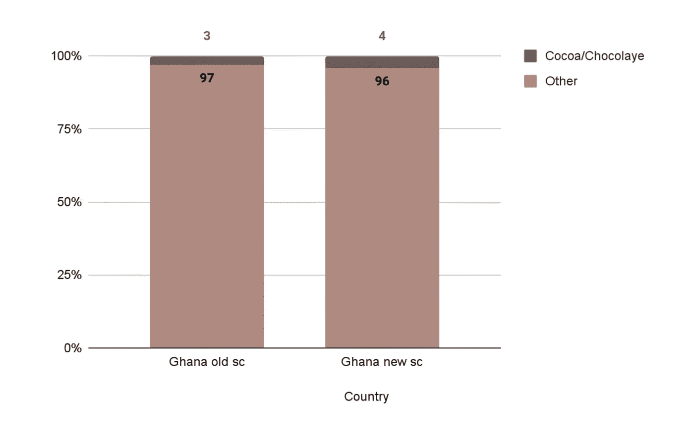

Impact of Cocoa on GDP

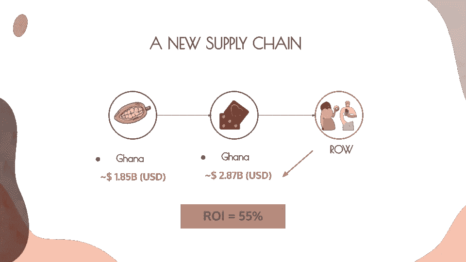

Supply Chain with Ghana as a chocolate Maker

如果可可的定价更加公平，比如说是现在价格的两倍，欧洲在巧克力上仍然可以获得 71%的投资回报率，而几乎不会影响其 GDP。

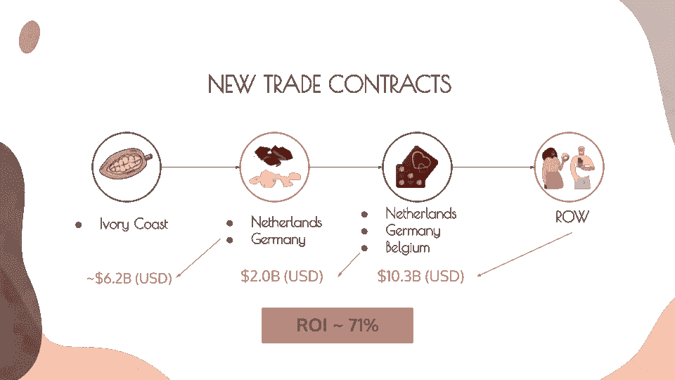

Supply Chain with Prices of Cocoa doubled

# 假设

当你阅读这篇文章时，我在分析过程中所做的一些假设要记住，包括:

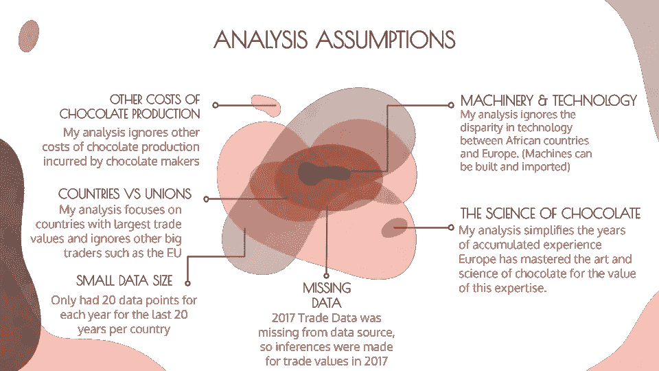

# 4.下一步是什么

完成这一分析后，我想知道是否有可能在非洲向西方国家出口最多的其他商品中发现同样的趋势。

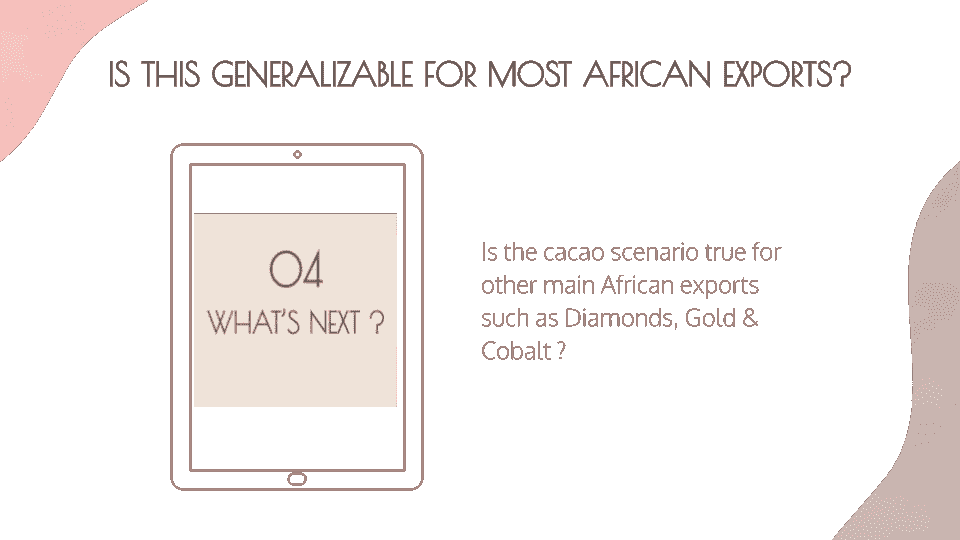

**联系我:**LinkedIn | stellacindyn@gmail.com

非常感谢我的导师 Boris Vassilev 指导我完成了这个分析并回顾了我的工作！

感谢所有帮忙复习这个的朋友！

## **更详细的分析**

*   [2017 年可可/巧克力缺失贸易数据插补](https://medium.com/p/41533f29d5fb/edit)(使用 Python Pandas 从时间序列数据中插补缺失值)

## Github:

*   [代码](https://github.com/cindynyoumsigit/cocoa_analysis/blob/main/Cocoa%20Analysis.ipynb)
*   [数据](https://github.com/cindynyoumsigit/cocoa_analysis)

## 来源和参考

***数据来源:***

*   [https://wits.worldbank.org/trade/country-byhs6product.aspx?lang=en](https://wits.worldbank.org/trade/country-byhs6product.aspx?lang=en)
*   [https://unstats.un.org/UNSD/SNAAMA/BASIC](https://unstats.un.org/UNSD/SNAAMA/BASIC)

***参考文献:***

*   [https://ig.ft.com/special-reports/child-labour/](https://ig.ft.com/special-reports/child-labour/)
*   [https://www . research gate . net/publication/271706319 _ 科特迪瓦可可业和减贫的重组](https://www.researchgate.net/publication/271706319_RECONFIGURATION_OF_THE_COCOA_INDUSTRY_AND_POVERTY_REDUCTION_IN_COTE_D'IVOIRE)
*   【https://trends.google.com/trends/explore? 日期= 2009-01-01% 202019-12-31&q =可可、巧克力
*   [https://agri trade . CTA . int/Agriculture/Commodities/Cocoa/Special-report-Cote-科特迪瓦-s-Cocoa-sector-reforms-2011-2012 . html](https://agritrade.cta.int/Agriculture/Commodities/Cocoa/Special-report-Cote-d-Ivoire-s-cocoa-sector-reforms-2011-2012.html)
*   [https://agri trade . CTA . int/en/Agriculture/Commodities/Cocoa/Executive-Brief-Update-2013-Cocoa-sector . html](https://agritrade.cta.int/en/Agriculture/Commodities/Cocoa/Executive-Brief-Update-2013-Cocoa-sector.html)
*   [https://Oxford business group . com/analysis/changing-policies-cocoa-reforms-have-empowered-farmers-presented-new-challenges](https://oxfordbusinessgroup.com/analysis/changing-policies-cocoa-reforms-have-empowered-farmers-presented-new-challenges)
*   [https://www . thenewhumanitarian . org/news/2012/11/07/cocoa-farmers-welcome-state-imposed-prices](https://www.thenewhumanitarian.org/news/2012/11/07/cocoa-farmers-welcome-state-imposed-prices)
*   [https://www . worldcocoafoundation . org/WP-content/uploads/Cocoa-Market-Update-as-of-3 . 20 . 2012 . pdf](https://www.worldcocoafoundation.org/wp-content/uploads/Cocoa-Market-Update-as-of-3.20.2012.pdf)