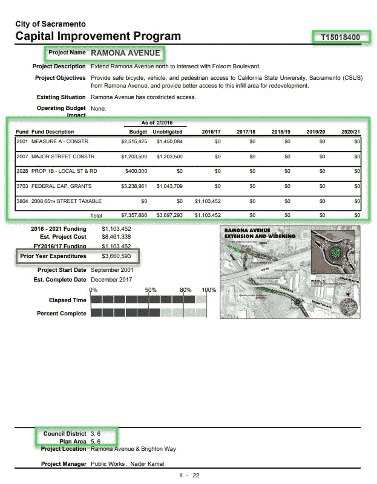
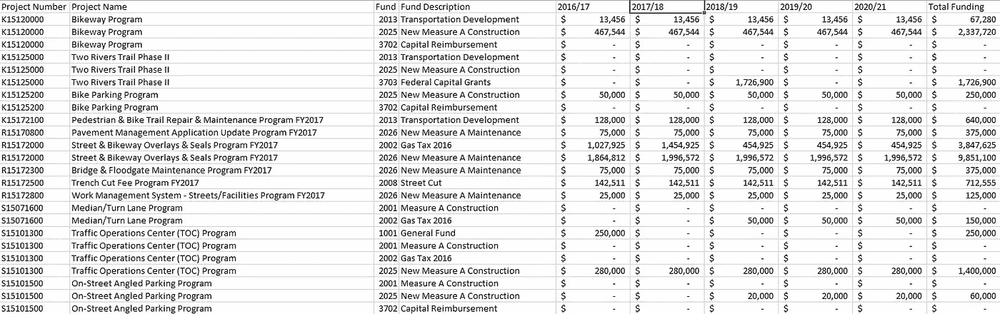
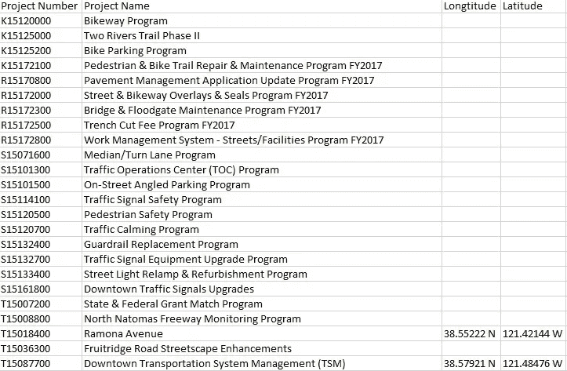
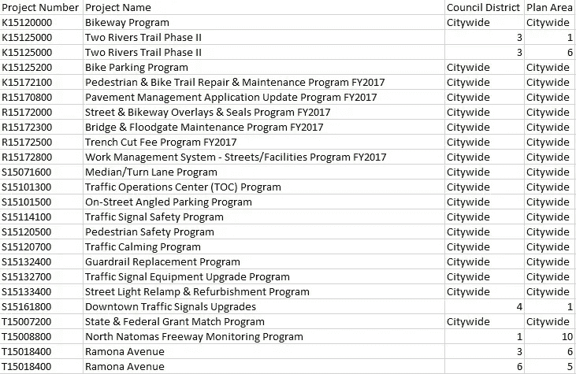
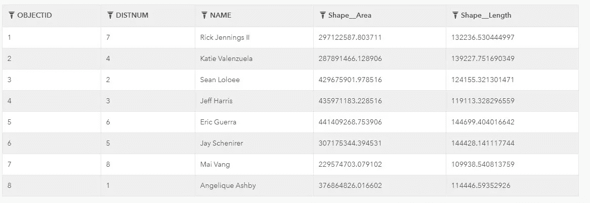
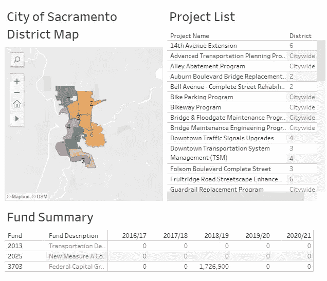
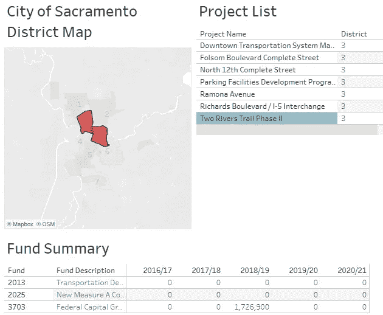

# 使用数据可视化使数据更易访问

> 原文：<https://medium.com/mlearning-ai/using-data-visualization-to-make-data-more-accessible-4215875b3755?source=collection_archive---------6----------------------->

无数的时间花在收集政府数据上——人们没有无数的时间去阅读。

现在是三月，这意味着政府机构正处于预算旺季。构建预算需要做很多工作——开会、建立预测模型、更多的会议、调整预测模型、更多的会议、在最后一刻提出预算请求，是的，还有更多的会议。

在这种官僚程序中，人们经常忽略的是如何最好地向公众传递预算信息。当然，其他官员可能会发现预算书很有用，但对于公众将如何消费这些信息，人们给予了什么关注呢？例如，如果我想了解我所在城市的公共基础设施项目，我必须浏览 420 页萨克拉门托市的资本改善计划(CIP)书籍！既然我们在这里处理公共信息，也许一本 400 页的书是政府数据透明的必要之恶？我愿意接受这一点，但是，我确实认为这里错过了一个以社区参与的方式利用数据的机会。

我给自己的目标是建立一个用户友好的仪表板，总结萨克拉门托市的 CIP 图书的一部分。为此，我选择了项目的交通部分，因为我之前在地方政府管理部门的工作使我熟悉了与交通相关的基础设施项目相关的项目和资金。考虑到这一点，我的最终目标是将 62 页的运输部分变成一个具有向下钻取功能的仪表板。

我构建仪表板的第一步是收集必要的数据。对于这一步，我必须以一种允许我构建数据表的方式剖析资本改进计划书中包含的数据。

Source: City of Sacramento 2016–2021 CIP Transportation Program Approved

CIP 手册的项目页面提供了丰富的信息，但我需要对我希望在仪表板中突出显示的数据进行选择。我选择选择与资金和位置相关的数据，因为我认为人们最感兴趣的是在他们各自的城市地区如何分配资金，所以这就是我想在我将要整理的仪表板中突出显示的内容。关于财务数据，萨克拉门托市列出其前一年资金的一个缺点是，它只将这笔资金作为一个总数列出，而没有前一年支出的一栏。鉴于此，我选择不在我的仪表板中包含这些信息。萨克拉门托市列出其项目的一个好处是，CIP 列出了与项目相关的市政区和规划区。拥有这些信息对我在地图上可视化关联数据的能力至关重要。

利用我能够从项目页面中选择的数据，我能够构建一个由三个表组成的关系数据库:

Project finance table

Geographic data table

Area designation table

我最终找到了地理数据表，因为起初我以为我必须为城市的各个区创建多边形，但是我能够在城市的开放数据门户上找到一个形状文件，它为我提供了下表:

Source: City of Sacramento Open Data Portal

有了三个数据表(两个是我创建的，一个是我从市里借来的)，我的第二步是使用 Tableau Public 来构建我开始创建的仪表板:

Source: Tableau Public

仪表板的目标是让用户能够根据选择的地区地图和项目列表深入查看资金摘要，这一目标已经实现:

在本例中，我从地区地图中选择了第 3 区，从项目列表中选择了 Two Rivers Trail 二期项目，并了解了该项目在 CIP 手册(2016 年至 2021 年)涵盖的期间内将如何获得资金。

我大概花了半天时间才把这一切搞定。如果我使用某种光学字符识别软件从 PDF 格式的 CIP 书中提取数据，我会做得更快。

最后，政府机构已经拥有了他们需要的大部分数据，可以利用 Tableau 等数据可视化工具来整合仪表盘，让他们的选民能够以更直观的方式来消化数据。通过一点点繁重的工作和远见，公共管理人员可以让他们的数据变得生动，而不是让数据停滞在一本公众不愿意阅读的书中。

你可以在这里找到我组装的仪表盘。

感谢您阅读我的第一篇关于媒体的文章。我的目标是分享数据可视化的实际应用。我的下一篇文章将以体育相关的数据分析为特色，我将研究一个团队的赢(或输)文化是否会影响他们的底线。