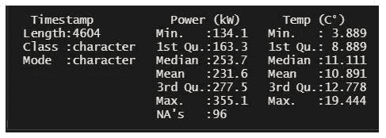
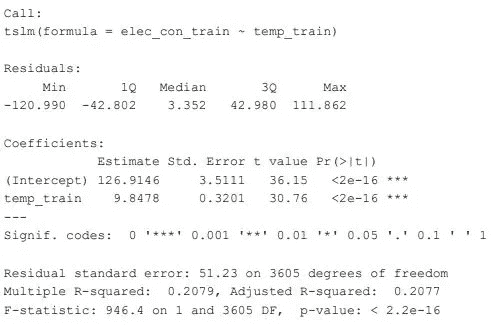
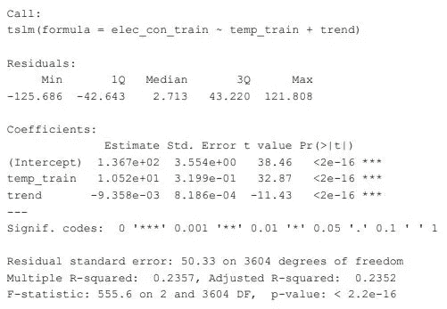
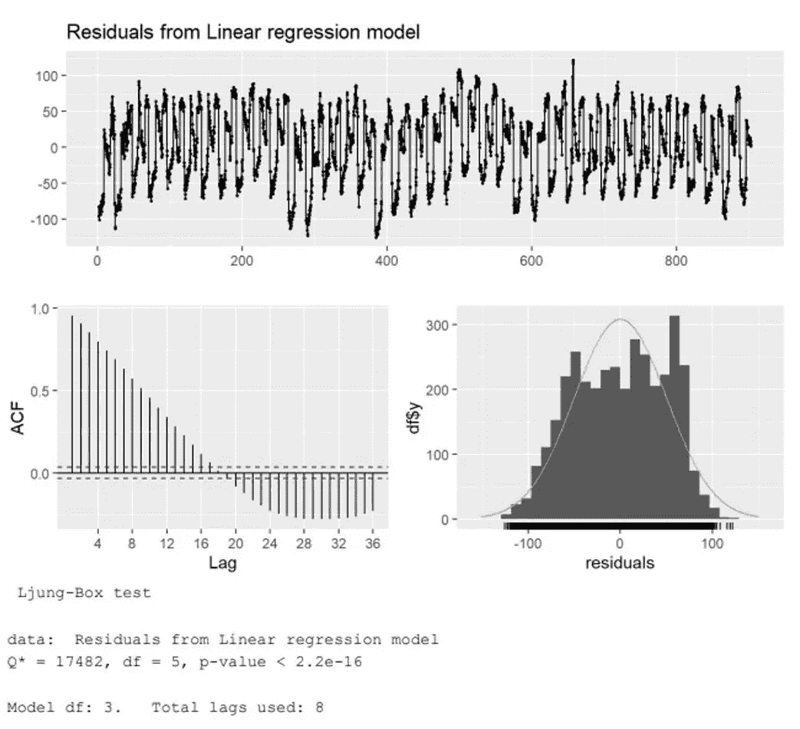
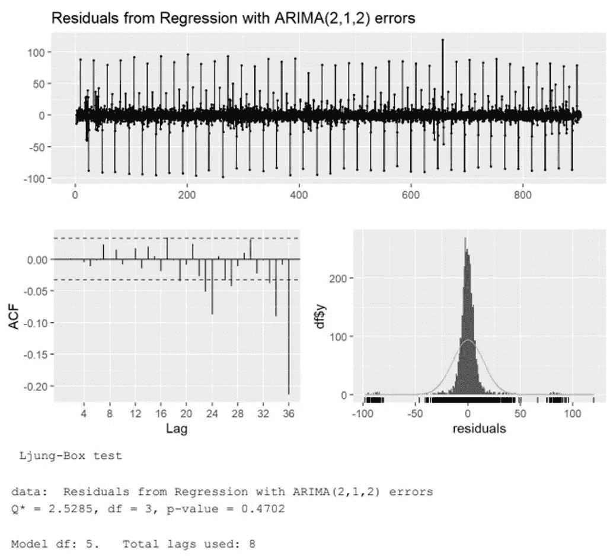
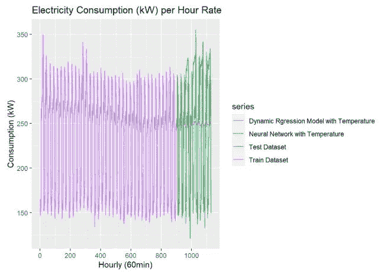
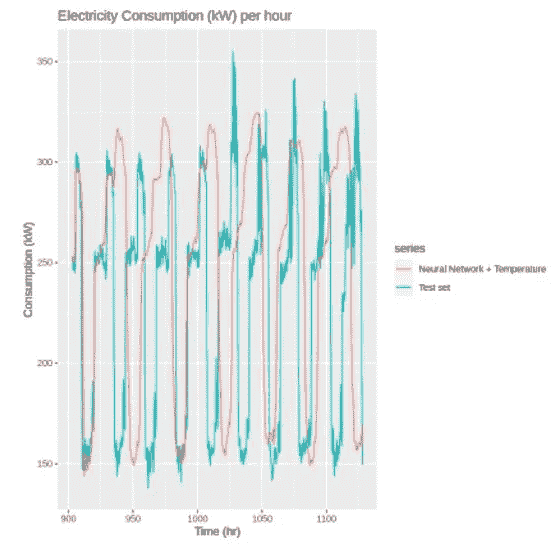
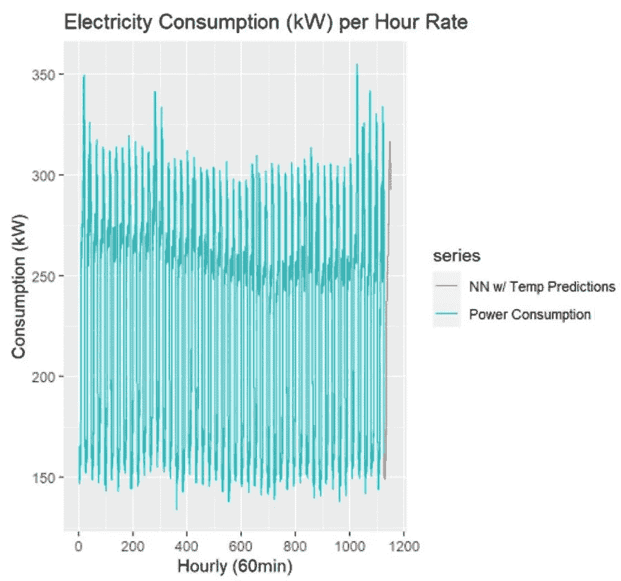

# 使用深度学习建模预测外部变量的用电量—第 2 部分

> 原文：<https://medium.com/mlearning-ai/using-deep-learning-modeling-to-predict-electricity-consumption-with-an-external-variable-part-2-94cacddc6c81?source=collection_archive---------2----------------------->

## 与以前的机器学习模型相比，展示了时间序列中使用的深度学习模型的威力

在第二部分的中，我们分析并使用室外温度作为预测电力消耗的附加变量。室外温度是一个有趣的变量，因为我们经常用它作为一个视觉指标，要么使用空调降温，要么使用加热设备来温暖我们的家。这当然会对用电量产生直接影响。

# 我的空间加热器用了多少电？

M ost 电暖器用的是 1500 瓦，但有些略少或略多。因为 1000 瓦等于 1 千瓦，这意味着一个加热器使用 1.5 千瓦的功率。用电暖器使用的瓦特数乘以使用小时数。对于这个例子，我们假设 8 个小时。

1500 x8 小时= 12000。除以 1000 = 12。接下来，用这个数字乘以公用事业公司收取的电费。对 T4 来说，这大约是 0.15 欧元。因此，12 x .15 = 1.8 欧元。在温暖的房间里享受一整天的奢华阅读大约需要 1.8 欧元。为了让加热器在整整一个月的时间里每天都这样运转，它会很快增加(大约 55 欧元/月)。根据加热设备的数量和使用时间的不同，这一成本会有很大差异。然而，使用像上一篇文章中那样的深度学习模型，可以明显看出我们的个人消费习惯。

# 方法

U 相同的数据集由 3 列组成，时间戳、功率(kW)和室外温度(摄氏度),来自欧洲冬季的典型家庭消费。时间戳长度为 4604 行，从 2022 年 1 月 1 日到 2 月 16 日。从 1:15 到 23:45，每隔 15 分钟测量一次时间戳。这种情况下的目标是预测 2022 年 2 月 17 日的用电量，使用和不使用室外温度(作为一个因素)。大部分工作都是用 R/Python (Jupyter 笔记本格式)完成的。

Figure 1: Statistics info about the dataset

## 拆分数据

M 获取两组数据，训练数据集(80%)和测试数据集(20%)，以便运行适当的时间序列预测来适当地评估模型，因为我们正在使用新的 elecdataset，这将意味着 900 行作为训练，227 行作为测试。

# 时间序列线性回归模型

为了证明和验证室外温度对用电量(kW)的影响存在，首先需要建立一个 T [时间序列回归模型](http://r-statistics.co/Time-Series-Analysis-With-R.html) (TSLM)。回归分析是[推断统计](https://statisticsbyjim.com/basics/descriptive-inferential-statistics/)的一种形式。p 值有助于确定在样本中观察到的关系是否也存在于更大的总体中。

Figure 2: Outdoor temperature effect on electricity with TSLM

在这种情况下，我们注意到 temp_train(温度)的 p 值小于 0.05。这意味着我们拒绝零假设(H0 ),并声明室外温度对耗电量(千瓦)有影响。

## 季节性

为了进一步验证，[季节性](https://machinelearningmastery.com/time-series-seasonality-with-python/)被添加到现有的 TSLM 模型中，并再次重新计算，以查看对该数据集是否有任何影响。

Figure 3: Outdoor temperature effect on electricity with TSLM+Seasonality

在这种情况下，P 值大于 0.05，因此接受零假设，季节性在统计上不显著。第二季、第三季和第四季对 TSLM 模式没有影响。

## 趋势

F 此外，还可以对现有的 TSLM 进行趋势分析，看看对这个数据集有没有影响。

Figure 4: Outdoor temperature effect on electricity with TSLM+Trend

p 值小于 0.05，这意味着我们拒绝零假设(H0)，并声明存在趋势模式对电力消费(千瓦)的影响，这意味着在这种情况下具有统计学意义。因此，TSLM 模型仅用于趋势分析。

## 残差

按顺序进行，TSLM 模型假设残差是独立的。为了证明这一点，我们检查了残差以及 [Ljung-Box](https://www.statisticshowto.com/ljung-box-test/) (LB)测试。LB 以统计学家 [Greta M. Ljung](https://en.wikipedia.org/wiki/Greta_M._Ljung) 和 [George E.P. Box](https://en.wikipedia.org/wiki/George_E._P._Box) 的名字命名，是一种检验时间序列中是否存在自相关(值不相关)的统计检验。零假设表明残差是独立分布的。

Figure 5:Residuals + LB test from Linear Regression model

这里残差是相关的，这意味着这个回归模型是不恰当的。此外，LB 检验说明 p 值小于 0.05，这意味着残差是独立分布的。

# 动态回归模型

In 建议再形成[动态回归](https://otexts.com/fpp2/dynamic.html) (DR)模型，用 [ARIMA](https://otexts.com/fpp2/arima.html) p，d，q 模型对残差建模。阶数的选择 [p，d，q](https://otexts.com/fpp3/non-seasonal-arima.html)(p =自回归部分的阶数；d =所涉及的一阶差分的程度；q =移动平均部分的阶数)。这可以通过检查残差或使用许多 DR 统计软件包中的 auto.arima 函数自动完成。

Figure 5:Residuals + LB test from Dynamic Regression model

用(2，1，2)的 ARIMA 模型:残差的自相关已经被建模。与之前的线性回归相反，动态回归的 LB 检验解释了 p 值大于 0.05 意味着残差不是独立分布的(它们表现出序列相关性)。

# 室外温度的动态回归和神经网络模型

我们比较了动态回归模型与神经网络(之前已探讨过)相比的成功程度。由于神经网络模型表现出色，该模型将用于预测未来的预测，也包括室外温度。

Figure 6:Train and Test data set with the Dynamic regression model with temperature as well as Neural network with temperature for comparisons

如图 6 所示，室外温度的动态回归模型表现良好，但是室外温度的神经网络在预测方面表现更好。这只是表明，与以前的机器学习模型相比，神经网络在解决复杂问题方面是多么复杂。

Figure 7: Neural network with outdoor temperature predicting the Test data set

在图 7 中，一个有趣的点是，与之前没有室外温度的神经网络相比，更新的神经网络在添加室外温度作为外部变量的情况下做出了更好的预测。

## 未来预测

F 最后，我们可以看到神经网络对室外温度的预测有多好，如图 8 所示。

Figure 8: Neural network with outdoor temperature prediction of power consumption

## 结论:

在其他模型中，神经网络模型是预测和预报千瓦消耗量随温度变化的最好和最强大的模型。像这样的统计分析可以让数据科学家了解不同因素下时间序列的规律。

 [## Mlearning.ai 提交建议

### 如何成为 Mlearning.ai 上的作家

medium.com](/mlearning-ai/mlearning-ai-submission-suggestions-b51e2b130bfb)