# 使用深度学习建模来预测电力消耗—第 1 部分

> 原文：<https://medium.com/mlearning-ai/using-deep-learning-modelling-to-predict-electricity-consumption-part-1-20e05101c1f4?source=collection_archive---------8----------------------->

## 与以前的机器学习模型相比，展示了时间序列中使用的深度学习模型的威力

当科学预测基于历史时间戳数据时，可以进行时间序列预测。这包括通过历史分析建立模型，并使用它们进行观察和推动未来的战略决策。

我们生活在这样一个时代，节约能源和使用可再生能源是当前全球都在解决的问题。居民家庭的节能措施可以极大地改变环境质量，也可以为消费者带来更多的储蓄。大多数用户能够从他们的提供商那里收集历史能源使用情况，但是只有一些用户能够根据他们的消费需求做出预测。许多管理机构如[气候&清洁空气联盟(CCAC)](https://www.ccacoalition.org/en/initiatives/household-energy) 旨在保护气候和改善空气质量，家庭能源是其关注的领域之一。使用神经网络预测电力消耗可以改变我们的习惯。

Climate and Clean Air Coalition Org.

# 介绍

内容: C 首先将研究预测模型，指数平滑法，其目的是对序列中确定性的部分进行建模。ARIMA 模型将允许走得更远，也模拟了该系列的随机组成部分。最后，将研究一些更先进的模型:神经网络、动态回归模型和分组时间序列模型。

由于本文的内容较多，本文将分为两部分，第一部分将深入预测随时间变化的电力消耗，第二部分将室外温度作为预测电力消耗的附加变量。

## 主题和数据集

T 数据集由 3 列组成，时间戳、功率(kW)和室外温度(摄氏度),来自欧洲冬季的典型家庭消费。时间戳长度为 4604 行，从 2022 年 1 月 1 日到 2 月 16 日。从 1:15 到 23:45，每隔 15 分钟测量一次时间戳。这种情况下的目标是预测 2022 年 2 月 17 日的用电量，使用和不使用室外温度(作为一个因素)。大部分工作都是用 R/Python (Jupyter 笔记本格式)完成的。

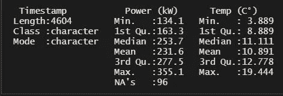

Statistics info about the dataset

## 数据清理

因为观察是每 15 分钟一次，所以我把它转换成一个小时(60/15=4 ),得到一个每小时一次的频率，这样可以更好地显示图表。

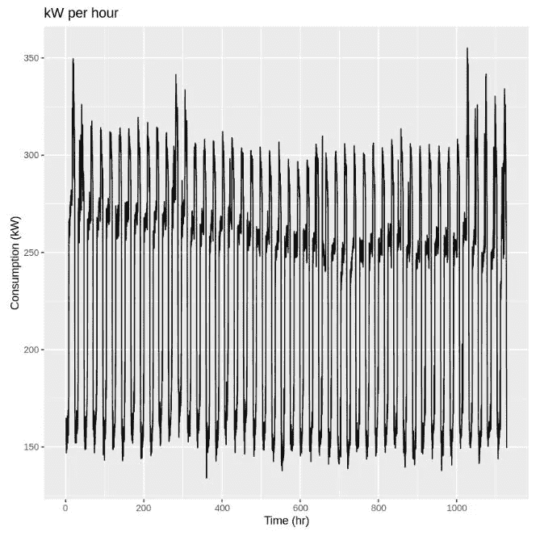

Figure 1: Consumption (Kw) vs Time (hrs) over time

# 方法

M 取两组数据，训练数据集(80%)和测试数据集(20%),以便运行适当的时间序列预测来适当地评估模型，因为使用了新数据集，这将意味着 900 行作为训练，227 行作为测试。

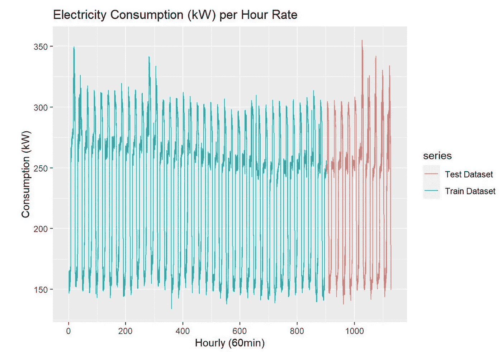

Figure 2: Train and Test Split of Dataset

## 在不同型号上测试

用[简单指数平滑](https://machinelearningmastery.com/exponential-smoothing-for-time-series-forecasting-in-python/#:~:text=Single%20Exponential%20Smoothing%2C%20SES%20for,smoothing%20factor%20or%20smoothing%20coefficient.) (SES)开始预测，在 alpha 中没有平滑参数(指数平滑是一种单变量数据的时间序列预测方法)。SES 是一个简单的模型，与季节性无关。均方根误差(RMSE)将被用作评估时间序列性能的度量。

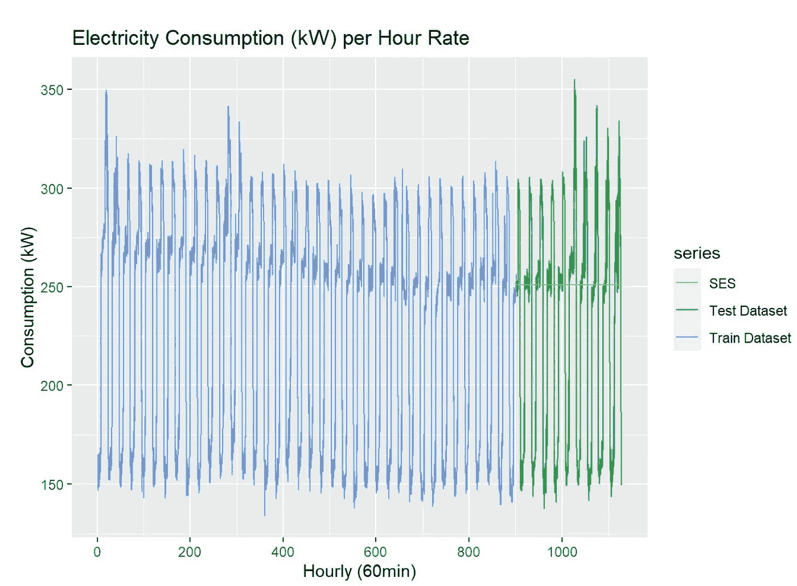

Figure 3: SES Model

这个模型的 RMSE 是 60.764。虽然 RMSE 很低，但在这种情况下，从视觉上看，SES 是一个糟糕的预测工具。所以我开始用更复杂的模型和更多的参数。

## 霍尔特-温特斯

比如[霍尔特-温特斯模型](https://orangematter.solarwinds.com/2019/12/15/holt-winters-forecasting-simplified/#:~:text=What%20Is%20the%20Holt%2DWinters,cyclical%20repeating%20pattern%20(seasonality).)的用法。在这种特殊情况下，可加季节性 HW、阻尼可加季节性 HW 和对阻尼可加季节性 HW 的 Box-Cox 变换(这可能是有效的)。

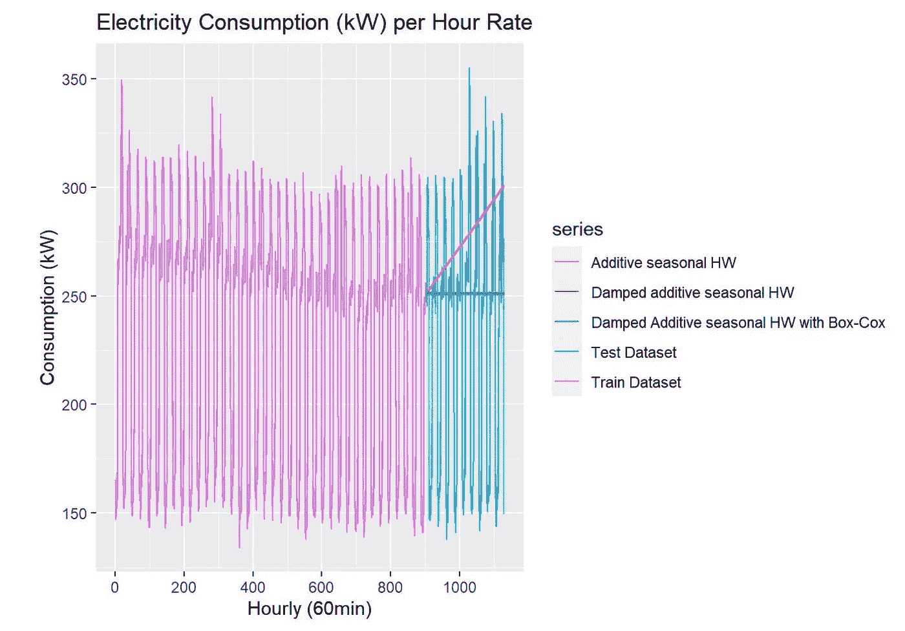

Figure 4: Using Holt Winters Models on the Dataset

每个模型的 RMSE，加性季节性 HW (73.46)，阻尼加性季节性 HW (60.91)，以及带 Box-Cox 的阻尼加性季节性 HW(60.84)。比较所有不同类型的霍尔特-温特斯模型的 RMSE 误差没有太大差异，正如所观察到的，阻尼 HW 和具有 Box-Cox 的阻尼 HW 的误差与指数平滑保持相同。此外，加性季节性硬件误差表现更差，这可能是因为它们是线性模型。还有一点要注意，正如 Box-Cox 所看到的，Lambda 被自动设置为，而不是被选择，这可能是它性能很差的原因。

## ARIMA

我继续用 [ARIMA 模型](https://www.machinelearningplus.com/time-series/arima-model-time-series-forecasting-python/)进行预测，看看是否与以前的模型有什么不同

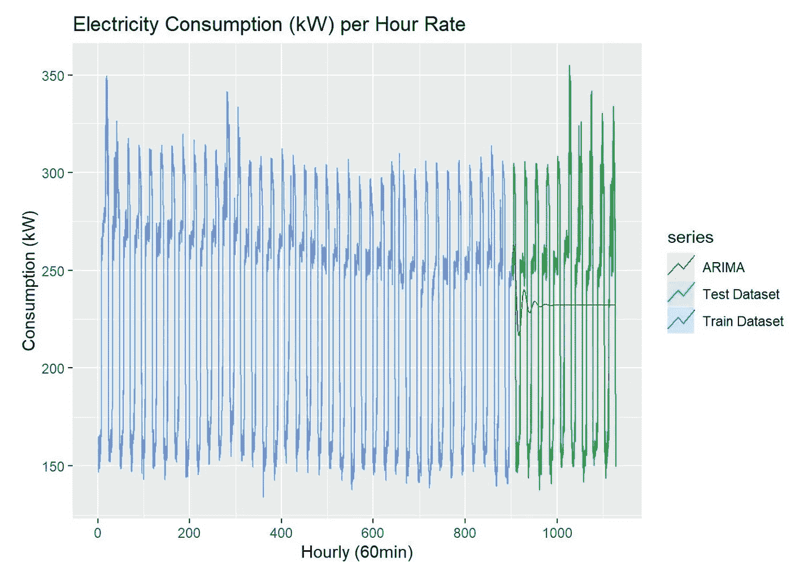

Figure 5: ARIMA Model

从视觉上看，ARIMA 对测试集的预测优于之前观察到的模型。在检查 RMSE 误差(56.39)时，尽管它比以前的模型低，但它仍然不能做好预测，因为该模型能够在非常小的显著性下进行预测，然后它收敛到零，因为 ARIMA 通常用于静态数据集中。一个[增强的 Dicker Fuller 测试](https://en.wikipedia.org/wiki/Augmented_Dickey%E2%80%93Fuller_test)，可以证明这个数据集确实是稳定的，因为 P 值小于 0 . 05，拒绝零假设，换句话说，它具有一些依赖于时间的结构，并且没有随时间的恒定变化

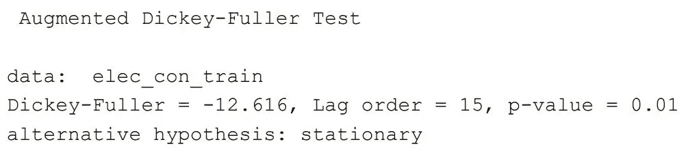

Figure 6: Train dataset ADF Test

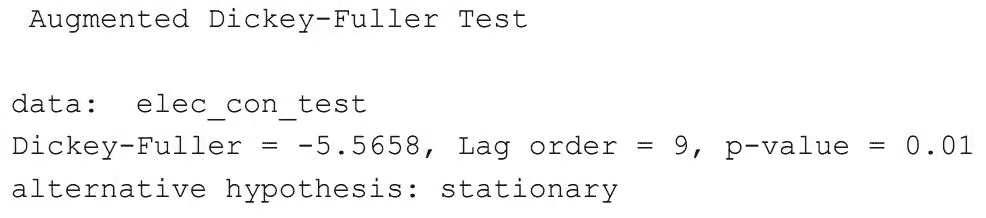

Figure 7: Test dataset ADF Test

## 相关图

继续，相关性测试可用于使用[自相关图和部分自相关图](https://towardsdatascience.com/significance-of-acf-and-pacf-plots-in-time-series-analysis-2fa11a5d10a8)识别模式。

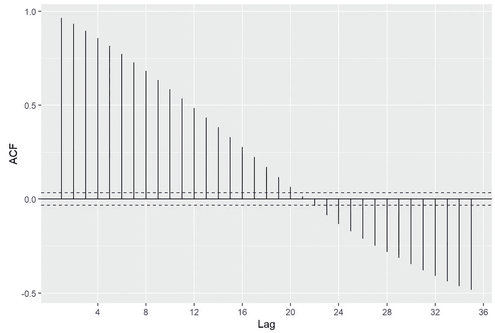

Figure 8: ACF of Train Dataset

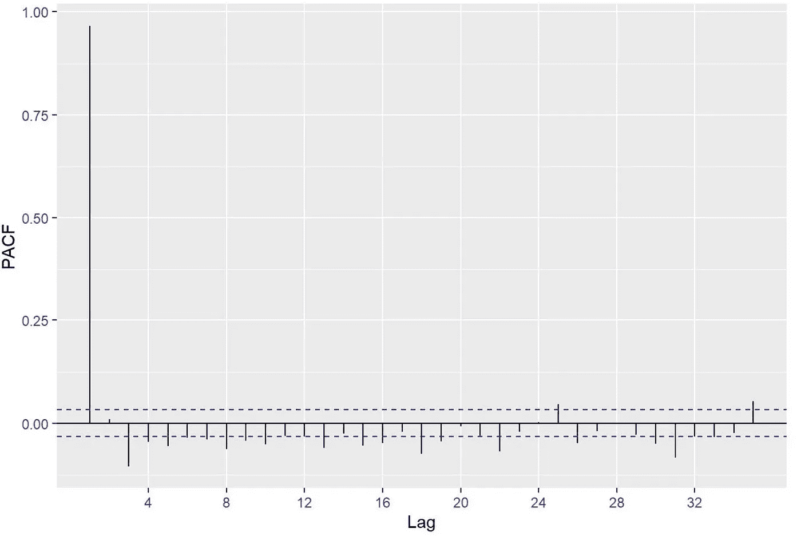

Figure 9: PACF of Train Dataset

理论上，自相关是时间序列中两个值之间的相关性，滞后代表数据集中的时间点。正如所观察到的，滞后位于 95%置信区间之外，这可能意味着滞后之间可能相互关联。自相关函数迅速下降到接近零，这是非平稳性的一个属性，它将影响几种预测模型的效率。在这种情况下，ACF 和 PACF 证明了这一点。也有可能该数据是周期性的，而不是季节性的，如果是这种情况，它不能用线性模型建模。

## 自回归神经网络

L 很快，可以使用[神经网络](https://machinelearningmastery.com/deep-learning-for-time-series-forecasting/)对测试数据集进行更好的预测(NN 具有学习从输入到输出的复杂映射的能力)。在该模型中，参数 p 和 k 由算法自动选择。神经网络由 20 个网络组成，网络组成为 35–18–1，权重为 667。

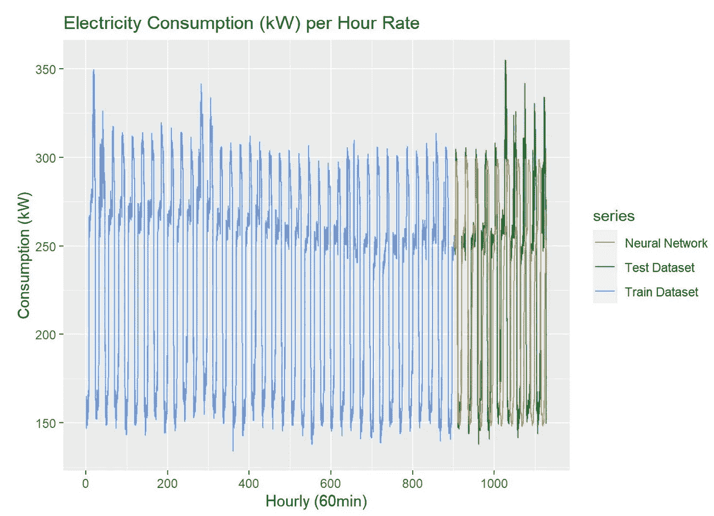

Figure 10: Neural Network model on Dataset

从视觉上看，与以前的预测模型相比，这个模型可能是最好的模型。与以前的模型相比，计算 RMSE 的错误率最高(80.05%)。这是可以接受的，因为它做了更好的预测。

如先前在先前模型中使用的那样，向数据集添加 Box-Cox 变换可以稳定 NN 中的方差。

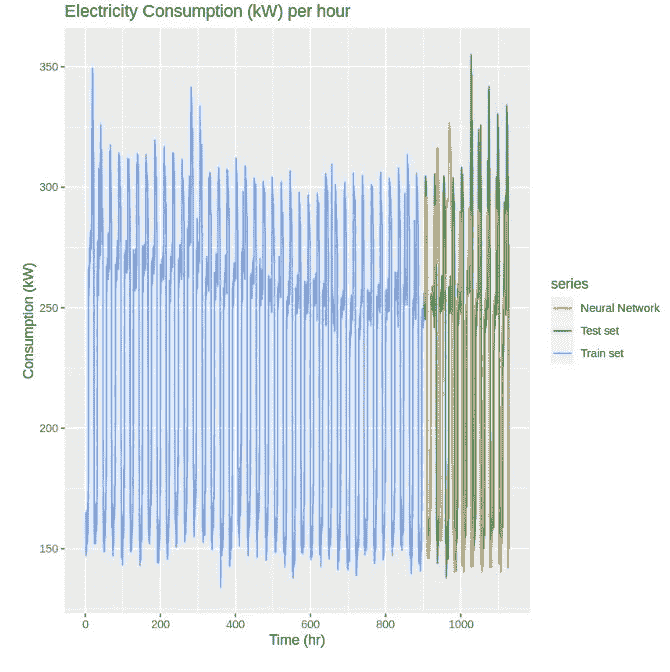

Figure 11: Neural network with added Box-Cox Transformation

在这种情况下，RMSE 较低(70.82)，从视觉上看，与所有之前的模型相比，这是预测电力消耗的更好模型。

为了更好地观察来自神经网络的预测，这里根据测试数据集预测神经网络。它并不特别擅长建模，但与以前的模型相比，它更占优势。

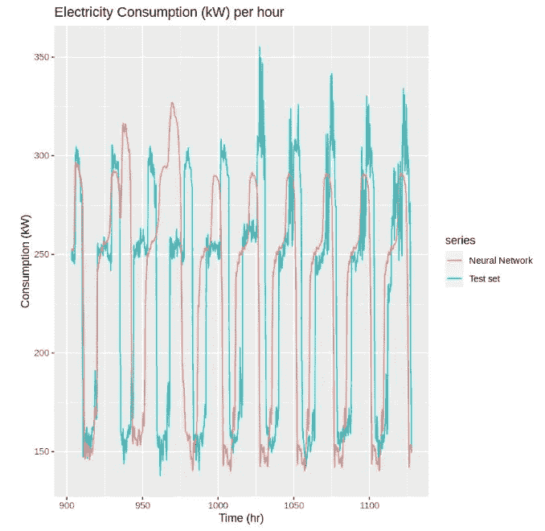

Figure 12: Neural Network on Test Dataset

最后，我们用这个神经网络来预测未来。代表全天 24 小时的 96 次观察。对 2022 年 2 月 17 日第二天的消耗量进行了预测。

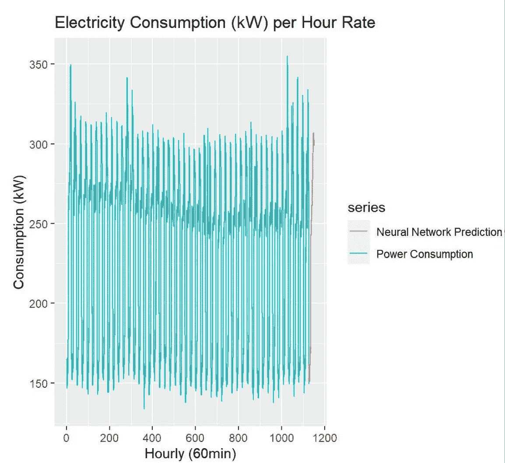

Figure 13: Neural Network future predictions

# 第二部分

将在未来几周发布的下一篇文章将探索室外温度的附加变量以及使用动态回归的神经网络。

敬请期待:)

 [## Mlearning.ai 提交建议

### 如何成为 Mlearning.ai 上的作家

medium.com](/mlearning-ai/mlearning-ai-submission-suggestions-b51e2b130bfb)