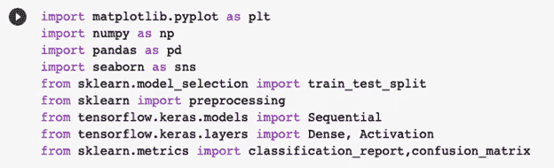
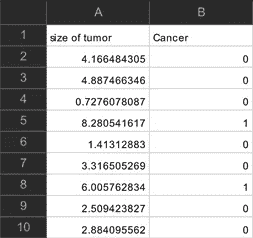
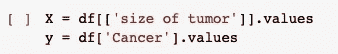
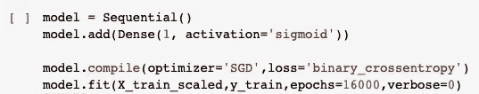
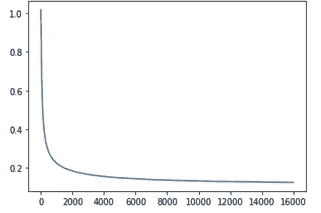
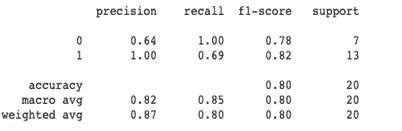
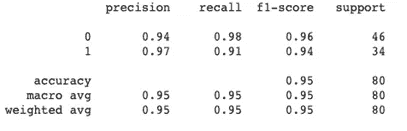

# 用 Python 实现逻辑回归在机器学习中的应用

> 原文：<https://medium.com/mlearning-ai/using-logistic-regression-in-machine-learning-with-python-66af0dd0135c?source=collection_archive---------2----------------------->

在机器学习和统计学中，逻辑回归是一种常用的工具，用于创建模型来总结某个类别或事件存在的概率。这可能是赢或输，通过或失败等等。逻辑回归常与线性回归混淆，但它们有明显的区别。线性回归用于预测数据趋势，并通过“最佳拟合线”创建模型，同时计算预测中的误差源。逻辑回归使我们能够预测某一种情况是否会发生在另一种可能性之上。在本文中，我们将使用肿瘤数据来预测患者是否患有癌症，从而深入了解这一点。

**Python 中的 Keras 介绍**

概括一下进行模型分析时的主要步骤，导入库和模块以访问特定特征总是很重要的。添加了标准导入，如 Matplotlib、pandas、NumPy 和 seaborn，以及 sklearn，它允许我们将我们的集分成测试集和训练集，并对我们的数据进行预处理。

在第 7 和第 8 行，我们整合了 TensorFlow 和 Keras。Keras 是 TensorFlow 的高级 API，所以一定要这样导入。

**我们的数据**

正在研究的数据是由患者的肿瘤数据组成的集合。根据肿瘤的大小，我们的数据将告诉我们患者是否易患癌症。以下是数据集中前 10 名患者的数据。总共有 101 名患者。

**功能和标签**

机器学习的每个方面都与特征有关。数据集的 x 值是要素，而 y 值是标注。特征和标签的想法延续到逻辑回归，因为它们将被分为两个值的训练集和测试集。

对于这些数据，特征是肿瘤大小，而标签是癌症值，用 0 和 1 描述是否有癌症。

**创建模型**

为了使用逻辑回归来预测患者是否患有癌症，需要创建一个模型。要创建模型，我们需要向模型添加一个激活。然而，我们不把它加到线性回归中；我们需要它来进行逻辑回归，以便在线性转换后应用 sigmoid 函数。

一旦创建了模型，我们就用 python 编译这个函数，它包括告诉我们的代码将会出现什么样的错误。带着这个问题，我们将其设为**二元交叉熵**。这将每个预测概率与实际类别输出进行比较，如我们在肿瘤数据中看到的标记 0 和 1。

当训练这个模型时，我们使用 **model.fit** 命令，因此我们的缩放 x 值和 y 训练值被输入，并且通过这个，我们试图找到什么适合这个模型。Epochs 是我们将要做的梯度下降的多少步，而 verbose 提供了计算机计算的后台操作的附加信息。

**误差最小化**

当谈到误差最小化时，我们需要确保进行足够的迭代来创建最精确的结果。 **J_list** 是每次迭代后的误差。如果我们完成了足够的迭代，最终得到的图将是线性的。

**召回、精确度和准确度**

Testing Data

Training Data

比较测试和训练数据的查全率、查准率和查准率，在训练集中查准率高得多，在测试集中查全率更好，在训练集中查准率更高。

正如本文所解释的，逻辑回归是数据科学中一个有用的工具，可以缩小概率范围，并通过开发的模型创建准确的预测。如果你想更彻底地回顾本文中解释的概念，可以看看我下面关于这个主题的视频。