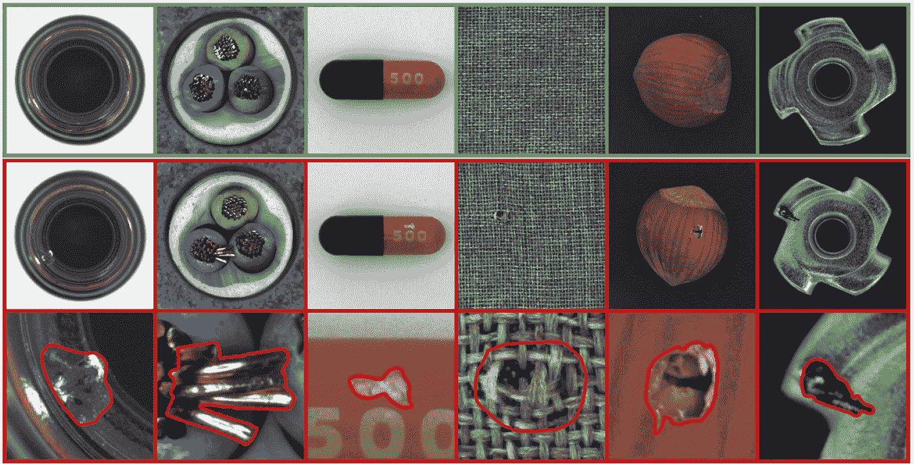
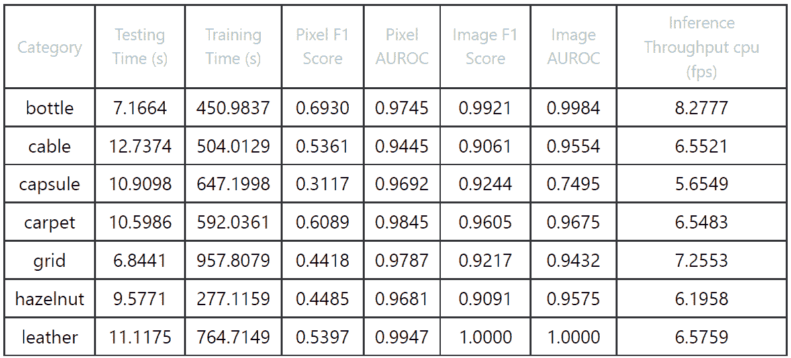
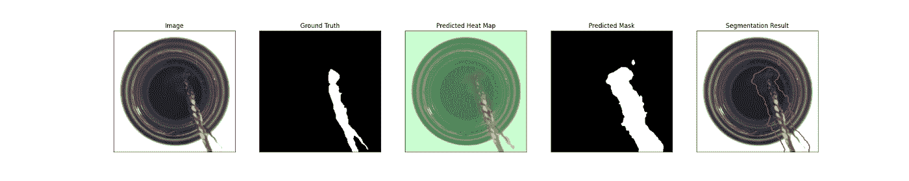
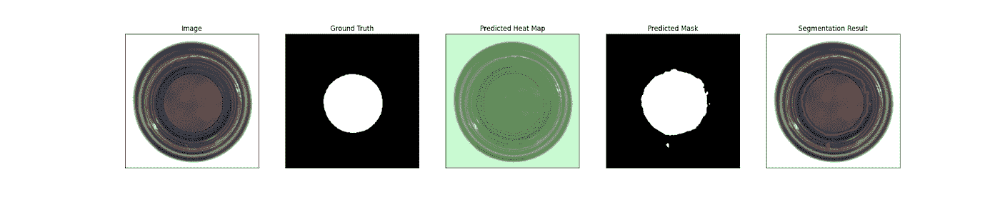
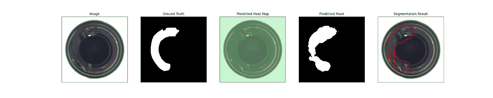
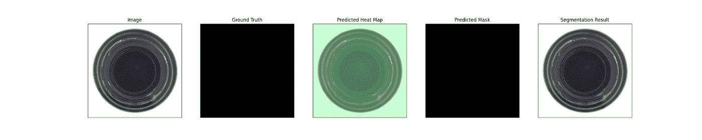
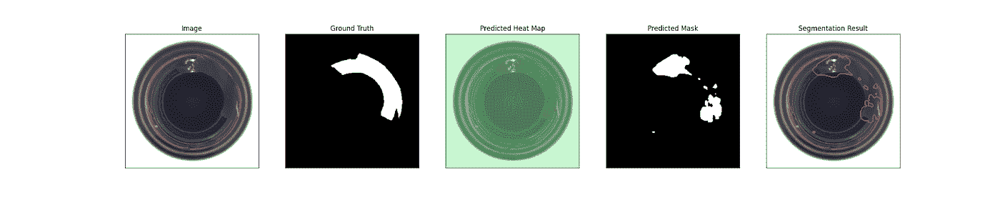

# 使用机器学习和人工智能进行制造业中的自动视觉检测

> 原文：<https://medium.com/mlearning-ai/using-machine-learning-and-ai-for-automated-visual-inspection-in-manufacturing-c9e3ba14374?source=collection_archive---------5----------------------->

# 介绍

视觉检测一直是工业环境中质量控制的基石。

它用于快速准确地检测产品和零件中的缺陷和异常，确保保持质量标准，避免生产线上的任何潜在问题。

现在，在机器学习和人工智能的帮助下，自动化检查成为可能。

本文将解释如何在很少或没有人工干预的情况下将机器学习算法用于自动检查。

# 异常检测模型

对于异常检测，我们使用一类学习任务模型。

这意味着在训练时仅使用名义图像(非异常)，因此与其他监督方法相比，减少了收集数据所需的工作。

该模型具有类似金字塔的架构，有助于识别不同大小的异常。

学生和教师生成的特征之间的差异用于在像素级别上对异常的概率进行评分，从而允许在图像内对异常进行精确定位。

# Anomalib

我们用 anomalib 做实验。该库收集了公共和私有数据集上的高级深度学习检测算法和基准测试工具。它还拥有将模型导出到英特尔硬件以提高性能的工具。

# 资料组

[MVTec 异常检测数据集](https://www.mvtec.com/company/research/datasets/mvtec-ad)是任何希望对异常检测方法进行基准测试的人的理想资源，尤其是那些与工业检测相关的方法。

将 5000 多张高分辨率图像分为 15 个不同的类别，您将可以访问大量无缺陷的训练图像和具有各种缺陷的测试集。

所有图像都没有瑕疵，便于比较不同的方法并获得最准确的结果。

# 结果

我们在 MVTec 数据集上测试了我们的深度学习模型，这是一个由 7 个不同类别组成的图像识别数据集。

我们使用了一个 t3.xlarge AWS EC2 实例，该实例具有 4 个英特尔至强白金 8175M @ 2.50GHz vCPUs 和 8GB RAM。输入图像大小设置为 244x244，模型的超参数保留默认值。

该模型由两部分组成:教师模型，在 Imagenet 数据集上预训练的 ResNet18，以及学生模型，也是随机初始化的 ResNet18 模型。

以下是每个类别的培训结果。

您将找到每个类别的指标，以及为每个类别训练模型所花费的时间。

该模型获得了非常高的分数，甚至在皮革类别中获得了满分——这表明了它在现实世界中的应用潜力。使用 Pytorch 实现来测量推理吞吐量。

# 输出预测样本

下面显示了*瓶*类别的一些测试图像结果。

# OpenVINO(仅在 CPU 上提高推理速度的框架)

此外，我们测试了在*瓶子*类别上训练的模型，以使用其内置的基准工具在 OpenVINO 上获得其推理吞吐量，获得大约 **30.2 fps** ，显示出相对于普通 *Pytorch* 实现，推理速度几乎提高了 **4 倍**。

# 结论

自动化视觉检测是工业过程的强大工具，可以更准确、高效地检测缺陷和异常。

在机器学习和人工智能等现代技术的帮助下，现在可以在很少或没有人工输入的情况下检测图像中的问题。

我们在数据集上的测试显示了令人鼓舞的结果，该模型获得了非常高的分数，甚至在皮革类别中达到了满分。

还测量了该过程的速度，并显示了良好的结果。

这是自动化视觉检测在工业领域应用的一大进步。

# **您需要缺陷检测方面的帮助吗？联系 hello@dynamindlabs.ai！**

 [## Mlearning.ai 提交建议

### 如何成为 Mlearning.ai 上的作家

medium.com](/mlearning-ai/mlearning-ai-submission-suggestions-b51e2b130bfb)