# 利用机器学习和公司基本面战胜股市

> 原文：<https://medium.com/mlearning-ai/using-machine-learning-and-company-fundamentals-for-beating-the-stock-market-fa2d4ac438a7?source=collection_archive---------0----------------------->

## 为股票交易建立机器学习模型的实用指南

Photo by [charlesdeluvio](https://unsplash.com/@charlesdeluvio?utm_source=medium&utm_medium=referral) on [Unsplash](https://unsplash.com?utm_source=medium&utm_medium=referral)

在这篇文章中，我将展示如何构建一个简单的**机器学习**模型分类器，它可以用来帮助投资者选择投资哪些**股票**。

这篇文章虽然是介绍性的，但目标读者是具有一些 Python 和 ML 知识的人。如果你对 ML 和交易的更高层次的解释感兴趣，看看这个[的帖子](/@Batmaxx/machine-learning-and-stock-trading-ebf9a87c4297)。

将涵盖以下主题:

*   数据准备—目标和特征创建(**熊猫)**
*   探索性数据分析(**熊猫概况)**
*   建模( **LightGBM)**
*   评估—分类器和投资组合(用 **Plotly 可视化)**

本文中使用的数据和代码可以在我的 [GitHub](https://github.com/Batmaxx/ml-model-for-stock-trading) 页面上找到。你可以随意克隆这个项目来跟进。

在存储库中，您还会发现一个 ***README.md*** 解释了如何设置一个包含所有必需依赖项的环境。

# 💽数据

为了更容易理解，我创建了一个**样本数据集**，其中包含道琼斯 30 只成份股**的历史数据。该数据集已经在月级别进行了汇总，并且还创建了一些财务比率。**

**原始数据来自一家提供财务数据 API 的公司 Tiingo。**

## **🔃加载数据集**

**让我们将数据集加载到 Pandas 中。**

**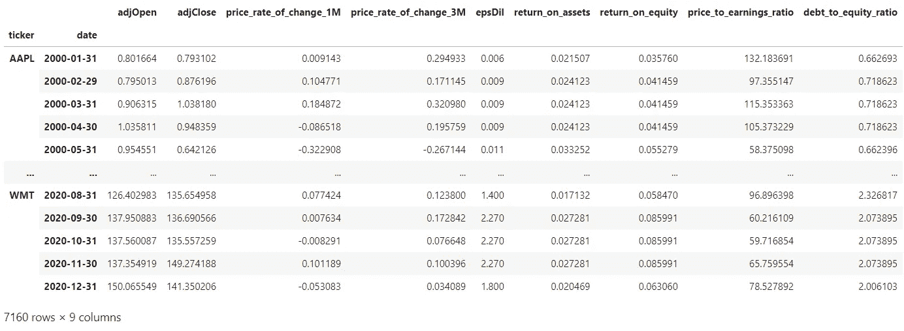**

**以下是各列的含义:**

*   ***股票代号*:股票的股票代号**
*   ***日期*:日期(月末)**
*   ***adjOpen* :当月第一天的开盘价(调整后)**
*   ***adjClose* :当月最后一天的收盘价(调整后)**
*   ***price _ rate _ of _ change _ 1M*:股票上个月的收益**
*   ***price _ rate _ change _ 3M*:最近 3 个月的股票收益**
*   ***epsDil* :每股收益摊薄**
*   ***资产回报率*:资产回报率**
*   ***净资产收益率*:净资产收益率**
*   ***市盈率*:市盈率**
*   ***负债权益比率* : d/e 比率**

## **🎯目标创建**

**我们将构建一个**分类器**模型，其中的目标将是一个**布尔**变量，指示股票在上个月的涨幅是否超过了 *X%* 。**

**在此之前，我们假设:**

*   **我们在每月的第一天以开盘价买入**
*   **我们在这个月的最后一天以收盘价卖出**
*   **回报是买价和卖价之间的差额(百分比)**

**然后，目标将采用以下值:**

*   **`True`如果股票收益高于或等于 *X%***
*   **`False`否则**

**目标**阈值** ***X*** 的选择是可以使用对过去数据的实验或模拟来确定的。这里我们将保持简洁明了，使用固定的阈值 **5%** 。
随意试验其他阈值(10%、20%……)或者甚至使用止盈止损建立一个更复杂的目标，就像德普拉多建议的*三重障碍法*(洛佩兹·德普拉多，M. (2018))。*金融机器学习的进展*。约翰·威利&的儿子)。**

**下面是创建目标的代码。**

**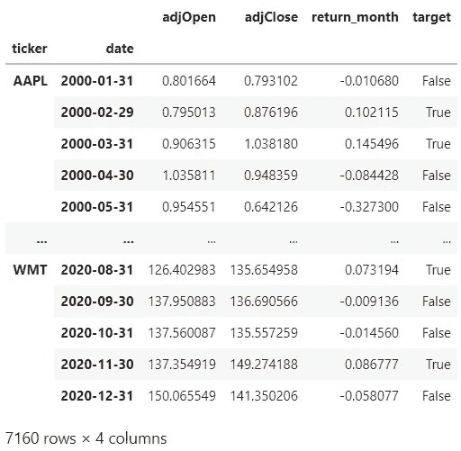**

## **🥗特征创建**

**为了简化笔记本，我已经使用原始数据预先计算了一些特征。如果你有兴趣知道我是如何创造它们的，请在评论中告诉我。
我们将使用以下功能来构建模型:**

*   **价格变化率 1M**
*   **价格变化率 3M**
*   **艾普斯迪尔**
*   **资产回报率**
*   **股本回报率**
*   **价格对收入比率**
*   **债务对权益比率**

**这里非常重要的一步是**将特征值移动一个周期**。**

**我们为什么要这样做？**

**因为那些特性的实际值只有在月底才知道。我们需要确保用于预测目标的输入数据(特性)在月初可用。通过将特征值移动一个周期，我们确保不会产生**数据泄漏**。**

**然后我们需要删除每个 ticker 的第一行，删除在`shift()`操作中创建的`NaN`。**

**这是包含要素和目标的最终数据集的外观。**

**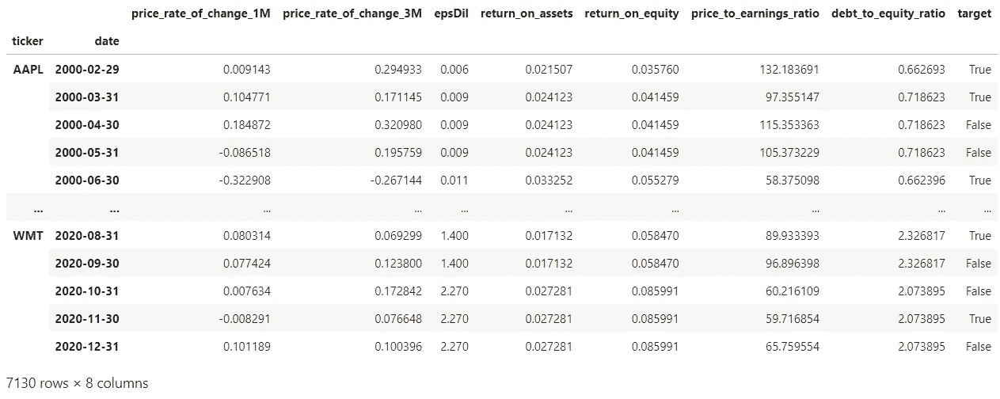**

# **🔍探索性数据分析**

**为了做一个快速的数据探索，我们将使用 [***熊猫图谱***](https://github.com/ydataai/pandas-profiling) 库。这个库非常适合用一行代码构建分析报告，如下所示。**

**我们得到了这个漂亮的**互动报告**，可以随意在笔记本上滚动浏览。**

**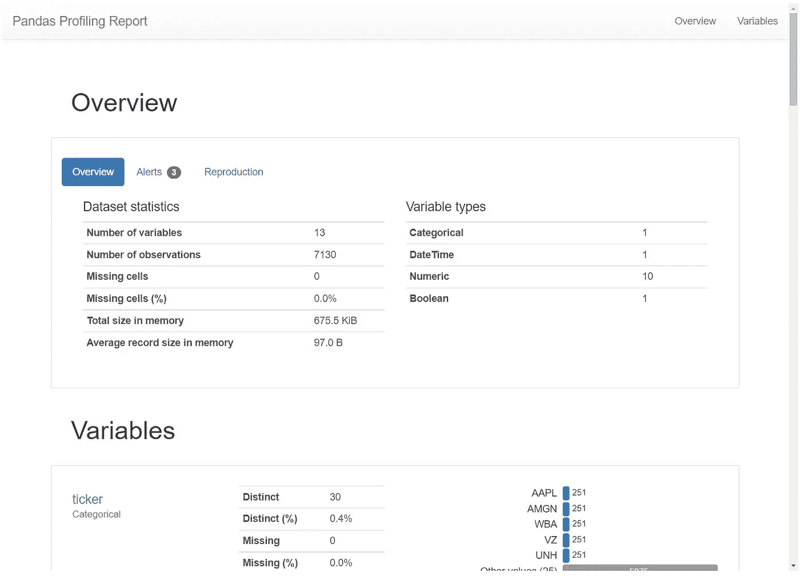**

**从报告中，我们可以看到**数据**总体上是相当**干净**的。**

**重要的是要注意到**目标**分布是**不平衡的**，在建模部分要记住这一点！**

**我们还看到列`price_to_earnings_ratio`和`debt_to_equity_ratio`的一些**异常值**。我现在不打算深入探讨这个问题，但是，这个问题在以后的阶段会很有趣。移除或修复这些异常值可能会提高模型的性能。**

# **🤖建模**

**现在我们有了一个数据集，我们将使用 [**LightGBM**](https://lightgbm.readthedocs.io/en/latest/) 构建一个简单的**分类器**模型。**

> **LightGBM 是一个梯度推进框架，使用基于树的学习算法。**

**我喜欢 LightGBM 是因为它的**高精度**、**快速训练**，最重要的是它的**易用性**。事实上，您几乎不需要任何预处理就可以让 LightGBM 模型工作，例如，分类特征或 NaN 会自动处理。**

**因为它是基于树的，所以对环境也更好(😁)并且对于非技术人员来说更容易解释和可视化，导致涉众更容易接受模型。**

## **🪓分割数据**

**为了简单起见，我们将使用简单的**训练/测试**分割，并省略任何更复杂的交叉验证程序。
2020 年**的数据将用于测试，之前的数据将用于训练。****

## **👔安装分类器**

**让我们创建一个分类器估计器，并将其应用于训练数据。我使用默认的超参数，除了 ***is_unbalance*** 被设置为 ***True (*** 给定数据集的高级**不平衡**)和 **max_depth** 、 **num_leaves、**和 **min_child_samples** 被设置为根据 lightGBM [文档](https://lightgbm.readthedocs.io/en/latest/Parameters-Tuning.html)的“适当”值。**

**请随意试验其他超参数！**

## **🔮根据测试数据进行预测**

**一旦模型适合训练数据，我们就可以用它来预测测试数据。在 *df_test* 中创建了一个新列 ***buy*** ，它包含了模型做出的预测。**

**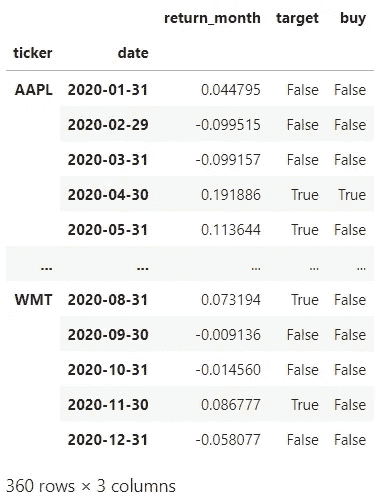**

**既然我们已经对测试集进行了预测，我们可以继续进行**评估**部分，在这里我们将评估模型的性能。**

# **✅评估模型**

**我们将从两个方面评估模型的性能:**

*   ****分类器性能**:使用准确度、精确度、召回率等指标。我们可以评估分类器在区分好的*和*表现差的股票方面有多好。**
*   ****投资组合表现**:使用回溯测试，我们可以模拟我们会赚到多少钱(或者赚不到！)，并计算总回报、夏普比率、提款等财务指标。**

## **📝分类器性能**

**为了全面了解分类器的性能，我们将使用来自 sklearn 的`classification_report`。**

**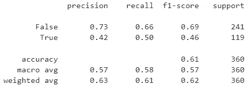**

**总体**精度**为 **61%** 。该模型在预测*假*类方面做得相当好(73%的精度，66%的召回率)，但在预测*真*类(42%的精度，50%的召回率)方面就不太好了。**

**考虑到数据集的**高级不平衡**，我们在这种情况下使用**精确度**时应该小心。**

## **📈**投资组合表现****

**现在让我们更关注模型的财务表现。也就是说，我们能用这种模式赚钱吗？**

**为此，我们采取以下假设:**

*   **每个月我们投资`**n**`不同的股票(取决于模型预测)**
*   **我们在每只股票上投资相同的金额(`**1/n**`)**

**有了这些假设，我们可以很容易地计算出策略的月回报，然后计算出总回报或夏普比率等财务指标。**

**我们首先只选择模型做出正面预测的股票(买入)。**

**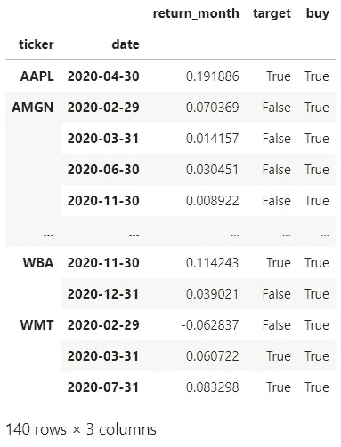**

**然后**汇总**月份级别的数据，以了解**每月挑选多少股票**，以及**的平均回报率**是多少。我们可以使用每月平均回报，因为我们假设我们将投资于每只选定的股票。**

**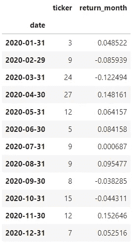**

**我们可以使用`describe()`函数来获得一些统计数据。**

****

**每月挑选**股票**的数量从 **3 到 27** 不等，每月**平均收益**为 **2.96%** 。**

**让我们也计算一下 [**夏普比率**](https://www.investopedia.com/terms/s/sharperatio.asp) ，这是一个非常常用的指标，用来评估投资回报与其风险的对比。**

**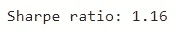**

****夏普**比 **1.16** ，还不错:)**

## **🎨**可视化****

**为了直观显示一段时间内的回报，我们首先需要计算**累积回报**。**

**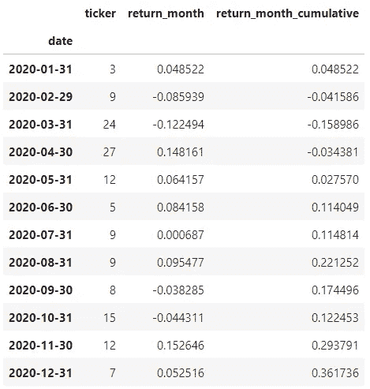**

**然后我们可以用**制作一些漂亮的情节。****

****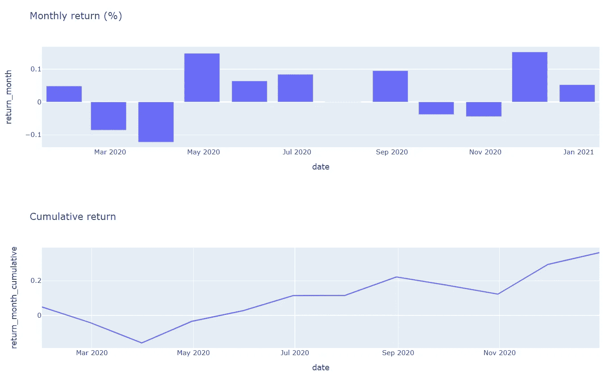****

****这些初步结果看起来一点也不差，即使 3 月份左右发生新冠肺炎危机，我们也能在 2020 年获得 **+36%的回报率**，这非常有希望:)****

****然而，为了全面了解情况，我们需要正确看待这些结果，并将其与**基准策略**进行比较。正如我们使用道琼斯的 **30 只股票一样，我们将使用跟踪同一指数的 ETF:[**DIA**](https://www.ssga.com/us/en/intermediary/etfs/funds/spdr-dow-jones-industrial-average-etf-trust-dia)。******

**我们来加载这个 ETF 的数据。**

**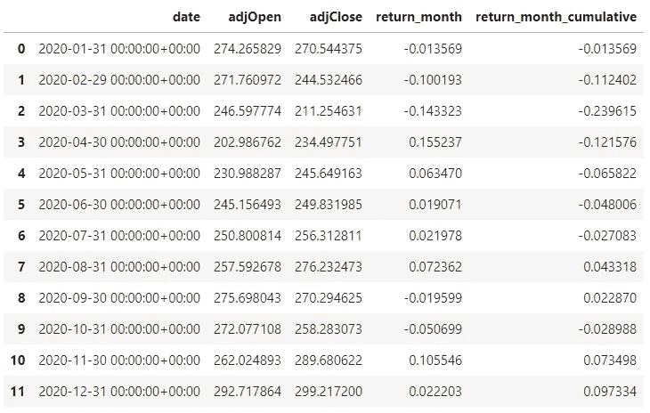**

**我们计算这个基准策略的夏普比率。**

**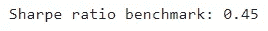**

****夏普**比 **0.45** ，这个比 ML 车型的要低很多！**

**让我们在同一张图上画出这两种策略，以便更好地了解它们的区别。**

**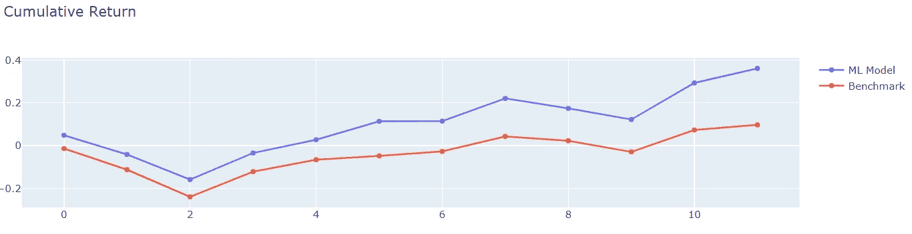**

**ML 模型遵循与基准策略相同的**轨迹，考虑到股票的**集合**仅限于 **30 个报价器，这是有意义的。******

**然而，该模型似乎能够区分和挑选高性能股票，导致比基准高 3 倍的回报率和提高的 T2 夏普比率，干得好！**

# **🔚结论**

**我希望这篇介绍性的帖子能够给你一些关于如何使用**机器学习**进行**交易**的见解。**

**随意摆弄笔记本，尝试不同的算法和特性，或者用权重、止损、获利、费用等改进回溯测试方法。
不过要小心，在金融机器学习中很容易获得“好看”的回溯测试，这是金融专业人士经常强调的事情。在另一篇文章中，我将写关于重复回溯测试的危险，并展示过度拟合一个模型是多么容易，以及嵌套交叉验证是如何帮助降低这种风险。**

**如果您有任何问题或评论，请发表评论，并关注我以获得更多类似这样的帖子！**

**你也可以在交易平台 [**eToro**](https://etoro.tw/3ajuXgr) 上**关注我**，在这里我使用机器学习作为我投资策略的核心。**

***此帖子包含社交交易平台* [*eToro*](https://etoro.tw/3ajuXgr) 的附属链接**

** [## Mlearning.ai 提交建议

### 如何成为 Mlearning.ai 上的作家

medium.com](/mlearning-ai/mlearning-ai-submission-suggestions-b51e2b130bfb)**