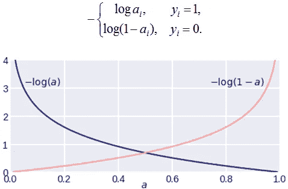
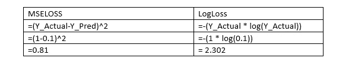

# 在逻辑回归中使用均方误差损失(MSE)？

> 原文：<https://medium.com/mlearning-ai/using-mean-squared-error-loss-mse-in-logistic-regression-bcc5e07a6d99?source=collection_archive---------6----------------------->

我一直在重温一些濒临从我的记忆中消失的算法/概念:)在修改逻辑回归时，我意识到我从未关注过一些微小的细节。为什么我们在训练一个逻辑回归模型的时候不用 MSE 损失呢？在谷歌上搜索了不同的来源后，我明白了以下几点== >

在深入回答之前，让我们先复习一些概念

您可能知道，通常对数损失(也称为交叉熵损失)用于训练逻辑回归分类模型。相同的公式如下

LogLoss Formula

> 其中 y 是实际值或标签
> 
> p 是模型的预测值。

这个对数损失是一个凸函数，这意味着图中只存在一个局部极小值。并且如同任何其他 ML 算法一样，梯度下降被用于优化，其寻找系数的最佳值，使得成本函数值最低。如果你还记得梯度下降的一个主要条件是，图应该只有一个局部最小值，它迭代并试图找到最优值。

让我们通过绘制对数损失函数来了解这一点。将复杂的事情分解成更小的部分总会让你更容易更快地理解。让我们把对数损失函数分解成几个部分。根据 yi 的值，应该是这样的== >

Plot of CrossEntropyLoss

简单地说，可以在α= 0.5 找到局部最小值。这就是为什么凸函数在梯度下降中是重要的，否则算法将永远不会在一个非凸函数中找到精确的局部最小值，因为它包含不止一个最小值。

现在，让我们继续我们的主题，为什么 MSE 损失不用于逻辑回归。上面提到的整个语境足以理解其中的原因。

# **1。非凸性质**

Convex vs Concave plots.

对于逻辑回归，均方误差函数的图形是非凸的。因为我们把因变量 x 放在一个非线性的 sigmoid 函数中。如上所述，梯度下降不适用于非凸函数，逻辑回归模型将永远无法收敛到最优值。

# **2。对错误预测的惩罚。**

好吧，如果你不关心优化和寻找最佳局部最小值，但仍然想使用 MSE 损失，它仍然不会工作。为什么？

如果我问你，成本函数/损失函数的功是什么？

> 基本上，在错误预测的情况下，成本函数应该能够通过输出最终将导致更高梯度值的更高损失值来惩罚模型。

但是逻辑回归中使用的均方误差并没有以很大的方式惩罚模型。理想情况下，对于错误的类预测，MSELoss 应该很高，但这不会发生，原因是逻辑回归用于分类，并且所有预测的概率值都在 0，1 之间。

假设在一个二进制分类问题中，您的模型预测第 1 类的概率为 0.1(这是一个错误分类的明显例子)。

> 这里我们的 **Y_Actual=1** 和 **Y_Pred=0.1**

理想情况下，对于好的成本函数，惩罚/误差值应该很高。让我们比较相同的均方误差和对数损失

我希望现在清楚了为什么 MSE 损失在逻辑回归中不是一个好的选择。尽管分类错误，MSE 仍然用比 logloss 更低的值来惩罚模型。

谢谢大家！

请关注更多如此优秀的博客:)

[领英 ](https://www.linkedin.com/in/pranav-kushare-ab217418a/)

[*给我买杯咖啡*](https://www.buymeacoffee.com/PranavK)

[*Github*](https://github.com/Pranav082001)

 [## Mlearning.ai 提交建议

### 如何成为 Mlearning.ai 上的作家

medium.com](/mlearning-ai/mlearning-ai-submission-suggestions-b51e2b130bfb)