# 使用神经网络和 NLP 单词嵌入来预测亚马逊用户评论评级

> 原文：<https://medium.com/mlearning-ai/using-neural-networks-and-nlp-word-embedding-to-predict-amazon-user-review-sentiment-28156f69e1e1?source=collection_archive---------1----------------------->

# 摘要

## 项目目的:

该项目的目的是建立一个模型，根据用户评论中的文字预测用户对亚马逊数字音乐专辑的星级(1-5 级)。我测试了几个神经网络算法，这些算法是用采样的用户评论评论及其对应的星级进行训练的。我利用几种自然语言处理(NLP)技术将文本标记化和矢量化为“可训练的”数据结构。通过建立一个从文本中解读用户意见的监督分类模型，我希望我的算法可以潜在地用于其他类型的情感分析问题，包括需要无监督学习的问题(即，没有星级分类标签进行训练)。当然，这是基于星级是用户情绪的真实反映的假设。

如下表所示，我的模型将获取原始用户评论数据样本(reviewText 列)，将对来自标记化关键词的文本进行矢量化(tokens 列)，然后预测他们将留下的用户星级。然后，我会看到预测的星值(pred_stars)与数据集中的实际星值(diff_pred)相比如何。

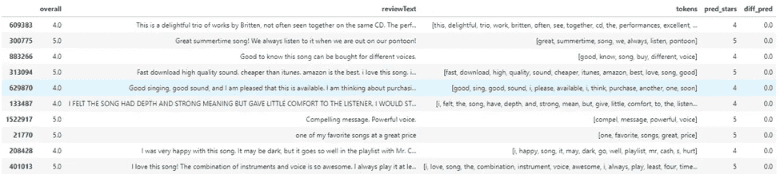

## 使用的数据和代码:

我使用的数据集是来自亚马逊的大约 150 万条用户评论的开源数据集。由于我的笔记本电脑有处理限制，并且无法访问云服务器，我选择只对整个数据集的 10%随机样本进行训练/测试。我所有的代码都可以在我的 Jupyter 笔记本[这里](https://github.com/omshapira/Amazon_star_rating_predictions/blob/master/Project_Amazon_Reviews.ipynb)找到。

## 方法概述:

为了建立这个模型，我最终测试和超参数调整了六种不同类型的算法和 NLP 矢量化组合。我探索的算法是支持向量机(SVM)、深度神经网络(DNN)和卷积神经网络(CNN)模型。为了对我的文本数据进行矢量化，我测试了三种方法:单词袋(BOW)，从头训练一个单词嵌入向量，以及使用预训练的单词嵌入向量全局向量进行单词表示([手套](https://nlp.stanford.edu/projects/glove/))算法。每个模型都遵循下图所示的相同工作流程。经过采样和文本预处理后，数据被分成测试数据和训练数据。

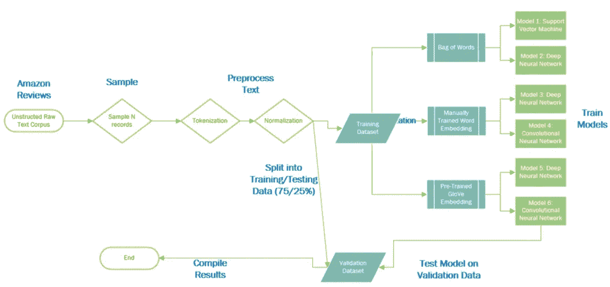

## 结果摘要:

从下面的结果可以看出，具有弓形矢量化功能的 DNN 具有最高的准确率，为 62%。虽然我对我所有模型的准确率只有 60%感到失望，但我很高兴它们在一个星级内的预测准确率都达到了 85%。但是从高训练精度可以看出，我的所有模型都显得过拟合。

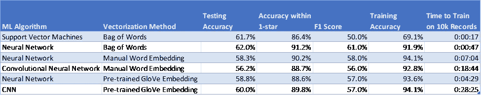

重要的是要记住，多类模型(在这种情况下，每颗星 5 个)的解释性能不如二进制模型直接。例如，查看每个类别级别(即 star)的[加权准确度](https://www.datascienceblog.net/post/machine-learning/performance-measures-multi-class-problems/)或性能可能是有意义的。我没有更深入地研究性能指标，但是计划在以后进行探索。也就是说，我怀疑是多种原因导致了我的模型过度拟合。概括地说，这些包括:

1.  *不平衡的数据集:*我的原始数据样本极度扭曲，大约 80%的评分为 5 星。虽然我使用了重采样技术来提高分布的均匀性，但它仍然不平衡。这种对性能的影响在多级模型上尤其严重。随着时间的推移，我计划探索其他过采样/欠采样技术。
2.  *嵌入和训练参数*:可能是我的 word 嵌入训练有缺陷，或者超参数(如图层、滤镜等)不理想。)在我的 NN/CNN 算法里。我已经在 Keras 中测试了正则化函数，但这最终降低了我的训练数据的准确性，而没有提高我的验证数据的性能。虽然我使用 GridSearch 来调优我的模型超参数，但是它所花费的大量训练时间限制了我可以合理测试的参数的范围和数量。
3.  *样本量不足:*我的采样数据集只有 10，000 条记录。如果我有更多的时间和云服务器，我会考虑使用更多时期的 160 万条记录的整个数据集…但我预计这将需要几天时间来运行。当我稍微增加样本量进行测试时，似乎没有太大的区别。在我的模型训练中，我也探索了使用更多的纪元，但是在最初的几个纪元之后，准确性似乎降低了。我最终为每个模型使用了 10 个时期。
4.  *没有足够的模型特征*:重要的是要记住，用户评论评论并不能完美地预测他们可能给出的星级。通过只根据用户评论训练我的模型，我没有考虑其他可能影响给定用户星级的预测因素。这包括一个成员如何评论其他在线产品、他们的人口统计数据(例如年龄、地点、教育程度等。)，或者与音乐专辑本身相关的其他因素。我的模型不是预测给出了什么星级，而是可以重新用于预测 1-5 级的用户情绪。我的模型在一颗恒星内预测的准确性证明了它可以有效地做到这一点。

总的来说，对于在 Keras 和自然语言处理技术中试验不同的神经网络架构来说，这是一次很好的学习经历。下面，我提供了创建模型的每个步骤的更多细节。

# 文本数据预处理:

预处理和矢量化是这个项目非常耗时的部分。这是由于我对各种技术的研究和实验。文本预处理的最终目标是创建某种类型的向量，用数字表示每个单词。这个数字向量然后被输入到用于训练和测试目的的机器学习模型中。我使用的预处理的一般流程是 1。2)对数据集进行采样。)标记化，3。)归一化，以及 4。)对我所有的文本数据进行矢量化。

## **对数据集进行采样:**

早些时候，我意识到亚马逊评论数据集的两个关键问题。首先，它太大了(160 万条记录)，无法在合理的时间内完成各种模型的训练。我最终只采样了 10，000 条记录，这仍然需要相当长的时间来训练某些模型。我接下来意识到，星级的分布是非常倾斜的。大约 80%的记录有 5 星评级，我觉得这扭曲了我的准确性评分的意义(即预测所有评论都是 5 星的模型将有 80%的准确性，这看起来很高)。为了在随机抽样我的 10k 记录时减轻这种情况，我对带有< 5 stars. The distribution of ratings before and after sampling are shown below.

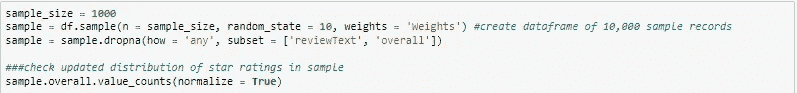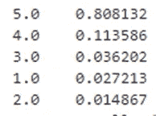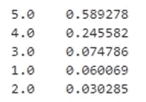

Left image shows initial distribution of star ratings, right image shows updated weightings.

## **符号化**的抽样记录赋予了更重的加权概率:

我的下一步是[标记化](https://www.kdnuggets.com/2018/03/text-data-preprocessing-walkthrough-python.html)数据，这样每个单词代表一个不同的标记特征。在这样做的时候，我还确保删除了“停用词”，这是一些常见的虚词，如“the”、“is”和“at”。以下是我在标记化前后的数据片段。预计像“n't”这样的标记将由缩写形成(例如，don 't)。

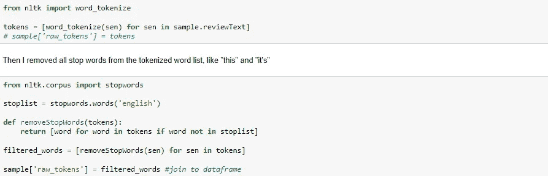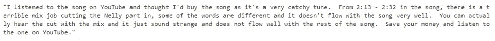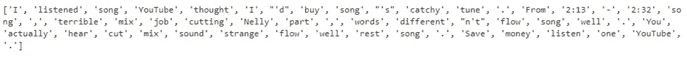

## **正常化**:

在标记化之后，我进一步规范化了文本数据以减少冗余。这是通过删除任何非 ASCII 字符、删除标点符号、将所有内容都变成小写，并用文本表示替换数字(500 = 500)来实现的。我在这里利用了来自[的代码片段](https://www.kdnuggets.com/2018/03/text-data-preprocessing-walkthrough-python.html)。

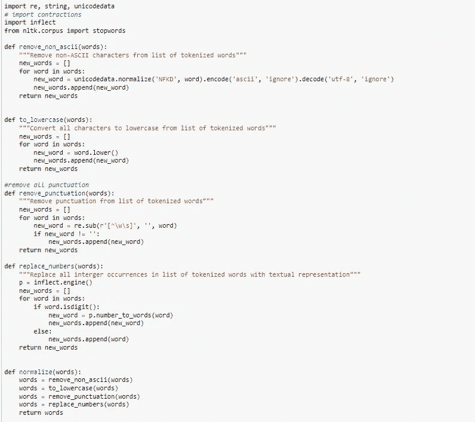

我还应用了词汇化，这是一种词干化[技术](https://nlp.stanford.edu/IR-book/html/htmledition/stemming-and-lemmatization-1.html)。这将单词，尤其是动词，正常化为它们的词根形式和现在时态。下面显示了规范化后的同一个审查记录的一个片段。注意“听”是如何变成“听”的，“想”是如何变成“想”的。

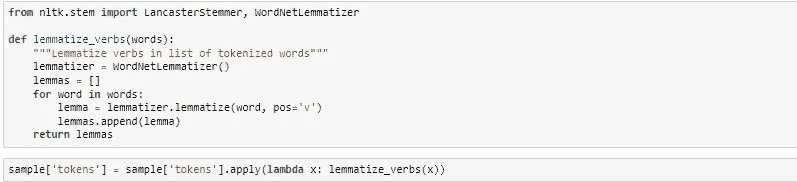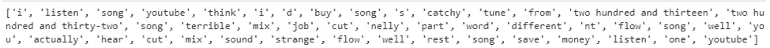

## **矢量化**:

最后，也是最复杂的一步是将文本数据矢量化为数字矩阵，输入到我的算法中。有许多技术可以做到这一点。我探索的三种方法是单词袋(BOW)，从头训练一个单词嵌入向量，使用预先训练好的单词嵌入向量单词表示全局向量(GloVe)算法。

**BOW 嵌入:**使用这种方法**，**创建一个向量矩阵，表示每个单词的频率。每个向量对应一篇评论，每个向量的宽度是跨所有记录的整个语料库中所有不同单词的数量。在每个评论的向量中，填充了每个词的频率。一个[示例](https://victorzhou.com/blog/bag-of-words/)如下所示。虽然这是实现起来最简单的方法，但是它有几个缺点。随着记录和词汇数量的增加，向量变得非常宽，有许多非零值。此外，词频不考虑上下文或单词的顺序。

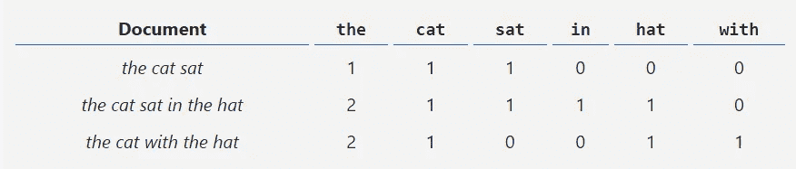

下面是我用 SVM 算法对 1000 条样本记录进行 BOW 测试的代码片段。它还显示了我的验证数据中 250 条记录的性能结果(75/25 分割)。

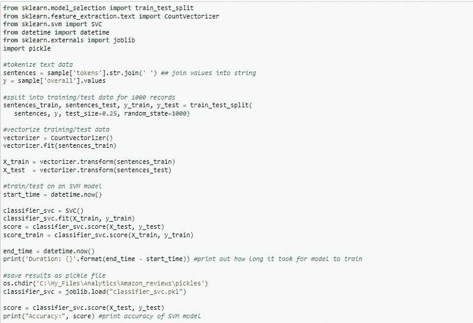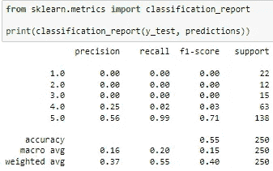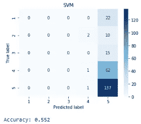

**手动训练的单词嵌入:**我的第二种方法是创建单词嵌入，这将在我的模型中手动训练。有三种通用的令牌矢量化和单词嵌入方法:

1.  由每个单词作为向量表示的单词
2.  由每个字符作为向量表示的字符
3.  表示为向量的单词/字符的 n 元语法。n 元语法是文本中多个连续单词/字符的重叠组。例如，您可以选择 N=3 来查找类似“我喜欢糖果”的单词组合。这个[方法](https://suyashkhare619.medium.com/how-to-deal-with-multi-word-phrases-or-n-grams-while-building-a-custom-embedding-eec547d1ab45)以相似的方式表示单词，如果它们以相似的方式使用的话。与鱼相比，蓝色更像红色的数字表示。

我选择了方法#1，因为我觉得对每个字符进行矢量化对于如此大的数据集来说是低效的，并且没有足够的时间来测试 N-gram 参数。在方法 1 中，我探索了一键编码和单词嵌入。独热编码输出一个 0/1 二进制指示符，指示一个单词是否存在于每个记录的不同单词的整个语料库中。但像 BOW 一样，一键编码的一个大缺点是它创建了非常广泛的输入向量，并且没有考虑单词排序(即上下文)。

相反，我最终使用了一种单词嵌入技术，这种技术可以创建大小相等的压缩向量，其最大大小基于最长用户评论中的单词数。这个向量将包含与记录的用户评论中的给定单词相关联的不同索引数字。对于较短的用户评论，向量将用零“填充”。下图显示了如何将标记化的数据转换为训练序列，然后将其填充为大小相等的向量。在下面的示例[中，由于第一个文本序列只有三个单词，所以向量的其余部分用零填充](https://www.kdnuggets.com/2020/03/tensorflow-keras-tokenization-text-data-prep.html)

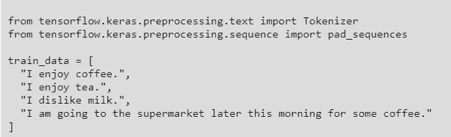

在 Keras 中，有一些有用的库可以对数据进行标记、填充和矢量化。下面是一个示例，它标记了一个示例审查记录，后面是一个代码片段，用于填充向量，使其大小相等。

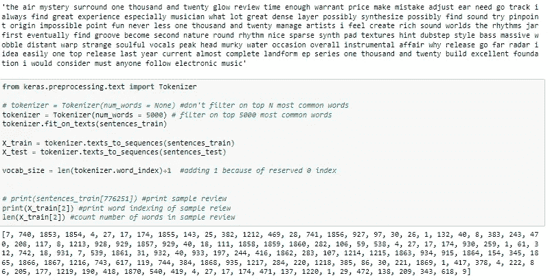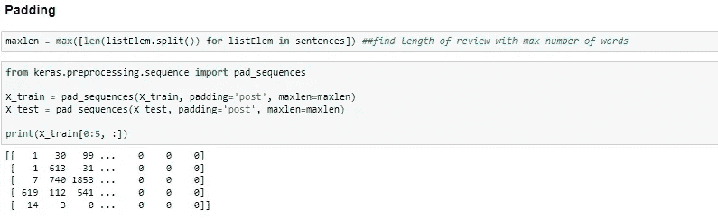

**手套嵌入**:我的第三种方法是使用预先训练好的手套嵌入。这个免费的[可下载的](https://nlp.stanford.edu/projects/glove/)嵌入已经初始化了单词的权重，这些权重很大程度上是通过在整个文本语料库中创建单词共现矩阵而获得的。Keras 提供了将这些嵌入字典合并到神经网络模型的嵌入函数中的能力。虽然这种嵌入被用来作为模型的种子，但我选择在模型训练期间更新它们。如果我有更多的时间，我会探索其他预训练的嵌入库是 [Word2Vec](https://www.tensorflow.org/tutorials/text/word2vec) 和 [TF-IDF](https://nlp.stanford.edu/IR-book/html/htmledition/tf-idf-weighting-1.html) 。从下面的代码片段可以看出，如果我将最大嵌入维数设置为 50，GloVe library 占了我的数据的文本语料库中所有单词的大约 93%。

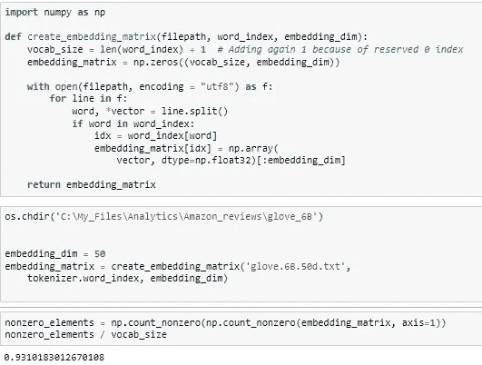

# 建模:

由于数据量很大，特别是当文本被矢量化时，我倾向于使用神经网络进行探索。我对使用 CNN 特别感兴趣，这是文本分类问题中常用的[。我很好奇它与更传统/不太密集的 ML 算法(SVM)相比会有什么表现，这也是文本分类的一个流行的选择。](https://arxiv.org/abs/1412.1058)

## **支持向量机(SVM):**

对于我的 SVM 模型，我使用默认参数来训练我的文本数据。它没有应用任何正则化惩罚，并使用径向基函数核。输入向量由 BOW 编码技术创建。由于 SVM 不是我项目的重点，我没有花太多时间来调整模型的参数值，而是将其视为一个基线模型。

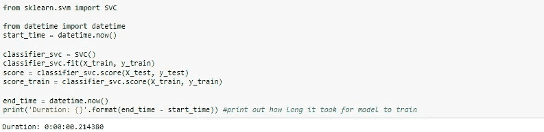

我的 SVM 基线模型的结果如下。2500 条验证记录的准确率约为 62%。此外，在训练数据集上的准确率仅为 69.1%，这意味着该算法不是非常有效。

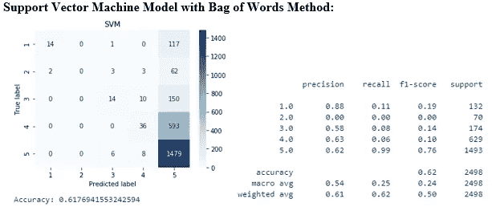

## **深度神经网络(DNN)** :

我使用上文描述的 BOW 和训练词嵌入文本矢量化技术实现了一个 DNN。我使用了 Keras 的顺序模型 API，其中层是按顺序添加的。这个[教程](https://realpython.com/python-keras-text-classification/#convolutional-neural-networks-cnn)对于实现 Keras 和获得神经网络的基本理解都是一个特别有用的指南。我将尝试在下面总结这一点，我已经*斜体*了一个神经网络的关键元素，它有我试验过的多种变化。

**【非常】神经网络的高层描述:**神经网络由从输入层前馈训练数据的节点组成→一个或几个*隐藏层*所有迭代训练都在那里发生→包含加权预测概率的输出层。输出图层的每个预测类都有一个结点(在本例中为 5 个)。下面是一个简单的图表。

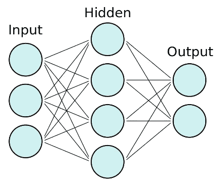

在整个神经网络中，每一层的输入节点都乘以一个计算出的权重和偏差变量，以产生下一层的输出节点。模型的初始输入权重是随机分配的，并通过一种称为反向传播的方法进行训练。该方法使用*优化器*来减少计算的目标输出和期望的目标输出之间的误差。优化器的目标是减少*损失函数*，这就是我们量化误差的方式。在整个反向传播过程中，每个输入层的权重通过*激活函数*传递。

**我的车型中的关键参数**:

1.  *隐藏层*:我建立了一个“深度”神经网络，这意味着有几个隐藏层，以便进行额外的训练。在我手动训练嵌入的模型中，我必须在我的矢量化中添加一个嵌入层。这在我的 BOW 模型中是不需要的。为了帮助推广这个模型，我还测试了添加一个[删除层](https://machinelearningmastery.com/dropout-for-regularizing-deep-neural-networks/)，它在整个反向传播过程中随机删除节点。但是，它对性能准确性的影响有限。
2.  *优化器*:我使用了一个 [Adam](https://machinelearningmastery.com/adam-optimization-algorithm-for-deep-learning/) 优化器，因为它被广泛使用，而且[认为](https://datascience.stackexchange.com/questions/10523/guidelines-for-selecting-an-optimizer-for-training-neural-networks)在各种型号上都有很好的性能。
3.  *损失函数*:我使用了分类交叉熵损失函数，因为这是一个多类分类问题。
4.  *激活函数*:可以将不同的激活函数应用于神经网络中的不同层。对于我的初始层，我使用了 10 个具有 Relu 激活功能的神经元。我使用了 softmax 激活函数，它非常适合多类问题，因为它输出了每个类标签的概率。我还测试了添加正则函数到我的辍学层。

下面的代码片段展示了 DNN 是如何在喀拉斯建造的。

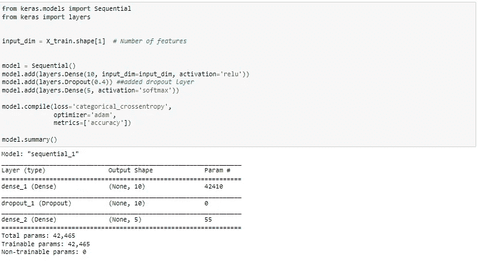

Defining model parameters

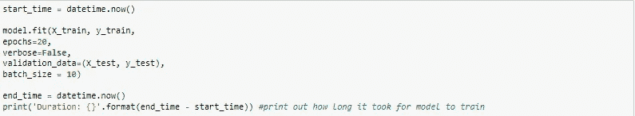

Training the model

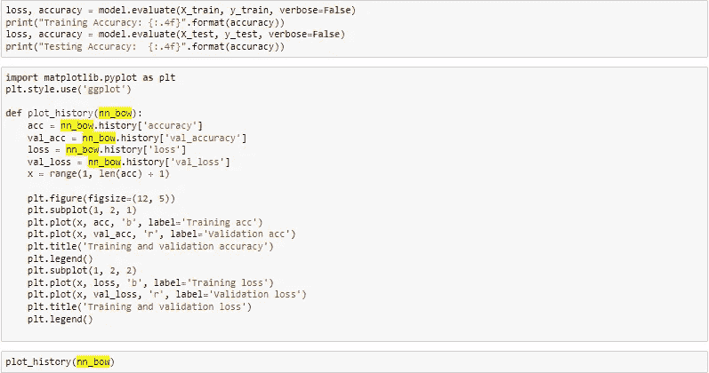

Viewing performance results

**DNN 结果:**

如下所示，我的两个 DNN 模型在 2500 条验证记录上的准确率都在 60%左右。高训练精度(92–95%)意味着模型非常过拟合。然而，如上所述，我的带蝴蝶结的 DNN 在预测一星之内的星级评分方面表现最好(91.2%)。

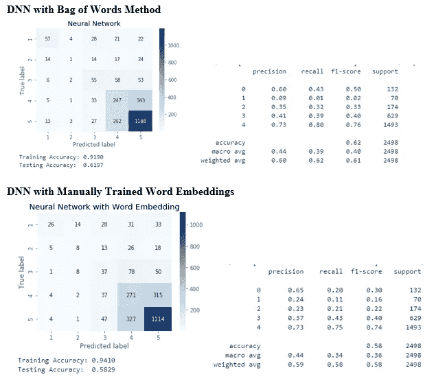

当将模型拟合到训练数据时，似乎验证数据的准确性实际上在大约 5 个时期后开始下降。下面，X 轴表示时代，Y 轴表示正确预测的星级比例。

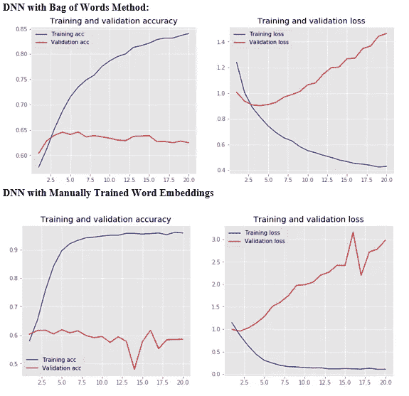

## **卷积神经网络**:

**架构和方法:**

CNN 是一种 DNN，其架构相似，但具有一些关键的附加层和参数，如下面的图[所示](https://towardsdatascience.com/understanding-how-convolutional-neural-network-cnn-perform-text-classification-with-word-d2ee64b9dd0b)。

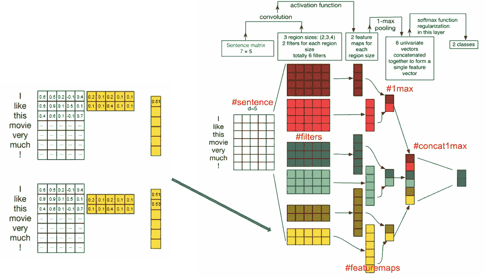

**第 1 层——输入层:**最左侧，输入层将单词嵌入低维向量中。这是由 Keras 中的嵌入函数完成的，类似于我的 DNNs。

在我的 CNN 模型中，使用了预先训练的 GloVe 单词嵌入，我通过在 CNN 架构的初始步骤中创建一个嵌入层来调用它。这是通过将权重设置为等于我导入的嵌入矩阵来完成的。输入长度是我在文本处理中创建的填充向量序列的最大长度(如上所述)。虽然这些嵌入为我的模型提供了种子，但我选择将嵌入设置为可训练的，并在模型训练期间不断更新权重。

**层 2 -卷积层:**该第二层通过嵌入的字向量的第一输入层进行卷积。使用各种滤波器并用激活函数(如 DNN)对每个卷积执行逐元素乘法。它对我的输入矩阵中的记号子集使用了许多不同大小的过滤器。下图左侧显示了一个示例，其中一个 2x5 过滤器一次遍历输入句子中的两个相邻单词(用嵌入矩阵表示)。然后，它会生成记录在要素地图输出图层(0.51)中的按元素分类的产品。这一顺序对它过滤的每一组单词重复进行。

有不同的非线性激活函数[可以用](https://realpython.com/python-keras-text-classification/#convolutional-neural-networks-cnn)在这一层，比如 Relu。在我的模型中，我使用了 softmax 激活函数，并使用了 128 个尺寸为 5×5、步长为 1 的过滤器。这一层过滤了我的文本字符串输入中的各种标记子集。像我的 DNN 一样，我也在我的密集层中使用了 Adam 优化器和分类交叉熵损失函数。

**第 3 层-汇集层:**CNN 中的汇集层从特征图输出中向下采样，以给出在输入中检测到的特征的[概括和概括版本。因此，即使卷积层检测到特征输入的微小变化(例如单词的排序)，汇集的特征图也可以具有相同的结果。](https://machinelearningmastery.com/pooling-layers-for-convolutional-neural-networks/)

与上图不同，我使用了全局最大池，它将整个特征映射向下采样为一个值。此外，我的模型的输出(最右边)有 5 个类(对于每个星星)而不是 2 个。

**超参数调整:**我使用 Python 的 Gridsearch 功能来测试我的 CNN 手套模型的最佳参数组合。前 20 名表演组合的结果输出如下。我测试的 CNN 参数是激活函数、辍学率、学习率和初始层神经元数量。我最终使用了默认的 0.1 的学习率，5 个神经元，0.2 的辍学率，和一个 softmax 激活函数。

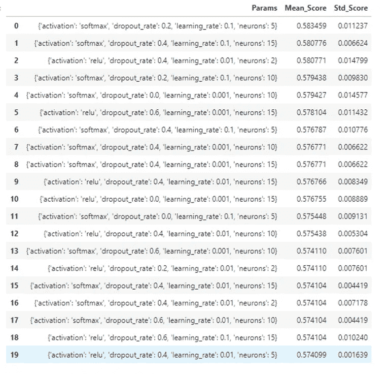

下面是我如何用 Python 的 Keras 库编写 CNN 的代码片段。

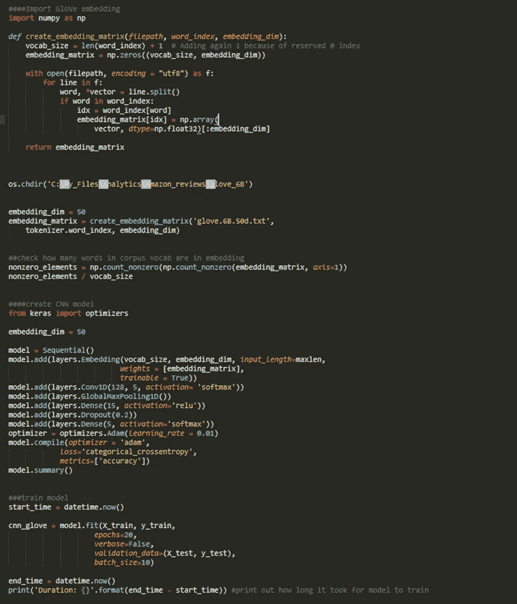

**CNN 结果:**

尽管我的 CNN 模型进行了所有的调整(训练时间明显更长)，但它的表现比我的神经网络 BOW 模型略差。我的带手套嵌入的 CNN 在 2500 条验证记录中有 57%的准确率。我的 CNN 有 56.2%的准确率。像我的 DNNs 一样，它们在训练样本上都有很高的准确率(约 93%)，这意味着明显的过度拟合。然而，我又一次感到高兴，他们在一颗恒星内有 90%的预测准确率。

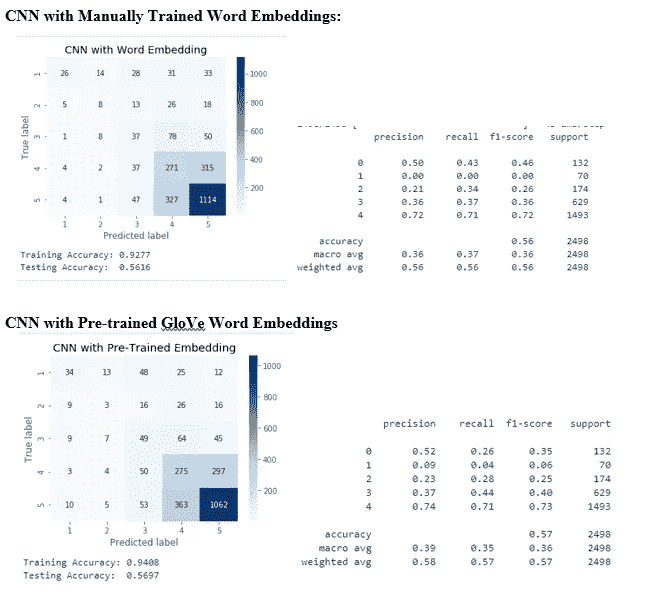

同样，和我的 DNNs 一样，下面的学习曲线速率表明，我的验证数据的准确性在大约 5 个时期后开始下降。如果给我更多的时间，我会继续测试各种参数——特别是 CNN 卷积层的过滤参数。

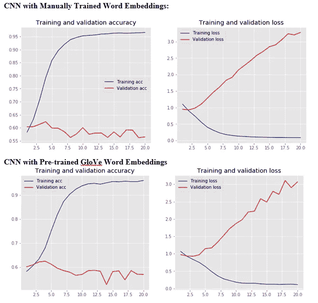

随着我对 NLP 和神经网络建模技术的进一步了解，我希望能够再次访问这个项目，并有可能提高模型的性能。

 [## Mlearning.ai 提交建议

### 如何成为 Mlearning.ai 上的作家

medium.com](/mlearning-ai/mlearning-ai-submission-suggestions-b51e2b130bfb)