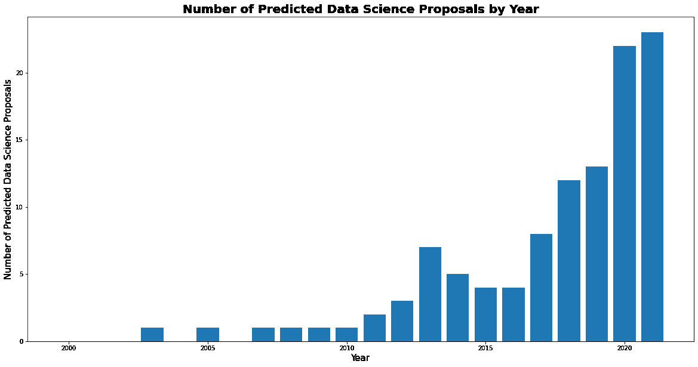

# 使用自然语言处理改善被授权者的发现

> 原文：<https://medium.com/mlearning-ai/using-nlp-to-improve-grantee-discovery-adc40f3833f?source=collection_archive---------4----------------------->

我如何构建一个简单的数据科学主题分类器来标记洛克菲勒基金会的资助数据库。

由 Dustin Marshall 撰写，这篇文章基于去年社区聚焦系列的《走向数据科学》编辑和 Rockefeller Foundation 之间的 [*采访*](https://towardsdatascience.com/adapting-data-science-tools-for-social-impact-in-philanthropy-73a8a382c79c) *中提出的许多主题。*


Image: DALL-E mini/Craiyon

# 洛克菲勒基金会的数据科学团队

我整个夏天都在洛克菲勒基金会的数据科学团队中，这是他们创新团队的一部分。该团队今年的重点之一是监控社会部门使用人工智能造福社会的所有创新方式。**这项工作要求团队关注 RF 受让人网络中的数据科学技术和专业知识。**

作为他们的暑期数据科学助理，我的任务是构建一个简单而有效的分类模型，以确定一项资助是否与数据科学相关。该模型将对基金会的拨款应用二元标签——是否与数据科学相关。了解哪些组织使用数据科学技术将有助于我们发现数据科学未来应用的机会。我希望下面分享的过程(和代码)能够对那些希望根据自己的项目需求进行调整的数据新手有所启发。

# 构建数据科学分类模型

**文本分类是大多数现代自然语言处理**[](https://towardsdatascience.com/your-guide-to-natural-language-processing-nlp-48ea2511f6e1)****【NLP】**应用的基础，无论是在网络搜索中识别最相关的链接，还是从你的电子邮件收件箱中过滤垃圾邮件。在这种数据科学分类模型的情况下，它不必那么复杂。**

****为 NLP 模型选择数据源时，拥有大量行业特定词汇的文本通常在最简单的模型中表现最佳**。对于这个模型，我注意到我们的内部管理文档包含了太多的冗余，而在拨款开始时提交的提案由于倾向于使用更多的行话而脱颖而出，成为文本分类的良好候选。**

****在** [**监督机器学习**](https://towardsdatascience.com/supervised-vs-unsupervised-learning-14f68e32ea8d) **中，为了让一个模型对未知数据做出预测，需要对已知数据进行训练。**出于这个原因，在提取了提交给基金会的 1000 份最新提案后，大约有 100 份被手工标注为与数据科学相关。其标准是，提案需要使用赠款来开发或改进数据产品。**

```
# Convert csv with data science proposals text to pandas dataframe & add classification label
data_science_proposals = pd.read_csv("DataScienceProposals.csv", header=None)
data_science_proposals.columns = ["raw_text"]
data_science_proposals["label"] = np.ones(len(data_science_proposals), dtype=np.int32)# Convert csv with other proposals text to pandas dataframe & add classification label
other_proposals = pd.read_csv("OtherProposals.csv", header=None)
other_proposals.columns = ["raw_text"]
other_proposals["label"] = np.zeros(len(other_proposals), dtype=np.int32)
```

****为了让 NLP 模型发挥最佳性能，对数据进行预处理，删除不必要和不一致的细节非常重要。对于该模型，Python 数据分析库 [Pandas](https://pandas.pydata.org/) 和数学库 [NumPy](https://numpy.org/) 用于导入和准备数据。然后使用库[自然语言工具包](https://www.nltk.org/) (NLKT)对数据进行预处理，去除特殊字符和标点符号。接下来，使用同一个 NLKT 包，在一个叫做[词汇化](https://towardsdatascience.com/stemming-lemmatization-what-ba782b7c0bd8)的过程中，同一个单词的不同形式被简化为它们的根单词。****

```
# Create function to pre-process text to improve model performance
def text_preprocessing(text):
    text = text.lower()
    text = re.sub('[^a-zA-Z]', ' ', text)
    text = text.split() 
    text = [WordNetLemmatizer().lemmatize(word) for word in text if 
        not word in set(stopwords.words('english'))]
    text = ' '.join(text)
    return text
```

****为了使模型能够根据数据进行训练，数据必须以一种可以理解的方式通过模型。**为此，该模型包括一个管道，首先根据单词在文档中出现的频率以及在标记为数据科学相关的文档集中出现的频率，将每个唯一的单词转换为数字。这个过程被称为[词频-逆文档频率](https://towardsdatascience.com/tf-idf-for-document-ranking-from-scratch-in-python-on-real-world-dataset-796d339a4089#:~:text=TF%2DIDF%20stands%20for%20%E2%80%9CTerm,Information%20Retrieval%20and%20Text%20Mining.) (TF-IDF)文本矢量化，可以简单地使用 Python 机器学习包 [Scikit-learn](https://scikit-learn.org/stable/) (sklearn)来完成。为了进一步提高模型理解数据的能力，管道再次使用 sklearn 对向量执行[奇异值分解](https://towardsdatascience.com/singular-value-decomposition-158469b433ad) (SVD)，进一步删除数据中的冗余，然后标准化数据，转换数字，使平均值为 0，标准偏差为 1。一旦数据被处理，它被分成训练集和测试集。**

```
# Build pipeline to transform and process text
model = Pipeline(steps=[
    ("tfidf", TfidfVectorizer(ngram_range=(2,4), min_df=5, 
        max_df=0.5, sublinear_tf=True, stop_words="english")), 
    ("svd", TruncatedSVD(n_components=64, n_iter=10, 
        random_state=1)),
    ("scaler", StandardScaler()))
```

****由于有多种分类模型可供使用，并且每个模型中都有可以调整以提高性能的超参数，因此留出训练集中的数据来测试和验证您的选择非常重要**。对于该模型，训练集被再次分割以包括额外的验证集，然后使用 sklearn 库中的各种分类模型进行评估，其中[支持向量机](https://scikit-learn.org/stable/modules/svm.html) (SVM)分类器具有最高的性能度量。然后使用相同的方法调整模型的超参数。**

```
# Iterate through classifiers, building pipeline that transforms text and passes it through classifier
for name, classifier in [
          ('LogReg', LogisticRegression()), 
          ('RF', RandomForestClassifier()),
          ('KNN', KNeighborsClassifier()),
          ('SVM', SVC(probability=True)), 
          ('GNB', GaussianNB()),
          ('XGB', XGBClassifier())]:
    model = Pipeline(steps=[
        ("tfidf", TfidfVectorizer(ngram_range=(2,4), min_df=5, 
            max_df=0.5, sublinear_tf=True, stop_words="english")),
        ("svd", TruncatedSVD(n_components=64, n_iter=10, 
            random_state=1)),
        ("scaler", StandardScaler()),
        (name, classifier)])
```

****决定如何评估分类模型的性能取决于用例的需求落在** [**精度/召回权衡**](https://towardsdatascience.com/precision-and-recall-a-comprehensive-guide-with-practical-examples-71d614e3fc43) **上。**在这种情况下，最重要的是，模型将所有数据科学提案标记为与数据科学相关，即使有些提案被标记为与数据科学无关。这是一个回忆偏向模型的例子，它需要一个考虑到这一点的评估尺度。因此，正在使用 [F2-Score 测度](https://towardsdatascience.com/is-f1-the-appropriate-criterion-to-use-what-about-f2-f3-f-beta-4bd8ef17e285)对模型进行评估，该测度按比例结合了精确度和召回测度，同时也增加了召回的权重。**

```
# Evaluate average model performance across 10 random states (to account for the small sample size)
f2_scores_byrandomstate = []
for n in range(1,11):
    # split data into training, validation, and testing sets
    X = data["processed_text"].values
    y = data["label"].values
    X_train, X_test, y_train, y_test = train_test_split(X, y, 
        test_size=0.20, random_state=n, shuffle=True, stratify=y)
    train_X, validate_X, train_y, validate_y =  
        train_test_split(X_train, y_train, test_size=0.25, 
        random_state=n, shuffle=True, stratify=y_train)
    # fit model on the training set
    model.fit(train_X, train_y)
    # find max F2-Score measure for the model
    y_score = model.predict_proba(validate_X)[:, 1]
    precision, recall, thresholds = 
        precision_recall_curve(validate_y, y_score)
    f2_score = (5 * recall * precision) / (4 * recall + precision) + 
        1e-10
    f2_scores_byrandomstate.append(np.max(f2_score))
average_model_performance = np.average(f2_scores_byrandomstate)
```

**经过所有的文本预处理、矢量化、模型选择和超参数调整后，性能最佳的模型的 F2-Score 为 0.828。任何高于. 7 的分数都被认为高于平均水平，但高于. 9 的分数将是理想的。**

****该型号完整代码见** [**此处为**](https://gist.github.com/dustinmarshall-rf/95979c8ae1c38630258ccc4cf14c9640) **。****

# **将该模型应用于洛克菲勒基金会的提案集**

**在向洛克菲勒基金会提交最新的 1k 提案以查找与数据科学相关的应用程序并对模型进行培训后，我们现在可以打开存储在赠款数据库中的其余 4k+提案以及将来提交的任何提案。我们得到的回报是对所有提交给基金会并继续前进的提案进行预测分类。这将有助于洛克菲勒基金会利用数据科学技术简化确定受赠人的过程。**

```
# Plot predicted data science proposals across time
additional_proposals = additional_proposals.groupby("year").sum()
plt.figure(figsize =(20, 10))
plt.bar(additional_proposals.index.values, 
    additional_proposals["predicted_label"])
plt.xlabel("Year", fontsize = 15)
plt.ylabel("Number of Predicted Data Science Proposals", fontsize = 
    15)
plt.title("Number of Predicted Data Science Proposals by Year", 
    fontweight ='bold', fontsize = 20)
plt.show()
```

****

# **洛克菲勒基金会数据科学基金**

**洛克菲勒基金会自成立以来就对慈善事业采取假设和数据驱动的方法，但直到最近，它才加倍承诺资助专注于推广和应用数据科学以产生社会影响的倡议和组织。**

**最后，我强调了近年来创新团队中一些杰出的受赠者，他们正在从数据科学中获取技术和模型——与上面分享的没有太大不同——并利用它们来创新解决全球社区面临的长期问题的方案。**

*   **[**data kind**](https://www.datakind.org/)**:**自 2017 年以来，洛克菲勒基金会已向美国非营利组织 [DataKind](https://www.datakind.org/) 拨款超过 100 万美元。这笔正在进行的拨款用于支持该组织使用人工智能和预测分析改善世界各地生活的各种工作，以及总的来说，其连接数据科学和非营利社区以产生更大社会影响的使命。要阅读更多关于他们最近的资助，请看这篇文章。**
*   **[**Data.org**](https://data.org/)**:**自 2021 年以来，洛克菲勒基金会已向美国非营利组织[Data.org](https://data.org/)捐赠了超过 1000 万美元，以支持他们在构建具有社会影响的数据科学领域和建立高影响力用例方面的努力。要阅读更多关于他们惊人工作的内容，请看这篇文章。**
*   **[**阿特拉斯**](https://www.atlasai.co/) **:** 上个月，洛克菲勒基金会向总部位于美国的 B 公司提供了 180 万美元的资助，目的是帮助他们构建下一代人类与经济地图集，这是一种用于衡量贫困和模拟发展进程的数据科学工具。要了解更多关于这项资助的信息，请看这篇文章。**

**[](/mlearning-ai/mlearning-ai-submission-suggestions-b51e2b130bfb) [## Mlearning.ai 提交建议

### 如何成为 Mlearning.ai 上的作家

medium.com](/mlearning-ai/mlearning-ai-submission-suggestions-b51e2b130bfb)**