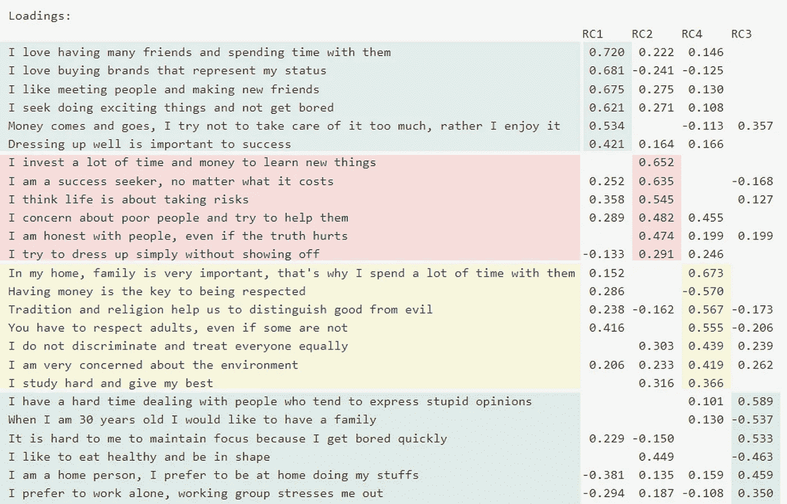
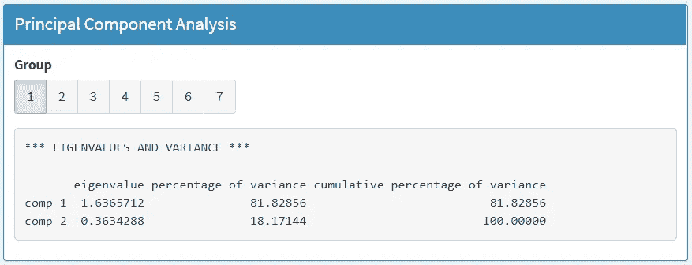
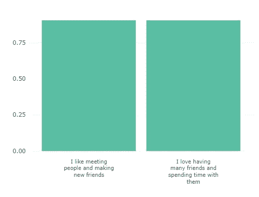
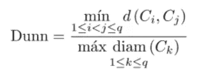
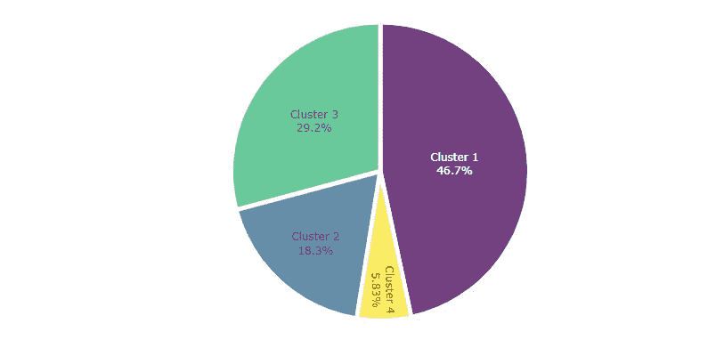
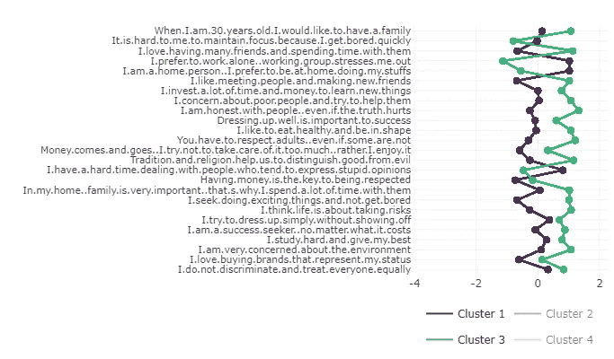
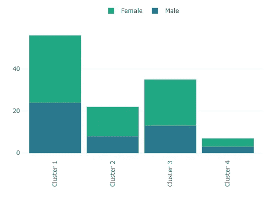
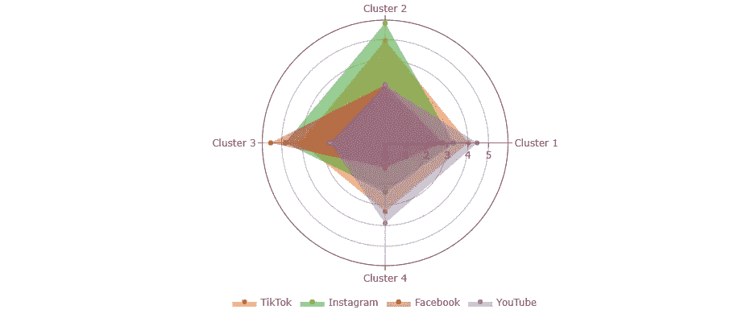

# 使用 R-Shiny 通过应用心理聚类帮助公司开展更好的营销活动

> 原文：<https://medium.com/mlearning-ai/using-r-shiny-to-help-companies-run-better-marketing-campaigns-by-applying-psychological-clustering-abe5f7ea3183?source=collection_archive---------5----------------------->

创建市场集群和决定如何通过 R-Shiny 达到市场集群的有用技巧(包括相关性、因子分析、PCA、对应分析和集群技术)。

如果有人问你知道哪些 BI 工具，你可能会想到 Power BI 或 Tableau。这就是为什么，在我看来，Shiny 是用来创建仪表板的最被低估的工具。事实是，Shiny 可以构建强大的交互式可视化，今天我将向您展示如何使用它，应用聚类技术和其他类型的分析。

# 为什么聚类有助于优化广告预算？

好了，在去编码和深入钻研之前，我们先来分析一下公司是怎么看市场的。在大多数行业，市场是如此之大，如果公司试图触及所有的客户，他们的努力将是无效的。这是因为消费者的行为各不相同，根据不同的人，他们会表现出以下模式:

*   他们可能在寻找高价值、物有所值或低成本的产品。
*   生活方式和价值观会有所不同。

因此，不可能以一种所有消费者都喜欢并购买的方式提供产品和/或服务。

为了创造有利可图的产品，公司倾向于将市场划分为集群，从中选择几个，并根据他们的需求提供产品。此外，更容易有效地创建针对具有许多共同点的人(集群)的广告活动，而不是创建针对所有人的平面广告活动。

由于上述原因，聚类分析是数据科学领域中广泛使用的技术。引用亚历山大·巴甫洛夫·科岗(前 CDO 剑桥分析公司)的话，他因开发了允许剑桥分析公司收集 8000 万脸书用户的个人信息的应用程序而闻名(我知道这是不对的，但老实说，这是一个出色的技术执行):

> 如果你在收集人们的数据，并对他们进行描述，这给了你更多的洞察力，你可以利用这些洞察力来了解如何对人群进行细分，以向他们传达他们关心的问题以及他们可能参与的语言和图像。

# 端到端集群项目

作为一名大学教授，我要求我的学生完成一份用谷歌表格做的性格测试调查。查看了解个性测试调查是什么样的(注意:它是用西班牙语写的。如果你喜欢，你可以翻译它，或者不要担心它，因为你会在文章的下面看到它的翻译):

如您所见，调查分为三个部分:

*   **人口统计:**它只有两个简单的问题(年龄和性别)。它本来可以更广泛，但它并不坏。
*   **陈述:**最重要的区块，包含所有与心理侧写相关的问题(生活方式、兴趣爱好、思维方式、个人价值观)。
*   **应用:**包含学生在社交媒体(脸书、WhatsApp、Instagram 和 YouTube)上花费时间的信息。

一天结束时，我们收到了 123 个案例，样本量很小。然而，它足以运行我们的教学目的的分析。如果我们要解决一个真正的商业问题，就需要一个更大更有代表性的样本。

现在，让我们假设我们为一家公司工作，我们正试图接触年轻的中产阶级目标，像我的学生。我们可以想象为 Forever 21 或任何其他公司工作。真正的问题是:我们如何以尽可能好的方式达到目标并与之互动？

一个有效的方法是试图了解他们如何思考，他们的价值观和对生活的想法是什么。这就是为什么调查包含允许我们根据受访者的同意程度对答案进行评级的陈述。

让我们看看结果(注意:这是唯一一个不包含在仪表板中的图表):

According to you, which of the following statements best describes your way of being and thinking? (Likert’s scale from 1 to 5)

不幸的是，柱状图几乎没有显示变量之间的差异。即使我们可以清楚地看到第一个和最后一个陈述之间的差异，我们真的能区分出*我关心穷人并努力帮助他们*和*我努力学习并尽最大努力*？一点也不。除此之外，如果这个目标(记住，年轻的中产阶级)可以进一步分为基于心理的集群呢？

# 用闪亮的仪表板建立结论

首先，我想和你分享两件事:

*   [R-Shiny 脚本](https://github.com/auzaluis/personality-clusters/blob/main/personality-clusters-english-720.R)，因为如果我把所有的细节都写在这里，文章永远不会结束，所以我只会展示和解释最重要的几行代码。
*   [仪表板](https://acortar.link/UTbtig)，因此您可以通过自己的分析与它进行交互。

现在，让我们将流程分为 5 个部分:

*   **导入**Google Forms 创建的电子表格并做一些转换。
*   **探索**数据，通过相关性和因子分析找到变量之间的关系。
*   **用 PCA(主成分分析)对**相似变量进行分组。
*   **使用欧几里德距离通过沃德方法定义**聚类，并使用邓恩指数进行评估。
*   **通过对应分析和其他技术了解**集群。

## 从 Google 表单导入

使用 *gsheet* 库中的 *gsheet2tbl* 函数:

下一步是数据争论。就像我之前说的，我不会在这里提到所有的过程，只是最重要的。在这种情况下是从文本格式到数字的 Likert 标度变换，因此我们可以稍后构建相关矩阵:

## 探索变量之间的关系

变量(陈述)如此之多，以至于不可能用我们的样本进行聚类分析。因为我们没有数百万行，只有几行，PCA(主成分分析)是可取的，以减少变量的数量。

但在此之前，让我们检查相关性是否允许我们运行主成分分析。我们通过定义相关矩阵来做到这一点:

然后我们需要为矩阵创建图表:

Quotes Correlations Matrix Plot

一些陈述之间的关系是显而易见的。比如*见人*和*与朋友共度时光*(斯皮尔曼相关= 0.647)*传统*和*尊敬大人*(斯皮尔曼相关= 0.379)等等。

现在，我们可以直观地说，主成分分析将有助于我们通过创建新的维度来减少变量的数量。

找到关系的另一种方法是进行*因子分析。*我们必须使用 *psych* 包中的 *principal* 函数估算*因子载荷，并将 *varimax* 定义为旋转方法:*

通过强制创建四个因子，该算法建议以下组:

*   RC1:与社会生活和消费主义相关的句子(蓝色)
*   RC2:与因果和成功变量相关的句子(红色)
*   RC3:与传统价值观相关的句子(黄色)
*   RC4:与个人主义和孤独相关的句子(绿色)

Factor analysis with varimax rotation

如果你觉得这四个因素之间的关系不够一致，可以进一步划分。顺便说一句，这是告诉你好的分析师通常试图将统计工具的结果与领域知识结合起来的恰当时机。例如，在这种情况下，我们可以通过运行相同的*因子分析*，但增加因子的数量，从而对这些因子进行更多的划分。但是，它可能不会像我们预期的那样创建组(请自行尝试)。

建议在检查*相关矩阵*和*因子分析*结果的同时，使用 PCA 手动创建您自己的组，这样您不仅能够创建技术上可接受的组，还能够创建有意义的组。

## 主成分分析降维

为什么使用 PCA 而不是*因子分析*来定义语句组？简单的说，在*因子分析*创建平衡维度(即每个维度会尽量代表一些变量)的同时，PCA 试图在第一个维度(分量)累积所有信息。所以，我们可以创建第 *k* 个组件运行 PCA *k* 次。

让我们创建第一组语句。基于*相关矩阵*和*因子分析，*可以由以下组成:

*   我喜欢认识人和交新朋友
*   我喜欢有很多朋友，喜欢和他们在一起

有几个软件包可以让你运行 PCA，但我通常用 *FactoMineR* 来运行它。在这种情况下，由于 PCA 函数运行了 *k* 次，必须首先定义 *iuOutput* :

现在，让我们使用提到的函数创建 PCA 对象:

最后，我们继续打印维度摘要并检查结果:

如果你以前运行过 PCA，你可能已经知道第一个成分包含了来自两个语句的 81.8%的信息。这意味着现在我们可以只使用一个变量(第一个组件)而不是两个。

只是为了好玩，为了保险起见，让我们看看原始变量和创建的组件之间的相关性:

相关性高于 0.90，因此我们可以放心，新的组成部分是明确的。姑且称之为**外向**维度。使用同样的方法，我又创建了六个维度，并根据它们的特征给它们命名:

*   **外向**
    我喜欢认识人，交新朋友。我喜欢有很多朋友，并和他们共度时光。
*   **消费主义**
    有钱是被尊重的关键。我喜欢购买代表我身份的品牌。金钱来来去去，我尽量不去在意它，而是享受它。
*   **传统**
    在我的家里，家人非常重要，这就是我花很多时间和他们在一起的原因。传统和宗教帮助我们区分善恶。你必须尊重成年人，即使有些人对你不尊重。
*   我投入大量的时间和金钱去学习新事物。我认为生活就是冒险。
*   我是一个居家的人，我更喜欢呆在家里做我的事情。我喜欢独自工作，在团队中工作让我感到紧张。
*   **利他主义**
    我非常关心环境。我关心穷人，并尽力帮助他们。
*   **成就**
    我是一个追求成功的人，无论付出什么代价。我努力学习，尽力而为。

## 定义集群

假设我们有 7 个变量而不是 25 个，我们现在可以对我们的样本进行*聚类分析*。我们通过运行*nb cluster*包中的*nb cluster*函数来实现。输入是每个维度的值。

重要的是要知道一些维度可以与原始变量反向相关。发生这种情况时，维度的值必须乘以-1，因此我们创建一个对象来实现这一点:

之后，我们需要定义一个对象，该对象允许分析师在运行*nb cluster*函数时交互地定义他们想要多少个集群:

尝试提高邓恩指数是明智的。它越高，意味着集群越紧密且彼此分离。

## 了解集群

为了理解聚类，我们必须创建一个包含所有可能感兴趣的变量(如人口统计或应用程序使用)的数据框架。

现在我们可以看到每个集群的重量:

到目前为止，我们知道哪个是最大的集群(1)，哪个是最小的集群(4)。除此之外，如前所述，了解每个集群的心理特征是很重要的。为此，我们进行了对应分析。这是一种广泛使用的技术，显示了两个变量之间的关系，在这种情况下，创建了*集群*和*维度。*

首先，我们创建一个表，其中包含按分类转换的维度得分:

现在我们从 *FactoMineR* 包中运行 *CA* 函数(*对应分析)*，然后我们绘制第一个 2 轴:

第 1 类和第 3 类在价值观上非常相似，除了第 1 类喜欢独处，而第 3 类非常外向。另一方面，集群 2 也是高度外向的，但是他们受到品牌和消费主义的强烈影响。最后，集群 4(最小的群体)将孤独作为一种生活方式。

要查看分类 1 和分类 3 之间差异的详细信息，让我们创建一个图表，显示陈述如何与每个分类相匹配:

与*孤独相关的变量存在显著差异。*第三组的人也承认*很难与那些倾向于表达愚蠢观点的人相处。这意味着集群 3 不仅更孤独，而且更不宽容。*

## 决策点

> 现在，让我们假设你是一名品牌经理。如果你还没有决定关注哪个集群，你应该选择一个最适合你的品牌的集群。例如，如果你经营一个高档奢侈品牌，你应该努力征服集群 2，即使集群 2 没有集群 1 大，因为你的品牌更容易与他们接触。
> 
> 如果你想坚持专注于集群 1，也许你应该创造另一个不同的品牌，以新的本质更有效地吸引这个集群。

一旦你知道了每个群体的心理特征，你就可以发现人口统计学上的差异。在这种情况下，没有显著的差异。让我们为性别生成代码，举个例子:

由于对我们的消费者有如此深入的了解，我们的活动现在能够谈论他们关心或感兴趣的话题。根据集群的不同，创意代理可以创建一些更有可能吸引他们的内容。太棒了，对吧？但是还有一个问题，媒体呢？

# 提高广告支出的效率

到目前为止，我们已经分析了 4 个集群，现在是时候分析它们的应用程序使用情况了。如你所知，我们问了他们在过去 7 天里花了多少时间在脸书、Instagram、抖音和 YouTube 上。让我们画一个蜘蛛图:

例如，如果我们决定专注于集群 3，那么把大部分预算花在 YouTube 上就是浪费钱。相反，我们应该花在脸书上，因为第三组平均每周花在脸书上的时间接近 6 小时，而看 YouTube 的时间只有 2.7 小时。另一方面，您可以看到集群 1 发生了相反的情况。

虽然上述项目仅考虑了数字媒体，但它也可能考虑了传统媒体(电视、广播等),只是在调查中增加了几个问题。

# 结论

了解如何对消费者进行心理分析有很多好处，花时间和精力去更好地了解你的目标是值得的。这将使你的公司更有效率，设计更准确的活动，从而为你的品牌创造更高的利润。

 [## Mlearning.ai 提交建议

### 如何成为 Mlearning.ai 上的作家

medium.com](/mlearning-ai/mlearning-ai-submission-suggestions-b51e2b130bfb)