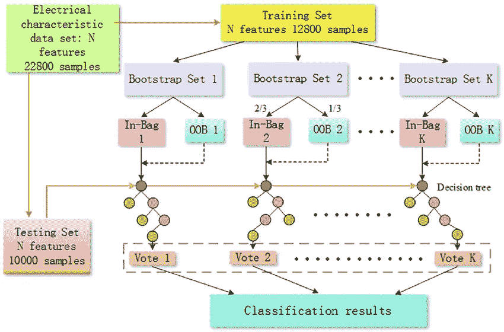
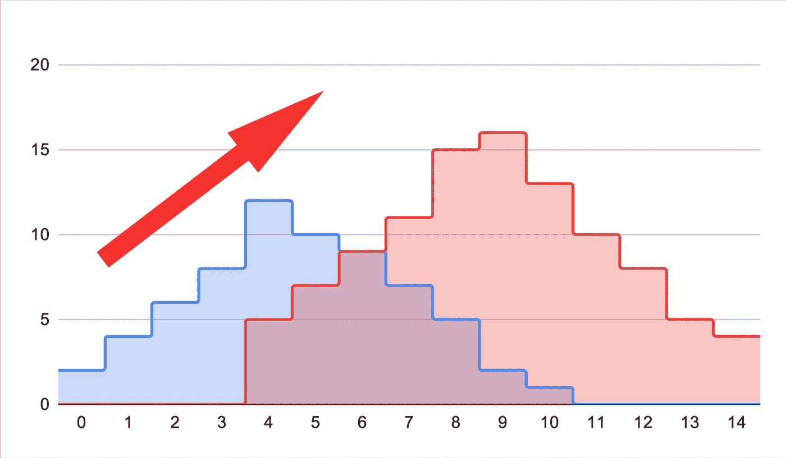
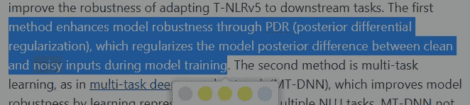
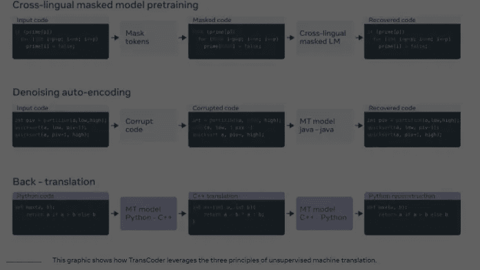
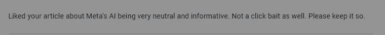
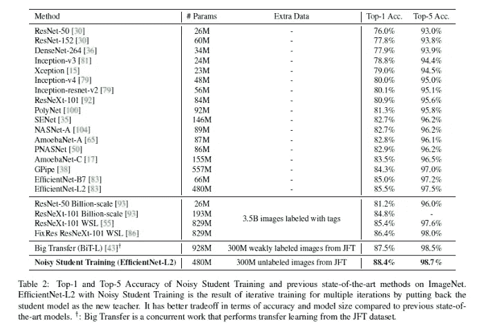
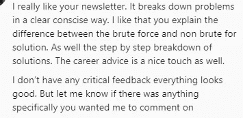

# 在深度学习中有效利用随机性

> 原文：<https://medium.com/mlearning-ai/using-randomness-effectively-in-deep-learning-910c60adc067?source=collection_archive---------0----------------------->

## 为什么它有利于数据扩充而不利于选择要素

我非常相信在你的训练数据中引入噪音和随机性。[我相信性能优势、归纳能力和健壮性都非常好，不容忽视](https://medium.datadriveninvestor.com/why-and-how-to-integrate-randomness-into-your-machine-learning-projects-53c1c30561e)。因此，我在我的内容中写了/谈了很多。最近，我的一位读者提出了一个有趣的问题。他想知道为什么在数据扩充等方面有随机性，而在选择特征方面没有随机性(垃圾输入，垃圾输出)。我认为这将是一个很好的话题，因为我强调将噪声和随机性集成到机器学习管道中，但没有涵盖为什么它工作得这么好。在这篇文章中，我将介绍随机性的原理，以及为什么它在机器学习中如此有效。要问我问题或请求/推荐主题想法，请滚动到本文的底部，并在不同的平台上与我联系。

要理解这个答案，我们先来了解一下至关重要的背景信息。

# 机器学习如何工作，面向五年级学生

传统的机器学习、数据科学、大多数人工智能，甚至更复杂的深度学习网络都基于几个基本假设:

1.  所有数据都有一个在多个样本中保持一致的基本分布。此外，一个样本的存在不会影响其他样本。统计学爱好者知道这就是 [IID(独立同分布)原理](https://medium.datadriveninvestor.com/significance-of-i-i-d-in-machine-learning-281da0d0cbefhttps://medium.datadriveninvestor.com/significance-of-i-i-d-in-machine-learning-281da0d0cbef)。
2.  可以学习数据和特征的分布，用于推断关于数据的有意义的信息。这可以用来预测目标、将数据组合在一起、预测未来性能等。

假设我们的数据满足这些假设，我们就可以开始实现机器学习模型了。我们的模型将简单地获取数据，并试图了解数据的基本分布。换句话说， ***一个模型会试图用一个函数来拟合给定的数据。***

Different models will attempt things differently. Image taken from [this U-Washington page](https://courses.washington.edu/matlab1/ModelFitting.html)

然而，重要的是要记住[机器学习模型有它们自己的关于数据的假设](https://www.kdnuggets.com/2021/02/machine-learning-assumptions.html)。这就是为什么不同的模型在给定不同类型的数据分布时表现不同，以及为什么在从数据科学/机器学习管道中做出任何结论时考虑问题的背景至关重要。

One of my favorite things about RF is that they don’t make any additional assumptions about the data. This makes them ideal for handling outliers etc. The image is taken from [here](https://www.researchgate.net/publication/316982197/figure/fig5/AS:559887665303554@1510499029585/The-structure-of-random-forest-algorithm-The-random-forest-is-composed-of-the-generated.png)

这也是为什么[扎实的数学基础是机器学习的关键](https://www.youtube.com/watch?v=b8WjF-6Bhqc&t=256s&ab_channel=Devansh%3AMachineLearningMadeSimple)。它将让你了解你的数据/报告，并作出最佳决策。

# 为什么正确的特征/数据如此重要

从这个角度来看，为什么干净的数据对模型训练如此重要应该是显而易见的。以及为什么每个人和他们的奶奶总是嚷嚷着数据的重要性。如果您没有选择好的特征，或者如果您的数据不代表整体(真实世界)的数据分布，那么您最终会得到无用的模型。

[This is why I stress the importance of dealing with Data Drift in my recommended ML Projects](https://youtu.be/A5wfVTyzv9E). [Image Source](https://towardsdatascience.com/data-drift-part-1-types-of-data-drift-16b3eb175006)

著名的，几乎是陈词滥调的原则“垃圾进，垃圾出”就是基于这个原则。如果你输入垃圾数据，你会得到很多垃圾输出。

但是等一下。到目前为止，我已经上了讲台，向任何愿意听的人宣扬随机输入和噪声训练。根据定义，随机噪声不符合任何分布。有没有可能，随机噪音是垃圾(提示休克)？那为什么我们会从中得到如此奇妙的结果呢？

# 为什么数据增强与 GIGO 相矛盾

以[trivia augment](https://arxiv.org/abs/2103.10158)为例，这是一个令人惊讶的高性能计算机视觉数据增强策略，不需要调整([关于它的故障，请观看此视频](https://youtu.be/DzdVsME6NOM))。增强策略可以产生看起来非常奇怪的样本。[谷歌还在他们的图像分类管道中整合了大量随机性，取得了惊人的结果](https://medium.datadriveninvestor.com/how-did-google-researchers-beat-imagenet-while-using-fewer-resources-267243071ee4)。

For my analysis of this publication, [check out this link](/geekculture/microsoft-timnit-gebru-and-google-ai-85384edc6af7)

这不仅限于计算机视觉分类任务。上面的片段摘自微软的“[在 GLUE 和 SuperGLUE](https://www.microsoft.com/en-us/research/blog/efficiently-and-effectively-scaling-up-language-model-pretraining-for-best-language-representation-model-on-glue-and-superglue/) 上高效和有效地扩展语言模型预处理以获得最佳语言表示模型”。该模型解决了自然语言处理中的任务和测试。正如所强调的，它在训练期间利用噪声输入来提高鲁棒性。

Taken from Facebook’s Post: [Deep learning to translate between programming languages](https://ai.facebook.com/blog/deep-learning-to-translate-between-programming-languages/)

甚至脸书的编码语言翻译器也集成了错误代码来提高性能。那么，为什么随机数据增强表现如此之好，尽管是垃圾？GIGO 不完整吗？随机噪音暗中有帮助吗？

# 为什么数据增强和噪声有效

要回答这个问题，我想让你看看我们提到的任务。说到数据扩充，这种做法在自然语言处理或计算机视觉中最为常见。这两种类型的数据本质上是不同的。

一般认为这篇文章和内容创作。你正在读这篇文章，因为算法已经以某种方式决定(无论是现在还是过去)我的写作/交流风格与你匹配。其他人也涉及了我谈到的一些主题，但他们通常有不同的受众。有 100 种方法来写/说同样的 3 件事。

All the articles here are informative and not clickbait. That’s why I’m the most woke. Follow to join the cult

计算机视觉可能看起来没有那么多样化，但这就是你错的地方。我们不仅有很多类和交互，而且同一个类的图像也可能非常不同。如果说对抗性学习教会了我们什么的话，人类察觉不到的[变化仍然会引发图像分类器](/mlearning-ai/researchers-discover-possible-reason-why-adversarial-perturbation-works-f65e64d9eb7)。

When it comes to Machine Learning, we like Chaos. Photo by [Markus Spiske](https://unsplash.com/@markusspiske?utm_source=medium&utm_medium=referral) on [Unsplash](https://unsplash.com?utm_source=medium&utm_medium=referral)

看到趋势了吗？当我们处理具有大量自然变化的任务时，随机数据扩充非常有效。在传达相同的基本信息时，编码风格、图片、文本都可以有很大的不同。通过添加带有随机数据增强/噪声的混沌元素，您可以更好地复制您将在输入中看到的真实世界的多样性。

但是，在开始实现这个方法之前，您必须考虑一个问题。

# 背景很重要

你知道我总是强调机器学习论文应该在上下文中解读吗？这将是一个最好的例子。不要因为最近的论文好像都在做，就盲目冲进去，试图用随机噪声。为什么？看这个表格，来自前面提到的谷歌论文。

This extra data is on top of an already massive dataset.

他们在基线中已经拥有的数据量是巨大的。比大部分人训练时会有的多得多。因此，当他们引入随机噪声/输入时，他们能够添加一个新的维度**，而不会弄乱基本的拟合函数**。如果你对干净数据集的随机性比例太高，你就有弄乱你的模型的风险。借用塔勒布关于[抗脆弱性](https://www.investopedia.com/terms/a/anti-fragility.asp)的一个比喻，给你的管道增加噪音就是摄入少量的毒素到你的系统中来增强你的免疫力([一种实际的做法叫做米特里达化](https://www.thefreedictionary.com/Mithridatization))。正确的数量实际上会起作用。太多会把你搞糟。

# 使用合成数据——未来？

我们也看到了在 ML 管道中使用纯合成数据的新趋势。这些可以提供各种功能，例如便宜和避免某些隐私规定。对于合成数据，我们看到相反的趋势(数据试图尽可能地类似真实世界的数据)。SinGAN-Seg [的作者将高水平发生器和神经类型转移结合起来，创造出极其逼真和有用的医学图像](/nerd-for-tech/how-is-singan-seg-solving-the-medical-machine-learnings-data-problem-26c10e1ecbcc)。

[Read more about “Fake It Till You Make It Face analysis in the wild using synthetic data alone” here](/geekculture/the-best-machine-learning-company-of-2021-8011e078edbb)

微软的[“伪造它，直到你让它在野外单独使用合成数据进行面部分析”](https://microsoft.github.io/FaceSynthetics/)做了类似的事情。它使用特殊的技术来训练一个只使用合成人脸的面部特征检测器。他们在真实的人脸上测试，结果是 SOTA。[你可以在这里阅读我的分析](/geekculture/the-best-machine-learning-company-of-2021-8011e078edbb)。

在管道中使用非常细粒度的合成数据可能是对抗 Deepfakes 等威胁的未来。这将为数据扩充增加另一层。随着管道变得越来越复杂，这些截然不同的领域将开始融合，我们将看到项目和基础设施使用多种技术。虽然这将允许强大的解决方案，但越来越复杂的系统也会成为问题。研究表明，ML 管道(以及我们对它们的评估)通常容易受到任意因素的影响。[要了解这方面的更多信息，以及如何应对，请观看此视频](https://youtu.be/S9lLdSUyKbc)。

本文到此为止。如果你想擅长机器学习，基础技能是必须的。对于那些希望进入机器学习领域的人来说，这篇文章是一个循序渐进的指南。它链接了大量的免费资源，你可以用来提高你的技能。

It’s promo time. But real talk, my newsletter (Substack) has helped a lot of people out.

要真正擅长机器学习，软件工程的基础将是至关重要的。他们将帮助你概念化，建立和优化你的 ML。我的每日时事通讯，[编码采访变得简单](https://codinginterviewsmadesimple.substack.com/)涵盖了算法设计、数学、最近的科技事件、软件工程等主题，让你成为更好的开发者。我目前全年都在打八折，所以一定要去看看。

Think of the ROI that this student made by subscribing.

我创造了[编码面试，使用通过指导多人进入顶级科技公司而发现的新技术，使面试变得简单](https://codinginterviewsmadesimple.substack.com/)。时事通讯旨在帮助你成功，避免你在 Leetcode 上浪费时间。

为了帮助我写更好的文章和了解你[填写这份调查(匿名)](https://forms.gle/7MfQmKhEhyBTMDUD7)。最多花 3 分钟，让我提高工作质量。

如果你也有任何有趣的工作/项目/想法给我，请随时联系我。总是很乐意听你说完。

以下是我的 Venmo 和 Paypal 对我工作的金钱支持。任何数额都值得赞赏，并有很大帮助。捐赠解锁独家内容，如论文分析、特殊代码、咨询和特定辅导:

https://account.venmo.com/u/FNU-Devansh

贝宝:[paypal.me/ISeeThings](https://www.paypal.com/paypalme/ISeeThings)

# 向我伸出手

使用下面的链接查看我的其他内容，了解更多关于辅导的信息，或者只是打个招呼。另外，查看免费的罗宾汉推荐链接。我们都得到一个免费的股票(你不用放任何钱)，对你没有任何风险。**所以不使用它只是损失免费的钱。**

查看我在 Medium 上的其他文章。https://rb.gy/zn1aiu

我的 YouTube:[https://rb.gy/88iwdd](https://rb.gy/88iwdd)

在 LinkedIn 上联系我。我们来连线:[https://rb.gy/m5ok2y](https://rb.gy/f7ltuj)

我的 insta gram:[https://rb.gy/gmvuy9](https://rb.gy/gmvuy9)

我的推特:【https://twitter.com/Machine01776819 

如果你正在准备编码/技术面试:【https://codinginterviewsmadesimple.substack.com/ 

获得罗宾汉的免费股票:[https://join.robinhood.com/fnud75](https://www.youtube.com/redirect?redir_token=QUFFLUhqa0xDdC1jTW9nSU91WXlCSFhEVkJ0emJvN1FaUXxBQ3Jtc0ttWkRObUdfem1DZzIyZElfcXVZNGlVNE1xSUc4aVhSVkxBVGtHMWpmei1lWWVKNzlDUXVJR24ydHBtWG1PSXNaMlBMWDQycnlIVXNMYjJZWjdXcHNZQWNnaFBnQUhCV2dNVERQajFLTTVNMV9NVnA3UQ%3D%3D&q=https%3A%2F%2Fjoin.robinhood.com%2Ffnud75&v=WAYRtSj0ces&event=video_description)

 [## Mlearning.ai 提交建议

### 如何成为 Mlearning.ai 上的作家

medium.com](/mlearning-ai/mlearning-ai-submission-suggestions-b51e2b130bfb)