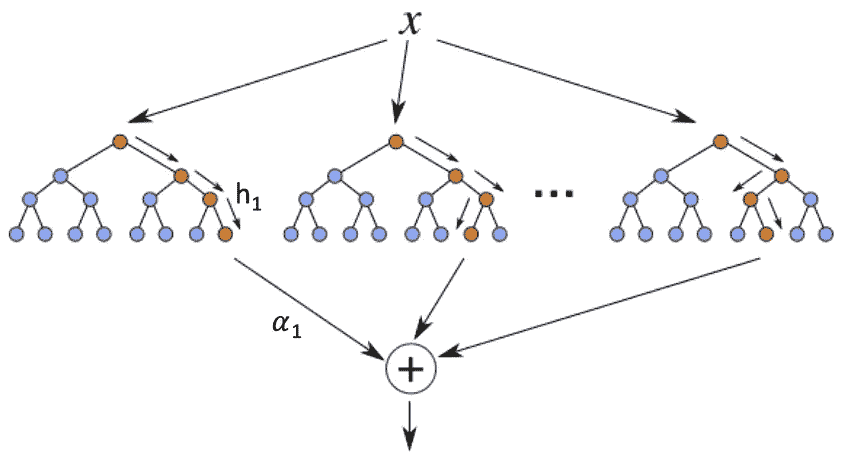
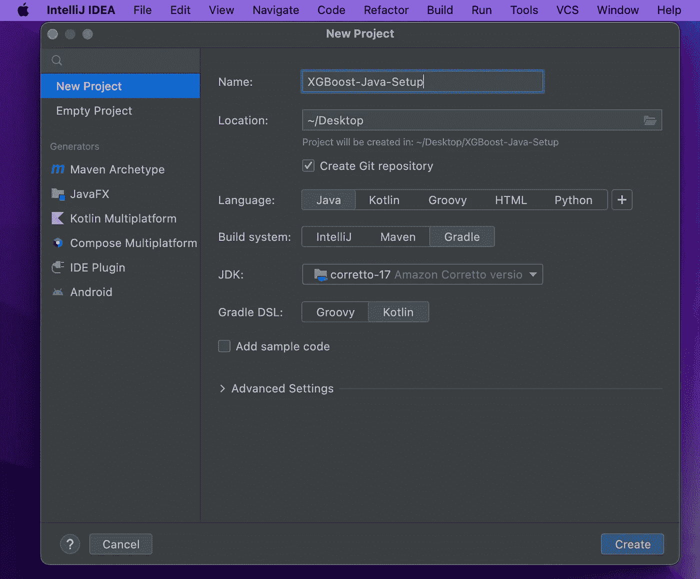
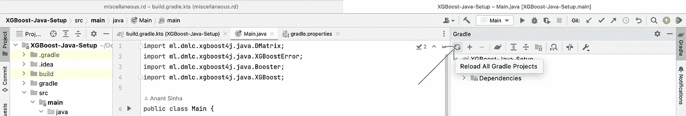

# 在 Java 中使用保存的 XGBoost 模型

> 原文：<https://medium.com/mlearning-ai/using-saved-xgboost-models-in-java-6bd8632d3fa1?source=collection_archive---------8----------------------->

几周前，我在[上发布了一篇文章](/@anantsinha9811/saving-xgboost-models-as-files-using-python-e06514308ef)，描述了如何将 Python 中创建的 XGBoost 模型保存为文件。

Python 非常适合构建 ML 模型，但是在资源有限的系统上安装大型 ML 库可能不可行。您可能还必须处理现有的栈和环境，其中模型可能必须以不同的语言加载。

Schematic diagram of a boosted ensemble of decision trees. Credit: [Energy-Efficient Classification for Resource-Constrained Biomedical Applications](https://www.researchgate.net/publication/325632132_Energy-Efficient_Classification_for_Resource-Constrained_Biomedical_Applications)

XGBoost 在线文档提供了使用 Maven 安装必要库的步骤，但是在这里使用 Gradle 要简单得多。请遵循以下步骤:

## 步骤 1:基本安装

确保您安装了 Java 和 IntelliJ。我们用的是亚马逊 Corretto 17 版本。

## 步骤 2:使用以下项目配置创建一个新项目

1.  语言:“Java”(废话)
2.  生成系统:“IntelliJ”
3.  JDK:“亚马逊科雷托 17”
4.  格雷迪 DSL:“科特林”

## 第三步:修改 *gradle.properties*

你的项目根目录应该有一个 *gradle.properties* 文件。如果它还不存在，请创建它。我们将使用这个文件来指定我们库的所需版本。截至 2022 年 9 月，以下版本有效:

## 第四步:修改 *build.gradle.kts*

在文件中声明变量 *scalarBinaryVersion* 和 *xgboostVersion* ，并将它们添加到 dependencies 部分。该文件应该如下所示:

## 步骤 5a:如果需要，下载 Gradle

您可能会在项目的右下角看到一个弹出窗口，要求您下载 Gradle。点击它让 IntelliJ 下载并安装 Gradle。如果弹出窗口不可见，请单击右上角的通知选项卡来查找它。

## 第五步:刷新梯度

从 IntelliJ 窗口的右上方打开 Gradle 窗格，然后“重新加载所有 Gradle 项目”

理想情况下，在这一步结束时，应该在 IntelliJ 控制台上打印出“构建成功”消息。这可能需要几分钟时间。

Gradle Pane on the top right

Reload Gradle button

## 步骤 7:在 Java 中加载 XGBoost 模型

调用 XGBoost loadModel 方法[将预先保存的模型](/@anantsinha9811/saving-xgboost-models-as-files-using-python-e06514308ef)加载到 Java 中，并存储在 Booster 类型的对象中。

创建一个新的 DMAtrix 对象，并将之前保存的 libsvm 文件的路径传递给它的构造函数。

模型预测将以 2D 矩阵的形式返回。第 N 个值存储在矩阵的[N][0]单元中。

参考[本报告](https://github.com/anantsinha/XGBoost-Java-Setup)中的代码。

 [## Mlearning.ai 提交建议

### 如何成为 Mlearning.ai 上的作家

medium.com](/mlearning-ai/mlearning-ai-submission-suggestions-b51e2b130bfb)