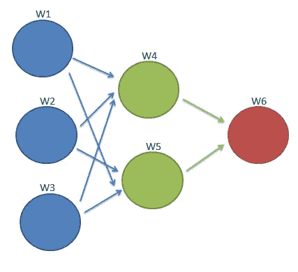

# 深度消失梯度下降问题

> 原文：<https://medium.com/mlearning-ai/vanishing-gradient-descent-problem-in-depth-a6181404bd2c?source=collection_archive---------3----------------------->

在训练多层神经网络模型时，消失梯度下降是一个大问题。这是因为，向网络中添加更多的层会导致权重值的消失，从而导致用于计算的几乎恒定的值。我们说这些值几乎是恒定的，因为变化并不显著。

让我们通过深入研究这个问题来理解这一点。

## **什么是消失梯度下降**

> 反向传播的误差信号随着与最终层(通常是输出层)的距离的增加而减少(通常是指数的),这是指向**消失梯度下降**的问题。

但这意味着什么呢？让我们通过创建自己的小网络来理解这一点。



Simple Neural Network (Made using [http://draw.io/](http://draw.io/))

这是一个简单的神经网络，有一个输入层、一个隐藏层和输出层。权重写在图中节点的旁边。

模型训练过程以下列方式进行:

1.  输入与各自的权重相乘，加上偏差，到达第一个隐藏层。
2.  这个隐藏层再次根据它们的特定权重执行计算，并且信号被传播到下一层(在这种情况下是输出层)。
3.  输出(O21)被发送到 ***损失函数*** ，优化器由此创建。优化器负责调整权重值，以减少反向传播过程的损失值。

用于更新权重的公式为:

```
Wa(new) = Wa(old) - α * (𝕕L/𝕕Wa)
```

其中，α是学习率，L 是损失函数，Wa 是特定节点的权重。

现在让我们尝试在第一步之后计算 W1 的新值。

```
W1(new) = W1(old) - α * (𝕕L/𝕕W1)
```

**我们如何计算(𝕕L/𝕕W1)？**

我们可以看到，W6 的值取决于 W4 和 W5 的值。

W4(和 W5)的值又取决于 W1、W2 和 W3 的值。

因此，为了计算 W1 引起的损耗变化，我们需要考虑 W6 和 W4 引起的损耗变化(因为它们将 W1 连接到输出端)。

因此

```
**(𝕕L/𝕕W1) = (𝕕W6/𝕕W4) * (𝕕W4/𝕕W1)**
```

这就是所谓的 ***链式分化法则。***

随着我们越往下，导数越小，所以

**(𝕕W6/𝕕W4)** 大于 **(𝕕W4/𝕕W1).**

当激活函数为 s 形时，通常会出现消失梯度下降的问题。但是为什么呢？

这是因为 sigmoid 函数的导数值总是在 0 和 0.25 之间。


Sigmoid and it's derivative (created using matplotlib)

你可以通过使用 **matplotlib** 和这段[代码](https://gist.github.com/Priyansh-Kedia/07f501da18bfd64543c513e137bb7e1a)来可视化 sigmoid 函数及其导数。

所以我们可以清楚的看到，如果 **(𝕕W6/𝕕W4)** 的值是 0.1， **(𝕕W4/𝕕W1)** 的值是 0.001，那么 **(𝕕W/𝕕W1)** 的值就会是 0.0001。

假设 W1(old) = 2.5，α = 1，则

```
W1(new) = 2.5 - 0.0001 = 2.4999
```

你可以清楚地看到，随着我们增加网络的层数， **(𝕕W/𝕕W1)** 的值会进一步减小，因此，权重的值没有明显的变化。

这就是所谓的**消失梯度问题。**

在这篇博文中，我们学习了神经网络中的消失梯度问题及其原因。

**参考**

[](https://machinelearningmastery.com/how-to-control-neural-network-model-capacity-with-nodes-and-layers/) [## 如何控制具有节点和层的神经网络模型容量-机器学习掌握

### 深度学习神经网络模型的能力控制其映射函数类型的范围

machinelearningmastery.com](https://machinelearningmastery.com/how-to-control-neural-network-model-capacity-with-nodes-and-layers/) [](https://en.wikipedia.org/wiki/Vanishing_gradient_problem) [## 消失梯度问题-维基百科

### 在机器学习中，用神经网络训练神经网络时会遇到消失梯度问题

en.wikipedia.org](https://en.wikipedia.org/wiki/Vanishing_gradient_problem)