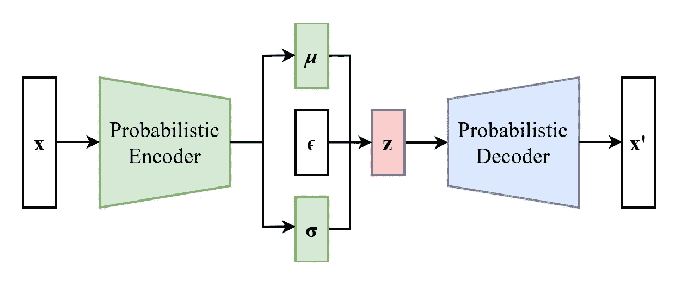
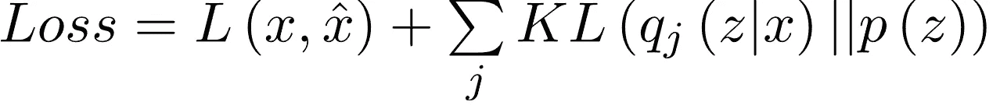
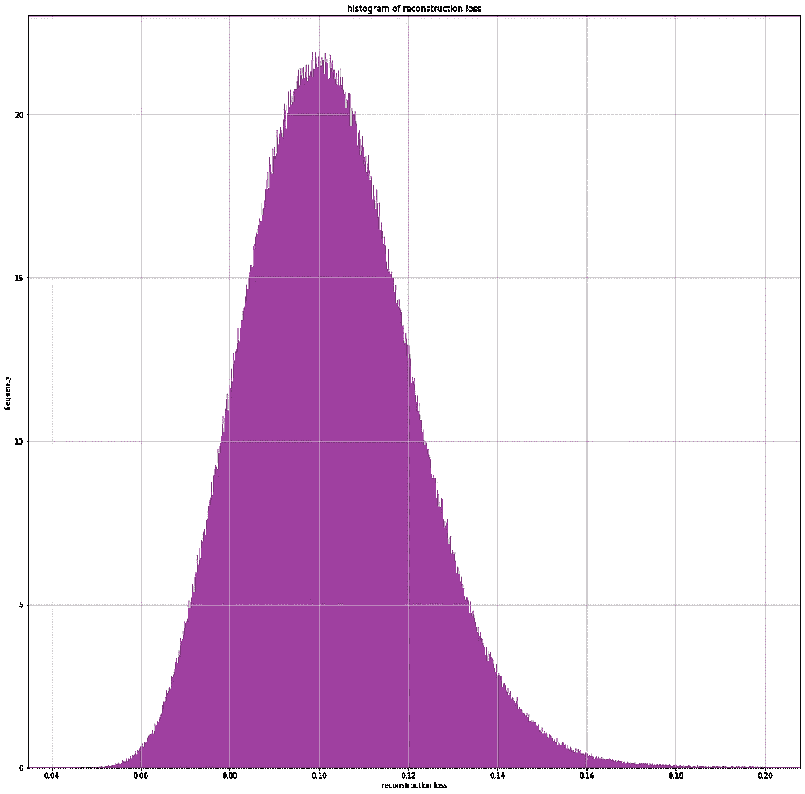
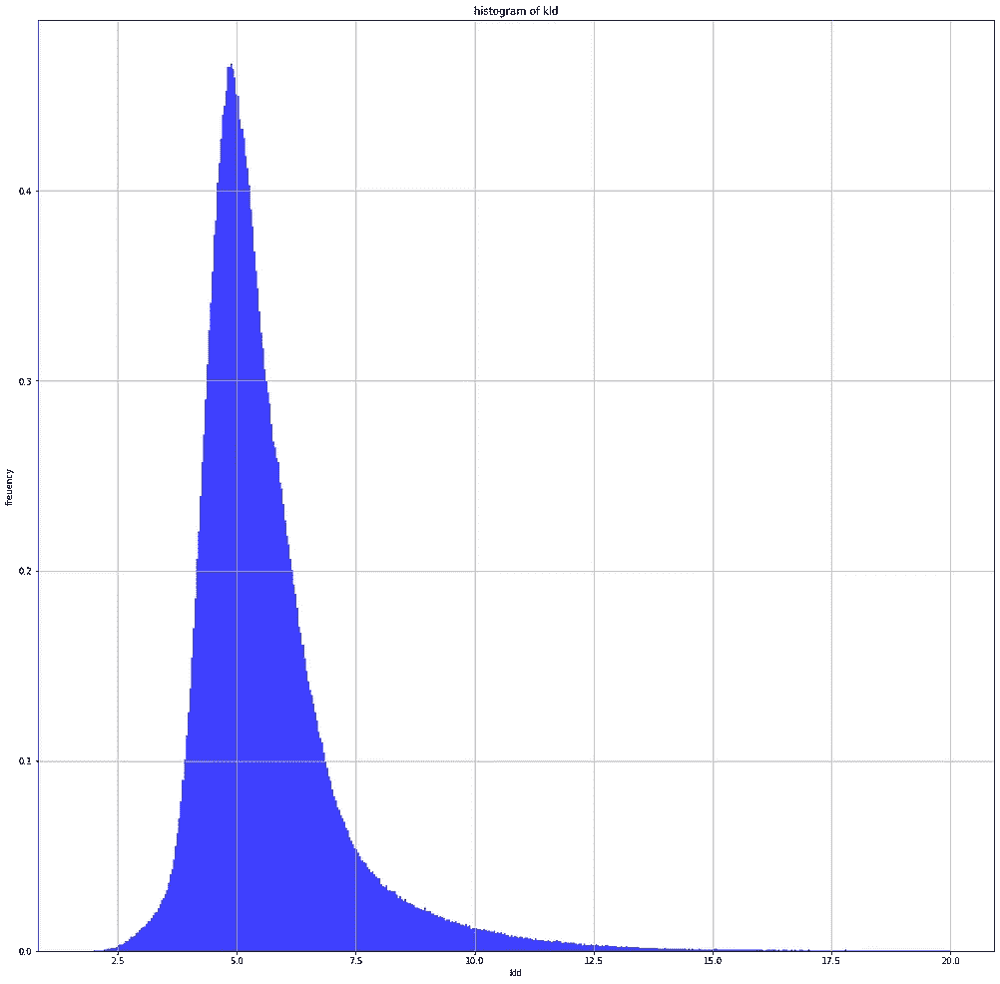
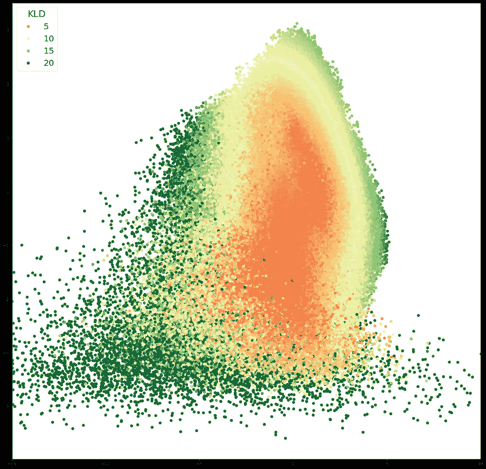
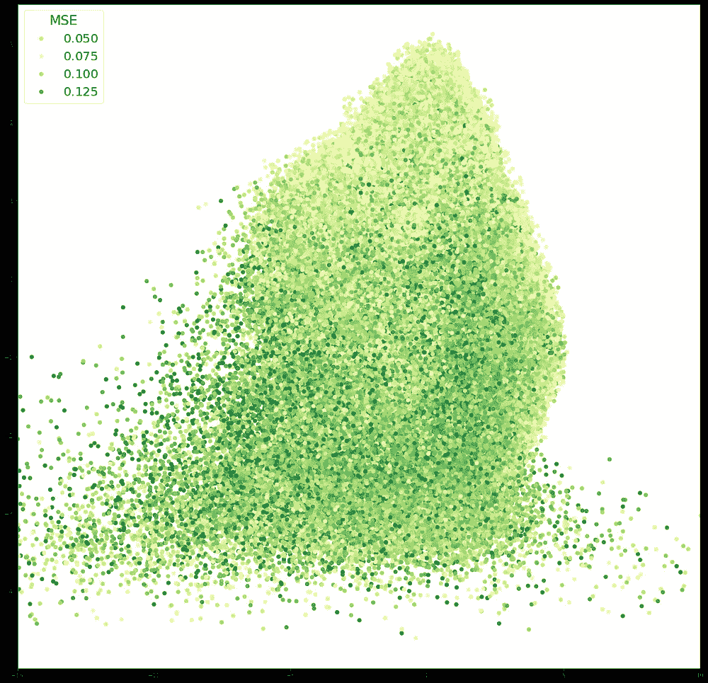

# 数字数据集的变分自动编码器(VAE)

> 原文：<https://medium.com/mlearning-ai/variational-auto-encoders-vae-for-the-numerai-dataset-2709dcc7e449?source=collection_archive---------1----------------------->

数字数据集包含全球股票市场几十年的历史数据。在数据集上训练的机器学习模型学习预测股票回报，并根据数字锦标赛中的表现赚取加密货币(NMR)。这篇博文首先解释了“为什么”variable auto encoder 是数字模型开发人员堆栈中的一个合适的工具。然后，我们讨论“什么”是一个变分自动编码器，并显示“如何”你可以训练一个。

# 为什么要改变自动编码器？

我们可以使用 VAEs 进行异常检测、去噪和生成合成数据。

## 异常检测

异常检测是关于识别明显偏离大多数数据并且不符合正常行为的明确定义的样本。在数字数据集中，可能存在财务异常时期，检测这些时期可以提供信息。

## 去噪

降噪是从信号中去除噪声的过程。我们可以应用 VAE 去噪偏离大多数的特征。去噪转换噪声特征，而异常检测标记噪声样本。

## 合成数据生成

结合了合成数据和真实数据的训练模型已经显示出[有希望的结果](https://www.forbes.com/sites/robtoews/2022/06/12/synthetic-data-is-about-to-transform-artificial-intelligence/?sh=118013c75238)。使用 VAE，我们可以从正态分布中采样，并将其传递给解码器以获得新的样本。

# 什么是变分自动编码器？

自动编码器由两个主要部分组成:1)将输入映射为代码的编码器，以及 2)使用代码重构输入的解码器。在文献中，代码也被称为表示变量或潜在变量。是什么让它变得不同？将潜在表示的分布强制为诸如高斯的已知分布。典型的 AE 无法控制潜在空间的分布。变分自动编码器(VAE)提供了一种*概率*方式来描述潜在空间中的观察。因此，我们不会构建一个输出单个值来描述每个潜在状态属性的编码器，而是将我们的编码器公式化来描述每个潜在属性的概率分布。在本教程中，我们使用在下面的论文中介绍的原始 VAE，我们称之为香草 VAE:

[](https://arxiv.org/abs/1312.6114) [## 自动编码变分贝叶斯

### 我们如何在有向概率模型中进行有效的推理和学习，在连续的…

arxiv.org](https://arxiv.org/abs/1312.6114) 

我们使用 https://github.com/AntixK/PyTorch-VAE 的[作为我们的代码库。这个代码库包括各种 VAE 架构，但是我们将重点放在它的普通 VAE 上。](https://github.com/AntixK/PyTorch-VAE)

## 体系结构

编码器由一个或多个完全连接的层组成，其中最后一层输出正态分布的平均值和方差。平均值和方差值用于从相应的正态分布中采样，作为解码器的输入。解码器由一个或多个完全连接的层组成，并输出编码器输入的重建版本。下图展示了 VAE 的建筑:



The architecture of the VAE [[source](https://en.wikipedia.org/wiki/Variational_autoencoder#/media/File:Reparameterized_Variational_Autoencoder.png)]

VAE 的编码器模型将输出表征潜在空间中每个维度的分布的参数，而不是像在标准自动编码器中那样立即报告潜在状态的值。我们将输出两个向量，反映潜在状态分布的均值和方差，因为我们假设我们的先验具有正态分布。然后，我们的解码器模型将通过从这些定义的分布中采样来构建潜在向量，之后，它将重建原始输入。

## 培养

在普通 VAE 的损失函数中有两项:1)重建误差和 2) KL 散度:



The loss function for training a vanilla variational autoencoder

传统 VAE 中使用的重建误差是均方误差(MSE)。MSE 损失试图使重构信号类似于输入信号。KL 散度损失试图使代码的分布接近正态分布。`q(z|x)`是代码给定输入信号的分布，`p(z)`是正态分布。PyTorch 代码如下所示:

```
recons_loss = F.mse_loss(recons, input)kld_loss = torch.mean(-0.5 * torch.sum(1 + log_var - mu ** 2 - log_var.exp(), dim = 1), dim = 0)
```

我从主 [Pytorch-VAE 的](https://github.com/AntixK/PyTorch-VAE)分支为数字数据集创建了一个分支:

[](https://github.com/erfaneshrati/PyTorch-VAE) [## GitHub-erfaneshrati/py torch-VAE:py torch 中可变自动编码器(VAE)的集合。

### 更新 04/14/2022:这个分叉是为支持 Numerai 的数据集而写的，它是一个可变自动编码器的集合…

github.com](https://github.com/erfaneshrati/PyTorch-VAE) 

普通的 VAE 配置文件如下所示:

```
model_params:
  name: 'NumeraiHistogram of KL divergence (left) and mean-squared reconstruction lossVAE'
  in_channels: 1191
  latent_dim: 32

data_params:  
  data_path: "/train.parquet"
  train_batch_size: 4096  
  val_batch_size:  4096  
  num_workers: 8

exp_params:  
  LR: 0.005  
  weight_decay: 0.0  
  scheduler_gamma: 0.95  
  kld_weight: 0.00025  
  manual_seed: 1265trainer_params:  
  gpus: [1]  
  max_epochs: 300logging_params:  
  save_dir: "logs/"  
  name: "NumeraiVAE"
```

配置中的关键参数是`in_channels`:输入特征的数量，`latent_dim`:VAE 的潜在尺寸。编码器/解码器包括线性层，随后是批量标准化和泄漏 ReLU 激活。

编码器的型号定义:

```
# Build Encoder
modules = []        
modules.append(            
  nn.Sequential(                 
    nn.Linear(in_channels, latent_dim),
    nn.BatchNorm1d(latent_dim),
    nn.LeakyReLU(),        
  ))

self.encoder = nn.Sequential(*modules)        
self.fc_mu = nn.Linear(latent_dim, latent_dim)        
self.fc_var = nn.Linear(latent_dim, latent_dim)
```

解码器的模型定义:

```
# Build Decoder        
modules = []

self.decoder_input = nn.Linear(latent_dim, latent_dim)

modules.append(            
  nn.Sequential(                 
    nn.Linear(latent_dim, in_channels),
    nn.BatchNorm1d(in_channels),
    nn.LeakyReLU()        
))

self.decoder = nn.Sequential(*modules)
```

## 培训怎么跑？

```
python3 run.py --config configs/numerai_vae.yaml
```

它应该打印以下日志:

```
GPU available: True, used: True
TPU available: False, using: 0 TPU cores
IPU available: False, using: 0 IPUs
======= Training NumeraiVAE =======
Global seed set to 1265
initializing distributed: GLOBAL_RANK: 0, MEMBER: 1/1
----------------------------------------------------------------------------------------------------
distributed_backend=nccl
All distributed processes registered. Starting with 1 processes
----------------------------------------------------------------------------------------------------
LOCAL_RANK: 0 - CUDA_VISIBLE_DEVICES: [0,1]| Name  | Type       | Params
-------------------------------------
0 | model | NumeraiVAE | 83.1 K
-------------------------------------
83.1 K    Trainable params
0         Non-trainable params
83.1 K    Total params
0.332     Total estimated model params size (MB)
Global seed set to 1265                                                                                                                          
Epoch 19: 100%|██████████████████████████████████████████████████████████████████████████| 592/592 [00:20<00:00, 28.49it/s, loss=0.0818, v_num=3]
```

## 如何使用 VAE 进行异常检测？

异常是具有高损耗值的样本。损失值可以是重建损失、KLD 损失或它们的组合。



Histogram of KL divergence (left) and mean-squared reconstruction loss (right) on the Numerai’s training dataset.



Visualization of the KL-divergence and mean-squared error of the Numerai’s training dataset. The latent dimension of the trained VAE of this figure is two so that we can visualize it.

## 如何用 VAE 去噪？

VAE 被训练来重建其输入。有噪声的输入首先被传递到编码器以获得代码。然后，代码被传递到解码器，以获得去噪声的输入。

## 如何用 VAE 生成合成数据？

由于解码器的输入遵循已知的分布(即高斯分布)，我们可以从高斯分布进行采样，并将值传递给解码器，以获得新的合成数据。

# 进一步阅读

[1] [变型自动编码器](https://www.jeremyjordan.me/variational-autoencoders/)

感谢你阅读这篇博文。欢迎分享您对在数字锦标赛中使用 VAEs 的意见！

[](/mlearning-ai/mlearning-ai-submission-suggestions-b51e2b130bfb) [## Mlearning.ai 提交建议

### 如何成为 Mlearning.ai 上的作家

medium.com](/mlearning-ai/mlearning-ai-submission-suggestions-b51e2b130bfb)