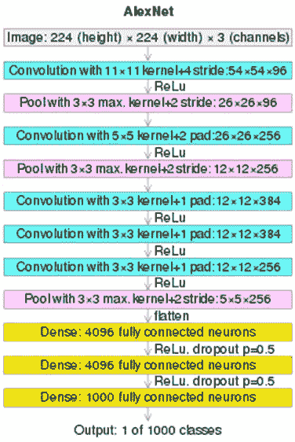
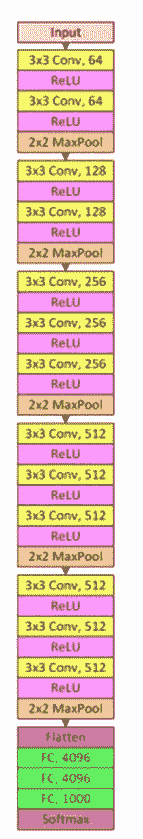
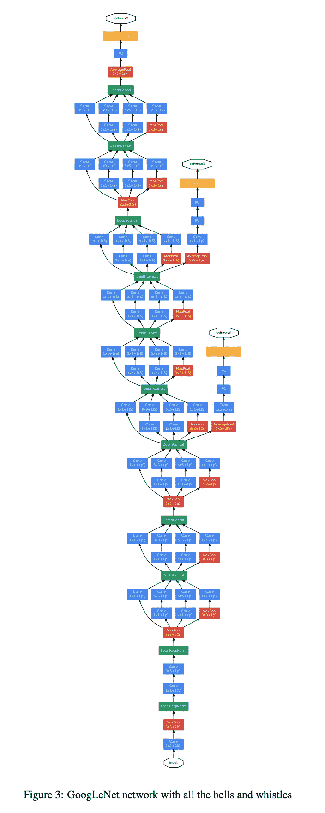
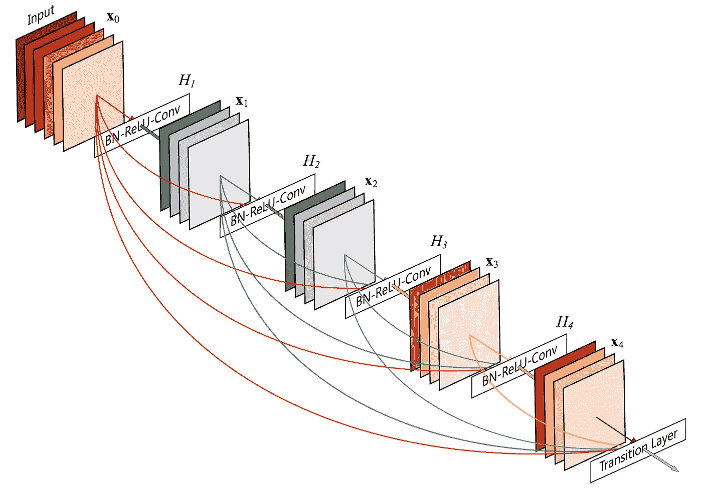
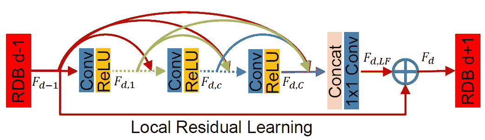
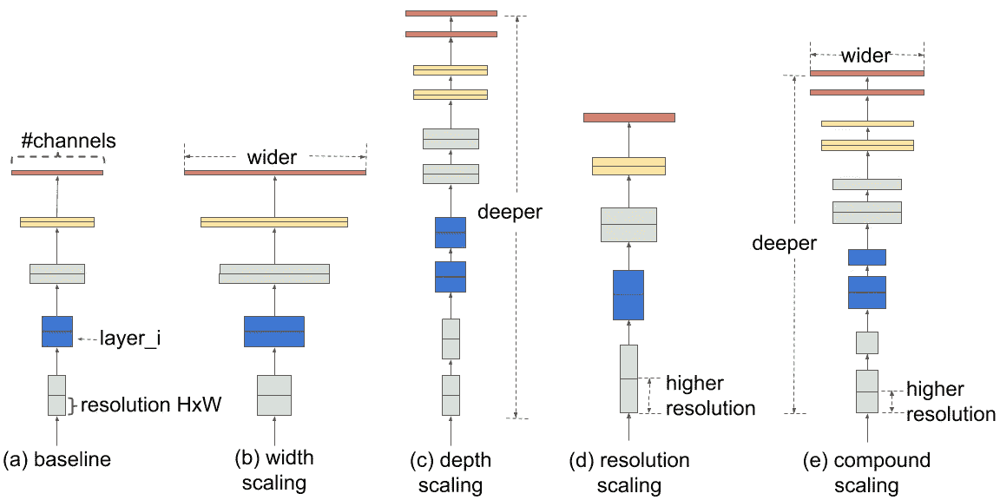

# 各种计算机视觉架构——有何不同

> 原文：<https://medium.com/mlearning-ai/various-computer-vision-architectures-whats-the-difference-db123df23865?source=collection_archive---------0----------------------->

计算机视觉作为一个话题开始于 20 世纪 60 年代末。计算机视觉的目标是模仿人类的视觉和理解。计算机视觉的基础是图像处理。在现代，图像处理与人工智能算法相结合，以模仿人脑对图像的功能。与数字数据不同，图像需要以不同的方式进行处理和解释，以便计算机做出任何有意义的输出。很长一段时间以来，CNN 一直是机器学习领域的趋势。但是传统的 CNN 在大规模思考时有很多缺点。为了克服这一点，已经设计了许多架构。在这篇文章中，我们将看看各种流行的计算机视觉体系结构，它们的设计和特点。

AlexNet

AlexNet 是在 2012 年为大规模图像分类设计的，准确地说是 1000 个类别。设计从 11x11 卷积层开始，移动到 5x5，并缩小到 3x3。AlexNet 总共包含 8 层——5 层 CNN 和 3 层 Pooling。

[https://en.wikipedia.org/wiki/AlexNet](https://en.wikipedia.org/wiki/AlexNet)

由于在 GPU 上训练大数据集(ImageNet ), Alex net 获得了良好的准确性。

**ResNet**

非常深的网络可能会提供良好的结果，但在某些时候，可能会导致梯度消失的问题。这是因为要更新大量的权重，随着算法到达网络的早期层，梯度不断变小(反向传播从后面开始)。ResNet 是一个大规模深度神经网络，它使用跳过连接来防止消失梯度，并增加网络的整体性能。ResNet 跳过几层，一般是 2、3 层。这确保了在训练网络时，在较早的层上梯度不会下降到 0。为了更好地理解，请看一下设计:

**VGG**

类似于 AlexNet，VGG 是基于传统 CNN 架构的大规模图像分类。VGG 也有其他变体——VGG-16 和 VGG-19 是普遍使用的变体，分别有 16 层和 19 层。VGG 和 AlexNet 的区别在于，与 AlexNet 相比，VGG 专注于更小的内核和更大的跨度，并且拥有更深层次的架构。此外，与 AlexNet 相比，VGG 拥有更多的 ReLU 单元，因为其架构更深，因此映射功能更具识别性，性能也更好。

谷歌网

GoogeNet 是由 Google 研究人员使用 Inception 模块的修改版本开发的 CNN 架构。inception 模块并排使用多个过滤器，并将它们的输出合并到一个层中。

Inception 的优点是图像内信息的位置不会影响网络，因为多个过滤器被组合，并且信息被全部组合成一个。这避免了对任何深度网络和消失梯度下降的需要，同时保持了任何网络的准确性。此外，与深度网络相比，更宽的网络更容易训练。

[https://production-media.paperswithcode.com/methods/Screen_Shot_2020-06-22_at_3.28.59_PM.png](https://production-media.paperswithcode.com/methods/Screen_Shot_2020-06-22_at_3.28.59_PM.png)

仔细观察该架构，您可以看到网络中间有两个 softmax 层。在训练阶段考虑来自这两者的损失，以防止任何消失梯度。这被建议在训练结束时发挥作用，此时损失和准确性达到饱和。

**DenseNet**

到目前为止，我们看到的网络是以连续的方式将一层的输出传送到另一层。DenseNet 的工作与此完全相反。DenseNet 是一个紧密连接的神经网络，其中每一层的输出都被发送到其他每一层，以实现特征重用。这样，网络可以是浅层的，但同时由于其密集的性质，可以有效地学习特征。

[https://cloud.githubusercontent.com/assets/8370623/17981494/f838717a-6ad1-11e6-9391-f0906c80bc1d.jpg](https://cloud.githubusercontent.com/assets/8370623/17981494/f838717a-6ad1-11e6-9391-f0906c80bc1d.jpg)

DenseNet 主要由两部分组成——dense block 和过渡层。DenseBlock 具有卷积、批量标准化和具有密集连接的 ReLU，而过渡层使用 1x1 卷积降低了模型的复杂性，并使用 2 步最大池降低了输出的高度和宽度。

[https://miro.medium.com/max/1400/1*qg5cCnke3684W1w5z32ddg.png](https://miro.medium.com/max/1400/1*qg5cCnke3684W1w5z32ddg.png)

**高效网**

高效网络考虑了 CNN 的缩放。根据实验研究，已经证明随着图像分辨率的增加，增加深度和高度对于带来良好的精度是必要的。但是扩展任何一个都只有有限的好处，因此有了复合扩展的概念。复合缩放设计了一个原则，即*深度*、*宽度*和*分辨率*必须以平衡的方式进行缩放。在对定义深度、宽度和分辨率应该发生多少缩放的参数α、β和γ执行网格搜索时，得出结论:为了缩放 CNN，深度应该增加 20%，宽度应该增加 10%，分辨率应该增加 15%。这些值在缩放比例之间保持平衡，并提供有效的结果。

[https://1.bp.blogspot.com/-Cdtb97FtgdA/XO3BHsB7oEI/AAAAAAAAEKE/bmtkonwgs8cmWyI5esVo8wJPnhPLQ5bGQCLcBGAs/s1600/image4.png](https://1.bp.blogspot.com/-Cdtb97FtgdA/XO3BHsB7oEI/AAAAAAAAEKE/bmtkonwgs8cmWyI5esVo8wJPnhPLQ5bGQCLcBGAs/s1600/image4.png)

感谢您的阅读！

## 有用的链接:

在 LinkedIn 上找到我:[https://linkedin.com/in/vishnuu0399](https://linkedin.com/in/vishnuu0399)

更了解我:[https://bit.ly/vishnu-u](https://bit.ly/vishnu-u)

 [## Mlearning.ai 提交建议

### 如何成为 Mlearning.ai 上的作家

medium.com](/mlearning-ai/mlearning-ai-submission-suggestions-b51e2b130bfb)