# 向量自回归(VAR)—Eviews 简化版中股票市场的创建和解释

> 原文：<https://medium.com/mlearning-ai/vector-auto-regression-var-creation-and-interpretation-of-stock-market-in-eviews-simplified-a313c5932611?source=collection_archive---------2----------------------->

## 标准普尔 500 和恒生指数的评价。(美国和香港)

## 本文将涵盖的内容:

*   如何使用 python 获取股票数据
*   确定是否应该使用 VAR 或 VEC 模型
    -识别平稳变量与非平稳变量(单位根检验)
    -协整检验 Engle Granger 方法
    -滞后长度标准
    -脉冲响应
*   进一步分析的后续步骤

## 获取数据

第一步是使用 Yahoo Finance API 获取适当的数据。请注意，标准普尔 500 指数的股票代码是^GSPC，恒生指数的股票代码是^HSI.这段代码将为您提供每日数据，我们将在 Eviews 中将这些数据转换为 ***月度数据*** 。
要获得这两个索引，请使用以下代码:

```
##Libraries
import yfinance as yf
from datetime import datetime
import pandas as pdstart_date = datetime(1997,7, 2) ## year, month, date; put this to                      your needs
end_date = datetime(2022, 4, 1) ## put this to your needsSP_500 = yf.download('^GSPC', start=start_date, end=end_date)
HSI = yf.download('^HSI', start=start_date, end=end_date)SP_500 = SP_500['Adj Close'] #we are only targeting one column
HSI = HSI['Adj Close']SP_500.to_csv('SP_500.csv') #download into a CSV file
HSI.to_csv('HSI.csv')
```

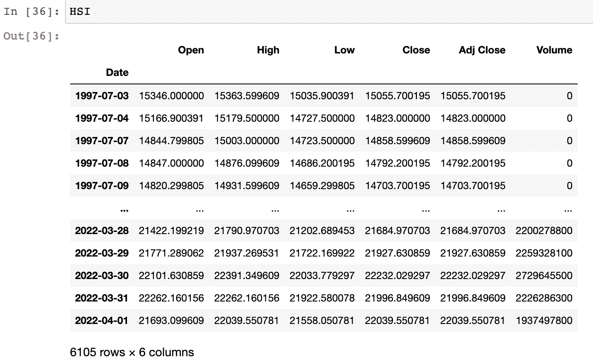

数据框中有 6 列，您只需保留一列。您可以选择“关闭”或“调整关闭”。在本例中，我们将使用调整后的收盘价。获取 csv 文件并上传到您的 Eviews。要将每日数据转换为每月数据，请单击工作文件上的“新建页面”。然后单击“按频率/范围指定”，并将“频率”更改为“每月”。将数据集从第一个选项卡复制到新选项卡。它会自动将每日数据集转换为每月数据集。

你也可以在 python 中这样做，然后每月上传到 Eviews。

## VAR 还是 VEC？

VAR:

*   VAR 使用稳定变量
*   如果它们不是协整的，你可以取差(对数)使它们成为平稳变量

VEC:

*   当非平稳变量被协整时，VEC 使用非平稳变量

我的两个变量(恒指指数和标准普尔 500)都是非平稳的，也不是协整的。因此，我们必须建立一个 VAR 模型。

**通过图表确定平稳变量:**

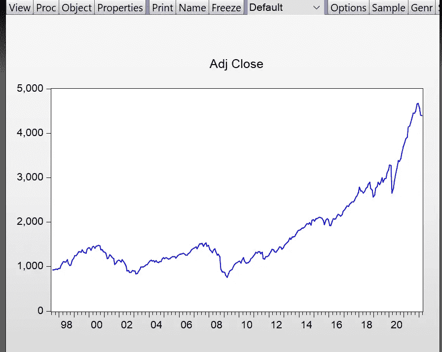

Graph of S&P 500 — Monthly

在这里，我们看到标准普尔 500 指数是不稳定的，图表趋势向上，没有回到均值。虽然我没有在恒指指数上发布同样不稳定的图片。

**方法— 2(也是我推荐的)** 可以进行增广的 Dickey-Fuller 单位根检验。这在 Eviews 中很容易做到。打开你的变量，点击右上角的视图，悬停在“单位根测试”上，点击“标准单位根测试”。对于这个例子，保持默认设置，并点击“确定”。下图是你将会看到的。

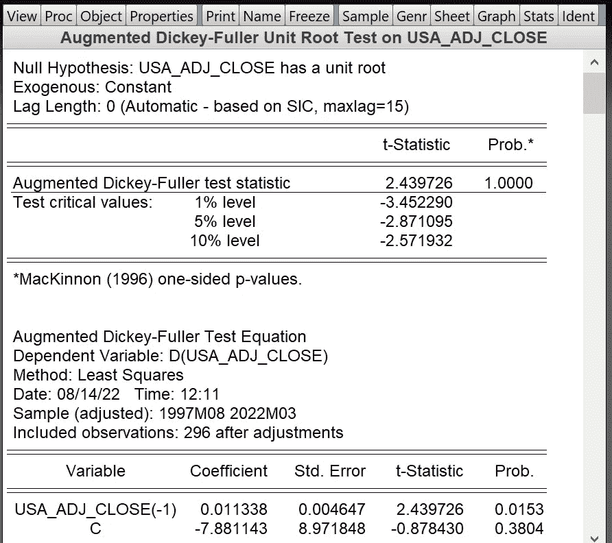

S&P adjusted close

您可以看到 t 统计量并不显著，因为 P 值高于 0.05。
2.439 >，2.871 &，1.9261 >，2.8711；意味着两者都是不稳定的

由于两者都是非平稳变量，我们必须检查它们是否协整！

## 协整检验

我将向你们展示两种检查变量是否协整的方法。

**方法一(长方式):** 在 Eviews 中点击“快速”然后“估算方程”。第一个变量将是你的因变量，随后是常数“c”和你的其他变量。

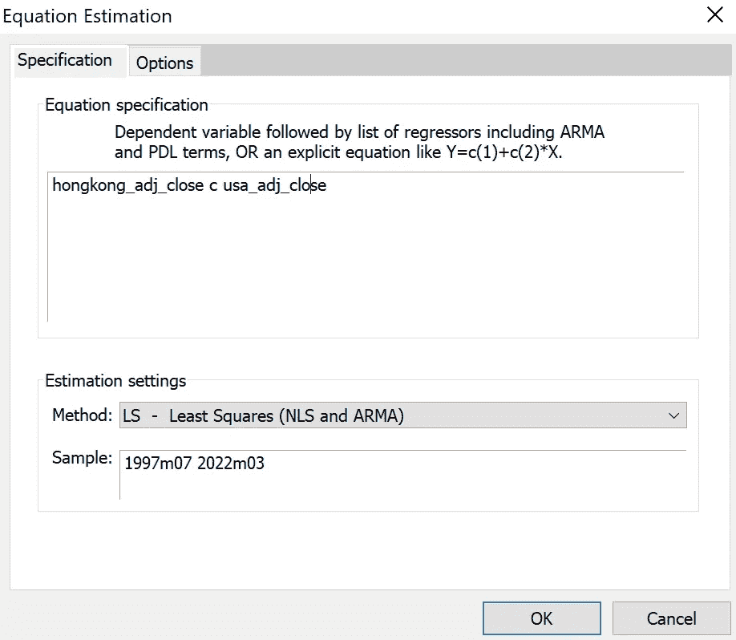

HSI is dependent variable and S&P 500 is independent variable

点击“确定”后，您将看到下图:

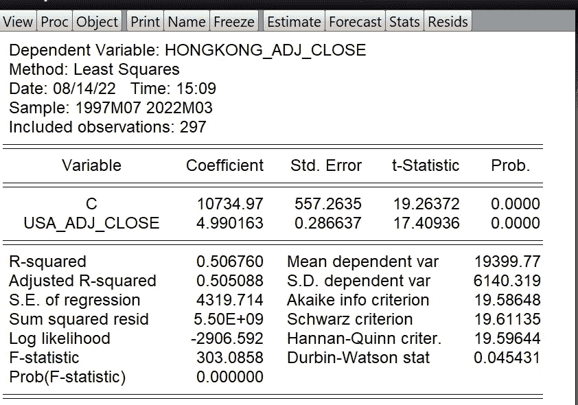

现在我们需要得到残差，看看它们是否协整。每次在 Eviews 中运行一个模型时," resid "会自动填充到工作文件中。在命令提示符下键入“series resid1 = resid”。这将创建一个名为 resid1 的新变量。双击 resid1，点击“查看”，将鼠标悬停在“单元根测试”上，点击“标准单元根测试”。结果如下图所示。

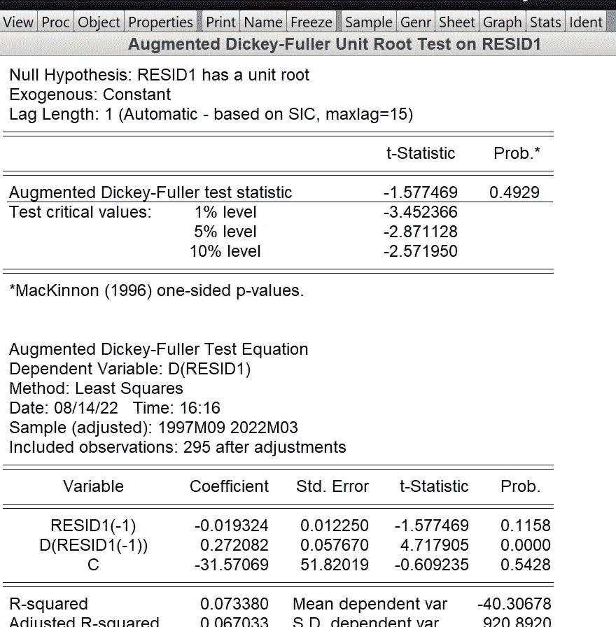

Augmented Dickey-Fuller Unit Root Test on Residuals

从该图中我们可以看到，t 统计量为-1.5875，在 5%的水平上大于 t 统计量-1.9419。*但是我们不能使用临界值来进行残差，我们必须使用* [*临界值*](https://www.econstor.eu/bitstream/10419/67744/1/616664753.pdf) *进行协整检验！*

用β∞+β1/T+β2/T2:
T = 295
-3.3377+(-5.967/295)+(-8.98/295)=-3.3883
-1.587589>-3.3883

我们接受零假设(不能拒绝零假设)，即残差有一个单位根，意味着非平稳。我们有 0.5 的高 R 平方值和 0.045 的极低杜宾沃森统计值。这仅仅意味着这是一个伪回归。

**方法二(恩格尔格兰杰法):** 点击“快速”和“估计方程”。输入因变量，接着是“c ”,然后是你的自变量。将方法更改为“COINTREG-协整回归”。点击“确定”，见下图:

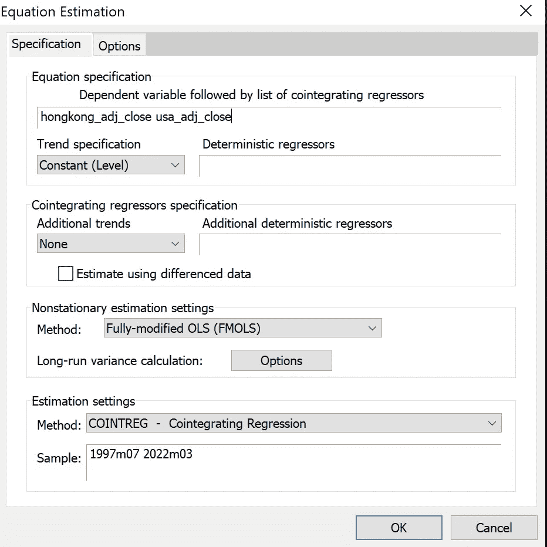

现在按“查看”，然后按“协整检验……”，并将检验方法更改为“Engle-Granger”。

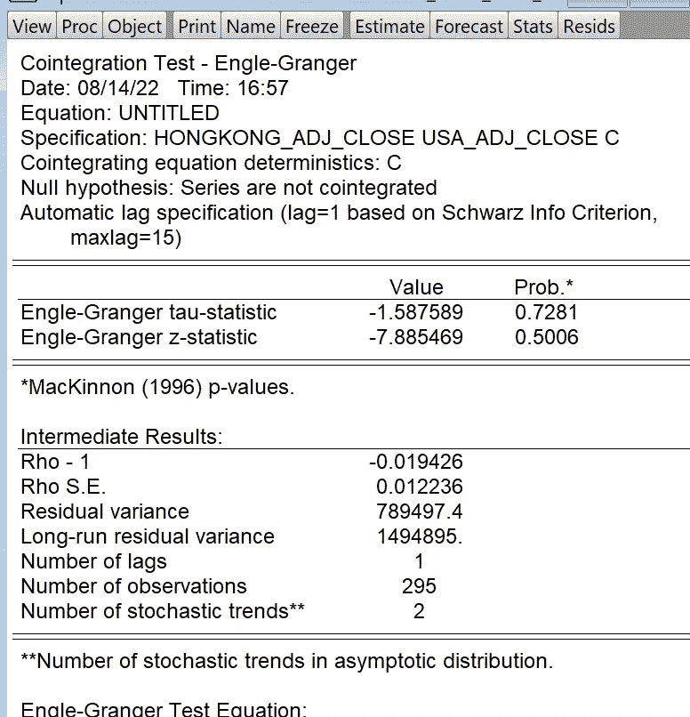

格兰杰方法我们看到 tau 统计量的值为-1.5875，与上图中问题 1 步骤 2 和 3 的值相同。我们接受我们的零假设(未能拒绝零假设)，即两个变量(恒生指数和标准普尔 500)不是协整的。

**好消息这意味着我们可以使用 VAR 模型了！**

# VAR 模型

VAR 使用平稳变量，因此我们必须将 HSI 和 S&P 转换成平稳变量。要做到这一点，你可以通过取对数来得到差值。单击“过程”，然后单击“通过等式生成”并键入' new_variable' = @dlog("您的变量的名称")。见下图。

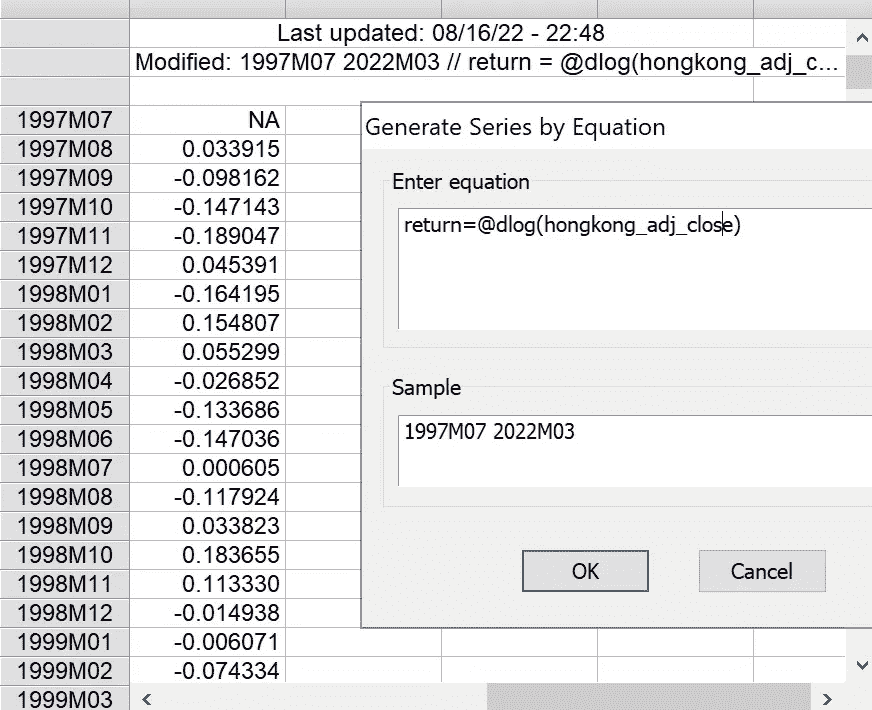

The spreadsheet is generated from taking the log of HSI

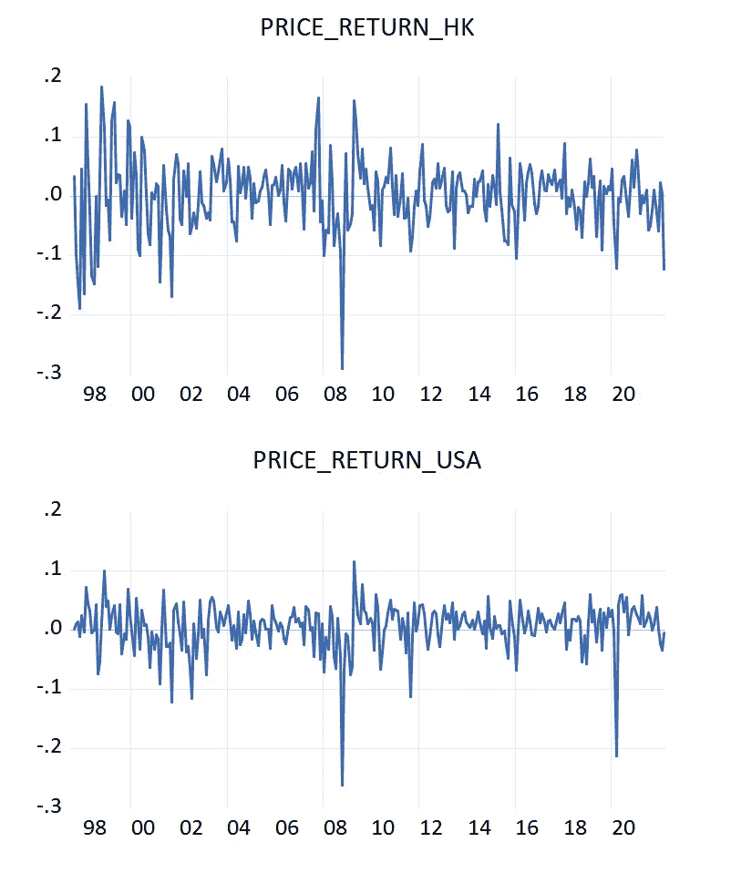

Stationary Data for S&P 500 and HSI

点击“快速”,然后点击“评估风险…”。在内生变量中，第一个变量是因变量，接下来是最有影响力的变量。在这种情况下，我只用了两个变量，但是你可以加上 GDP，失业率，油价……*确定变量顺序的一种常用方法是使用格兰杰因果检验*。

在提到内生变量的地方，你可以创建一个虚拟变量，放在那里。你可以把金融危机，如衰退和 covid 也包括在内。

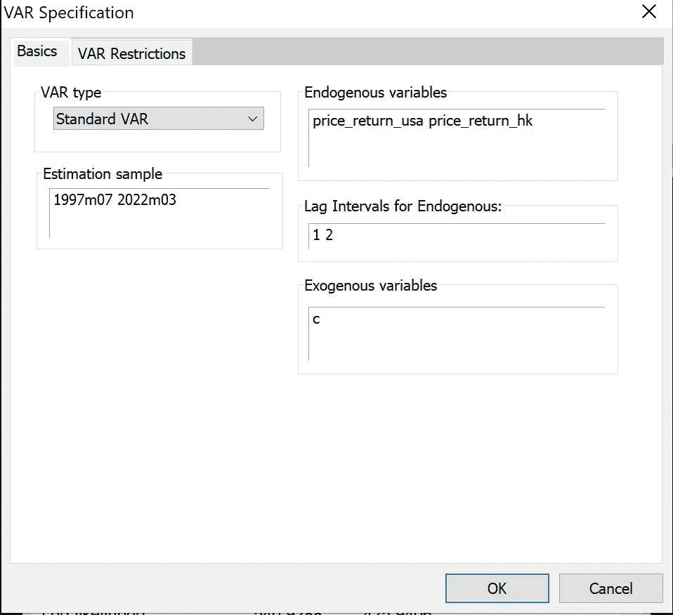

VAR model for return prices

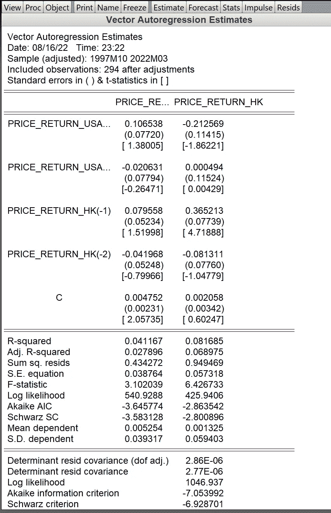

VAR model

上图向我们展示了我们的 VAR 模型。我们需要进行滞后长度测试。单击“查看”、“滞后结构”，然后单击“滞后长度标准”，并输入“12”作为滞后数。

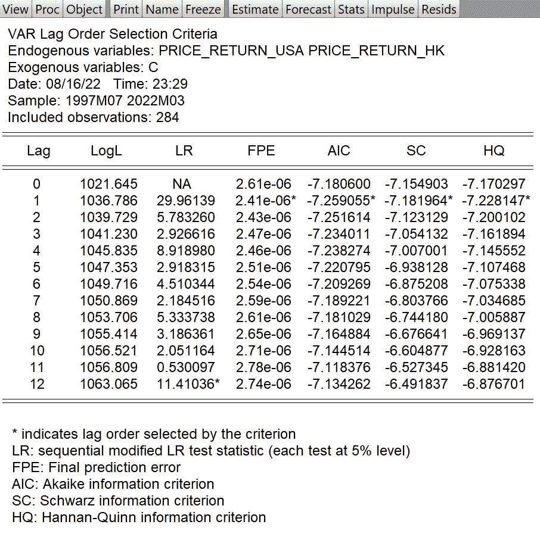

Lag Length Criteria

你需要看看最后三栏。在这种情况下，它是直截了当的，我们看到“AIC”、“SC”和“HQ”在滞后 1 上有一个星号。这意味着你的风险值模型应该有 1 个滞后。见下图，最终风险值模型。

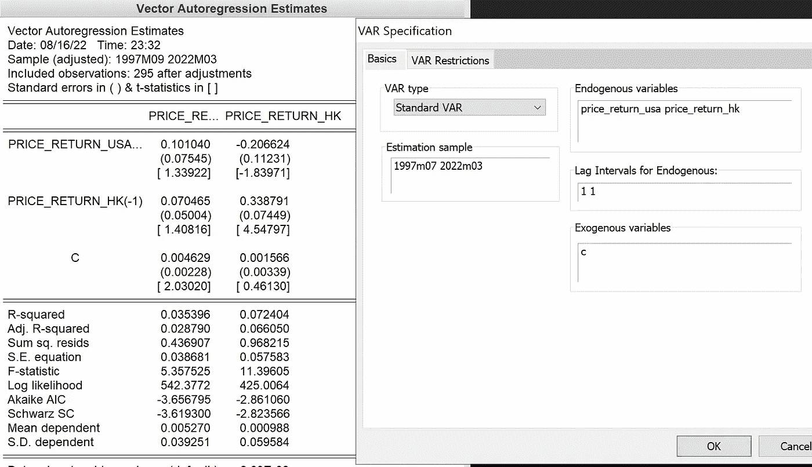

VAR model with 1 lag, image on left is VAR model and image on right is how to create it

现在我们可以看看方差分解。点击“查看”、“差异分解”，将显示格式改为“表格”，将“期间”改为 12。你会看到下图。

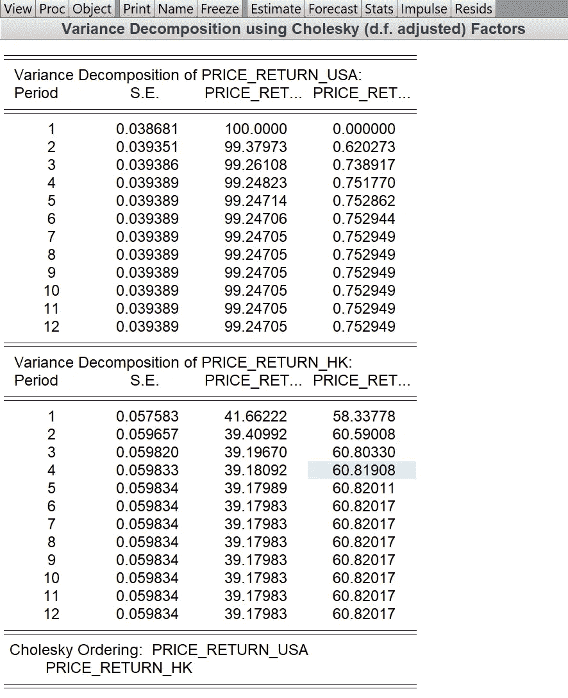

Variance Decomposition (12 months)

请注意，第二列是第一个表的 HSI 指数回报率。对于第二个差异期，恒生指数对标准普尔 500 指数的解释力为 0.62%。这些变化只发生在第 7 个差异期，与第 3-6 个差异期相比有微小的变化。恒生指数收益率对 S&P500 指数收益率没有显著的解释力。

第二个表格显示标准普尔 500 指数的回报解释了差异期 1 的恒指指数的 41.6%。在其余的时间里，大约有 39%的解释力。

***那么这就告诉我们，标普 500 指数的收益对他的指数收益*** 更有影响。在这种情况下，差异期只是指月份，如果我们使用季度数据，差异期为 1 意味着第一季度。

*这类似于主成分分析(PCA)，我们看到哪些变量具有最大的方差来解释因变量。*

**脉冲响应** 要创建脉冲响应图，点击“查看”，然后点击“脉冲响应”。

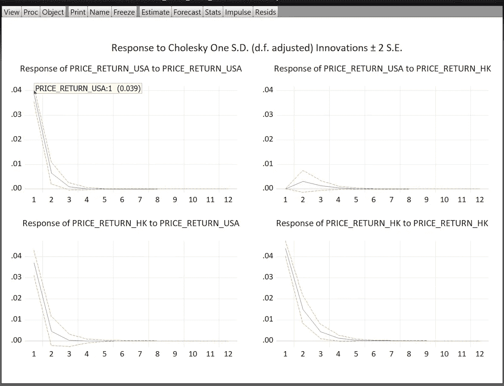

“价格 _ 回报 _ 香港对价格 _ 回报 _ 美国的反应”图表告诉我们，标准普尔 500 的一次标准差冲击(3.9%)将在第一年产生大约 3.7%的积极影响，第二年产生大约 0.5%的积极影响，第三年稳定下来。

# **接下来的步骤**

*   创造你自己的故事！
    -如果美国正在经历衰退，哪个市场受影响最小？HSI？你能在其他地方投资短期资金吗？
*   添加 GDP、失业率和其他特征
*   加上金融危机变量！(Recession/covid)-虚拟变量
    -@expand(@quarter，@ drop last)-把这个作为外生变量
    -快速添加衰退的方法是用 0 和 1 创建一个 excel 文件，其中 1 代表衰退的月份。
*   您可以创建一个包含多个变量的 VAR 模型，并使用 python 实现自动化！！

## 如有任何疑问，请随时联系我！

[](/mlearning-ai/mlearning-ai-submission-suggestions-b51e2b130bfb) [## Mlearning.ai 提交建议

### 如何成为 Mlearning.ai 上的作家

medium.com](/mlearning-ai/mlearning-ai-submission-suggestions-b51e2b130bfb)