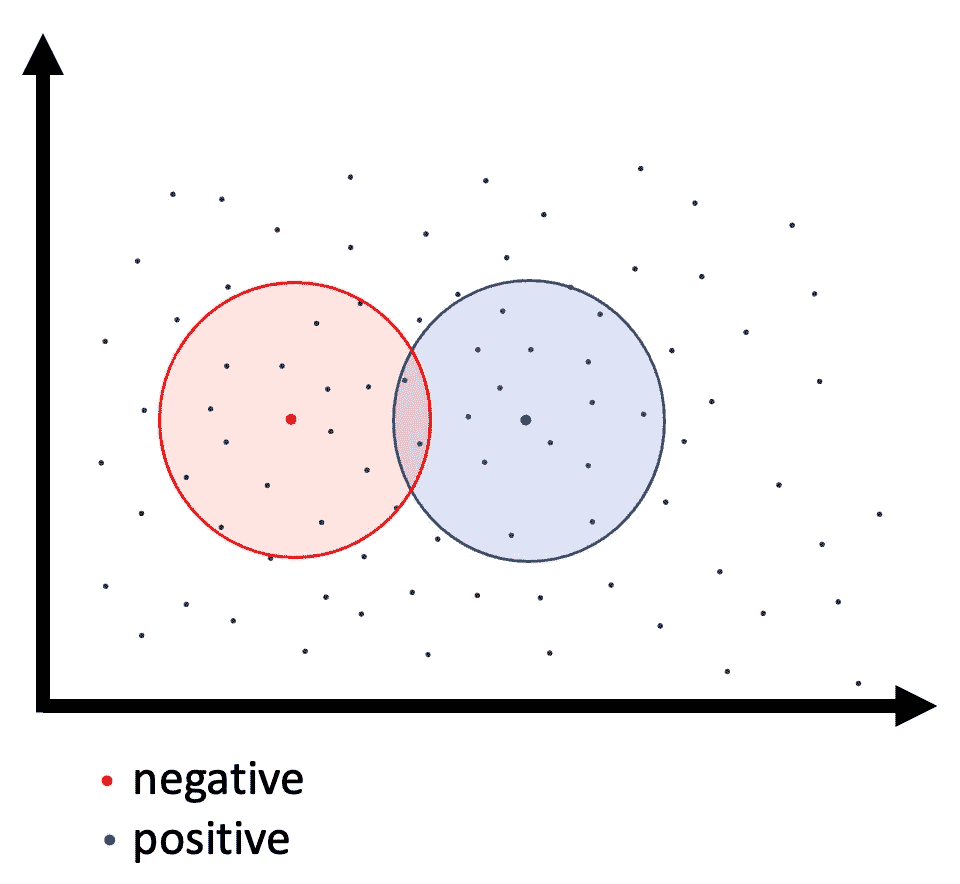
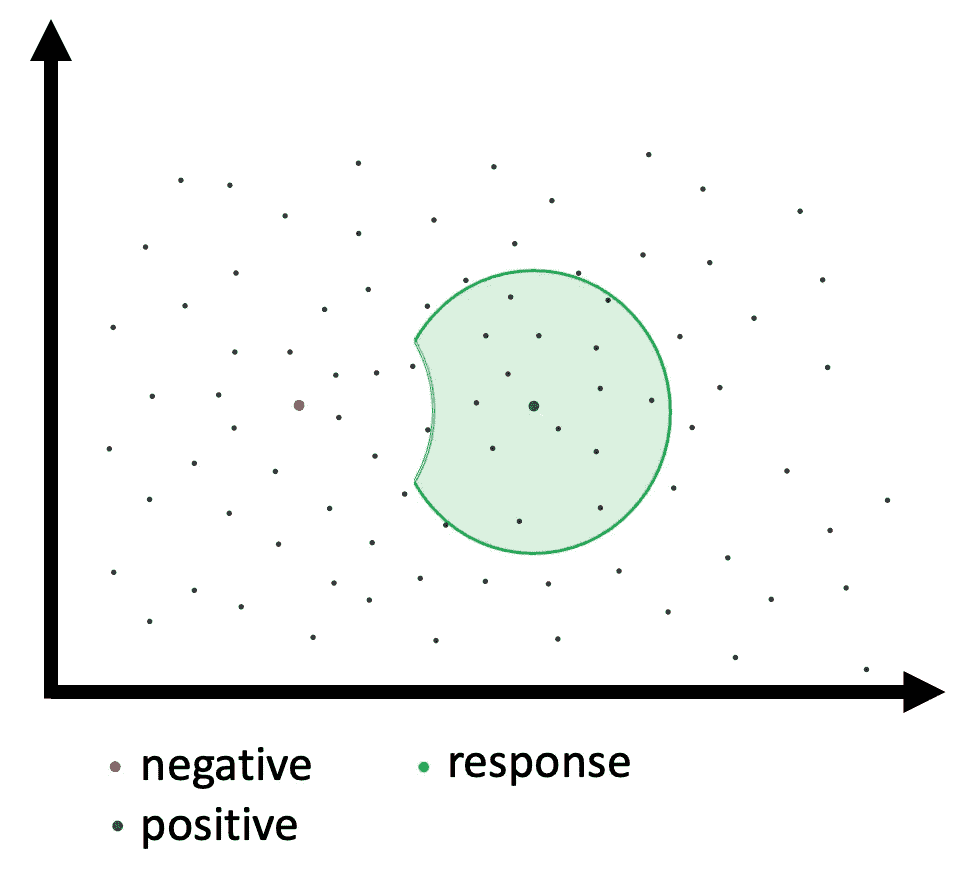

# 面向以数据为中心的人工智能的矢量数据库(第二部分)

> 原文：<https://medium.com/mlearning-ai/vector-databases-for-data-centric-ai-part-2-ba995053ce05?source=collection_archive---------3----------------------->

用 QDrant，拥抱脸和 Streamlit 构建应用程序。

QDrant 已经创建了一个优秀的向量数据库，我怀疑 ML 的工程师才刚刚开始发掘它的潜在应用。

矢量数据库支持混合相似性搜索，并提供 CRUD API 来更新数据集。它们是对第一波近似最近邻工具(如 Faiss 和 airy)的重大改进，这些工具支持非常高性能的内存向量搜索，但对更新流和元数据过滤器的支持很少。

我已经在这里写了这些工具的一些应用。

[](/mlearning-ai/the-many-uses-of-a-vector-database-65cb6cc70b3f) [## 以数据为中心的人工智能矢量数据库

### 为什么您应该将矢量数据库作为 MLOps 平台的一部分。

medium.com](/mlearning-ai/the-many-uses-of-a-vector-database-65cb6cc70b3f) 

> **混合搜索**是结合属性过滤的**向量或【语义】搜索。**

QDrant 实现的语义搜索需要一个正反例列表。每个正数据点都是一个例子，说明您希望响应与之相似，每个负数据点都是一个例子，说明您希望响应与之不同。



这允许您在您的特征空间内建立任意复杂的决策边界。



QDrant 查询示例:

```
{"positive": [0],    
"negative": [1],    
"top": 10,   
"with_payload": true}
```

**这将启用类别的交互式定义:**

*   从一个正数据点开始。
*   浏览回答。
*   添加您认为与肯定列表相似的内容
*   把那些你认为不同的加入到否定列表中
*   运行新查询，然后重复。

在一批标记之后，你也可以改进你的嵌入，并继续使用一个*‘更好’*分离的数据集(我将在接下来做更多的实验)。

我构建了一个 mini Streamlit 应用程序来支持这个流程，使您能够在完成每个查询后保存它，并保存一个包含结果的 CSV 文件。

# QDrant-NLP 演示

QDrant-NLP. A short demo.

# 怎么跑

[](https://github.com/GeorgePearse/QDrant-NLP) [## GitHub-George pearse/qdr ant-NLP:qdr ant-NLP

### 让人类参与进来。我不是 QDrant 的开发人员，也与他们没有直接联系，但我认为他们已经…

github.com](https://github.com/GeorgePearse/QDrant-NLP) 

只需克隆回购并运行:

```
docker-compose up
```

我想增加数据集的数量，这可以尝试，要么与 GPU 支持的 lambda 函数，或通过保存许多示例数据集到 S3。到目前为止，我只制作了 ag_news 的 6K 子集。[ag _ 拥抱脸的新闻数据集](https://huggingface.co/datasets/ag_news)

这是用于通过拥抱脸生成嵌入的代码片段:

# 在哪里使用

对着两个克恩大喊。AI(一个优秀的开源 NLP 标签工具)

[https://github.com/code-kern-ai/refinery](https://github.com/code-kern-ai/refinery)

以及 Voxel51(一款优秀的开源计算机视觉分析工具)

[https://github.com/voxel51/fiftyone](https://github.com/voxel51/fiftyone)

作为其平台中该技术的早期采用者，但我不认为他们已经利用了它所能提供的所有价值。

# 以数据为中心的人工智能中的其他读取

[微模型介绍或:我如何学会停止担忧和热爱过度拟合|作者 Eric Landau | Medium](https://eric-landau.medium.com/introduction-to-micro-models-or-how-i-learned-to-stop-worrying-and-love-overfitting-fd8fbe98e99b)

[](/mlearning-ai/mlearning-ai-submission-suggestions-b51e2b130bfb) [## Mlearning.ai 提交建议

### 如何成为 Mlearning.ai 上的作家

medium.com](/mlearning-ai/mlearning-ai-submission-suggestions-b51e2b130bfb)