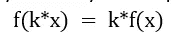
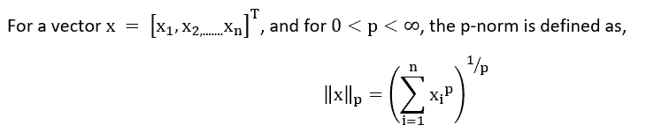
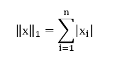
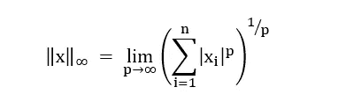
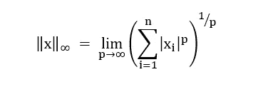

# 向量规范:简介

> 原文：<https://medium.com/mlearning-ai/vector-norms-introduction-a999c341d5ce?source=collection_archive---------4----------------------->

Representational image (Source: Getty)

什么是向量的范数？为什么用在机器学习中？让我们看看这个帖子。

向量范数是返回向量的长度或大小的函数。它在机器学习中有很多应用，其中一些是，

评估模型的误差(预测值和实际值之间的差异)。

用于定义正则项(以避免过度拟合的风险)。

向量范数具有以下性质:

正性——向量范数是非负值(把它想象成距离的度量！)，只有当向量本身为零时，向量范数才为零。

三角形不等式-两个或多个向量之和的范数小于或等于这些向量的范数之和

线性——对于任何标量 k，

机器学习中使用的向量范数计算很少是 L1 范数、L2 范数等。

# **向量的 Lp 范数:**

范数是数学对象大小的一种度量。

一个有趣的事实是，有理数(实数)是有序的，也就是说，我们可以很容易地比较有理数，

例如，“7”大于“4”，“0”大于“-2”。

但是复数呢？

我们能说“3i”大于“-2i”吗？

这是不正确的，所以从复数的知识来说，模数是用来比较复数的。

如果我们有 2 个复数，x+iy 和 a+ib，大多数时候我们比较 sqrt(x +y)和 sqrt(a +b)。

对于三维向量，|v| = sqrt(Vx +Vy +Vz)。

这引出了一个想法，为了理解向量的大小，我们有向量的 Lp 范数。

不同的向量范数计算可以通过改变 p 值(1，2…).

**矢 L1 范数:**

它被称为曼哈顿规范或出租车规范；范数是从向量空间的原点到曼哈顿距离的计算。

曼哈顿距离对于在统一网格上描述对象的向量可能更有用，比如棋盘或城市街区。测量值的出租车名称指的是测量值计算结果的直觉:出租车在城市街区之间行驶的最短路径(网格上的坐标)。数学上定义如下。

**矢 L2 范数:**

它以著名的希腊数学家欧几里得的名字命名为欧几里德范数，是最常用的范数。定义为矢量分量的平方和的平方根。

**L-无穷范数**

它给出了向量最大元素的绝对值(有兴趣证明？[点击此处](https://rorasa.wordpress.com/2012/05/13/l0-norm-l1-norm-l2-norm-l-infinity-norm/))，所以也叫 Max norm。

***注:***

当 p=0 时会发生什么？

我们可以称之为 L0 范数，但严格来说，它实际上不是一个范数，因为它违反了范数的齐次(线性)性质。

这是一个基数函数，它的定义是 Lp-范数形式的，尽管许多人称它为范数。

它用于计算向量中非零元素的数量，即稀疏性可以使用 L0 范数建模。

***对计算向量范数感兴趣？***

可以使用 norm()函数在 Numpy 中计算，更多详情[点击此处](https://machinelearningmastery.com/vector-norms-machine-learning/)。

快乐学习！！！

参考资料:

[向量的 L p 范数](https://angms.science/doc/Math/LA/LA_4_VectorLpNorm.pdf)

[向量范数的温和介绍](https://machinelearningmastery.com/vector-norms-machine-learning/)

 [## Mlearning.ai 提交建议

### 如何成为 Mlearning.ai 上的作家

medium.com](/mlearning-ai/mlearning-ai-submission-suggestions-b51e2b130bfb)