# 基于 CNN 的蔬菜图像分类

> 原文：<https://medium.com/mlearning-ai/vegetable-image-classification-using-cnn-6f1d1be75cfb?source=collection_archive---------1----------------------->

1.  **简介**

人脑有专门的视觉、听觉和其他感觉模块。我们想用**人工神经元**来模仿这些专门的模块，并想创造所谓的人工智能。**卷积神经网络**或 **CNN** 帮助机器识别**视觉模式、物体、图像等**。

CNN 源于对大脑视觉皮层的研究，并已被用于各种图像识别任务。在这篇博客中，我们将讨论卷积神经网络，并尝试使用这些 CNN 解决一个**图像分类任务**。

2.**对 CNN 的需求**

在讨论卷积层的概念之前，我想先谈谈为什么我们需要 CNN，为什么我们不能使用好的人工神经网络来解决这些图像识别任务。这有 **2 个主要原因**，

a.一个原因是，在人工神经网络中，一层中的每个神经元都与下一层中的每个其他神经元相连。这导致**大量的**模型参数。如果我们的计算能力有限，这可能**很难训练**，而且大参数也可能导致**过拟合**。

b.第二个原因是人工神经网络不是不变的。我这么说是什么意思？例如，我的训练集中有一个图像，我在这个训练集中训练 ANN 模型。现在，在我的验证集中，如果我遇到同一张图像的**旋转/平移/缩放/缩小**版本，我的人工神经网络模型将无法识别它。

卷积神经网络能够处理人工神经网络或密集神经网络的这两个缺点。让我们在下一节了解 CNN。

3.**卷积层**

卷积层是 CNN 最重要的组成部分。卷积层中的神经元**不与下一个卷积层中的所有其他神经元**连接，而是仅与它们**感受域**内的像素连接。

> **局部感受野是一个定义好的分割区域，它被卷积层内的神经元在卷积过程中暴露的输入数据内容所占据。**

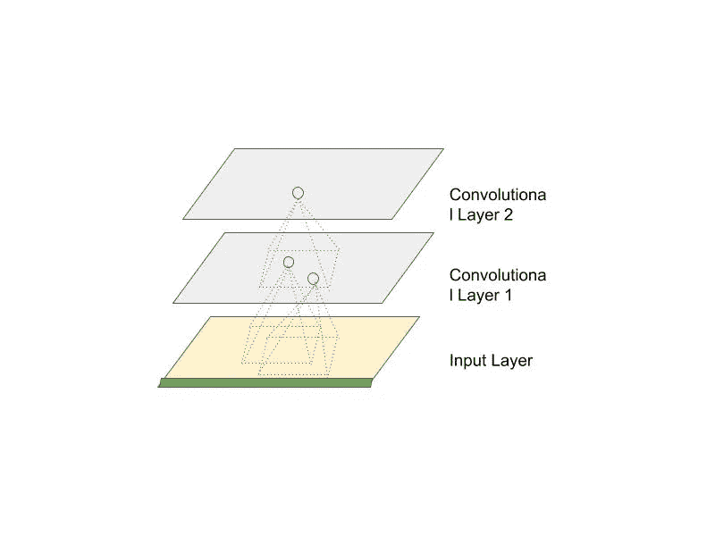

Convolutional Layers with Receptive Fields

上图中的小矩形显示了神经元的**局部感受野**。这种架构的另一个优点是，它允许网络关注初始隐藏层中的**小的低级特征**，然后连接到**较大的** **高级特征**。例如，让我们假设我们有一个人体的图像，然后，初始隐藏层将集中在低层次的特征，如线，圆，曲线等。中间的隐藏层将试图识别由低级特征组成的形状。最后，高级特征将识别整个对象，如面部、手臂、腿等。在人体内。这种层次结构可以在真实世界的图像中观察到，如上面的例子所示。因此，细胞神经网络在图像识别任务中表现很好。

两个矩阵之间的卷积运算可以通过将相应的元素相乘然后将它们相加来计算。在 CNN 的情况下，在图像和滤波器之间执行卷积操作。过滤器被定义为神经元，表示为感受野大小的小图像。

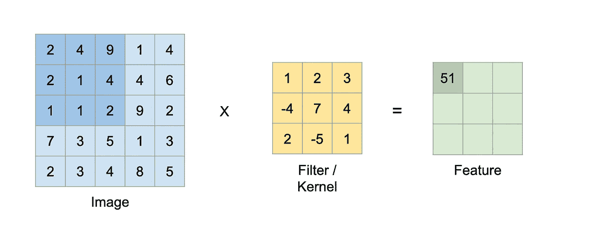

The convolution operation between Image and Filter, **Source**: [https://bit.ly/3JSnFNT](https://bit.ly/3JSnFNT)

上图解释了卷积运算。通过隔开滤光器/感受野，可以将较大的输入层与较小的层连接起来。这种间隔可以通过采取更长的**步幅**来实现。

理论部分讲得够多了，现在让我们继续讨论卷积神经网络的应用。

4.**利用 CNN 进行蔬菜图像分类**

这里的问题陈述是，

> **给出 15 种不同蔬菜的图片。开发一个图像分类模型，正确地检测蔬菜图像并将其分类到相应的标签。**

你可以在这里找到数据集。

让我们看看我们的图片和它们的标签。

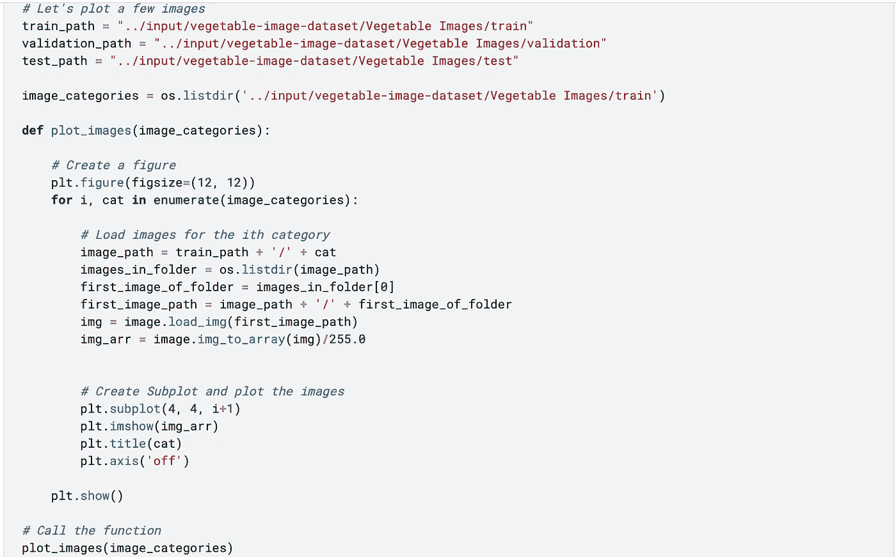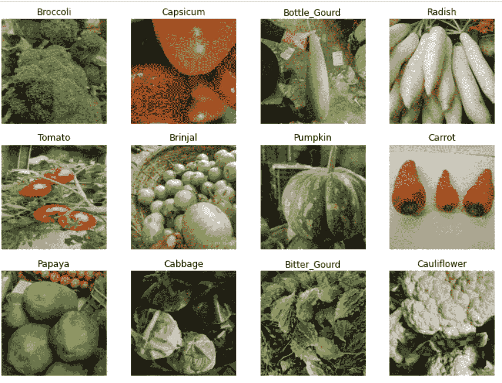

图像和标签看起来都很清晰。建模前的下一步是预处理图像，我已经使用了[**keras****imagedata generator**](https://keras.io/api/preprocessing/image/)。以下代码片段演示了**图像数据生成器**的使用，

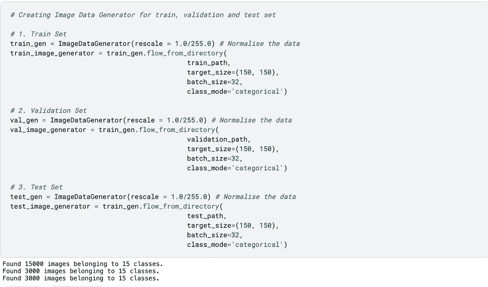

Keras ImageDataGenerator

在验证和测试集中，我们在属于 **15 个不同类别**(每个类别 **1000 个**图像)的列车组中有 **15000 个图像**和 15 个类别 **3000 个图像**(每个类别 **200 个**图像)。接下来，我使用 **Keras API 构建了一个定制的 CNN 模型。**

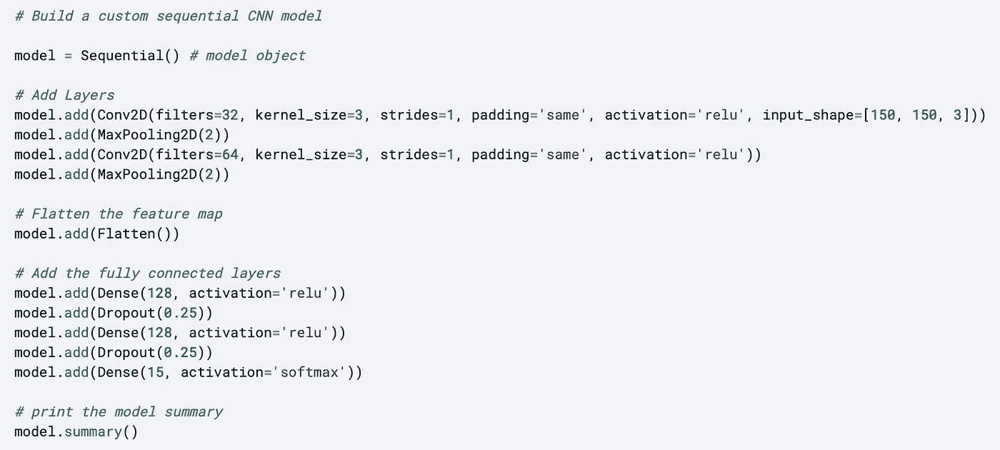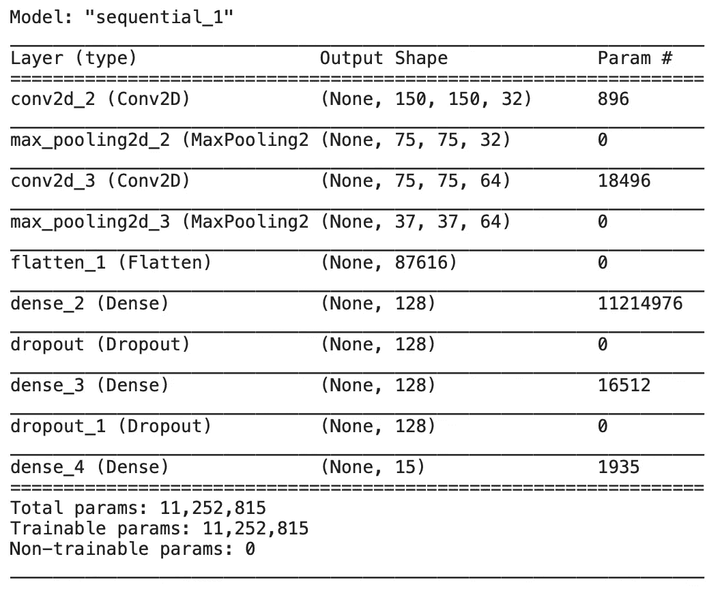

上述模型包括以下内容:

1.  2 **卷积层**分别具有 **32 个大小为 **3X3** 和 **relu** 的滤波器**激活功能和 **64 个大小为 **3X3** 和 **relu** 的滤波器**激活功能。
2.  2 个池大小为 2 的 MaxPoolingLayers 。
3.  1 **展平图层**展平 **3 维**特征体。
4.  2 **密集层**(全连接)具有 **128 个神经元**和 **relu** 激活功能。
5.  1 **脱层**，脱层率 25%。
6.  最终的**输出层**具有 **15 个神经元**和 **softmax** 激活函数，输出每个类的概率。

你可以在 Keras 文档中了解所有这些层。该模型用以下超参数编译和训练 100 个时期。

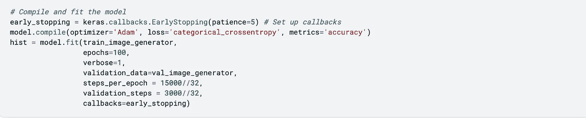

在提前停止之前，模型训练 14 个时期。下图显示了两组的训练和验证损失以及准确性。

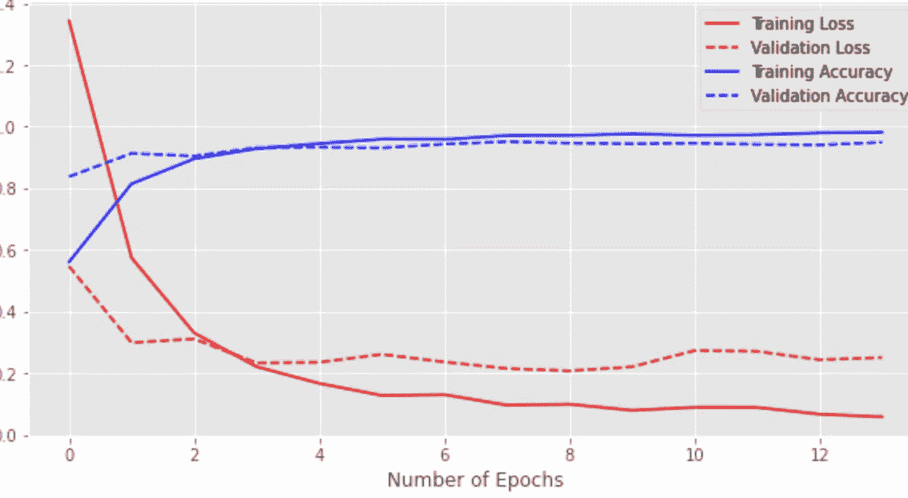

Model Performance

我们能够在测试装置上达到 95%的精确度。

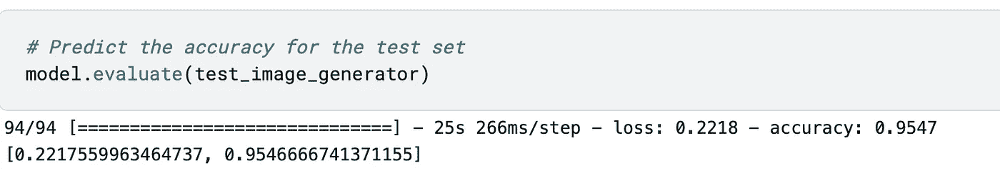

让我们测试模型的预测。下面的函数从目录和实际标签中获取图像的路径，并显示带有实际标签和预测标签的图像。

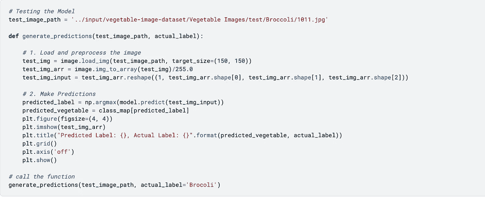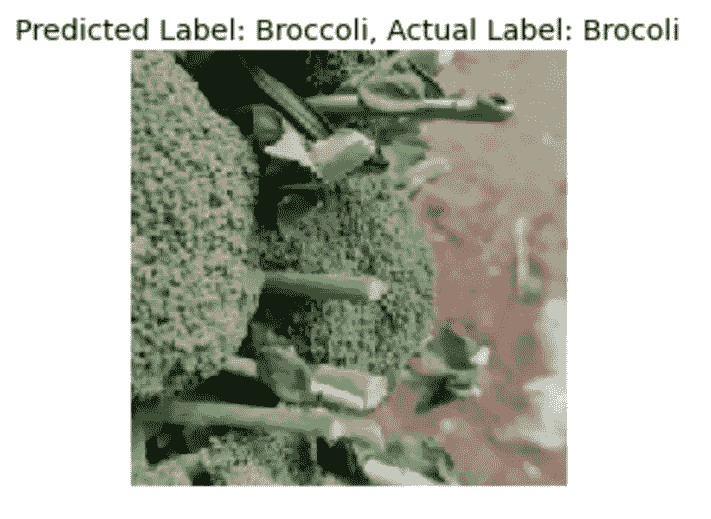

如我们所见，生成的预测是正确的。在我的下一篇博客中，我将在同一个数据集上实现 [**迁移学习**](https://machinelearningmastery.com/transfer-learning-for-deep-learning/) 的概念，并比较两个模型的结果。

5.**参考文献**

*   [https://keras.io/api/layers/](https://keras.io/api/layers/)
*   [https://blog . xrds . ACM . org/2016/06/convolutionary-neural-networks-CNN-illustrated-explain/](https://blog.xrds.acm.org/2016/06/convolutional-neural-networks-cnns-illustrated-explanation/)
*   https://www.kaggle.com/misrakahmed/vegetable-image-dataset
*   [https://www . ka ggle . com/chitwanmanchanda/vegetable-image-class ification-using-CNN](https://www.kaggle.com/chitwanmanchanda/vegetable-image-classification-using-cnn/edit)

我希望你发现这篇文章内容丰富。我一直在**媒体**和 **LinkedIn** 上分享**数据科学**内容。可以关注我 [**LinkedIn**](https://www.linkedin.com/in/chitwanmanchanda/) 。你可以在这里 访问整个代码 [**。**](https://www.kaggle.com/chitwanmanchanda/vegetable-image-classification-using-cnn)

 [## Mlearning.ai 提交建议

### 如何成为 Mlearning.ai 上的作家

medium.com](/mlearning-ai/mlearning-ai-submission-suggestions-b51e2b130bfb)