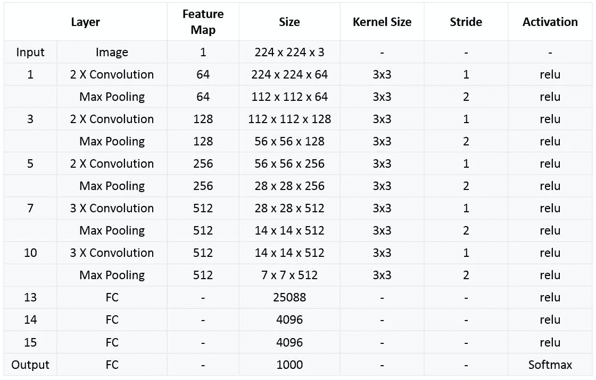

# 深入 VGG

> 原文：<https://medium.com/mlearning-ai/vgg-in-depth-48ec68d71a92?source=collection_archive---------2----------------------->

在我之前的帖子中，我们谈到了 AlexNet，这是 CNN 的一个革命性的进步，并成为图像分类的最佳模型。然后 VGG 来了，改变了整个场景。

VGG 的全称是视觉几何组。它是由[牛津机器人研究所](https://en.wikipedia.org/wiki/Oxford_Robotics_Institute)的[卡伦·西蒙扬](http://www.robots.ox.ac.uk/~karen/)和[安德鲁·齐泽曼](https://en.wikipedia.org/wiki/Andrew_Zisserman)在 2014 年提出的。VGG 研究卷积网络深度的最初目的是了解卷积网络的深度如何影响大规模图像分类和识别的准确度和精度。-Deep-16 CNN)，为了加深网络层数，避免参数过多，所有层都使用了一个小的 3×3 卷积核。

## VGG 建筑

VGG Architectue

VGG Layers Description

1.  使用 64 个过滤器的卷积
2.  使用 64 个过滤器+最大池的卷积
3.  使用 128 个过滤器的卷积
4.  使用 128 个过滤器的卷积+最大池
5.  使用 256 个过滤器的卷积
6.  使用 256 个过滤器的卷积
7.  使用 256 个过滤器+最大池的卷积
8.  使用 512 个过滤器的卷积
9.  使用 512 个过滤器的卷积
10.  使用 512 个过滤器+最大池的卷积
11.  使用 512 个过滤器的卷积
12.  使用 512 个过滤器的卷积
13.  使用 512 个过滤器+最大池的卷积
14.  完全连接 4096 个节点
15.  完全连接 4096 个节点
16.  具有 1000 个节点的 Softmax 激活的输出层。

该网络的特点是简单，整体结构包括 5 组仅 *3×3* 的卷积层，这些卷积层以递增的深度相互堆叠。减少卷大小是由最大池处理的。两个完全连接的层，每个层有 4，096 个节点，然后是 softmax 分类器。

AlexNet 仅包含一个内核大小为 7 * 7 的卷积，但是在 VGG 中，每个卷积层包含 2 到 4 个卷积运算。与 AlexNet 相比，内核的大小也很小，即 3 * 3。卷积步距固定为 1 个像素；conv 的空间填充。层输入使得空间分辨率在卷积后保持不变，即对于 3×3 conv，填充是 1 个像素。层次。VGGNet 最明显的改进是减小了卷积核的大小，增加了卷积层数。

1 * 1 卷积层主要是在不影响卷积层感受野的情况下，增加判决函数的非线性。虽然 1 * 1 卷积运算是线性的，但 ReLu 增加了非线性。

## 培养

**优化方法**是带动量的随机梯度下降 SGD + momentum (0.9)。

**批次**尺寸为 256。

**正则化**:使用 L2 正则化。

**退出**是在前两个完全连接的层之后。

## 总结 VGGNet

1.  使用更小的 3 * 3 卷积核和更深的网络。两个 3 * 3 卷积核的堆叠是相对于 5 * 5 卷积核的视场而言的，三个 3 * 3 卷积核的堆叠相当于 7 * 7 卷积核的视场。这样，参数可以更少。
2.  在 VGGNet 的卷积结构中，引入了 1 * 1 卷积核。
3.  在不影响输入输出维数的情况下，引入非线性变换，增加网络的表达能力，减少计算量。

希望这篇文章对你学习和了解 VGGNet 有所帮助。