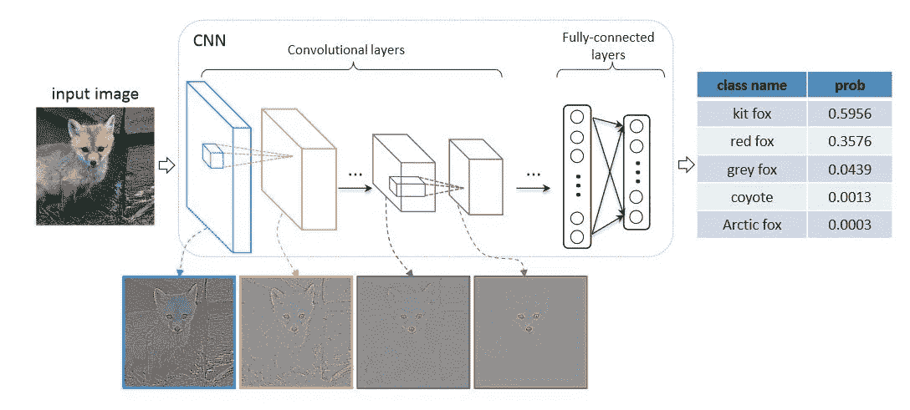
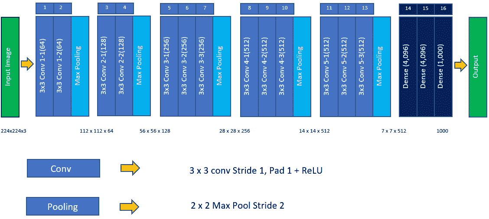
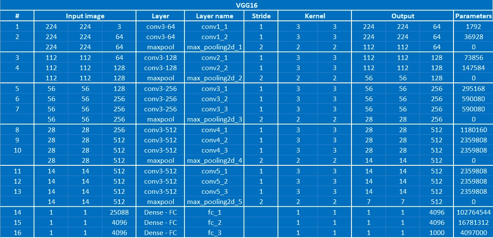

# VGG——深度卷积神经网络

> 原文：<https://medium.com/mlearning-ai/vgg-very-deep-convolution-neural-network-4a544fb9fd9b?source=collection_archive---------6----------------------->

在这篇博客中，我们将学习 VGG 模型的基本原理。

## 背景

2011 年计算机视觉竞赛 ImageNet 大规模视觉识别挑战赛(ILSVRC)的启动为计算机视觉任务领域的创新铺平了道路。使用 ImageNet [数据集](https://www.image-net.org/download.php)，基于 CNN 的网络 [AlexNet](https://proceedings.neurips.cc/paper/2012/file/c399862d3b9d6b76c8436e924a68c45b-Paper.pdf) 由 Alex Krizhevsky 于 2012 年提出。该网络以 15.3% 的[前 5 名错误率赢得了当年的比赛。在接下来的几年里，卡伦·西蒙扬和安德鲁·齐泽曼提出了 VGG 网络的想法，并在 2014 年的 ImageNet 挑战赛中提交了基于该想法的实际模型，并获得了亚军。他们以他们所在的牛津大学视觉几何组的名字给这个模型命名为 VGG。](https://en.wikipedia.org/wiki/AlexNet)

## 什么是 VGG？

VGG 是一种标准的卷积神经网络(CNN)架构，具有多层，旨在通过增加 CNN 的深度来提高分类精度。“深度”是指由 16 和 19 个卷积层组成的 VGG16 或 VGG19 的卷积层数。VGG 在 ILSVRC 数据集上接受训练，该数据集包括 1000 个类别的图像，分为三组，分别为 130 万个训练图像、10 万个测试图像和 5 万个验证图像。该模型在 ImageNet 挑战中获得了 92.7%的测试准确率。

**与之前的车型有何不同？**

与 AlexNet 和 ZFNet 等以前的模型中的大感受野相比，VGG 使用了一个非常小的 3×3 感受滤镜(仍然可以捕捉左/右和上/下的最小尺寸)，跨度为 1 个像素；相比之下，Alex net 使用了一个跨度为 4 的 11×11 滤镜，而 ZFNet 使用了一个大小为 4 的 7×7 滤镜。

拥有统一的 3x3 过滤器背后的想法是，它们可以复制 AlexNet 和 ZFNet 中使用的可变大小过滤器。例如，两个连续的 3×3 滤光器提供 5×5 的有效感受野。同样，三个 3 x3 滤镜相当于一个 7x7 滤镜。Aqeel Anwar 的博客很好地解释了上述概念。

现在，让我们检查需要训练的变量的数量。一个 5x5 卷积层过滤器有 25 个参数，而两个 3x3 过滤器总共有 18 个(=3x3x2)参数。多个 3×3 滤波器还导致具有多个非线性激活层，这使得模型更具区分性，并且使得网络能够更快地收敛。

## VGG 配置

作者提出了各种配置(VGG16、VGG19 等。)基于网络的深度。这些配置的基本构建模块是一个由多个卷积层组成的堆栈，滤波器大小为 3×3，跨距为 1，填充为 1，后面是一个大小为 2×2 的最大池层。卷积堆栈之后是三个完全连接的层。前两个大小为 4096，最后一个大小为 1000，是具有 softmax 激活功能的输出层。1，000 的大小指的是 ImageNet 中可能的类的总数。

Source: [https://viso.ai/](https://viso.ai/)

**VGG16 架构**

在所有配置中，VGG16 被认为是 ImageNet 数据集上性能最好的模型。在本节中，我们将回顾这种配置的实际架构。

*   **输入:**大小为 224x224 像素，3 通道(RGB)的图像。唯一需要的预处理是通过从每个像素中减去平均值来标准化 RGB 值。
*   **卷积层:**VGG 的卷积层使用尺寸为 3×3 的非常小的接收滤波器，这是可以捕捉上下和左右的最小可能尺寸。还有 [1x1 卷积滤波器](https://towardsdatascience.com/a-comprehensive-introduction-to-different-types-of-convolutions-in-deep-learning-669281e58215#6238)(作为输入的线性变换)，后面是非线性激活函数 ReLU，允许网络学习更复杂的函数。
*   **全连接层:** VGG 有 3 个全连接层，前两层各有 4096 个通道，第三层有 1000 个通道，每个类别一个通道。
*   **隐藏层:**VGG 网络中的所有隐藏层都使用 ReLU。

**它是如何工作的？**

大小为 224×224 的输入图像通过第一叠 2 个卷积层，每个卷积层具有 64 个 3×3 的非常小感受野的滤波器，随后是 ReLU 激活。卷积的步距固定为 1 个像素，填充为 1 个像素。直到这个阶段，空间分辨率没有变化，并且特征图的大小与输入图像的大小相同。然后，特征地图通过 2×2 窗口上的 max-pooling 层，步长为 2 个像素，将特征地图的大小缩小一半。在第一叠层的末端的激活或特征的尺寸被减小到输入图像 112×112×64 的一半。

VGG16 architecture

现在，生成的特征图随后流过具有 128 个过滤器(而不是第一层中的 64 个)的类似的第二层。结果这一层最后的输出进一步减半，变成了 56×56×128。接下来是第三个堆栈，包含三个卷积层和一个最大池层。由于在此步骤中应用的过滤器数量是 256，因此堆栈的输出大小是 28×28×256。随后是两叠三个卷积层，每叠包含 512 个滤波器。这些堆栈末尾的输出是 7x7x512。

卷积层叠层之后是三个完全连接的层以及一个展平层。前两层各有 4，096 个神经元，最后一个完全连接的层是输出层，有 1，000 个神经元，对应于 ImageNet 数据集中存在的一千个类。输出图层之后是用于类别分类的 softmax 激活图层。

下图显示了 VGG16 模型的结构细节，解释了输入和输出的大小、内核和步幅的大小，以及每一步中参数的[数量。](https://towardsdatascience.com/understanding-and-calculating-the-number-of-parameters-in-convolution-neural-networks-cnns-fc88790d530d#8028)

VGG16 — Structural details

## **挑战**

尽管 VGG 是一个非常简单、优雅且易于使用的模型，但也有一些与之相关的挑战。VGG 超过 138M，模型的大小超过 533 MB。这使得实施 VGG 网络成为一项耗时的任务。其次，网络的深度导致了[消失梯度](https://towardsdatascience.com/vggnet-vs-resnet-924e9573ca5c)的问题。

VGG 模型仍然用于几个图像分类问题，但未来更小的网络架构，如谷歌网和挤压网往往是首选。

**参考文献:**

1.  [https://towards data science . com/vgg-neural-networks-the-next-step-after-Alex net-3 f 91 fa 9 FFE 2c](https://towardsdatascience.com/vgg-neural-networks-the-next-step-after-alexnet-3f91fa9ffe2c)
2.  [http://cs 231n . Stanford . edu/slides/2017/cs 231n _ 2017 _ lecture 9 . pdf](http://cs231n.stanford.edu/slides/2017/cs231n_2017_lecture9.pdf)
3.  [https://viso . ai/deep-learning/vgg-very-deep-convolutionary-networks/](https://viso.ai/deep-learning/vgg-very-deep-convolutional-networks/)
4.  [https://www.mygreatlearning.com/blog/introduction-to-vgg16/](https://www.mygreatlearning.com/blog/introduction-to-vgg16/)
5.  [https://towards data science . com/the-w3h-of-Alex net-vggnet-resnet-and-inception-7 baaaecccc 96](https://towardsdatascience.com/the-w3h-of-alexnet-vggnet-resnet-and-inception-7baaaecccc96)

**论文:**

1.  [https://proceedings . neur IPS . cc/paper/2012/file/c 399862d 3 b 9d 6 b 76 c 8436 e 924 a 68 c 45 b-paper . pdf](https://proceedings.neurips.cc/paper/2012/file/c399862d3b9d6b76c8436e924a68c45b-Paper.pdf)
2.  [https://arxiv.org/abs/1409.1556](https://arxiv.org/abs/1409.1556)

 [## Mlearning.ai 提交建议

### 如何成为 Mlearning.ai 上的作家

medium.com](/mlearning-ai/mlearning-ai-submission-suggestions-b51e2b130bfb)