# 维拉特·科利 vs 科尔·拉胡尔

> 原文：<https://medium.com/mlearning-ai/virat-kohli-vs-kl-rahul-42473d6b0369?source=collection_archive---------2----------------------->

> Virat Kohli 仍然是最好的击球手吗？KL Rahul 是否正在超越 Virat Kohli？过去 5 年谁的数据更好？IPL 数据说明了什么？想知道一些不为人知的彩光统计数据吗？

Photo from Unsplash uploaded by Ajay Parthasarathy

让我用 python 的 IPL 数据分析来回答上面的问题(你可以查看 github.com 知识库中的完整代码——博客末尾给出了链接)。

让我们看看 IPL 的一些未知数据，然后我们将分析 Virat 和 KL Rahul 在过去 5 个 IPL 赛季的数据。

 [## 用 Python 编写复杂模式的简单方法，仅需 4 分钟。

### 用 python 编写复杂模式程序的简单方法

medium.com](/@gowthamsr37/pattern-programming-in-python-23d5af04211e) 

# 未知/鲜为人知的 IPL 统计数据:

*   我们知道**克里斯·盖尔**和**布伦顿·麦卡勒姆**是 IPL 中最具破坏性的击球手，但不为人知的事实是**克里斯·盖尔**和**麦卡勒姆**是**点球率最高的 2 名击球手**(2000 年面对的最小球数)分别为 46%和 45%。
*   尽管**克里斯·盖尔**在点球率方面位居榜首，但他是第二高击球率的**击球手**(2000 年面对的最小球数)
*   Shikhar Dhawan 和**大卫·华纳**是他们 IPL 生涯中拿过**最多 3s** 的击球手，两人都拿了 **23 3s** ，然后是 **Virat Kohli 拿了 19** **3s** 。
*   **大部分 4**在 IPL 的**第 4 次超过**时被击中，得分为 **1911** 和**大部分 6**在**第 20 次超过**时被击中，得分为 **866。**
*   **大卫·华纳**在第一轮得分最多的**(424)**和**在 IPL 第 20 轮得分最多的**(655)。****
*   **Bhuvaneshwar Kumar** 在第一回合中让出最多**分，而 **DJ Bravo** 在第二十回合中让出最多**分。****
*   Dinesh Karthik 被**卷入了 37 次出局**，其中他只被**出局了 13 次**，他的搭档还有 24 次被解雇。

# **总击球统计:**

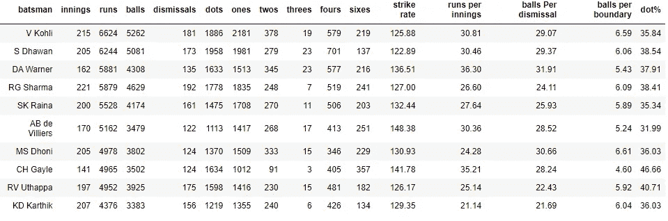

Overall Batting Stats in IPL

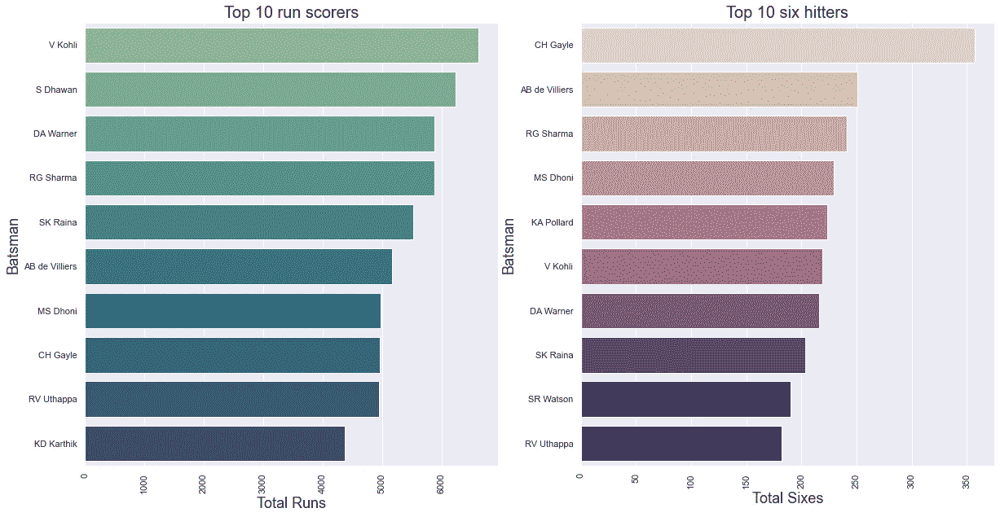

Bar graph showing different stats of top batsmen in IPL

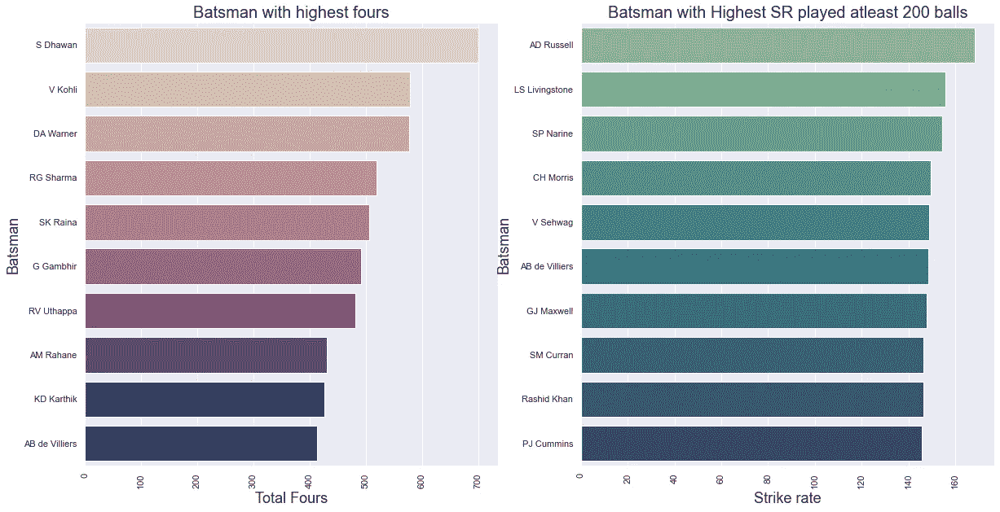

Bar graph showing different stats of top batsmen in IPL

# **维拉特的彩光统计:**

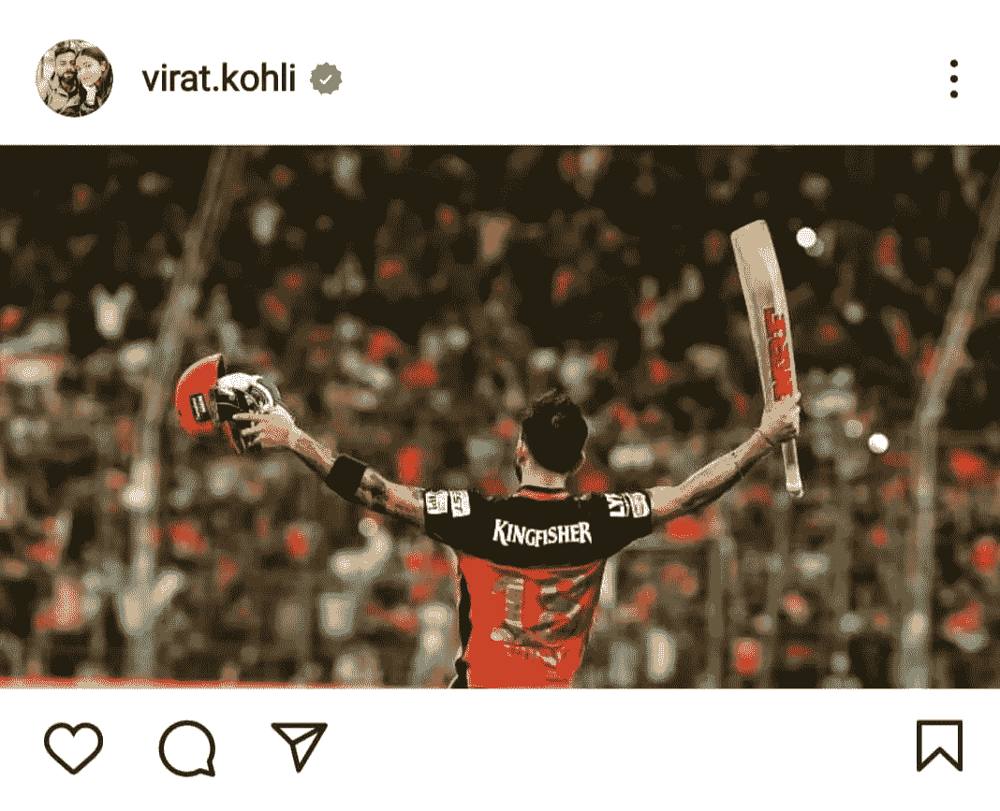

Photo of Virat Kohli celebrating his 100, posted on instagram

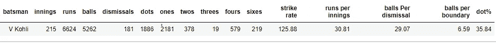

Virat’s overall IPL stats

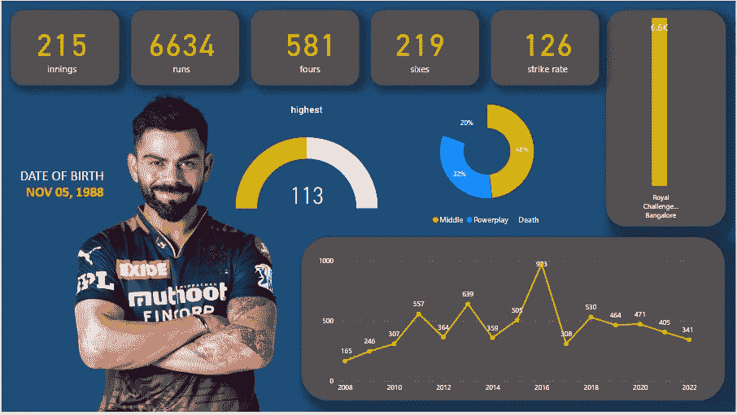

Virat Kohli's IPL stats till 2022

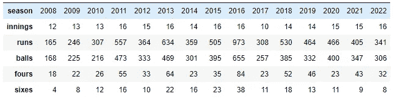

Virat’s overall IPL stats across seasons

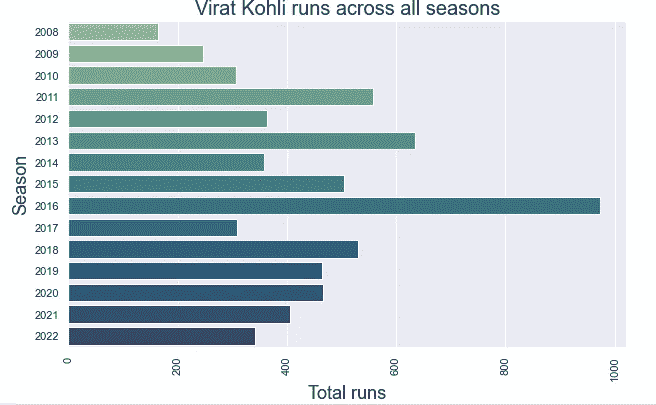

Virat’s runs across all seasons of IPL

**不同阶段的 Virat 统计:**

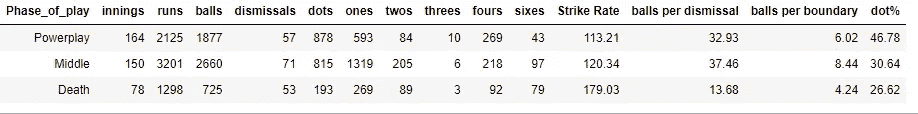

Virat’s stats across the different phases

Virat 得分最多的 10 名投球手:

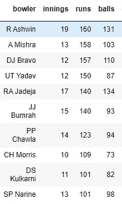

Bowlers against whom Virat has scored the most runs

【Virat 得分最多的 10 名投球手:

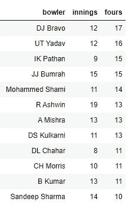

Bowlers against whom Virat has scored most fours

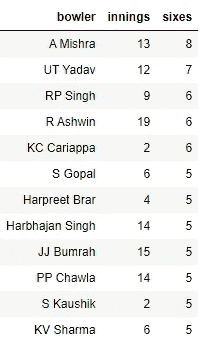

Bowlers against whom Virat has scored most sixes

**10 个最能打发维拉特的投球手:**

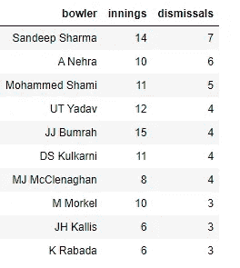

Bowlers dismissing Virat the most

**10 位与维拉对抗的投球手(最少打了 20 个球)点球率最高:**

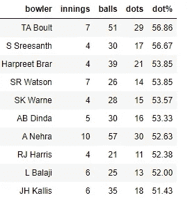

Virat struggles against these bowlers

**10 名维拉特好球率高的投球手(至少打 20 个球):**

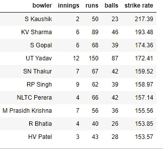

Bowlers against whom Virat has dominated

**与这些伙伴对战时，维拉的命中率会增加(最小球数为 20):**

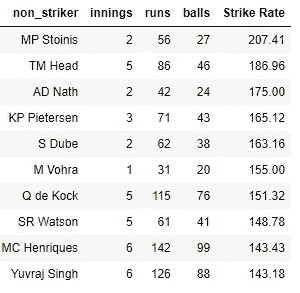

10 batting partners with whom Virat enjoys playing aggressively

**维拉特与这些伙伴对战时命中率下降(最小球数为 20):**

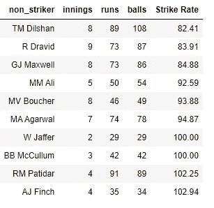

10 batting partners with whom Virat plays defensively

# KL Rahul 的彩光统计:

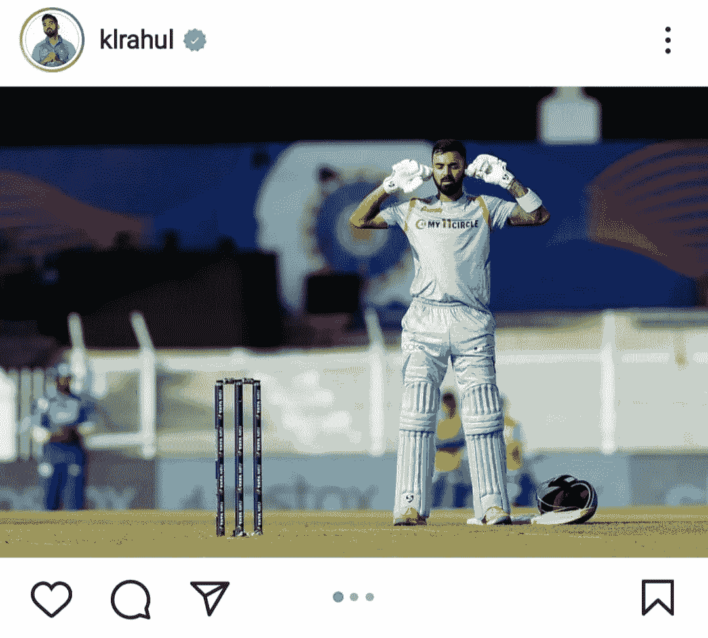

KL Rahul celebrating his 100 posted on Instagram

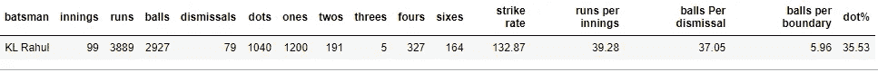

KL Rahul’s overall IPL statistics

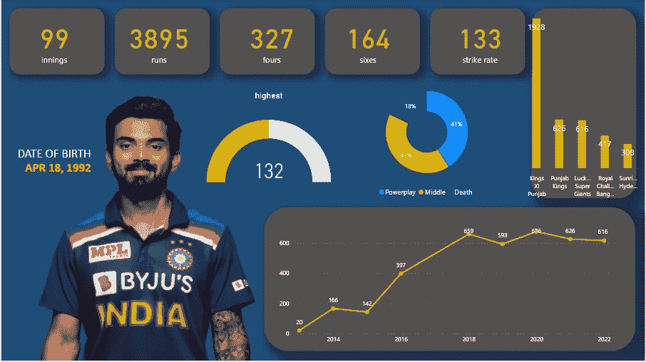

KL Rahul's IPL stats till 2022

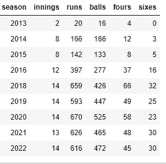

KL Rahul’s stats across all seasons of IPL

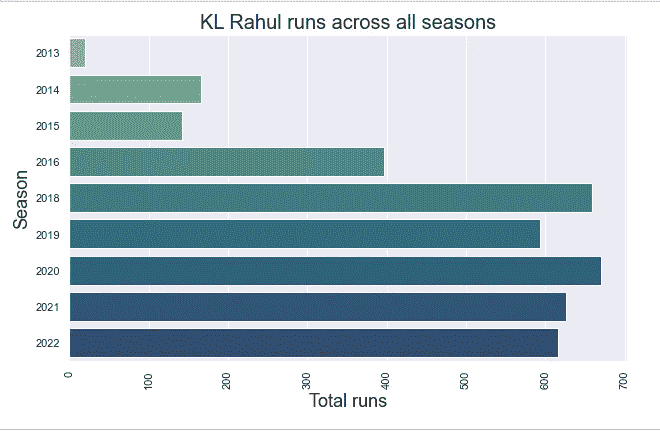

KL Rahul’s runs across all seasons of IPL

**拉胡尔在不同阶段的统计数据:**

KL Rahul’s stats across different phases

**KL Rahul 得分最多的 10 位投球手:**

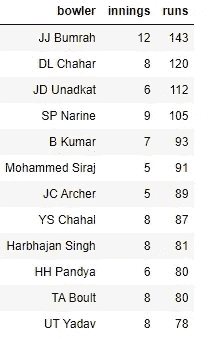

Bowlers against whom KL Rahul has scored the most runs

**KL Rahul 得分最多的 10 位投球手:**

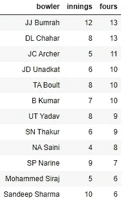

Bowlers against whom KL Rahul has scored most fours

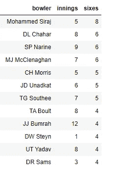

Bowlers against whom KL Rahul has scored the most sixes

**10 位最常淘汰 KL Rahul 的投球手:**

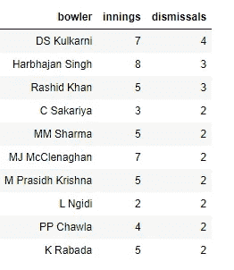

Bowlers who have dismissed KL Rahul the most

**与 KL Rahul 对阵的 10 名投球手的点球率最高(最少 20 球):**

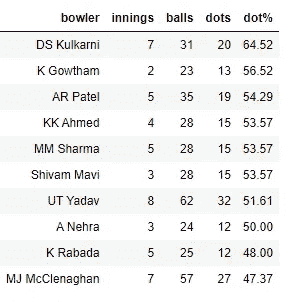

KL Rahul struggles to score against these bowlers

**与 KL Rahul 有良好命中率的 10 名投球手(至少打了 20 个球):**

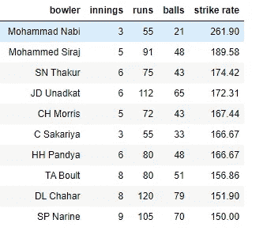

KL Rahul enjoys betting against these bowlers

**KL Rahul 和这些伙伴一起玩的时候命中率提高(min balls 打了 20):**

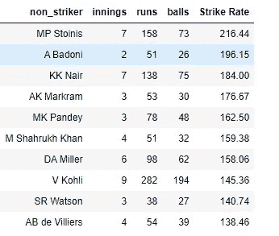

10 batting partners with whom KL Rahul enjoys playing aggressively

**KL Rahul 和这些伙伴一起玩的时候命中率下降(min balls 打了 20):**

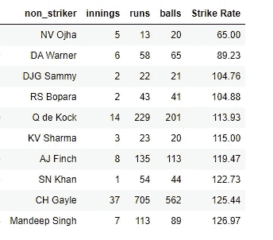

10 batting partners with whom KL Rahul plays defensively

# 维拉特和拉胡尔的对比(2018 年至 2022 年):

Image by author

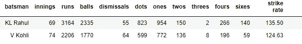

Virat Kohli vs KL Rahul stats (2018–2022)

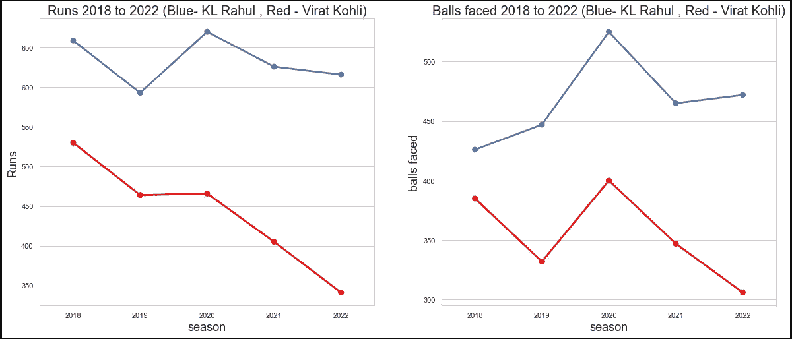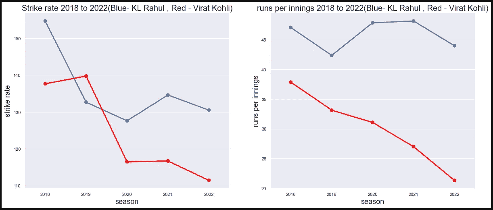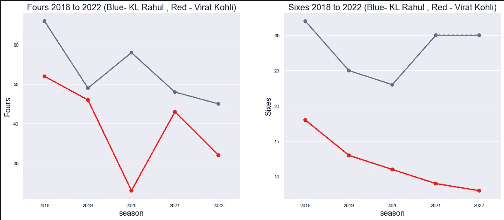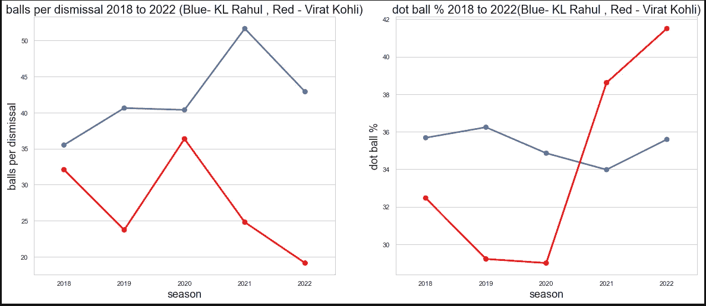

*   从上面的图表中，我们可以清楚地观察到，自 2018 赛季以来，KL Rahul 的**跑分、面对的球数、四分、六分**、**好球率、每局跑分和每场解雇的球数**与 Virat 相比都遥遥领先。
*   让我们欣赏一下 KL Rahul 的数据，希望 Virat Kohli 能在接下来的日子里恢复到最佳状态。

感谢阅读，你可以从我的 [GitHub 库](https://github.com/gowthamsr37/IPL-analysis-Virat-vs-Rahul-)获得完整代码。

 [## 任何可能出错的事情都会出错。

### 我们在日常生活中遇到的一些墨菲定律列表

medium.com](/@gowthamsr37/anything-that-can-go-wrong-will-go-wrong-2eb8b119c50f) 

如果你对混淆矩阵、精确度、召回率、准确度、f1 分数感到困惑，请阅读下面的博客。

 [## 混淆矩阵

### 什么是混淆矩阵精确度、回忆、准确度、F1 分数、FPR、FNR、TPR、TNR？

medium.com](/@gowthamsr37/confusion-matrix-179b9c758b55) 

如果你想了解更多关于特征缩放技术，以及标准化和规范化之间的区别，请阅读下面的博客。

 [## 其特点是使用缩放技术——标准化与规范化。

### 特征缩放是强制性的吗？什么时候使用标准化？何时使用规范化？会发生什么……

medium.com？](/@gowthamsr37/which-feature-scaling-technique-to-use-standardization-vs-normalization-9dcf8eafdf8c) 

你可以从[这个链接](https://www.linkedin.com/in/gowtham-s-r-78120a127/)在 LinkedIn 上和我联系。

最佳数据科学书籍[点击此处](https://amzn.to/3yvswRs)

 [## Mlearning.ai 提交建议

### 如何成为 Mlearning.ai 上的作家

medium.com](/mlearning-ai/mlearning-ai-submission-suggestions-b51e2b130bfb)