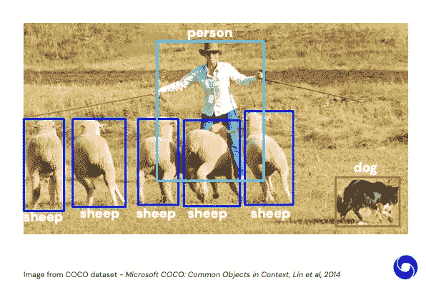
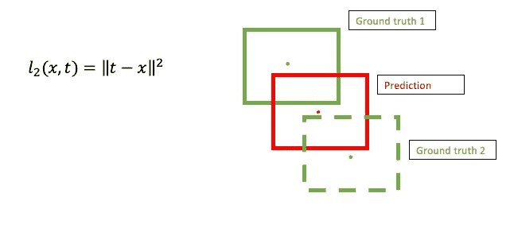
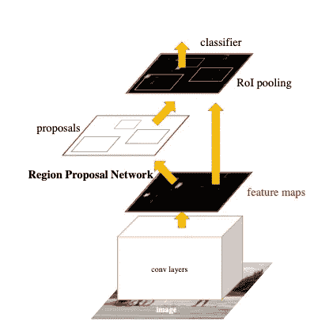
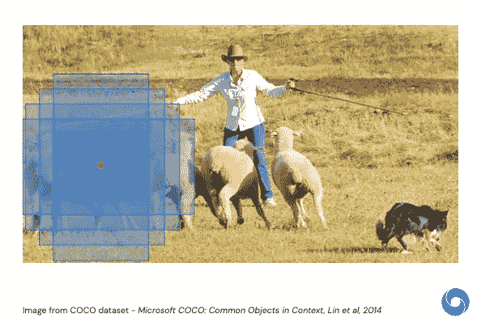
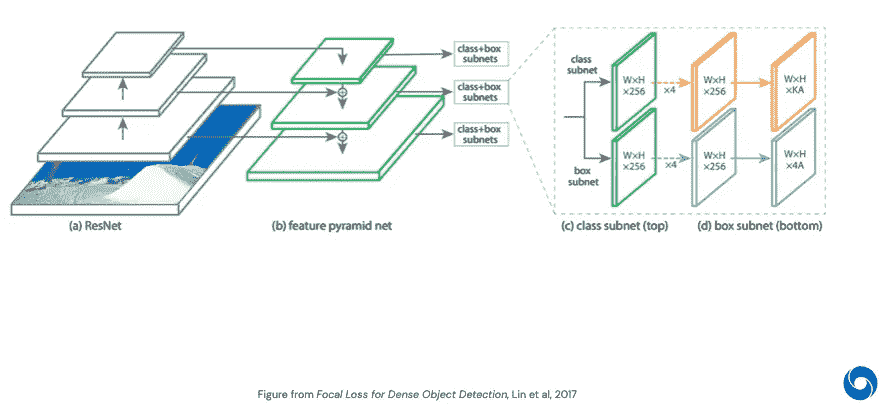
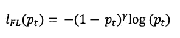

# 超越分类的视觉:超越分类的任务:任务 I:目标检测

> 原文：<https://medium.com/mlearning-ai/vision-beyond-classification-task-i-object-detection-d2f32a5ea4ca?source=collection_archive---------2----------------------->

2020 年 DeepMind [系列讲座](https://storage.googleapis.com/deepmind-media/UCLxDeepMind_2020/L4%20-%20UCLxDeepMind%20DL2020.pdf)第四课笔记

## 什么是物体检测？

目标检测是一个分类和定位任务。它的目标是定位图像中带有边界框的对象及其相应的类。

**输入**:带有一个或多个物体的图像。(RGB 图像`H x W x 3`)

**输出**:针对图像中出现的所有物体(*图 1* )

*   ***分类标签*** :分类标签的一键编码。比如:`0 0 0 1 0`
*   ***对象包围盒*** :对于每个对象的位置，我们输出

*(xᶜ，yᶜ，h，w)* 其中 *(xᶜ，yᶜ)* 为中心的坐标， *(h，w)* 为对应的高度和宽度。



**Figure 1**: The desired output for object detection

**如何准备数据集来训练对象检测？**

我们需要 ***N*** 个样本进行训练和测试。每个示例都包含一个带有对象列表的 RGB 图像，其中每个对象的坐标都有一个一键标签和一个边界框。

```
N_*train*, N_*test* samples
{'image': p ∈ [0,1], *H* x *W* x 3,
 'objects':
  [
   {'label': one_hot(N), 1 x *N*,
    'bbox': *(xᶜ, yᶜ, h, w)* ∈ ℝ, 1 x 4},
   {'label': one_hot(N), 1 x *N*,
    'bbox': *(xᶜ, yᶜ, h, w)* ∈ ℝ, 1 x 4},
   .
   . 
   .
  ]}
```

**如何学会预测 bbox 坐标？**

由于这些包围盒的坐标是真实值，错误在分类中是不可量化的，我们需要使用回归来预测包围盒坐标。我们使用二次损失*(图 2)* 来反馈预测边界框的准确性。所以我们的目标是最小化样本的二次损失(均方误差)。



**Figure 2**: Quadratic loss

其中:

*   ***t*** :地面真相
*   ***x*** :预测

通常，我们在一幅图像中有不止一个物体(*图 2* )。因此，我们使用两个步骤来识别我们应该与我们的预测进行比较的基本事实边界框。

1.  ***分类*** :我们先把输出值离散化成一个-hot 标签来分类我们的预测属于哪个地面真值包围盒。
2.  ***回归*** :一旦我们对地面真实边界框进行了分类，我们就可以通过回归来细化我们的预测值。

## 更快的 R-CNN:

[更快的 R-CNN](https://arxiv.org/abs/1506.01497) ( *图 3* )是由两个模块组成的两级物体探测器:



**Figure 3:** Faster R-CNN: a single, unified network for object detection (**Source:** Figure from Faster R-CNN: Towards Real-Time Object Detection with Region Proposal Networks, Ren et al, 2016)

***1。区域提议网络(****RPN****):***一个深度的、完全卷积的网络，它将图像(任何大小)作为输入，并预测一组矩形对象提议(候选边界框)，每个提议都有一个对象得分*。*

***RPN 是如何工作的？***

*   离散 bbox 空间: *(xᶜ，yᶜ，h，w)(图 4)*

```
-> anchor points for (*xᶜ, yᶜ):* to discretize the space of the center, choose an anchor point and distribute them uniformly over the image. *->* scales and ratios for *(h, w):* choose candidate bbox with different scales and ratios.
```



**Figure 4**: Discretizing bbox space

*   每个主播 n 个候选人:一般我们选择 3 个不同比例的 3 个不同尺度。
*   预测每个 bbox 的对象性分数:我们训练一个分类器来预测 bbox 中是否有对象。
*   排序并保留前 K 名候选人

**②*。一个检测网络:*** 采用快速 R-CNN(全连接层)使用来自 RPN 的建议区域作为分类和细化的输入。

> **注:** RPN 和快速 R-CNN 独立训练，使用交替训练技术共享卷积层。

## RetinaNet:

[RetinaNet](https://arxiv.org/abs/1708.02002) *(图 5)* 是由四个部件组成的一级物体探测器。



**Figure 5:** The one-stage RetinaNet network architecture that uses a Feature Pyramid Network (FPN) backbone on top of a feedforward ResNet architecture.

***1。特征金字塔网络(FPN)主干:*** 用自上而下的路径和横向连接扩充标准卷积网络。因此，该网络从单分辨率输入图像中有效地构建了丰富的多尺度特征金字塔。

***2。锚:*** 使用类似于 RPN 变体中的平移不变锚盒。每个锚被分配:

*   分类目标的长度***K***one-hot vector，其中 ***K*** 是对象类的数量。
*   盒回归目标的四维向量。

**3*。分类子网:*** 一个小的全连接网络(FCN)，它为每个*锚和 ***K*** 对象类预测每个空间位置上对象存在的概率。简而言之，它对主干网的输出执行卷积对象分类。*

****4。框回归子网:*** 另一个 FCN，即将每个锚框的偏移量回归到附近的地面物体。简而言之，它执行卷积包围盒回归。*

> ***注:** RetinaNet 是当前物体检测中最先进的模型。然而，这种单级检测器取得最佳结果并非基于网络设计的创新，而是由于其新颖的损耗: ***焦点损耗(FL)****

***什么是焦损失(FL)？***

*焦点丢失(FL)旨在解决一阶段对象检测场景，其中在训练期间前景和背景类别之间存在极端不平衡*(图 6)。*fl 建立在用于二元分类的交叉熵(CE)之上，其中调制因子(`1-p*t*` )ᵞ被添加到 CE 损失，可调聚焦参数γ **≥ 0。***

**

***Figure 6**: The Focal Loss*

*FL 用作分类子网输出的损耗。FL 将训练集中在一组稀疏的硬例子上，并防止大量容易否定的例子在训练期间淹没检测机。*

## *总结:*

*这篇文章探讨了分类之外的第一项任务:对象检测和旨在解决它的当前最先进的深度学习模型。*

*具体而言，我们解决了:*

*   ***物体检测**:计算机视觉任务，定位图像中物体的存在，并用边界框指示它们的位置。*
*   ***快速 R-CNN** :基于区域提议网络(RPN)和快速 R-CNN 检测网络的两级检测器。*
*   ***RetinaNet** :一个一级检测器，使用焦点损失来解决训练过程中的班级不平衡问题。*

> *[接下来是 DeepMind 深度学习系列第 4 讲的笔记:超越分类的视野:超越分类的任务:任务 2:语义分割。](/@nghihuynh_37300/vision-beyond-classification-tasks-beyond-classification-task-ii-image-segmentation-5c5e81edf2b0)*

*[](/mlearning-ai/mlearning-ai-submission-suggestions-b51e2b130bfb) [## Mlearning.ai 提交建议

### 如何成为 Mlearning.ai 上的作家

medium.com](/mlearning-ai/mlearning-ai-submission-suggestions-b51e2b130bfb)*