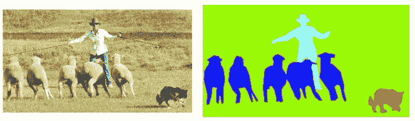
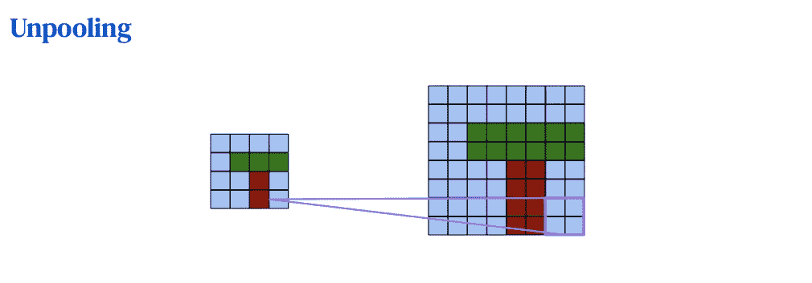
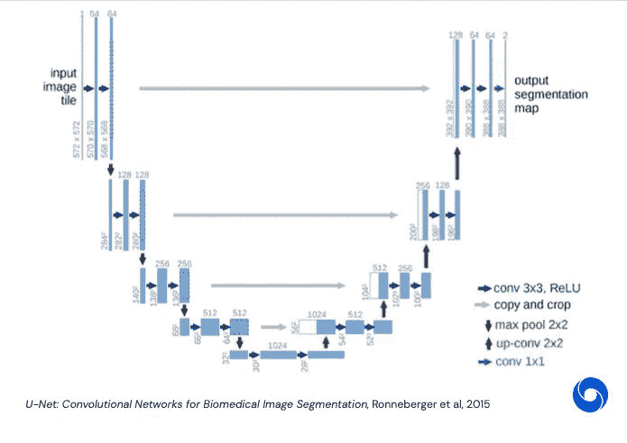
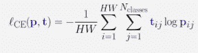
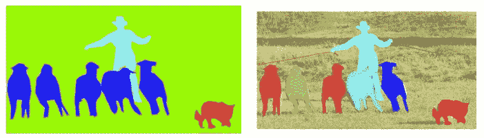
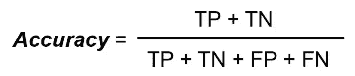
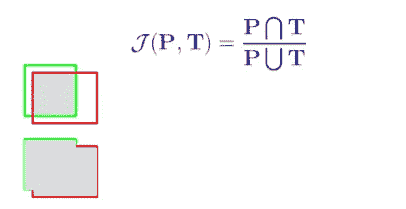

# 超越分类的视觉:超越分类的任务:任务二:图像分割

> 原文：<https://medium.com/mlearning-ai/vision-beyond-classification-tasks-beyond-classification-task-ii-image-segmentation-5c5e81edf2b0?source=collection_archive---------5----------------------->

2020 年 DeepMind [系列讲座](https://storage.googleapis.com/deepmind-media/UCLxDeepMind_2020/L4%20-%20UCLxDeepMind%20DL2020.pdf)第 4 课笔记

图像分割是一项计算机视觉任务，在这项任务中，我们用相应的类别来标记图像中特定的像素区域。由于我们预测图像中的每个像素，这个任务通常被称为 ***一个密集预测*** 问题，而分类则是一个 ***稀疏预测*** 问题。图像分割有两种类型:语义分割和实例分割。

现在，让我们来探索一下吧！

## 什么是语义切分？

***语义分割*** 是对图像中一个或多个特定的感兴趣区域进行标注的过程。此过程将单个类别中的多个对象视为一个实体。例如:在*图 1 中，*语义分割对羊的所有像素赋予相同的标签。

**输入**:带有一个或多个物体的图像。(RGB 图像`H x W x 3`)

**输出:**每个像素的类别标签

**Figure 1:** Left: Input: an RGB image; Right: Output: class label for every pixel

与稀疏预测问题不同，密集预测问题需要精确分辨率的输出作为输入。那么，我们如何产生相同分辨率的输出呢？

从前面的笔记中，我们已经遇到了降低分辨率的池技术。现在，让我们取消采样以提高分辨率！(*图二*)

**Figure 2**: Unpooling: upsample to increase resolution; here we use 2x2 kernel (**Source**: [DeepMind Lecture 4](https://storage.googleapis.com/deepmind-media/UCLxDeepMind_2020/L4%20-%20UCLxDeepMind%20DL2020.pdf))

现在，让我们通过探索 U-NET 的体系结构来看看如何将 unpooling 技术合并到一个模型中:当前语义分段中最先进的模型！

## U-NET:

***U-NET*** 是一种编码器-解码器模型，其中添加了跳过连接以保留细节。这个网络架构*(图 3)* 由一个收缩路径(左侧的编码器)和一个扩展路径(右侧的解码器)组成。

***编码器*** 路径遵循卷积网络的典型架构。该路径由两个 3×3 卷积的重复应用组成，每个卷积之后是一个整流线性单元(ReLU)和一个跨距为 2 的 2×2 最大池操作，用于下采样。

***解码器*** 路径具有与编码器路径相似的结构。但是，它用 2x2 上采样操作取代了 2x2 最大池操作。这条路径将精确分辨率的输出作为输入。

然而，由于上采样，我们可以得到一个滴状特征图。因此，为了保留细节，我们从相同分辨率级别的编码器层添加了一些长跳跃连接。因此，通过添加这些跳过连接，我们可以添加回在池化和取消池化操作中可能丢失的高频细节。

**Figure 3:** U-NET architecture

我们如何训练这个系统？

**输出 T5:*H*x*W*x*N _ classes***

***损失*** :逐像素交叉熵*(图 4)* 。

我们得到了输出中每个像素在可能类别上的概率分布。为了训练这一点，我们使用与分类相同的交叉熵损失，但现在它是输入中所有像素的平均值。

**Figure 4**: pixel-wise cross entropy

## 什么是实例分段？

***实例分割*** 是检测和描绘图像中每个感兴趣对象的过程。这个过程是对象检测和语义分割的结合。然而，它不同于语义分割，因为它给图像中特定对象的每个实例一个唯一的标签。例如:在*图 5(右)*中，实例分割为每只羊分配不同的颜色(标签)，而语义分割只为所有那些羊分配相同的颜色(标签)(*图 5，左*)。

**Figure 5**: Left: semantic segmentation; Right: instance segmentation

## 屏蔽 R-CNN:

[***掩膜 R-CNN:***](https://engineering.matterport.com/splash-of-color-instance-segmentation-with-mask-r-cnn-and-tensorflow-7c761e238b46) (区域卷积神经网络)在图像分割和实例分割方面是最先进的。Mask R-CNN 建立在速度更快的 R-CNN 之上，这是一个流行的对象检测框架。在这个框架中有两个阶段:

*   第一阶段，一个**区域提议网络** (RPN)，提议候选对象包围盒。
*   第二阶段从每个候选框中提取特征，并执行分类、边界框回归和**二元掩码**。

## 指标和基准:

***评价指标:***

***1。*分类:**

评估分类模型性能的最简单指标是**准确性**:正确预测的百分比(*图 6* )。

**Figure 6**: Accuracy

其中:

*   TP:真阳性
*   TN:真阴性
*   FP:假阳性
*   FN:假阴性

通常，我们使用:

*   Top-1: top 预测是正确的类。
*   前 5 名:正确的类别在前 5 名预测中。

***2。*物体检测与分割:**

然而，我们使用一个**交集-并集(IoU)** 来评估对象检测和分割*(图 7)* 。由于 IoU 是不可微的，我们只能用它来评估。

**Figure 7**: Intersection over union

***基准:***

*   [ImageNet](https://image-net.org/challenges/LSVRC/index.php) :大规模评估对象检测和图像分类算法的主要计算机视觉基准。
*   [Cityscapes:](https://www.cityscapes-dataset.com/) 大规模像素级、实例级和全景语义标注的基准套件和评估服务器。
*   [Coco:](https://cocodataset.org/#home) 大规模对象检测、分割和字幕数据集。

## 总结:

综上所述，我们探讨了分类之外的第二个任务:图像分割。

具体而言，我们解决了:

*   **语义分割**:对图像中一个或多个感兴趣的特定区域进行标记的过程，同时将单个类别中的多个对象视为一个实体。
*   U-NET :对象语义分割的编解码模型
*   **实例分割**:对象检测和语义分割相结合的过程，其中同一类别中的每个实例被区分。
*   **屏蔽 R-CNN** :对象实例分割的快速 R-CNN 扩展模型。
*   **度量和基准**:为分类、对象检测和图像分割提供一些众所周知的度量和基准。

> 接下来是 DeepMind 深度学习系列讲座 4 的笔记:超越分类的视觉:超越单一图像输入

 [## Mlearning.ai 提交建议

### 如何成为 Mlearning.ai 上的作家

medium.com](/mlearning-ai/mlearning-ai-submission-suggestions-b51e2b130bfb)