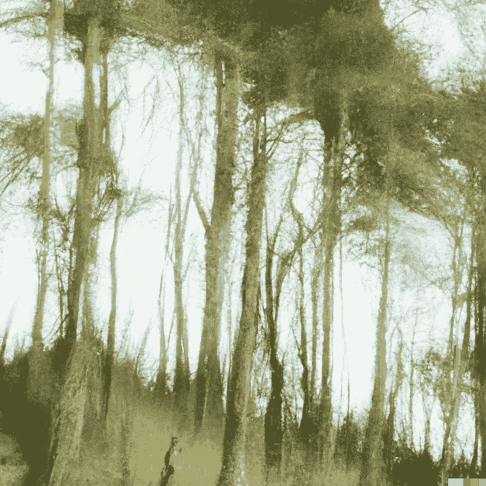

# 机器学习的视觉幻觉

> 原文：<https://medium.com/mlearning-ai/visual-hallucination-for-machine-learning-8f6407623032?source=collection_archive---------3----------------------->

## [机器学习艺术](https://mlearning.substack.com)

## 新的多模态人工智能翻译

[A good alternative to DALL·E 2 that you can use while waiting](https://mlearning.substack.com/p/a-good-alternative-to-dalle-2-that?r=z7zu8&s=w&utm_campaign=post&utm_medium=web) — [Images Created with DALL·E, an AI system](https://mlearning.substack.com/p/a-good-alternative-to-dalle-2-that?r=z7zu8&s=w&utm_campaign=post&utm_medium=web)

**机器学习**-辅助翻译无非是用 ML 模型翻译另一种语言。然而，与直接翻译每个单词的普通翻译相比，这种方法更上一层楼。例如，人工智能程序可以…