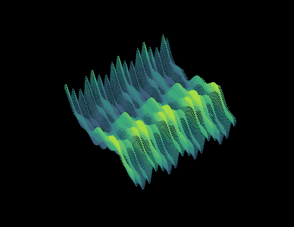
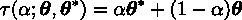
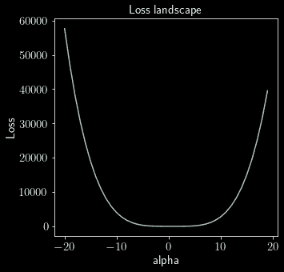
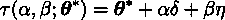
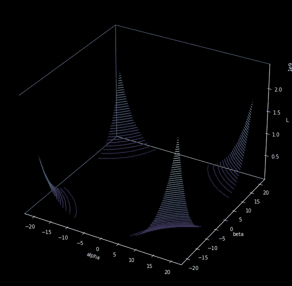
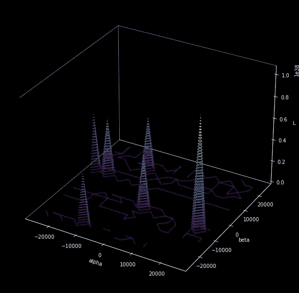
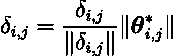
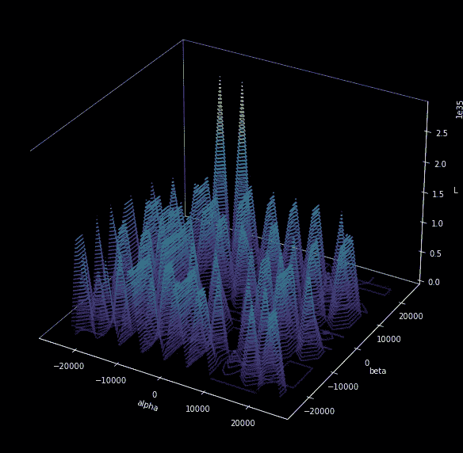
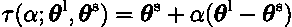
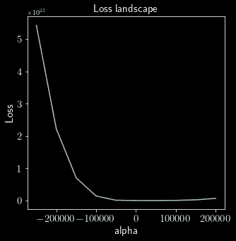

# 想象损失场景

> 原文：<https://medium.com/mlearning-ai/visualising-the-loss-landscape-3a7bfa1c6fdf?source=collection_archive---------0----------------------->

A gratuitous plot

# 序言

当绘制和监控一个建筑的损失函数时，我们通过一个卫生纸管来观察损失情况。在 *y* 轴上是损失函数，在 *x* 轴上是历元*。*我们只有损失函数空间的一维视图，对于小范围的参数梯度也是如此。

如果我们可以在数十亿个参数的梯度范围内看到 GPT 的 1750 亿维损失空间，会怎么样？好吧，我们别自欺欺人了。如果我们至少能在一个降维空间，比如说两维空间，看到损失景观会怎样？这篇介绍性文章简要地展示了它是如何实现的，以及这是一个多么简单而又迷人的想法。

> 在这个二维空间里，你无法超越某人。观察这个二维彩蛋。如果我们在第三维度，向下看，我们将能够看到一只未孵化的小鸡，就像三维鸡蛋里的小鸡能够被第四维的观察者看到一样

在训练神经网络时，我们绘制的损失函数是模型结构、优化方法、初始化、*等*的函数。对于它们的不同配置，绘制的所得损失函数不同。然而，这些选择对最终目标的影响尚不清楚。我们设想损失函数收敛是为了好玩，也是为了深入了解训练。景观的可视化提供了更丰富的见解，并有助于解释为什么神经网络可以优化甚至非常复杂的非凸函数，以及为什么最小优化的泛化能力很好。(例如，通过这种可视化观察到一种对跳跃联系的有用见解:它们防止模型将损失景观变得混乱，因此在训练中是有用的[3])。

**两个旁注—**

1.  为了简单明了，本文围绕 MNIST 数据集，探讨了可视化的几个方面。更多的学术研究和其他数据集的文本以及这个想法的各个方面可以在关于这个问题的论文中找到[2，3，4]
2.  至于符号，内部媒体还无法提供用符号说话的奢侈。2021 年也不行。现在，替代符号被使用，黑客被采用

A sample PyTorch data loader for the MNIST dataset

# 介绍

设𝛉是神经网络中所有参数的列表。让𝓛(𝑦，𝑡；𝛉)是损失函数，其中𝑦是预测，𝑡是目标。我们通常绘制𝓛的趋同图来显示𝑦和𝑡.之间的差异我们的目标略有不同。这个损失函数的输入，𝑦和𝑡，保持不变。换句话说，我们打算画的情节是𝛉的函数，*即*，𝓛(𝛉；𝑦，𝑡)，或者简单的𝓛(𝛉).这就是说，对于给定的域，我们对网络架构、优化器、损失函数、*等的选择。*在图上看起来像。

A simple NN with two convolutional layers enough to classify the MNIST dataset sufficient for demonstration

不用说，𝛉的维数很高(上面代码片段中的简单网络有 1，199，882 个维度！).可悲的是，现实将我们限制在只有三种——至少就观想而言。所以，我们需要降低这个维度。一个简单的方法是从欧几里得空间转移到更低维度(一个或两个)的超空间。更简单地说，欧几里得空间中具有 *d* 维的𝛉可以被认为是在超空间中具有一维表示。𝓛(𝛉的情节；𝑡𝑦)是一个二维图形。同样，如果我们假设𝛉在超空间中是二维的，我们就有了一个理想的三维图。

# 移至低阶维度

## 一维线性插值

将损失绘制成一维图[1]很简单:首先测量从一组参数𝛉到另一组参数𝛉*的损失，其中𝛉可以是朝向(已经找到的)局部(甚至全局)最优值𝛉*.的随机初始化组

A [learnt model](https://www.dropbox.com/s/t0zte6v7u1yfj3k/learnt.pt?dl=0) (4.58MB) (with over 98% accuracy) is loaded. Interpolation starts from a random initialisation

沿着这条线的所有可能的参数集可以简单地是从 0 到 1，两者加权相加等于 1，并且由非欧几里得变换𝜏:给出

A series of parameters linearly interpolated from one set of parameters to another

A function implementing linear interpolation of the parameters from 𝛉 to 𝛉*

对于标量𝛼，范围从 0 到 1 在*x*-轴上，损耗𝓛(𝛉(𝛼在 *y* 轴上，我们有一个一维损耗图。*范围可能不同* 并且，由于结果图是配置相关的，因此必须相应地辨别。

Computing the loss of all parameters from the random set to the globally optimised one (Code snippet is for illustration. Note the time complexity; model parallelism should come in handy)

A loss landscape plotted along the linearly interpolated set of parameters with the code snippet above

## 二维景观

在二维空间[1，2]中绘图在原理上也一样简单。给定任何随机或优化的参数集，𝛉*，我们在两个方向上冒险，𝛿和𝜂.在两个方向，我们分别迈出小步，𝛼和𝛽。因此，结果图是𝛼和𝛽.的函数

因为𝛿和𝜂是方向向量，所以它们代表𝛉*.每个维度的方向*即*，𝛿和𝜂具有与𝛉*相同的维数，都可以从随机高斯样本中抽取。

𝜏:给出了非欧几里得变换

The 2D contour map

然后可以从𝛼 𝜖 [0，1]和𝛽 𝜖 [0，1]或任何范围绘制等高线图。在下面的代码片段中，两者都在[-20，20]范围内。

A demo snippet for illustration; used to generate the contour plot shown below

Contour plot from 𝛼 𝜖 [-20, 20] and 𝛽 𝜖 [-20, 20]. Notice that the 1D graph above is akin to this in 1D

这张图给了我们两条信息:我们可以在两个方向上移动的速率，以及用来获得更大图像的范围。上面生成等高线图的代码片段(来自同一个𝛉*)用于生成下面的等高线图，只是这次𝛼和𝛽在[-25000，25000]中。

Contour plot from 𝛼 𝜖 [-2.5M, 2.5M] and 𝛽 𝜖 [-2.5M, 2.5M]

# 效用

在比较优化方法和网络架构时，这种可视化非常有用。然而，这并不总是可能的，因为几种层不会对模型的有效结果产生任何改变。例如，如果使用和不使用该层的有效结果相同，ReLU 不会改变网络的行为，例如当 ReLU 的输入按某个因子缩放，而输出除以相同的因子时。诸如分批标准化之类的层在网络对这些层的不变性方面也同样起作用。这使得我们无法进行有意义的比较。

另一方面，在某些情况下，由某个单元扰动网络的大权重几乎没有效果。其他时候，由同一个单位在敏感的重量上做同样的事情会造成混乱。为了解决这个问题，随机生成的方向向量，比如说𝛿，可以归一化为与𝛉*.方向相同更具体地说，使𝛿的每个滤波器具有与𝛉*的相应层相同的方向[3]:

Orienting filter directions in the random vector 𝛿 to be the same as those of 𝛉*

这样做表明，当方向(𝛿和𝜂)以这种方式标准化时，等高线图能够捕捉损失面的距离尺度(例如，比较上面的两个图)[3]。

## 确定解决方案空间面积

考虑两组经过训练的参数:𝛉ˡ和𝛉ˢ.前者在较大批量的数据集上训练，后者在较小批量的数据集上训练。从一个到另一个的插值显示了取决于批量大小的可能解空间的宽度。

例如，考虑从一个批次大小为 256 的[模型(13.74MB)](https://www.dropbox.com/s/de3m2cyrikyc7he/mnist_b256?dl=0) 生成的以下轮廓，与上面的批次大小为 64 的轮廓相反。

Contour plot from 𝛼 𝜖 [-25M, 25M] and 𝛽 𝜖 [-25M, 25M] from a model trained with 256 batch size

作为旁注，许多峰和谷解释了当使用大批量时，产生的重量往往小于小批量[3]。

然后，我们在两个训练参数𝛉ˡ和𝛉ˢ:之间进行插值

该插值现在是基于 64 和 256 之间的批量大小的参数的函数。这种比较有助于发现任何可能产生更好的优化结果的潜在配置。果然，我们知道什么时候该停下来:

Loss landscape as a function of network parameters varied by batch size

虽然这只是一个基于批量大小寻找好的解决方案空间的示例，但是也可以优化其他参数和超参数。一些关键要点[3]包括:

*   更广泛的网络防止混乱的景观
*   跳过连接拓宽了解决方案空间(或最小化)
*   混乱的地形有浅的山谷，导致更糟的训练和测试损失
*   视觉上较平坦的地形对应于一贯较低的测试误差

# 收场白

*   还尝试了一次标准化全部参数集(与逐个过滤器的基础相反)[2]
*   关于轮廓和图形的平坦度与锐度的更多讨论以及它们的用途将在[5，3]中详细讨论
*   [GitHub 上的 Loss Landscape](https://github.com/tomgoldstein/loss-landscape)有许多实用函数和有用的类可供进一步研究

## 参考

1.  伊恩·J·古德菲勒、奥里奥尔·维尼亚尔斯和安德鲁·M·萨克斯。定性表征神经网络优化问题。2015 年 *ICLR*
2.  丹尼尔·吉姆、陶大宇和克里斯汀·布兰森。深度网络损失面的实证分析。 *arXiv:1612.04010* ，2016
3.  郝莉，徐征，加文泰勒，克里斯托弗斯图德，汤姆戈尔茨坦:可视化神经网络的损失景观。在 NeurIPS，2018 年
4.  劳伦特·丁，拉兹万·帕斯卡努，萨米·本吉奥，约舒阿·本吉奥。尖锐的极小值可以推广到深网。2017 年 *ICML*
5.  川口健二，莱斯利·帕克·卡尔布林，和约舒阿·本吉奥。深度学习中的泛化。 *arXiv:1710.05468* ，2017