# 讲述数据故事的可视化技巧

> 原文：<https://medium.com/mlearning-ai/visualization-tips-for-data-story-telling-1e99cccbb8c7?source=collection_archive---------0----------------------->

做什么和不做什么，好的和坏的图表

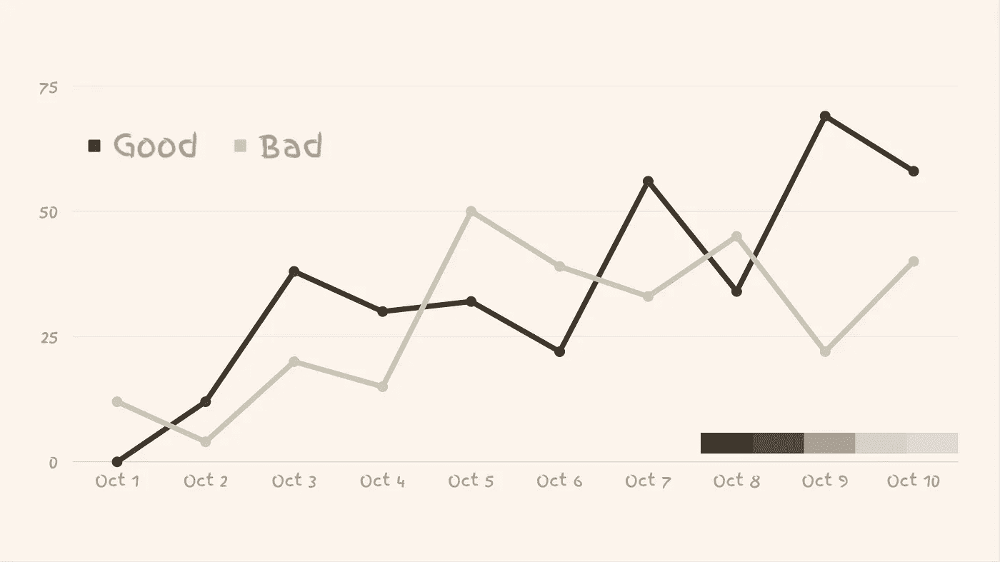

Image by Author

作为一个有美术和摄影背景的人，后来转向了数据科学，我发现自己在向利益相关者提供仪表板/演示时是“审美驱动的”。

> “也许故事只是有灵魂的数据。” *—布琳·布朗*

可视化和讲故事在整个数据科学管道中扮演着重要角色。这两个组成部分赋予了数据“灵魂”。每个数据分析师都有分析技能来进行分析，每个数据科学家都有能力调用 scikit-learn 函数来构建模型。即使这些是解决业务问题的关键，无论你的分析有多深入，你的模型有多花哨，如果没有强烈的视觉效果和引人注目的故事情节，一切都不到一粒灰尘的重量。

我不知道谁能理解这一点——当某人的演示文稿中的视觉效果与其目的不一致时，或者仅仅是“有点不对劲”时，我经常发现自己很难专注于项目本身然而，当有人拥有出色的视觉效果时，我会很快被他们试图讲述的故事吸引。

在这篇文章中，我想分享一些对我有用的可视化技巧，以及我从错误中吸取的一些教训。我将从四个主要方面向您介绍我在 Tableau Public 上看到的过去项目和视觉/仪表盘的示例:**颜色、文本、大小、**和**强调**。

(注意:本文中列出的例子仅用于技术目的，如果包含您的作品，请不要做出任何个人判断。)

# **颜色**

想象一下，你要出去结识新朋友，某人的服装颜色选择如何影响你对他们的看法？颜色可以诠释一个人的个性和情感。这和其他视觉元素一起，将是你在了解这个人之前首先注意到的东西。

数据展示也是如此。

当你展示你的视觉效果时，首先会抓住观众注意力的是颜色。因此，始终保持一致且合适的配色方案/主题至关重要。

## 保持简单

最重要的时尚规则之一是“穿不超过 3 种不同的颜色”。对于仪表板和数据显示，最好使用有限数量的色调。每种存在于你的仪表盘/视觉上的颜色都应该有一个合理的理由。在你决定添加另一种颜色之前，问问你自己这个问题:**它是否有助于向观众传达他们无法理解的信息？**如果答案是否定的或者你无法给自己解释，那么**不要**加色。

下面是我最近看到的一个例子:

Source: [http://citydashboard.org/london/](http://citydashboard.org/london/)

请注意，至少有 6 种色调伴随着许多大的强调 KPI 数字向你尖叫。色彩的多样使用破坏了整体的视觉和谐。这对人眼来说非常分散注意力。

与凯蒂·基尔罗伊的这个例子相比:

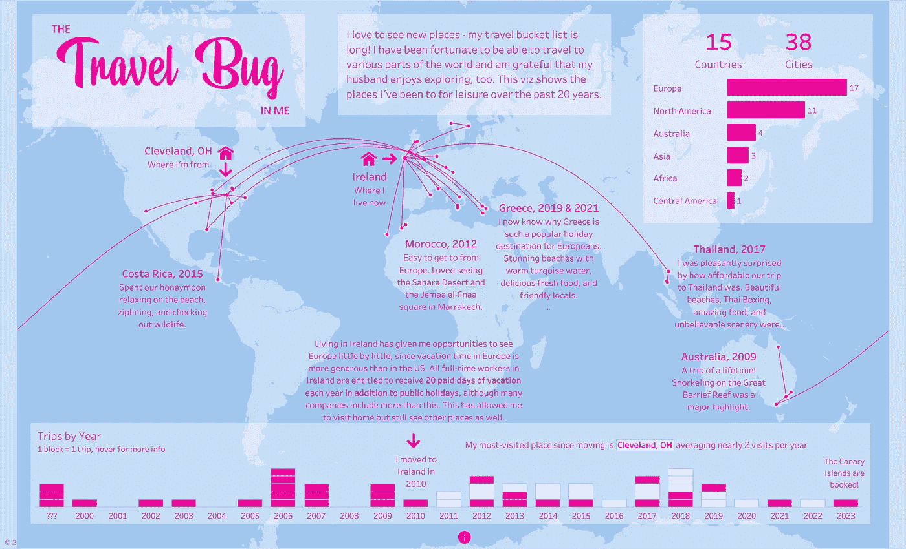

Source: Tableau Public — [Katie Kilroy](https://public.tableau.com/app/profile/katie.kilroy/viz/TheTravelBugInMe/TheTravelBugInMe)

我们看到背景色加上视觉效果的主色在整个仪表盘中只占两种色调。她巧妙地将两种颜色结合在一起，使重要的信息突出出来，并让观众轻松浏览。

## 合适的配色方案

现在你知道了色调的数量，让我们来谈谈选择什么颜色。这里我们将讨论最常见的配色方案类型以及何时使用它们。

*   **单色配色**

单色配色方案只有**一种**色调，有多种色调、阴影或色调。一旦你有了一个基本的颜色，你可以简单地在搜索引擎中输入十六进制的颜色代码，你会看到与该颜色相关的各种调色板。例如，如果我想使用颜色#947ec3，我会搜索这个颜色代码以查看颜色的不同色度和淡色，并根据我的偏好组成一个单色调色板。 [Color Hex](https://www.color-hex.com/) (下图)是我常去的网站之一。

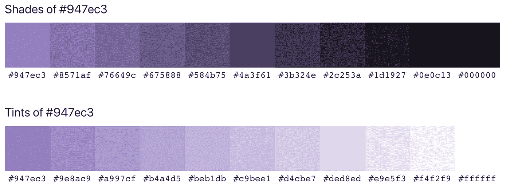

Monochromatic Color Palette Example — Source: [Color Hex](https://www.color-hex.com/)

单色调色板最常见的用例是可视化**数值与分类特征**，以及**分类特征的分布**。

下面的条形图是我最近合作的 NLP 项目的视觉效果之一。这个图表是展示 GitHub 上与元宇宙相关的编程语言 README.md 文件的长度**(数值)****(分类)**。通过使用单色调色板，将最暗的阴影分配给计数最高的变量，反之亦然，查看者可以容易地理解每个条形之间的比较。

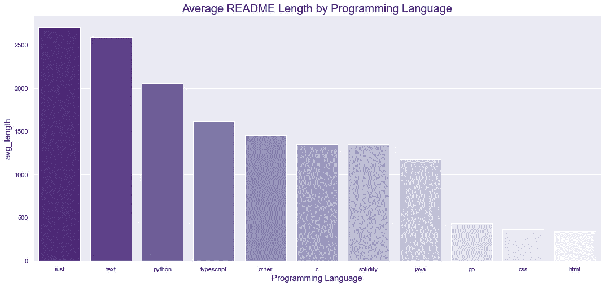

Bar Chart — Image by Author

确保色调/阴影的顺序与数值的顺序一致。下面是我在 Tableau Public 上看到的一个不好的例子:

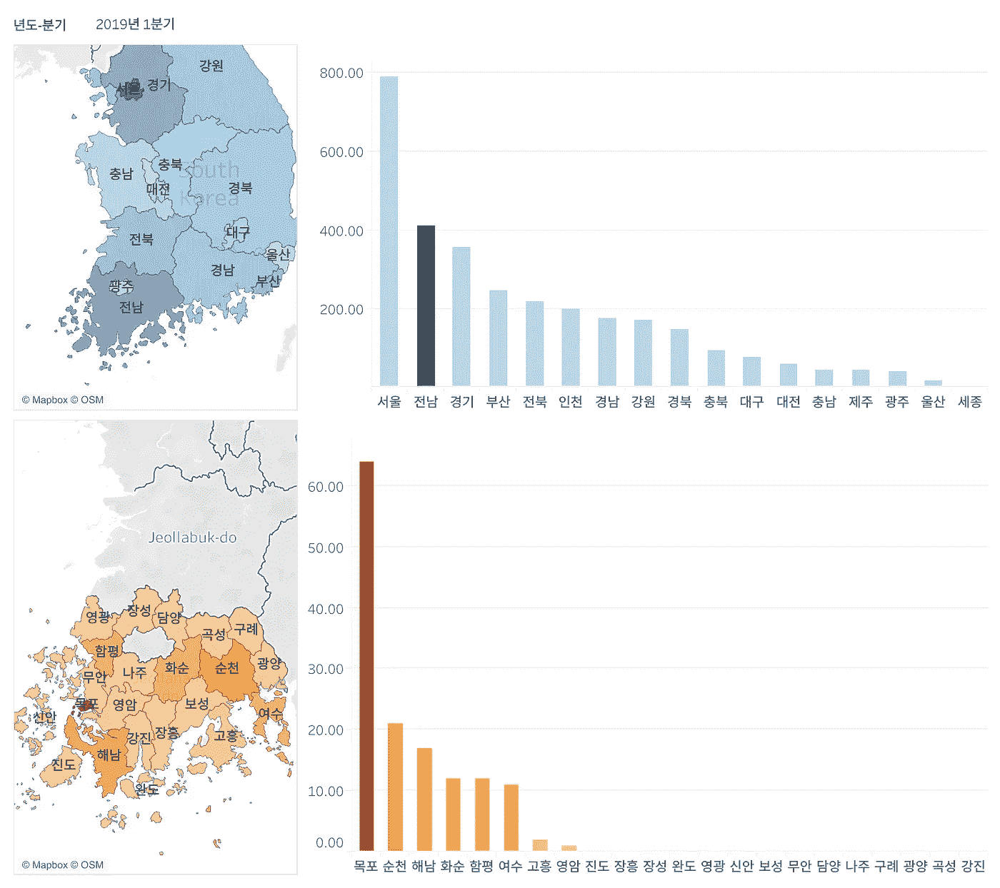

Source: Tableau Public — [전라남도 공공보건의료지원단](https://public.tableau.com/app/profile/eunsun.mun/viz/A0401-/A0401-)

在下图中，我们可以看到较暗的阴影被正确地用于显示具有最大值的条形。但是颜色阴影没有遵循上图中定量值的正确顺序。像这样的小错误可能会误导/迷惑观众——到底哪个更严重？你的重点是什么？

*   **补色方案**

互补色方案在色轮上的相对位置有两种色调**和**。下图很好地展示了互补色，包括一些常用的颜色对。

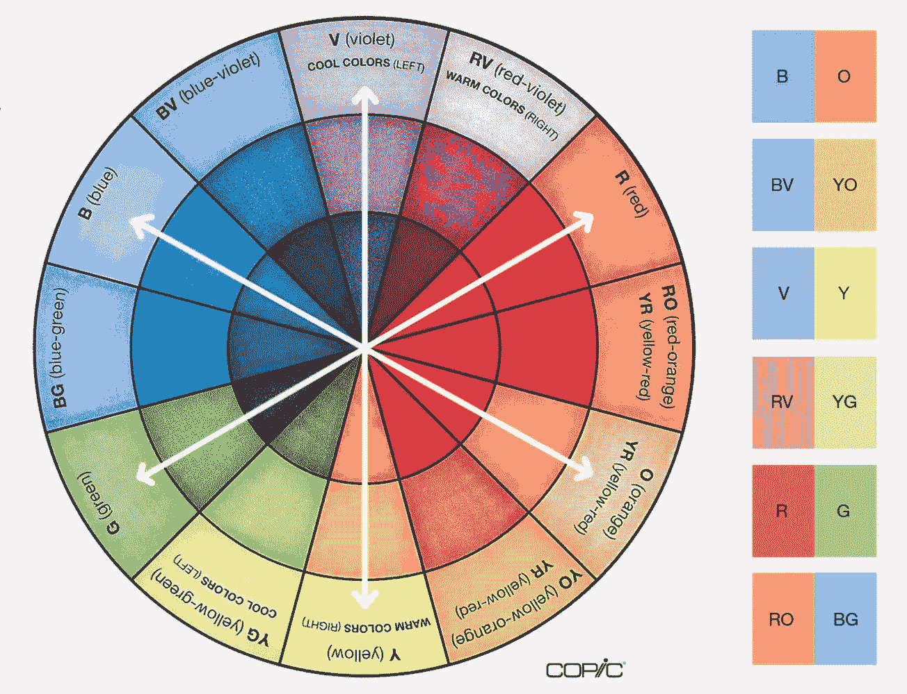

Complementary Colors — Source: [.Too](https://copic.too.com/blogs/educational/analogous-complimentary-and-split-complementary-color-schemes)

顾名思义，这种配色方案非常适合可视化比较**分类**特征。下面的动画条形图来自我的[客户流失预测](https://github.com/m3redithw/Customer-Churn-Prediction)项目。这是为了显示客户流失和不流失之间的区别。

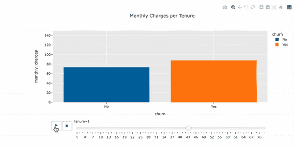

Bar Chart — Image by Author

这也是展示一系列**数字**特征的绝佳选择。下面的例子来自非营利组织 的 [**数据。我们可以看到作者是如何用两种互补色来表示两个对立的群体，用两种色调的不同深浅来表示数量值的。**](https://public.tableau.com/app/profile/amelia.kohm7895)

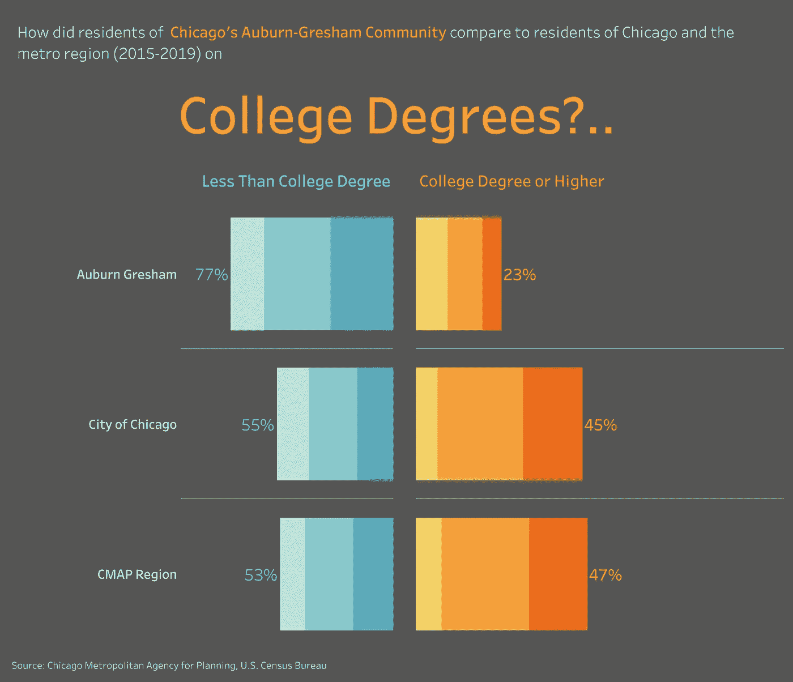

Source: Tableau Public — [Data Viz for Nonprofits](https://public.tableau.com/app/profile/amelia.kohm7895)

我们还经常在热图中看到互补色方案，用两种颜色代表两个极端(积极和消极)。下面的例子来自我的[家庭价值预测](https://github.com/m3redithw/Zestimates-Clustering-Project)项目，可视化特征之间的相关性。

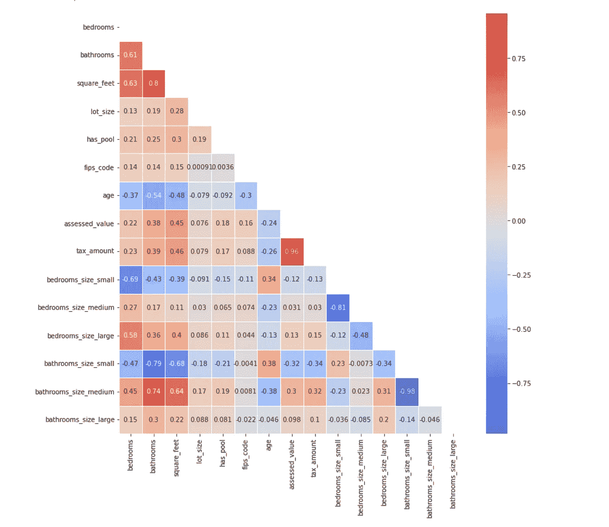

Image by Author

请记住，当您在热图中使用补色色标时，请确保这两种色调与色标的右侧相关联:**暖色**色(红色、橙色等。)为**正**和**冷**色(蓝色、绿色等)为**负**；**较暗的**色调(较高的饱和度)代表**较强的**关系，而**较亮的**色调(较低的饱和度)代表**较弱的**关系。

在下面的例子中，注意“覆盖能力”的色阶是向后的。这与我们的大脑用特定的描述性词语感知颜色的方式相反。

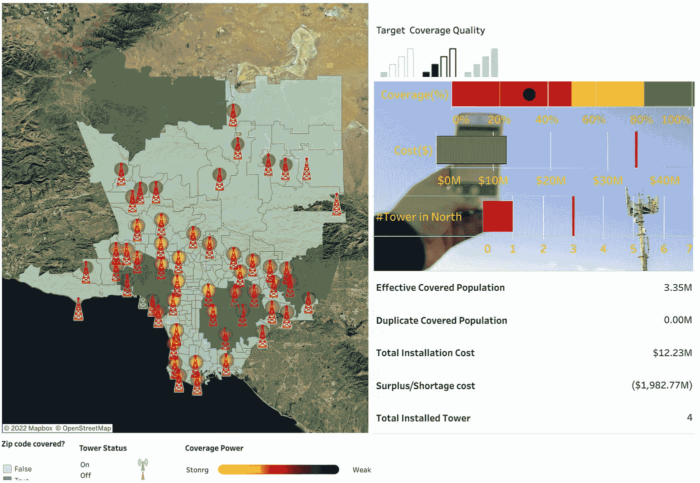

Source: Tableau Public

这是补色调色板的另一个经典用例:地理地图。

类似地，我们可以看到这两种色调是如何用于显示标尺的两侧的，并且颜色深浅与每一侧的数值相关联。

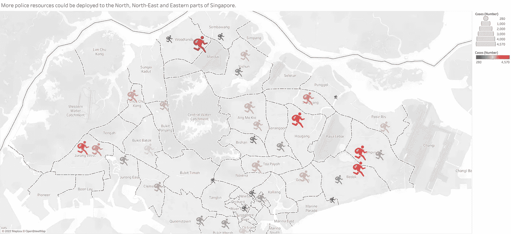

Source: Tableau Public — [Elias](https://public.tableau.com/app/profile/elias8766/viz/ApictureofcrimeinSingapore/Map-rank)

## 当心

人们将视觉效果的颜色作为默认颜色是很常见的。你可能已经看过这些颜色一百万次了。我不是说这些颜色有什么问题，但是只需要一行代码就可以让你的图形更漂亮、更独特。

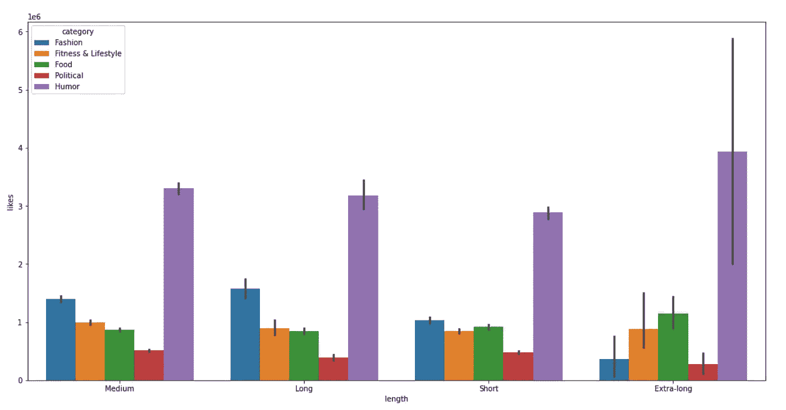

Image by Author

有大量的调色板供你探索，你也可以自定义自己的调色板。如果你想知道 Seaborn 有哪些内置调色板，请参考[这篇文章](/mlearning-ai/wordclouds-with-python-c287887acc8b)，我在这里列出了所有的调色板值。

总而言之，注意你的颜色选择——这是赋予你的作品个性并使你的视觉效果更加“生动”的最重要的因素之一。

# 文本

您的仪表板/演示文稿是**而不是**白皮书。最大的禁忌之一就是满屏文字。除了重要的关键点和注释，其余的只会让人分心。如果您已经删除了多余的文本，而剩下的部分仍然充满了文本，请考虑加入空白。下面是一个很好的例子。

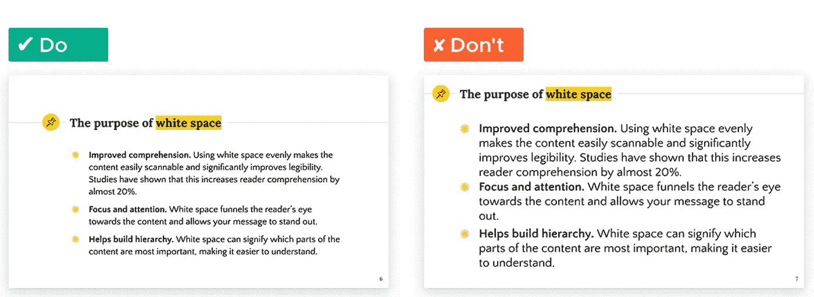

Source: [SlidesCarnival](https://www.slidescarnival.com/6-easy-tricks-for-designing-a-text-heavy-presentation/12520)

## 标签

当您自己创建图表时，没有人比您更熟悉数据集。在没有任何注释的情况下，你可能知道你的图表的每一个细节(你应该知道),但是观众不知道。即使您已经提供了口头/书面上下文，最佳实践仍然是为仪表板/演示文稿中的每个图表的每个轴准备一个合适的标题和标签。

这是我最近的[社交媒体参与度预测](https://github.com/Social-Media-Capstone/Social-Media-Engagement-Forecasting)项目中的一个例子——突出显示的部分是“必备品”。

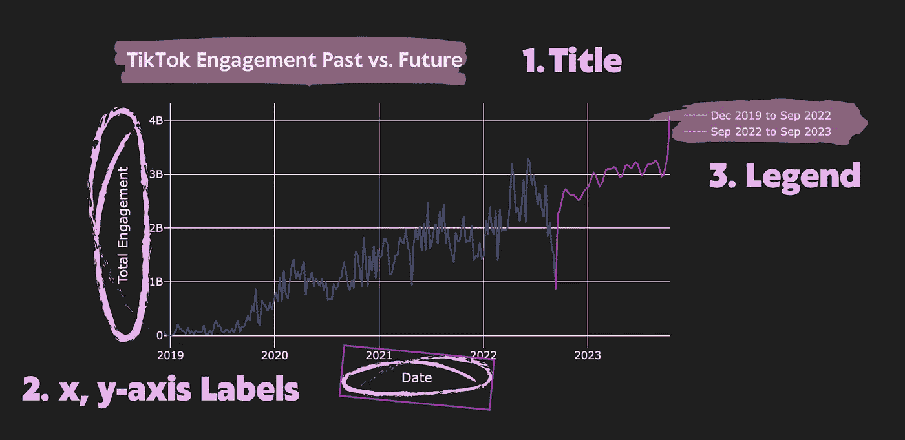

Image by Author

# 大小

这听起来是不言自明的，但是我不能告诉你，在演示过程中，有很多次我很难看清图表。许多人将图表和文本的大小作为默认值。当它仅仅是你自己的参考时，这可能不会打扰你，但是当你向别人展示视觉效果时，特别是在大屏幕上，确保尺寸**被适当调整**。

如果你在 Jupyter notebook 中使用 Seaborn 或 Matplotlib 创建视觉效果，你可以很容易地在几行代码中调整大小。

下面是使用上述代码对一个小图表和一个适当大小的图表进行的横向比较:

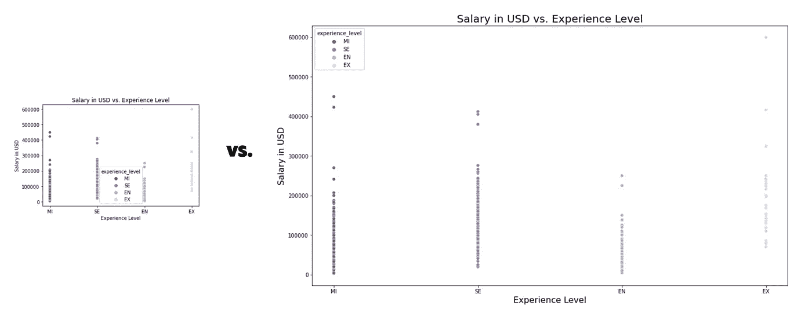

Image by Author

在这个小图表中，图例被挤在图表的中间——这是不允许的。您希望所有的东西，包括标题、图例、轴的标签，都清晰可见。

# 强调

你希望你的观众在 5 秒钟内明白的一两件最重要的事情/关键绩效指标是什么？在你的仪表板/演示文稿上大声自豪地展示出来。

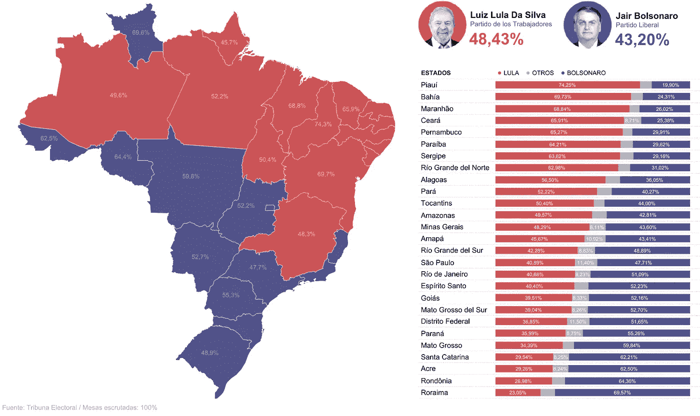

Source: Tableau Public — [LA NACIÓN](https://public.tableau.com/app/profile/lanacion.com)

在这张由 [LA NACION 数据](https://medium.com/u/2399dbfd6fc3?source=post_page-----1e99cccbb8c7--------------------------------)组成的仪表盘中，我们可以清楚地看到个人资料图片旁边的两个大数字。通过放大关键数字，你可以引导你的观众说“嘿，看这里！”

否则，有多个图表而没有一个或两个重点，观众很难认识到什么是重要的。

Source: Tableau Public

当我看到这个控制面板时，我马上想到了一些问题:

1.  我应该先看哪个图表？
2.  哪种颜色代表高分(红色对蓝色)？
3.  所有的红色方块代表相同的比例吗(左上图)？
4.  左下方的图表想告诉我什么？

除了多种色调和不恰当的色阶使用，4 个图表大小相等的事实暗示了这个仪表板中没有层次。然而，作者可以容易地添加几个大的数字来指示，例如，顶级游戏的用户计数(例如，“房子里的科里”)。

下面的例子是我见过的最长的条形图。由于图像大小的限制，我只能给你看 1/4 的原始图表。在这种情况下，当你的 y 轴或 x 轴上有大量的变量时，在图表上显示所有的东西从来都不是一个好主意。

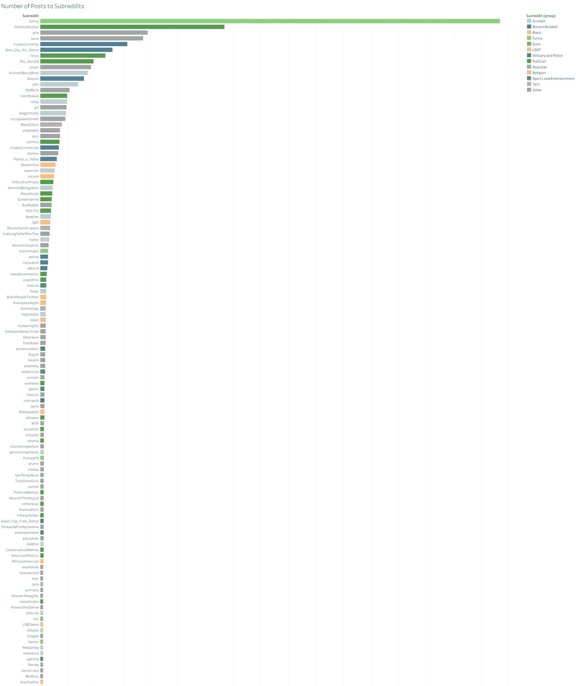

Source: Tableau Public

你可以通过关注前 10 名或后 10 名来限制噪音，去掉其余的。你的听众没有时间和精力去放大一个冗长的图表并消化所有的信息。通过有策略地强调一小部分数据，你也可以更好地利用配色方案。

# 奖金

**避免**使用饼图！！！你可能已经多次被告知，饼图很好地代表了整体的分布/比例。但在数据科学领域，对这张特殊的图表有很多负面的评论。下面是我在一次演讲中提到的一个例子。我知道人们不喜欢饼图，所以我故意选择了它，并认为这是在这种情况下的一个恰当的用法。

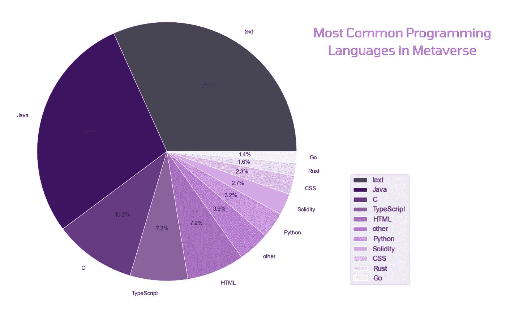

Most Common Languages in Metaverse — Image by Author

当然，毫不奇怪，有人问我为什么要用这张图表。

当包含的元素太多，或者两个比例的大小非常相似时，饼图可能会产生误导。在这种情况下，如果我不对“文本”使用更暗的阴影，您可能很难区分“Java”和“文本”之间的区别——哪个更明显？

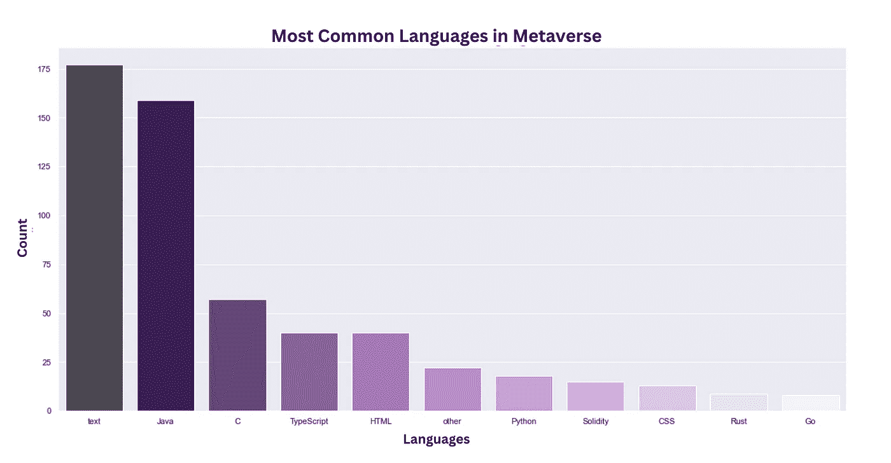

Most Common Languages in Metaverse — Image by Author

与上面的条形图相比，数量上的差异要明显得多，您可以立即识别出“最多”和“最少”。

很多人，包括过去的我自己，都倾向于用“花式图表”来炫耀自己的技术。但事实是，在许多情况下，简单的条形图或散点图能最有效地传达信息。通常情况下**少即是多**，强有力且有效的故事讲述始于简单明了的图表。

我希望你喜欢这篇文章，提示对你有帮助。请随时在 [LinkedIn](https://www.linkedin.com/in/m3redithw/) 上联系或联系我。聊不久:)

 [## Mlearning.ai 提交建议

### 如何成为 Mlearning.ai 上的作家

medium.com](/mlearning-ai/mlearning-ai-submission-suggestions-b51e2b130bfb)