# Python 可视化工具

> 原文：<https://medium.com/mlearning-ai/visualization-tools-with-python-2d6c6a0d7a02?source=collection_archive---------1----------------------->

Python 中常见的 Viz 命令

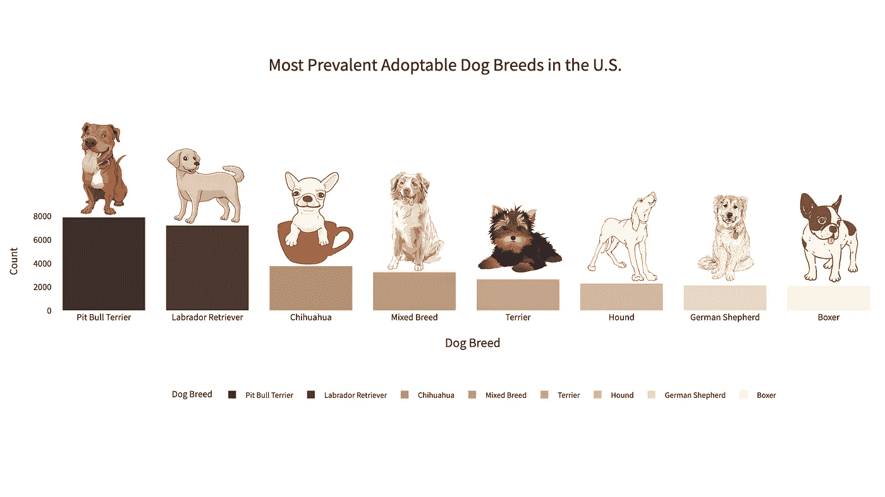

Image by Author

可视化在探索性数据分析(EDA)中发挥着重要作用。它不仅有助于我们理解特征之间的关系，也是交流我们发现的有效工具。

在这篇文章中，我想分享一些常用的可视化工具和命令，我的大部分分析都非常依赖它们。我将用 Kaggle 的“ [**美国可收养的狗**](https://www.kaggle.com/datasets/thedevastator/adoptable-dogs-in-the-us) ”数据集(allDogDescriptions.csv)带你看一些例子。

在我们开始演练之前，我想向大家简要介绍一下这个数据集。

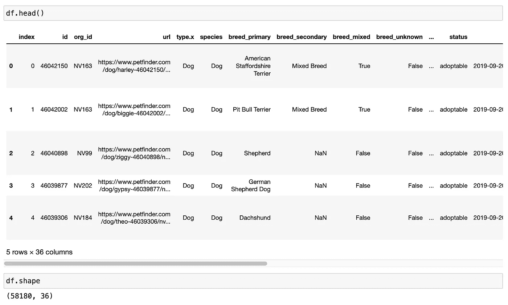

Adoptable Dogs in the US Data Overview — Screenshot by Author

这个数据集中有 36 列和 58180 行。我们有信息(如品种、颜色、年龄、位置等。)在美国每一只可领养的狗身上。这个数据集是为了帮助研究人员理解(来源于 [Kaggle](https://www.kaggle.com/datasets/thedevastator/adoptable-dogs-in-the-us) ):

1.  找出在给定的一年里美国有多少每种类型和品种的狗被带到收容所。
2.  看看哪个州进口的狗最多，都是什么品种/类型。
3.  确定被带进收容所的狗的类型/品种是否有任何趋势(例如，比特犬多于金毛寻回犬)

# **缺失编号**

数据集中缺少值是很常见的。作为数据科学家/分析师，我们需要就如何处理缺失值做出决定。在我们做出决定之前，了解这些缺失值在数据集中的分布是极其重要的。

Missingno(别名为“ **MSNO** ”)是一个可视化数据集中缺失值(nan)的伟大工具。

要安装该库，只需在命令行中键入以下代码:

```
pip install missingno
```

这个库为我们提供了 3 种显示缺失值的不同方式:

## 1.[数]矩阵

在这个例子中，我指定只显示缺少值的列，忽略没有任何 nan 的列。

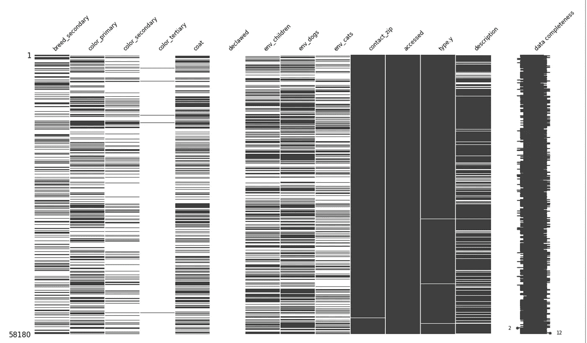

MSNO Matrix — Image by Author

它非常简单易懂——灰线代表现有值，白线代表缺失值。因此，一列中缺少的值越多，该矩阵中的列就显得越“空”。

## 2.条形图

同样，我们也可以使用条形图来寻找“缺失”的模式。

这里我只是将整个数据帧作为输入，而不是像上面的例子那样选择缺少值的列。您可以决定想要包含哪些列。


MSNO Bar — Image by Author

现在，我们可以看到所有列，无论是否包含缺失值，都显示在该图表上。条形的高度表示一列中有多少现有数据。所以条形越短，缺少的值就越多。

## 3.热图

热图是这个库给我们的另一个选择。

正如我们在这里看到的，该功能非常简单和直观。以下是输出:

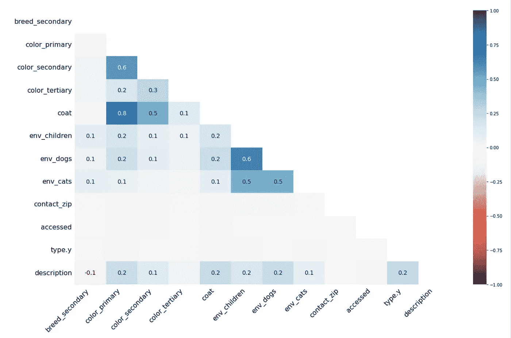

MSNO Heatmap — Image by Author

*   当该值接近 **-1** 时，表示一个变量出现，那么另一个变量很可能是**缺失**。
*   当值接近 **0** 时，表示两个变量的缺失值的出现之间不存在**依赖关系**。
*   当该值接近 **1** 时，意味着一个变量出现，那么另一个变量很可能出现**。**

**(以上解释来源:[极客对极客](https://medium.com/u/158bf765767a?source=post_page-----2d6c6a0d7a02--------------------------------))**

# **海生的**

**Seaborn 是另一个基于 matplotlib 的常用 Python 可视化库。事实上，在我的大部分分析中，我使用 Seaborn 比其他任何东西都多。虽然我很喜欢 plotly 的交互性，但 Seaborn 的渲染速度更快，并且有足够的定制自由度。**

**这里我只列出一些常用的图表，你可以在他们的[文档](https://seaborn.pydata.org/)页面上找到更多。**

## **[seaborn.barplot](https://seaborn.pydata.org/generated/seaborn.barplot.html)**

**简单的条形图一直是我最喜欢创建的图表之一。在数据讲故事中，几乎从来不是关于你的图表有多“花哨”，而是你如何用你的力量以最容易理解的方式传达给你的观众。和条形图，演示本身，服务于这个目的比其他许多更好。**

**结果:**

**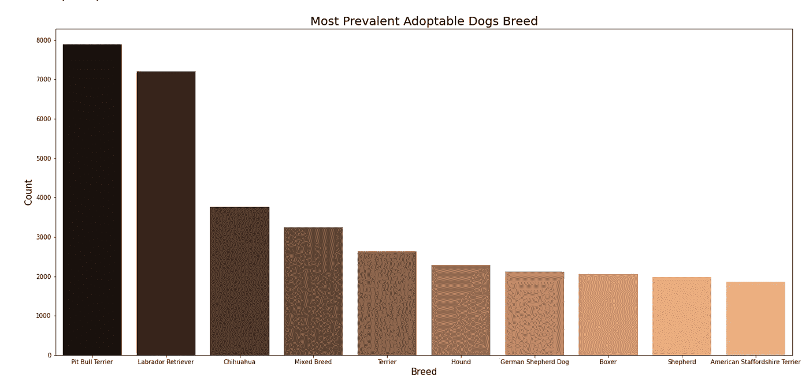**

**在这个例子中，我使用了 matplotlib 函数来设置绘图的标题和轴标签。我们可以清楚地看到比较和什么是最普遍的狗品种，可以被收养。**

## **[seaborn.countplot](https://seaborn.pydata.org/generated/seaborn.countplot.html)**

**计数图在视觉上类似于条形图，是可视化分类变量之间数量差异的好方法。对于这个数据集，这是一个完美的方式来显示在美国有多少可收养的狗是经过家庭训练的，而那些不是。**

**结果:**

**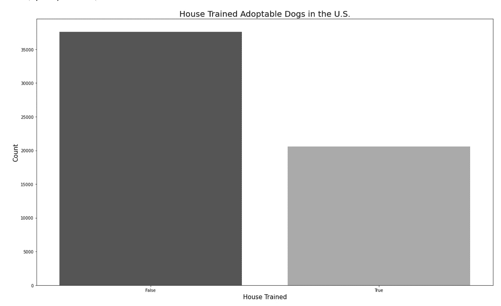**

**Seaborn Countplot — Image by Author**

**对于调色板，我为这张图选择了“binary_r”。Seaborn 调色板的多样性是我喜欢这个库的另一个原因，如果你对所有的内置值感兴趣，请随意参考这篇文章。**

# **matplotlib**

## **熊猫。DataFrame.plot**

**当您需要生成一个线图时，这个 pandas 函数就派上了用场。默认情况下，该函数使用 matplotlib。**

**例如，如果我想知道自 2018 年以来可收养的狗的数量，我可以很容易地用一行代码生成图表。**

**输出:**

**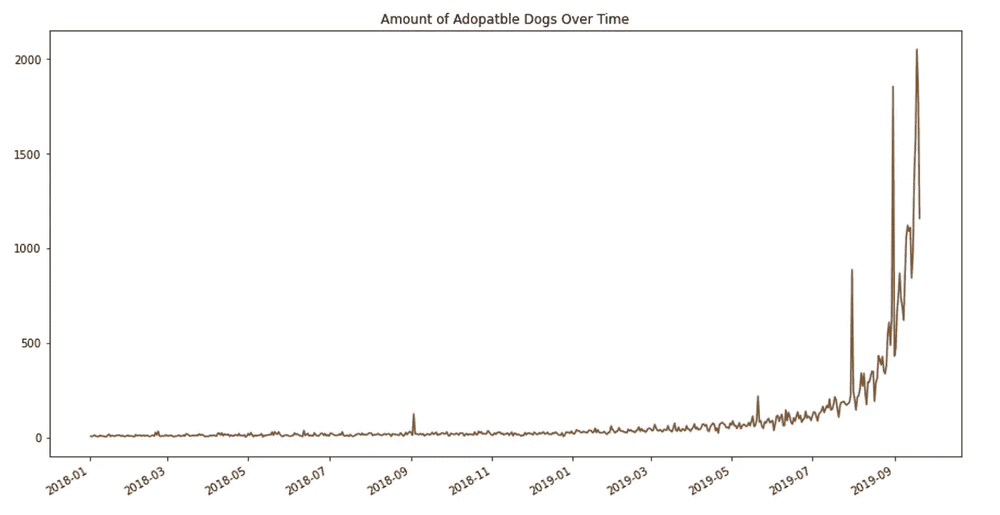**

**我通常使用这些熊猫函数生成的图表来服务于我自己的理解——制作起来简单容易，但大多数都没有在最终报告中出现。**

# **Plotly**

**[**Plotly**](https://plotly.com/python/) 以其交互性、动画性以及支持的多样图表类型而闻名。这是目前为止我最喜欢的可视化工具。唯一的缺点是渲染时间比其他静态图表长。如果你通过 Jupyter 笔记本展示视觉效果，图表不会显示出来，除非观众自己运行笔记本。**

## **[条形图](https://plotly.com/python/bar-charts/)**

**例如，我们先来看看我用 Plotly 创建的这个条形图:**

**输出:**

**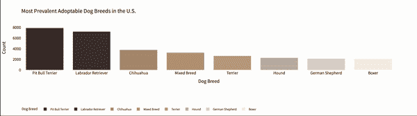**

**Image by Author**

**请注意，从视觉上看，它与上面的 Seaborn 条形图几乎相同。但它允许我们点击图例、条形图等。有选择地查看我们想要的特定数据。**

## **[Python 中的图像](https://plotly.com/python/images/)**

**除了使图表更具交互性和动态性，Plotly 还具有图像功能，您可以将自己的图像添加到图表中——真正允许我们定制每个视觉元素。**

**例如，如果我想在栏中添加一个图像:**

**确保导入 PIL (Python 图像库)以读取图像并正确输入文件路径。**

**输出:**

**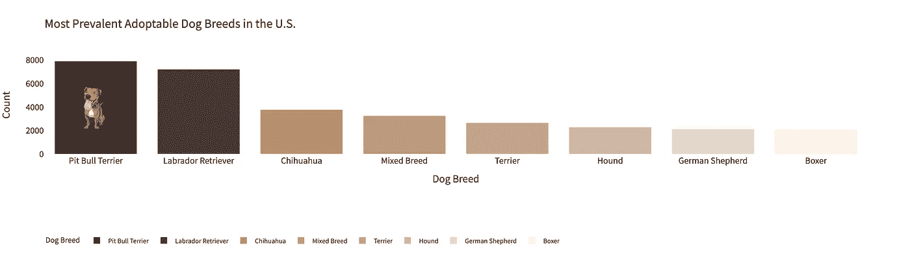**

**Image by Author**

**您可以指定图像的位置、大小、不透明度、图层等。在参数中，图像将根据您的偏好显示。**

# **[粗略地说](https://github.com/jwilber/roughViz)**

**这个由 Jared Wilber 开发的可视化软件包也是我的最爱之一。我无法告诉你我有多喜欢这种速写板美学！它不同于优先考虑准确性的传统视觉效果，并以其独特的方式表示数据的普遍性。**

****

**Source: [roughViz](https://github.com/jwilber/roughViz)**

**要安装软件包，请执行以下操作:**

```
pip install py-roughviz
```

## **环形图**

**该软件包提供了各种图表，但在这里，我将使用“甜甜圈图”作为一个例子，以可视化的数量混合品种与非混合品种的狗。**

**为了创建图表，该函数接收特定格式的数据。所以我首先做了一个值计数来获得量化值，然后手动将它们输入到函数中。**

**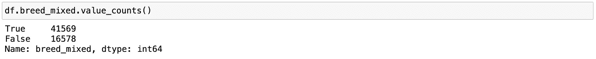**

**Screenshot by Author**

**输出:**

**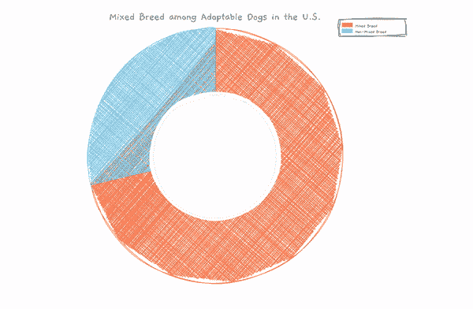**

**正如你在这里看到的，简单而有创意的美学，也有互动性。我强烈推荐你克隆[包的回购](https://github.com/jwilber/roughViz)，自己玩图表。请务必阅读文档并浏览示例。**

**我希望这些工具和命令对您有所帮助！如果你知道任何其他有用/流行的可视化工具，请留下评论，我很乐意去看看。如果您有任何问题，请随时联系:)**

**[](/mlearning-ai/mlearning-ai-submission-suggestions-b51e2b130bfb) [## Mlearning.ai 提交建议

### 如何成为 Mlearning.ai 上的作家

medium.com](/mlearning-ai/mlearning-ai-submission-suggestions-b51e2b130bfb)**