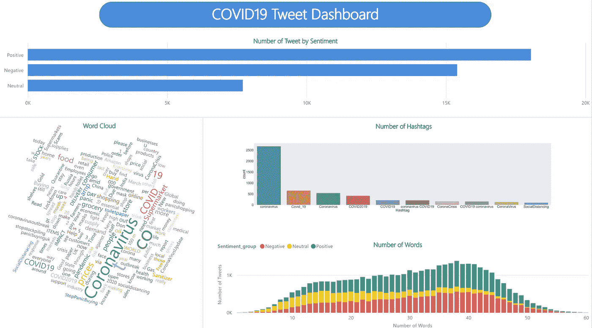
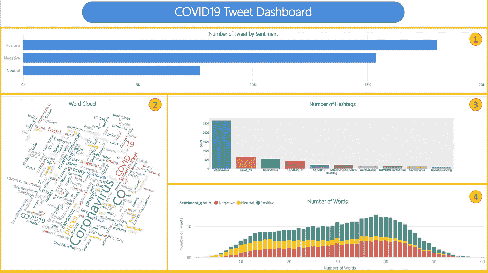
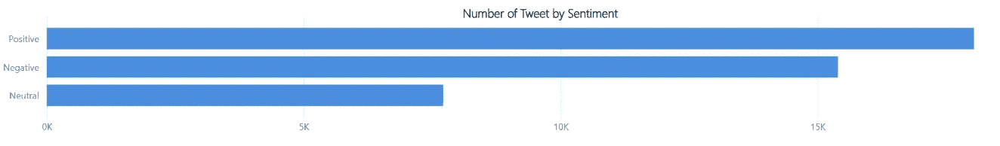
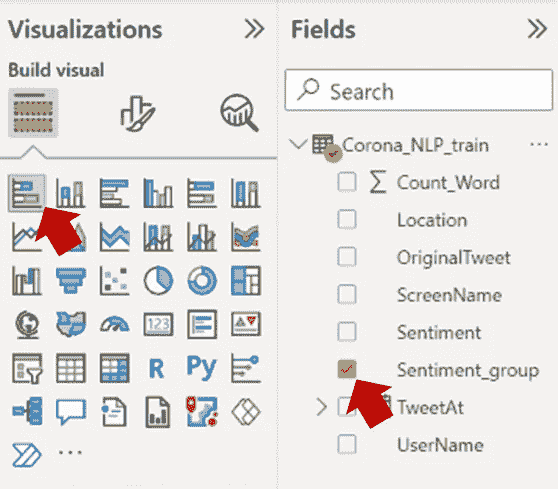
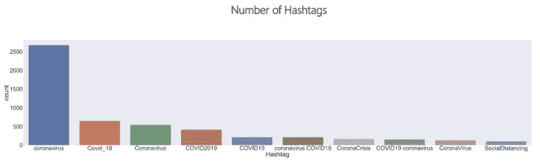
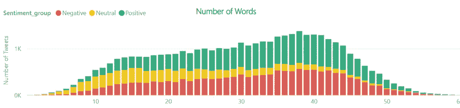
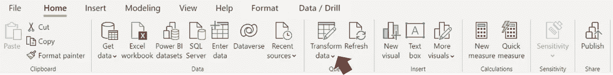
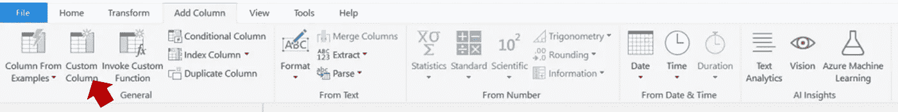
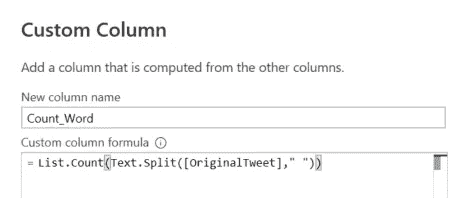
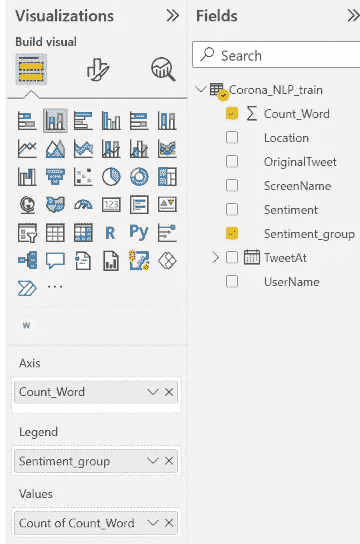

# 使用 Power BI 可视化 Twitter 数据

> 原文：<https://medium.com/mlearning-ai/visualize-twitter-data-with-power-bi-eb700b282a38?source=collection_archive---------1----------------------->

ower BI 是可视化数据的强大工具。已经提供了许多可视化工具，因此您可以只拖放数据字段来创建漂亮的绘图。然而，当涉及到客户反馈或 Twitter 帖子等文本数据时，可能不容易可视化并从中找到洞察力。

在本文中，我将展示一个在 Covid19 疫情期间来自 Twitter 的文本数据仪表板示例。

# 💽资料组

本文中使用的数据来自

 [## 你的数据科学之家

### Kaggle 是世界上最大的数据科学社区，拥有强大的工具和资源来帮助您实现您的数据…

www.kaggle.com](https://www.kaggle.com/datasets/datatattle/covid-19-nlp-text-classification/download) 

这些数据是在 Covid19 疫情期间从 Twitter 上收集的，并将情绪分为非常积极、积极、中性、消极和非常消极。

该数据集包含 41157 行和 5 列。


data sample

# 📊形象化

这是我的仪表板的快照。



它可以分为如下所示的 **4 个部分**。



让我们看看如何创建每个部分！

# **1。按情绪分类的推文数量**



该图用于显示数据概览，如有多少条推文是正面或负面的。

它也可以作为一个过滤器，用户可以点击情绪和其他情节会发生相应的变化。因此，用户可以逐个分析每个情感的特征。

这是一个简单的情节。

在 Visualization plain 中，单击堆叠条形图图标，并选择 plain 字段中的“情绪”列(我将情绪分为 3 组，但也可以不这样做)。



完成。

**注意:**最佳实践是创建一个新的测量方法来计算情绪并可视化该测量方法。

# 2.词云


一个优雅的可视化来显示单词出现的次数。文本越大意味着该词在数据集中出现的频率越高。

你可以在下面的链接中找到关于如何创建单词云的文章。

[](/mlearning-ai/word-cloud-visualization-in-power-bi-a993dc4afb77) [## Power BI 中的词云可视化

### 了解如何创建单词云，这是一种可视化文本数据的优雅方式。

medium.com](/mlearning-ai/word-cloud-visualization-in-power-bi-a993dc4afb77) 

# **3。标签数量**



这个图的目标是查看 Twitter 文本中包含的标签使用数量。(大部分是关于 covid 和同义词 lol)

此图由 Python visual 创建。为了使本文简短，我将包含一个到另一篇文章的链接，该文章描述了 Python 设置的细节和 Power BI 中的 Python 可视化。

如果您已经在 Power BI 中设置了 Python，您可以转到“使用 Python 可视化”部分。

[](/mlearning-ai/python-in-power-bi-66a80590ecc0) [## Python 在 Power BI 中的应用

### 通过集成 Python 增强 Power BI 仪表板的功能。一步一步地使用 Python 来获取、转换和…

medium.com](/mlearning-ai/python-in-power-bi-66a80590ecc0) 

在 Python 脚本编辑器区域，复制并粘贴以下代码。

```
# The following code to create a dataframe and remove duplicated rows is always executed and acts as a preamble for your script:# dataset = pandas.DataFrame(OriginalTweet)# dataset = dataset.drop_duplicates()# Import required libraries and setting plotimport seaborn as snsimport matplotlib.pyplot as pltimport resns.set(font_scale = 7) # Create funtion to find hashtagsdef find_hash(text): line=re.findall(r'(?<=#)\w+',text) return " ".join(line)# Apply functiondataset['hash']=dataset['OriginalTweet'].apply(lambda x:find_hash(x))temp=dataset['hash'].value_counts()[:][1:11]temp= temp.to_frame().reset_index().rename(columns={'index':'Hashtag','hash':'count'}) # Plot Graphplt.figure(figsize=(120, 25))sns.barplot(x="Hashtag",y="count", data = temp)plt.show()
```

**代码解释**

*   创建一个函数**‘find _ hash’**，它将返回一个与正则表达式模式匹配的 hashtags 列表。
*   创建一个新的 DataFrame 列， **'hash'** ，这是将 **'find_hash'** 函数应用于 **'OriginalTweet'** 列的结果。
*   计算临时标签的出现次数。
*   使用 seaborn 条形图进行可视化。

# **4。字数**



推文字数可能与推文发帖人的感觉相关，比如他感觉不好，所以他键入一个长句来解释他的感觉(反正只是假设)。

在创建这个图之前，我添加了一个名为 Count_Word 的新列。

*   转到转换数据。



*   在“添加列”选项卡下，单击自定义列。



*   您将看到一个自定义列窗口。键入列名和公式，然后单击确定。



```
List.Count(Text.Split([OriginalTweet]," "))
```

*   在主页选项卡中，单击关闭并应用。
*   在可视化平面中，选择堆积柱形图并设置轴、图例和值，如下图所示。



*   您也可以尝试堆积柱形图、簇状柱形图或盒状图


# **功率 BI 的限制**

虽然您可以在 Power BI 仪表板中查看文本数据概述并与之交互，但在数据分析方面有一些限制，例如 N 元语法可视化，我在 Power BI 中找不到一种简单的方法，但它可以仅使用 Python 来完成。

# 结论

Twitter 数据的仪表板可以包括概述情绪、词云、标签和字数。Power BI 的优点是仪表板是交互式的，缺点是不如用 Python 创建图表灵活。

如果你想看任何仪表板的例子，请在下面留下评论。

更多电力 BI 文章请关注我！！！

[](/mlearning-ai/mlearning-ai-submission-suggestions-b51e2b130bfb) [## Mlearning.ai 提交建议

### 如何成为 Mlearning.ai 上的作家

medium.com](/mlearning-ai/mlearning-ai-submission-suggestions-b51e2b130bfb)