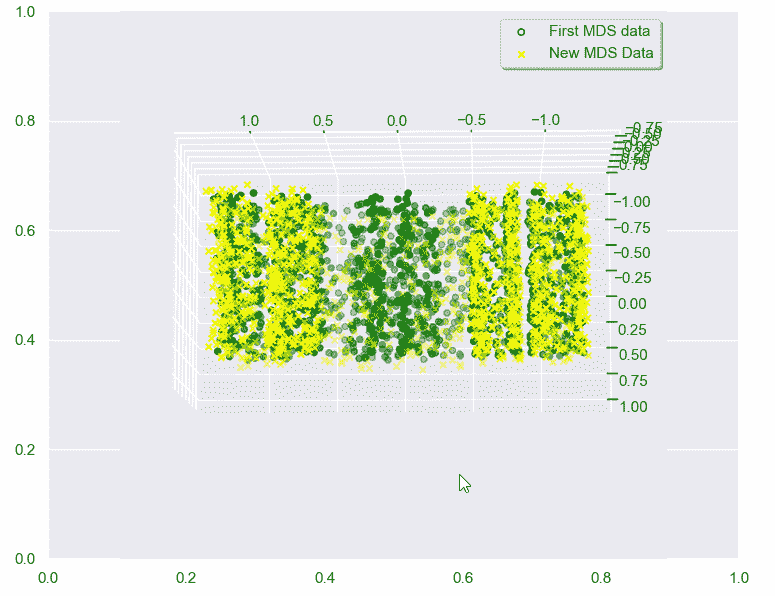
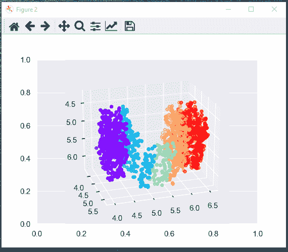
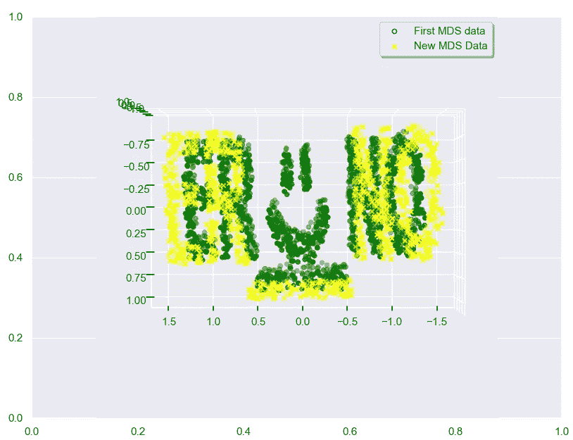
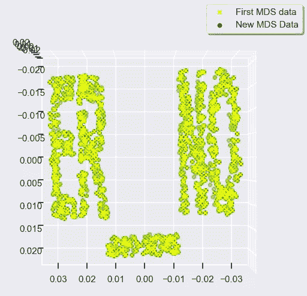

# 用 Python 中的 MDS 算法实现点距离信息的三维数据可视化

> 原文：<https://medium.com/mlearning-ai/visualizing-3d-data-from-point-distance-information-with-mds-algorithm-in-python-e413c8d28631?source=collection_archive---------3----------------------->



Animation by Erno Soinila

这篇文章是关于将距离信息转换成可理解的 3D 点云。首先，我们将讨论距离矩阵，它是一种以线性代数算法的便利形式表示点之间距离信息的方法。然后，我们将创建易于可视化定向的样本数据，无论它在 3D 空间中如何旋转。作为最后一部分，我们将讨论如何可视化新数据的添加。

你也准备好超越算法复杂性和乐趣的无聊的双 for 循环了吗？

## 什么是距离矩阵？

距离矩阵是具有零对角线条目的对称矩阵，它表示点之间的距离。

例如，点 *(10，0，0)* 、 *(0，10，0)* 、 *(0，0，10)* 和 *(10，5，10)* 可以表示为矩阵中的行。第一个数字是 **x** 坐标，第二个是 **y** 坐标，最后一个是 **z** 坐标。下面我们先用**Python**NumPy 库创建矩阵 **X** 。这些行是 3D 空间中的点。然后我们使用 **SciPy** 库 **pdist** 方法创建距离矩阵 **D** 。

读取距离矩阵的方法如下。假设我们将矩阵 **X** 行中的点称为 **a** 、 **b** 、 **c** 和 **d** 。为了从距离矩阵中读取两点之间的距离，我们首先从行中选择一点，从列中选择另一点。因此，如果我们选择从 **d** 到 **b** 的距离，我们得到 *15* 。由于距离矩阵是对称的，我们从列和行中选择哪一个点 **b** 或 **d** 并不重要。还要注意，对角线代表点与自身的距离，所有点的距离都为零。

## 如何从距离矩阵中获取未知坐标？

上面我们用已知的坐标做了一个距离矩阵。那是直截了当的。但是如果反过来呢——我们如何从距离矩阵中获得有用的坐标呢？

相反的过程更加棘手，因为仅仅知道距离并不能说明距离在哪里；如果将所有距离向右移动 100 个单位，两点之间的距离仍然相同。我们也不知道距离在空间中是如何旋转的；如果点的正面朝上或颠倒，它们之间的距离是相同的。

假设我们知道一些点的位置，那么只要我们计算如何转换这些点来匹配，我们就可以使用这些点来正确地定位其他点。

## 让我们从创建可视化的高质量数据开始

要知道我们的地图是否正面朝上，我们需要看起来不像正面朝上那样颠倒的数据。为了查看我们是否从正确的方向查看我们的数据，我们需要我们看到的数据是否是镜像。使用颜色范围可以更容易的旋转我们的点云。

为了确保能够在 Python 中使用鼠标交互式旋转 3D 图，您需要将这些神奇函数之一作为第一行代码。在我的例子中，我在 VSCode-notebook 中使用“%matplotlib qt5 ”,因为它会打开一个单独的窗口，我可以在其中旋转和缩放 3D 图。我为下面的第一行魔术函数添加了一些可能的选项。从你使用的行中删除所有注释，并把它作为第一行。



Animation by Erno Soinila

```
%matplotlib qt5  # <== interactive for VSCode Jupyter notebook
#%matplotlib inline # <== this just makes static images 
#%matplotlib notebook # <== interactive for browser Jupyter notebook
#%matplotlib ipympl  # <== interactive for browser Jupyter notebook
#%matplotlib widget # <== interactive for browser Jupyter notebook
```

拥有易于识别和正确定位的好数据可以解决许多繁琐的问题。拥有易于定位和检查的数据肯定有助于调试代码/数学。我们将在文章的结尾对此进行更多的讨论。

## 从距离矩阵获取初始坐标的 MDS 算法

使用 **M** 多 **D** 维度 **S** 缩放( **MDS** )算法，我们可以将距离矩阵转换成坐标。关于旋转和位置的信息是未知的，所以我们需要定位来自 MDS 的数据来理解它；我们希望将透明贴图的正面朝上，从正确的方向观察它。

## 说够了，让我们用 Python 试试 3D

下面是本文中使用的所有代码。画在笑脸上的图片可以从下面下载。

# 嵌入式代码的亮点

我们首先从文本制作 png 图像，然后从这些图像制作 3D 数据云。

然后，我们根据 3D 数据创建一个距离矩阵。

我们从距离矩阵中重建 3D 数据。请注意，这些数据总是处于荒谬的方向，甚至在每次运行代码时都有所不同。

我们添加一些额外的笑脸数据，方法是在之前创建的图像上绘图，并从中制作 3D 数据，然后我们将这些数据与之前的纯文本数据重叠，以进行比较。


Image by Erno Soinila

我们可以使用主成分分析(PCA)在先前数据的基础上大致正确地定位数据，而不是像上面 gif 中所示的那样总是使用 Python 中的鼠标手动定位数据。我们可以使用这个技巧来避免繁琐的手动旋转点云进行比较。

将我们的笑脸数据覆盖到之前的纯文本数据上的步骤并没有给我们带来太多新的信息，因为即使没有之前的数据，我们的测试数据也很容易正确读取。对于不太有益的 3D 数据，与一些已知信标的比对是一个活跃的研究主题，但论文很少公布任何实际可用和运行的样本代码。



最后，我们测试了 Procrustes 分析，以使第一幅图像与其 MDS 生成的数据之间的匹配更加精确。Procrustes 分析用于确定数据集之间的相似程度。在这里，我们研究原始数据的相似性及其与由 MDS 的距离矩阵产生的数据的匹配。



这在视觉上工作得很好，即使匹配没有超过库默认值。Procrustes 的这种匹配对于不同大小的数据集通常不太适用。还有其他算法来处理这些问题，例如在室内定位领域。大多数科学文章都没有附带工作代码，不在本文讨论范围之内。我们在这里的任务更多的是识别大的模式，而不是担心单个数据点的匹配。为了节省点数，我们也可以使用字母“P”或“F”作为数据中的视觉信标，因为它们只有一个正确的方向来读取。

# 讨论

对于处理 3D 数据来说，专注于创建清晰直观的测试数据，以便在任何方向上快速查看，这确实是值得的。MDS 主要用于数据的降维和人类可视化，它的库并不是为了让 MDS 易于室内定位等而设计的。对于 3D 应用，从 MDS 获得可用的稳健结果的最简单方法是在数据中具有有用的信标形状，该信标形状可用于定向其他点，而无需将测量数据与先前的测量数据进行匹配。尽管 PCA 有助于我们合理地定位数据，但我们不要忘记 Python 中的 3D 旋转功能。

# 参考

维基百科对于了解新主题的全貌非常有用(链接 1-2)。有一篇关于这个主题的有趣的文章(链接 3)，不幸的是源代码的链接在那篇文章中不再有效。SciPy 提供了非常棒的文档，其中包含令人惊叹的代码样本，有助于深入研究(链接 4 和 8)。除此之外，谷歌是你的朋友:

1.  [https://en.wikipedia.org/wiki/Multidimensional_scaling](https://en.wikipedia.org/wiki/Multidimensional_scaling)
2.  [https://en . Wikipedia . org/wiki/Generalized _ Procrustes _ analysis](https://en.wikipedia.org/wiki/Generalized_Procrustes_analysis)
3.  [http://dok manic . ECE . Illinois . edu/assets/pdf/dok manic 2015 eg . pdf](http://dokmanic.ece.illinois.edu/assets/pdf/Dokmanic2015eg.pdf)
4.  [https://sci kit-learn . org/stable/auto _ examples/decomposition/plot _ PCA _ 3d . html # sphx-glr-auto-examples-decomposition-plot-PCA-3d-py](https://scikit-learn.org/stable/auto_examples/decomposition/plot_pca_3d.html#sphx-glr-auto-examples-decomposition-plot-pca-3d-py)
5.  https://procrustes.qcdevs.org/
6.  [https://jakevdp . github . io/python datascience handbook/05.10-manifold-learning . html](https://jakevdp.github.io/PythonDataScienceHandbook/05.10-manifold-learning.html)
7.  [https://jakevdp . github . io/python datascience handbook/05.09-principal-component-analysis . html](https://jakevdp.github.io/PythonDataScienceHandbook/05.09-principal-component-analysis.html)
8.  [https://sci kit-learn . org/stable/auto _ examples/manifold/plot _ MDS . html # sphx-glr-auto-examples-manifold-plot-MDS-py](https://scikit-learn.org/stable/auto_examples/manifold/plot_mds.html#sphx-glr-auto-examples-manifold-plot-mds-py)

[](/mlearning-ai/mlearning-ai-submission-suggestions-b51e2b130bfb) [## Mlearning.ai 提交建议

### 如何成为 Mlearning.ai 上的作家

medium.com](/mlearning-ai/mlearning-ai-submission-suggestions-b51e2b130bfb)