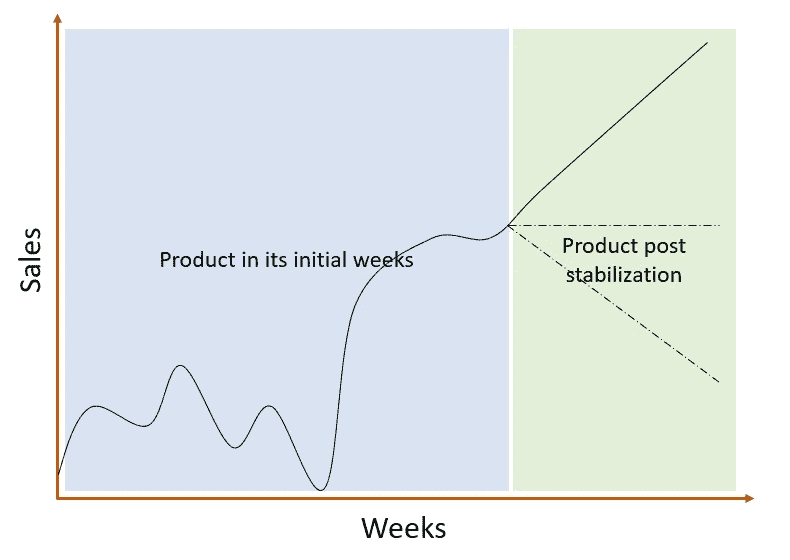
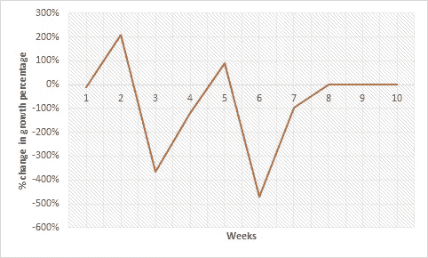

# 可视化产品发布并分析其稳定性

> 原文：<https://medium.com/mlearning-ai/visualizing-a-product-launch-and-analyzing-its-stability-693b254cf86f?source=collection_archive---------10----------------------->

# 介绍

对于任何新产品的发布，最初的几个月都有点不可预测。在**对活动和促销**的大量投资的推动下，该产品可以真正**提升月环比销售增长的价值**。这个数字看起来很大的另一个原因是**上个月的销售额(在计算销售增长时形成分母)在最初几个月很小**。

产品在市场中稳定下来**需要一段时间，最终达到一种状态，我们可以称之为稳态。在这种**稳定状态下，产品的销售**(每月、每周或每天)不再有大的突然变化。该产品可能会继续表现出强劲的增长，但这将有点一致。从数据科学的角度来看，产品**值得进行销售预测**。在本文中，我们将研究一种可视化的方法，并**识别那些已经过了初始阶段并达到稳定的产品**。**

# 概念概述

图 1 显示了新推出产品的销售曲线。贴上稳定产品，(不像图中所示那样突然，只是为了说明目的)曲线**变得稳定**。根据市场和产品本身的不同，它可能有任何下滑的迹象(或者零增长)。

Fig 1 — typical sales curve post a product’s launch

现在，这将意味着**销售增长曲线在稳定点**后看起来是水平的。由于增长/下降大致为常数/零，它将大致平行于 x 轴。这将进一步意味着**销售增长的变化(数学上，销售曲线的二次导数)将大致为零**。这一特性构成了我们确定产品是否稳定的统计方法的基础。

# 概念演示

让我们从某个产品发布后的几周内，获取一些该产品的周销售额的样本数据。从这些数字中，**增长率(一阶导数)，以及增长率的变化(二阶导数)，可以很容易地计算出来**。图 2 显示了一个新推出的产品在 12 周内的示例销售数字以及计算的导数。销售曲线也绘制在图 3 中。

Fig 2 — sample weekly sales for a hypothetical product

Fig 3 — sales curve of the hypothetical product

现在，如图 4 所示，双导数数字的**图在点**(可能是稳定点)之后开始围绕 x 轴盘旋。我想重申，这些数字只是为了说明的目的。实际上，**数据集会更大，曲线会在更长的时间内保持稳定**。

Fig 4 — plot of double derivate of sales vs weeks

我们如何决定产品是否已经达到稳定状态？一种方法是通过观察图表。现在想象一下，这个练习必须在数百个产品上进行，或者必须在在线数据科学平台上实时进行。在这种情况下，**我们不能真的看这些图**。我们需要一个**统计方法来验证双导数的最后几个值接近于零**。

让我们重新表述一下手头的问题。**我们有一个数字样本，我们想确定样本的平均值是否可能为零，并且可信度很高**。任何分析师首先想到的应该是一个**统计测试，比如 t 检验**。鉴于我们的样本量很小，我们不能在这里做测试的演示，但我们肯定可以制定它。

**零假设:均值= 0**
如果我们对零假设的拒绝进行常规 t 检验，p 值大于 0.8 意味着均值不为零的概率小于 20%。因此，我们有充分的理由支持我们的**默认假设(零假设)，即产品是稳定的**。这个默认的假设并不是不合理的，因为一个企业通常不会在短时间内用太多的新产品轰炸市场。

需要注意的重要一点是，我们希望**双导数的平均值为零，而不是每个双导数值为零**。因此，看起来像图 5 的销售曲线也代表稳定的产品(销售在本质上可以是季节性的)。

Fig 5 — sales curve of a seasonal (but stable) product

# 结论

在本文中，我们回顾了一个简单的方法来识别已经过了最初不确定期的产品。如果产品数量少，可以通过查看销售曲线来直观地实施所解释的概念**。如果这不可行，**我们也可以使用统计方法**。不管怎样，我们都会得到答案。**

统计方法，也可以用于各种其他的分析问题，它只不过是一个简单概念的巧妙应用，比如 t 检验。一个例子是，比较销售预测模型的历史趋势和预测趋势，以确保结果不会完全偏离。如果你想进一步讨论，请随时联系我。