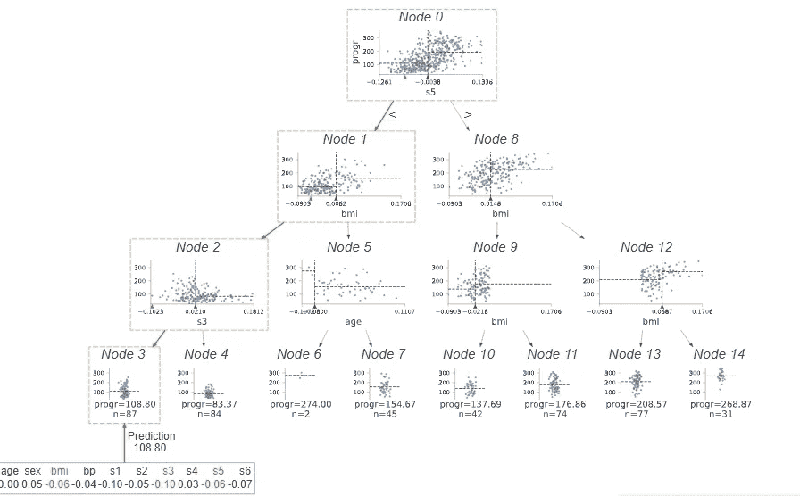

# 可视化决策树&它如何工作？

> 原文：<https://medium.com/mlearning-ai/visualizing-decision-tree-how-it-works-cd487f4577a4?source=collection_archive---------5----------------------->

使用 DTreeViz 创建多个可视化来理解决策树

Dtreeviz(Source: By Author)

决策树是一种机器学习模型，可用于分类和回归。它是一个树形结构，包含一个决策节点和一个叶节点。基本上，它是一种图形表示，用于分析给定问题的所有可能结果/解决方案。决策树起作用…