# 在 Python 的 Seaborn 库中可视化折线图

> 原文：<https://medium.com/mlearning-ai/visualizing-line-charts-in-seaborn-library-of-python-7f2e98cbcce6?source=collection_archive---------4----------------------->

[Photo by Lukas](https://www.pexels.com/photo/graph-and-line-chart-printed-paper-590045/)

让我们讨论在 Seaborn 中创建折线图的不同可视化技术。

Seaborn 是 python 中最流行的可视化工具之一。它流行的主要原因是在一行代码中创建复杂图表的简单性。

当我们谈到 python 中的折线图时，有许多方法可以创建一个简单的折线图。在 seaborn 中，我们有一个名为 line plot 的快捷函数。

第一步是在我们当前的环境中安装 seaborn。
如果您正在使用 Anaconda，您可以使用下面的命令(在 anaconda.org 中提到过):

*康达安装-c 巨蟒之灾*

否则，下一个选择是使用 pypi.org 提到的命令，即，

*pip 安装 seaborn*

安装完成后，下一步是使用下面的命令导入 seaborn 库:

将 seaborn 作为 sns 导入

这里，“sns”是简写，也称为 seaborn 的别名，也就是说，每当我们在代码中看到“sns”，我们就可以推断我们正在使用 seaborn 库。

要查看一些图，让我们在我们的环境中加载一些数据。

我们将使用 Seaborn 库的内置数据集。最初，我们不知道哪些数据集已经可用。

要获得数据集名称的列表，我们可以使用。seaborn 的 get_dataset_names()方法。

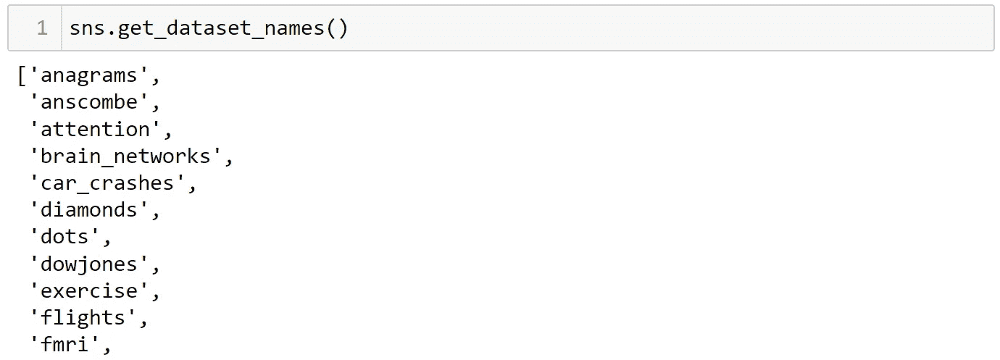

Image by Author

上面的命令为我们提供了一个包含 22 个数据集的列表，我们可以使用这些数据集进行分析。

让我们选择道琼斯数据集并创建一个线图。

我们使用“load_dataset()”方法，将信息读入一个名为 df 的数据帧。

Image by Author

现在让我们使用 head 方法检查前五行数据。

Image by Author

我们注意到我们有日期和价格列。让我们画一个不同日期对应的价格线图。

我们运行以下命令:

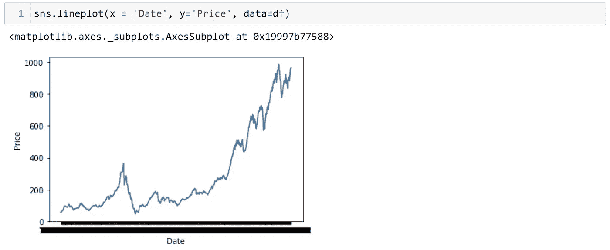

Image by Author

这里我们指定 x 轴包含日期，y 轴包含价格。
数据参数将通知 seaborn 数据位置。

在这里，我们看到生成的图在 x 轴上是误导性的，即日期全部重叠为一，因为我们只能看到一条粗黑线。

让我们检查列的数据类型，如果需要的话做一些预处理。

我们将使用 info()方法来检查数据类型。或者，我们可以使用“dtypes”属性来检查数据类型。

df.info()或 df.dtypes

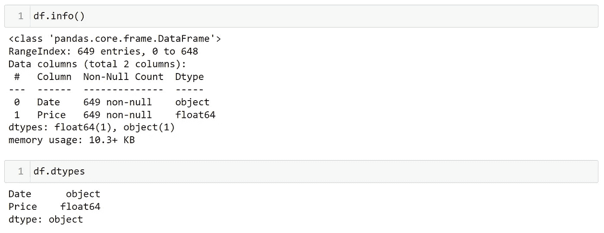

Image by Author

我们看到日期是一个字符串对象。让我们导入 pandas 库并使用 to_datetime()方法来纠正数据类型。

进口熊猫作为 pd

正如前面讨论的 wrt 别名，这里的“pd”是熊猫的别名，而“sns”是 seaborn 的别名。

使用 to_datetime()，我们可以将字符串转换为适当的日期时间对象。

我们运行以下命令:

df[' Date ']= PD . to _ datetime(df[' Date '])

这里，我们将日期列转换为日期时间对象，然后将其重新分配给日期列。

完成转换后，让我们将日期格式化为“%Y-%m-%d”。

我将使用 matplotlib 库来调整图表大小。因此，让我们将 matplotlib 添加到库导入部分。

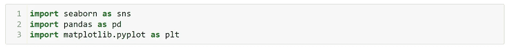

Image by Author

这里我们将使用 matplotlib 的 pyplot 组件。

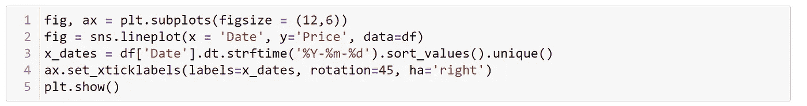

Image by Author

让我们一行一行地破解代码，理解它。
在第一行中，我们声明了一个名为‘fig’的图形和一个名为‘ax’的轴。
把图形想象成一张空白的纸，我们可以在上面画点什么。
在第二行，我们使用了 line plot 命令。
接下来，我们将日期时间对象格式化为年、月和日。接下来，我们将它旋转 45 度，这样日期就不会重叠。
最后，我们展示了使用 plt 的结果。show()方法。

所有步骤结合起来生成下面的输出。

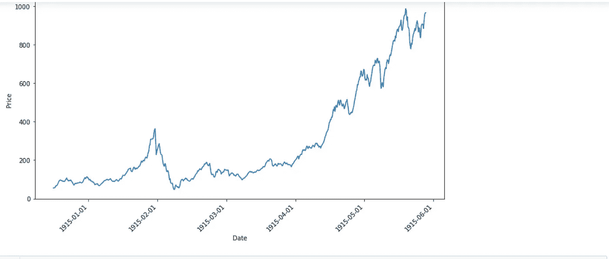

Line Chart (Image by Author)

以上是 seaborn 中折线图的一个简单例子。

让我们考虑另一个数据集，并检查线形图函数最常用的参数。

让我们在下一组例子中使用企鹅的数据集。

我们将使用前面显示的相同命令用企鹅的数据覆盖道琼斯数据。

df = sns.load_dataset('企鹅')

在这里，让我们画出票据长度和票据深度。为了区分企鹅的类型，让我们使用“色调”参数根据企鹅种类给数据点着色。

sns.lineplot(x = '账单长度 mm '，y= '账单深度 mm '，数据=df，色调= '物种')

从图中我们可以看出，每个物种都有不同的颜色。

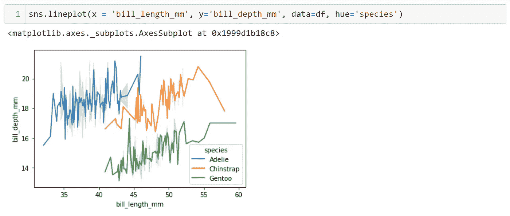

Image by Author

因此，hue 参数帮助我们根据另一列分离数据。

接下来，我们使用“style”参数来表示不同数据点的不同虚线。

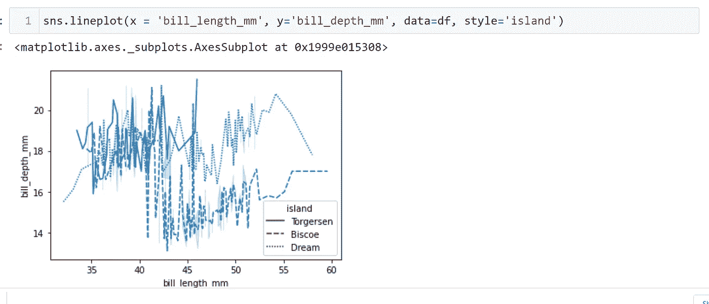

Image by Author

在上面的图中，虚线是根据岛屿绘制的。

接下来，我们有“调色板”参数，它是调色板的缩写，用于改变图表颜色。

到目前为止，我们一直使用 seaborn 提供的默认颜色。如果我们想改变生成的图表的颜色组合，我们可以使用调色板参数。

我使用的技术之一是给调色板参数一个随机字符串，执行命令并检查错误块。Seaborn 将告知我们该参数的可接受值。

在下图中，你可以看到我给了一个随机字符串“ABC ”, Python 为调色板参数的所有有效选项生成了一个值错误

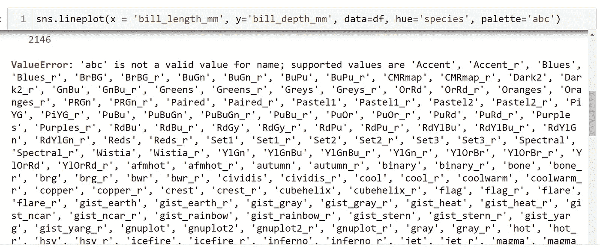

Image by Author

我正在为调色板选择“Gnuplot”选项。

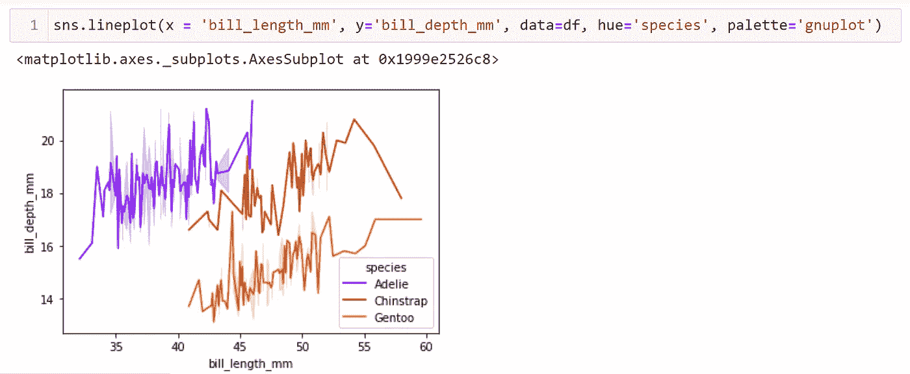

Image by Author

你可以尝试所有可能的颜色选项，并为未来的情节挑选几个最喜欢的。

最后，我们有线条宽度，它允许我们修改在图形表面上绘制的图表线条的粗细。

要使线条粗细加倍，我们需要使用参数‘lw’，它是线条宽度的缩写。

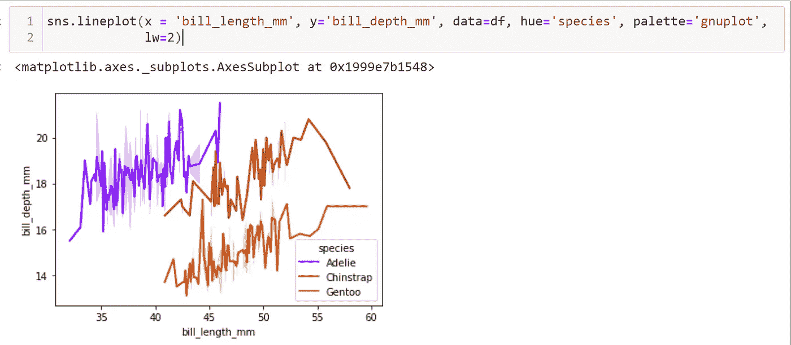

Image by Author

默认情况下，行宽是 1，可以根据需要增加或减少，例如，将整数传递给 double、triple 等。，或者用 0.5，0.8 之类的浮点数，让线条变细。

下次见！

 [## Mlearning.ai 提交建议

### 如何成为 Mlearning.ai 上的作家

medium.com](/mlearning-ai/mlearning-ai-submission-suggestions-b51e2b130bfb)