# 可视化 QS 世界大学排名

> 原文：<https://medium.com/mlearning-ai/visualizing-qs-world-university-rankings-92cb9f4357ef?source=collection_archive---------0----------------------->

## 探索 2017 年至 2022 年世界各地的教育机构

Photo by [Vasily Koloda](https://unsplash.com/@napr0tiv?utm_source=medium&utm_medium=referral) on [Unsplash](https://unsplash.com?utm_source=medium&utm_medium=referral)

QS 世界大学排名是由 Quacquarelli Symonds (QS)每年发布的全球大学排名，Quacquarelli Symonds 是一家专门分析全球高等教育机构的英国公司。QS 大学排名得到了国际排名专家组(IREG)的批准，被视为世界上三个最广泛阅读的大学排名之一，其他三个是世界大学学术排名和泰晤士高等教育世界大学排名。

# 历史

> 等级并不赋予特权或权力。它强加了责任——彼得·德鲁克

2003 年 12 月，英国记者兼企业高管 Richard Lambert 为英国财政部发表了一份名为*Lambert Review of Business-University Collaboration，*的报告。他的建议之一是，

> …..制定一份全球最佳研究密集型大学排行榜。这样的表格将为学术界提供一个有价值的现实检验，并有助于决策者判断他们的资助策略是否成功。

兰伯特表示，这样的表格将有助于英国将其大学与世界顶尖大学进行比较。在他的书《伟大的脑力竞赛》中，本·维尔德夫斯基将世界排名的想法归功于时任《泰晤士报高等教育》编辑的约翰·奥莱利。与 QS 大学合作，制作了 2004 年至 2009 年的世界大学排名。随后,从 QS 分离出来，发布了它的新版排名。QS 一直与爱思唯尔合作发布大学排名。

# 数据！

用于排名分析和可视化的数据是用 Python、Selenium、BeautifulSoup 抓取 [QS 世界大学排名网站](https://www.topuniversities.com/university-rankings/world-university-rankings/2022)得到的。收集的数据需要对许多属性进行大量的数据清理。例如，特性`city`和`faculty_count`有许多空值。所以，我写了一个 python 脚本，它可以基于`university`特性自动搜索谷歌，并为缺失的特性搜集值。以下是该数据集的总体概述。

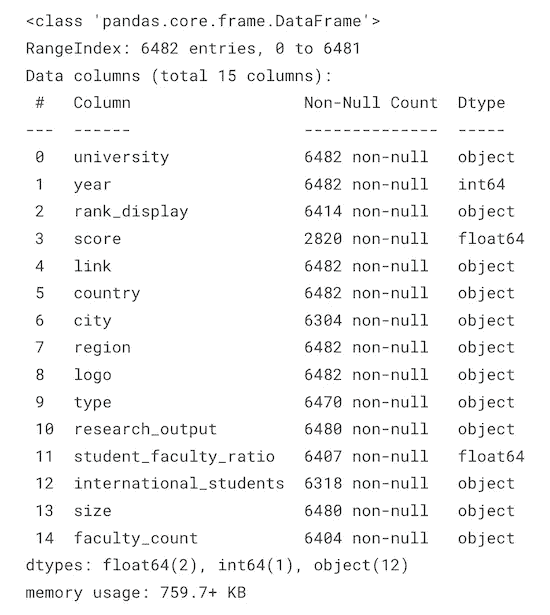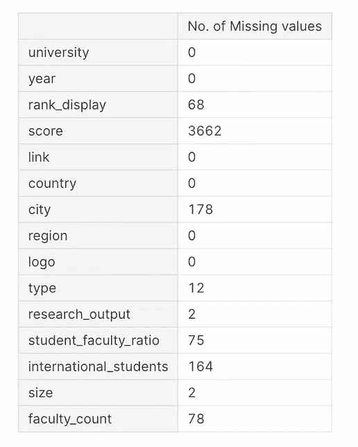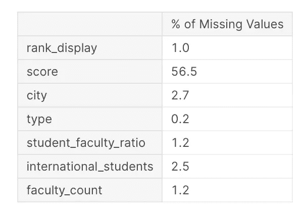

从 2017 年到 2022 年，QS 对 6482 所大学进行了排名。这个特殊的数据集包含每所大学总共 15 个要素。该数据集中的主要挑战是缺少值。尽管我如上所述努力删除它们，它们还是出现了。(叹气！)

因此，在处理丢失的值之前，我想了解它们之间是否有任何关联。我用 Python 的`[missingno](https://github.com/ResidentMario/missingno)`包来可视化[缺失](https://towardsdev.com/how-to-identify-missingness-types-with-missingno-61cfe0449ad9)关联。`missingno`关联热图衡量一个特征的存在与否对另一个特征的影响程度。

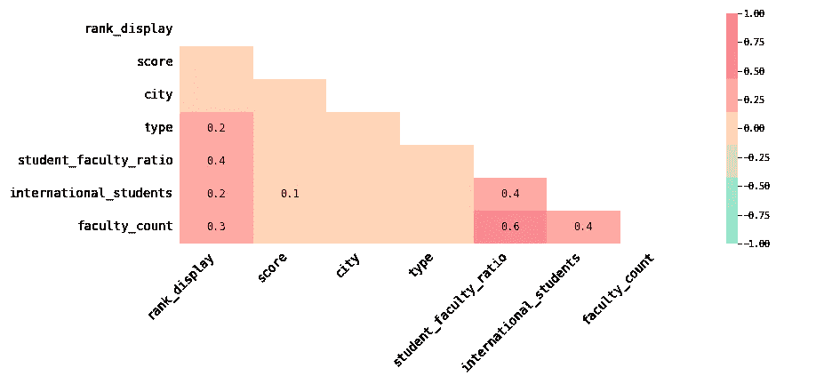

Correlation heatmap of missing values

关联热图仅包括缺少值的列。相关性越高，一列中缺少的值对另一列中缺少的值的依赖性就越高。我们可以看到`faculty_count`与`student_faculty_ratio`和`international_students`有显著的相关性。其他列几乎没有或没有显著的相关性。

在对数据进行了更多的研究后，我决定删除缺失 4 个以上特征的几行。它处理了 5 列中 1–2%的缺失值。罪魁祸首是`score`特性，它丢失了 56.5%的值。当我在 QS 网站上寻找这些值时，我可以看到他们只给出了前 500 所大学的分数，尽管有 1200 多所大学被排名。所以，我也决定放弃。

我一刮完数据就做了大部分的数据清理和准备工作。所以，一旦我处理了丢失的值，我的数据集就基本上完成了！现在，是时候发表一些见解了。

虽然 QS 发布大学排名已经快二十年了，但我们掌握的数据是 2017 年至 2022 年的。

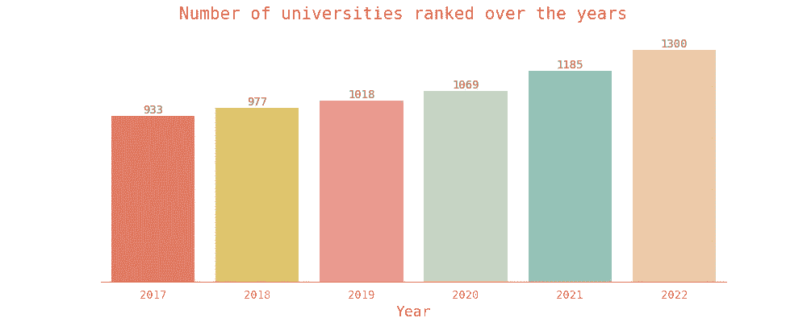

Number of universities ranked from 2017 to 2022

我们可以从上面的柱状图中看到，每年他们都在考虑比前一年更多的大学进行排名，其中 2022 年的大学数量最多。

学生在选择大学时的一个主要考虑因素是选择公立大学还是私立大学。他们两人都有各自的优点和缺点。下图显示了历年来 QS 排名的公立和私立大学的数量。

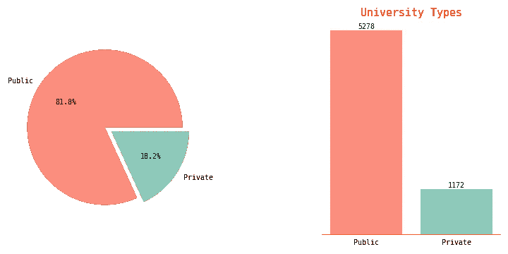

Types of universities

如果你做一个简单的谷歌搜索，你可以找到许多网站声称私立大学比公立大学更好，因为它们往往有更好的排名。嗯，这里的情况不是这样。超过 80%的排名大学是公立的，考虑到他们在 2022 年仅排名了全球数万所大学中的 1300 所。

## 可视化世界各地的大学:按大陆，按国家，按城市。

现在我们知道了它们的数量和种类。让我们看看它们是如何分布在世界各地的。

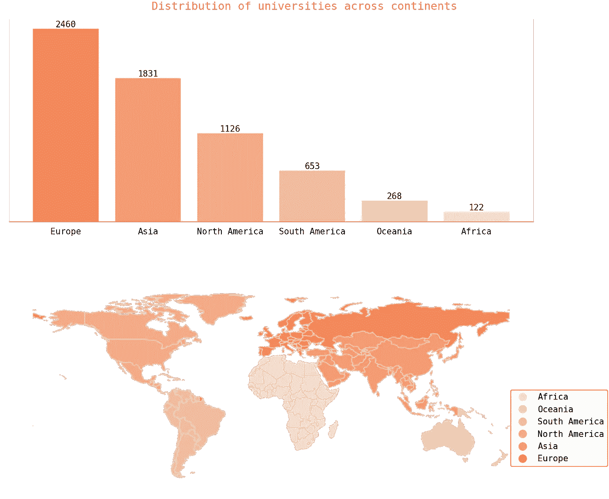

Distribution of universities across the world (Ranked by QS)

欧洲往往是拥有最多排名大学的大陆，尽管我们不得不考虑这样一个事实，即他们已经将俄罗斯纳入欧洲，尽管它属于欧洲和亚洲。非洲排名最少的大学。

从国家的角度来看，

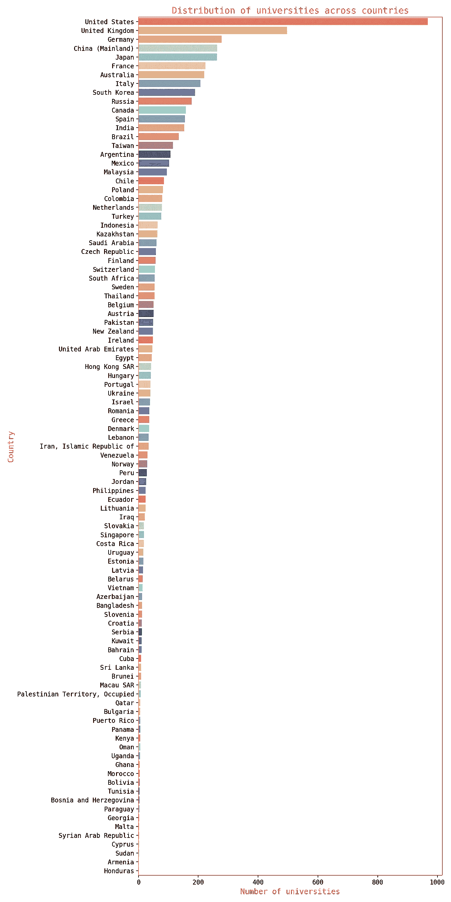

Number of universities ranked in each country

当我们看一看各个国家的大学数量时，美国和英国是领头羊。顶级大学主要来自欧洲、亚洲和北美。大多数垫底的国家来自非洲、拉丁美洲和中东。

虽然一个大陆或一个国家足够大，可以拥有许多排名很高的大学，但一些先进的城市也往往是顶级贡献者。

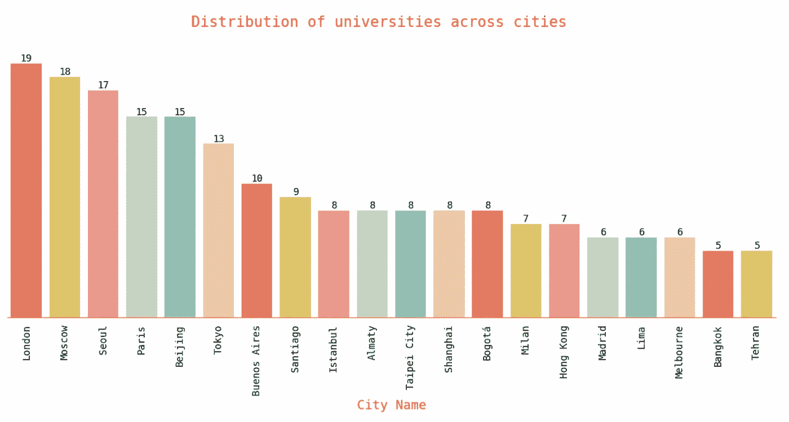

Top 20 cities with a high number of ranked universities

上图考虑了拥有大量独特大学的前 20 个城市。伦敦是一个学术热点，拥有 19 所全球排名的大学！紧随其后的是莫斯科和首尔。

在探索了各大洲、国家和城市的大学分布后，我对排名前 10 的大学很好奇。精英中的精英！就排名前 10 的大学而言，历年来独特大学的数量为 10 所，唯一的区别是排名。

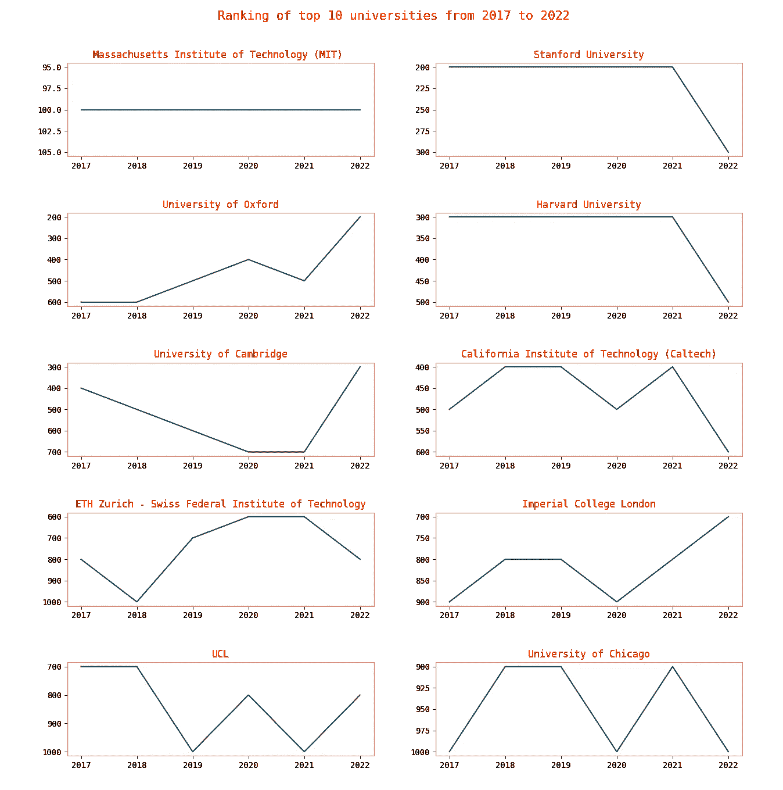

Top 10 universities ranked by QS

上图中的大学有持续占据前 10 名的趋势。一些关键的见解是，

*   在 QS 排名中，麻省理工学院是无可争议的王者，总是排名第一。
*   斯坦福和哈佛自 2017 年以来首次在今年(2022 年)下降。
*   英语世界最古老的大学牛津大学从第 6 位跃升至第 2 位。
*   总体而言，与美国大学相比，英国大学的排名大幅上升，而美国大学的排名今年(2022 年)有所下降。
*   在排名前 10 的大学中，只有瑞士苏黎世联邦理工学院(ETH Zurich)来自英美以外的国家。

# QS 排名方法

是什么让一所大学排名第一或第 1000？QS 是如何决定哪些大学将被考虑排名的？用什么标准来衡量大学之间的优劣？

这些问题的答案在于 QS 使用的方法论。QS 大学根据它认为的大学使命的关键方面来设计排名，以评估大学的表现:教学、研究、培养就业能力和国际化。它所遵循的方法框架基于六个指标来评估大学，

*   学术声誉(40%)
*   雇主声誉(10%)
*   教师/学生比率(20%)
*   每位教师的引用率(20%)
*   国际教师比例(5%)
*   国际学生比例(5%)

关于方法论的更多信息可以在[这里](https://www.topuniversities.com/qs-world-university-rankings/methodology)找到。

在 QS 用于大学排名的 6 个指标中，只有 3 个出现在数据集中——研究产出(每位教师的引用数)、学生-教师比率和国际学生——仅占调查方法的 45%。

## 研究成果

除了教学，学术研究被认为是大学发展的一个非常重要的因素。QS 用“每位教师的引用次数”来衡量研究成果的质量。引用他们的话，

> 为了计算它，我们用一个机构在五年内发表的所有论文被引用的总次数乘以该机构的教师人数。

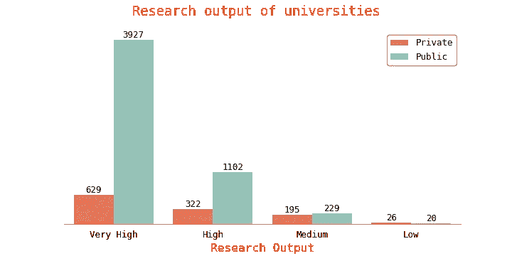

The research output of top universities by type

很明显，大多数排名中的大学都有“非常高”的研究成果。就研究而言，公立大学胜过私立大学。

数据中有一个特征叫做`faculty_count`，它包含了每所大学拥有的学术人员数量。不是每个学术人员都会从事研究，但大多数学术研究人员都是某个机构的教职员工。

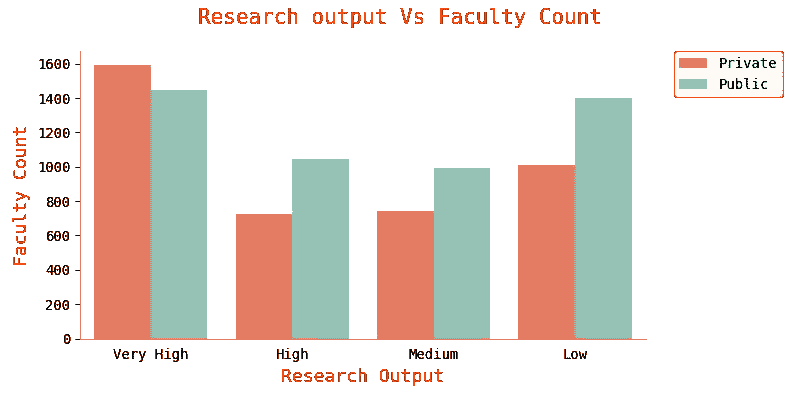

Research Output Vs Faculty Count

就教师人数而言，

*   研究成果“非常高”的大学有更多的员工。

*那么，这是否意味着教师人数多的大学研究得更好？不一定。研究成果“非常高”的大学可能会吸引更多有成就的学者和研究人员，因为他们的声誉和许多其他因素。*

*   我们可以看到，研究成果“非常高”和“低”的公立大学的员工数量几乎相等。
*   此外，“低”研究产出的私立大学比“高”产出的私立大学有更多的教职员工。

*这可能意味着，尽管有更多的学术人员，但并不是每所大学都重视研究。更多的学术人员并不意味着高质量的研究。*

下图描绘了研究成果和大学规模的点状图。

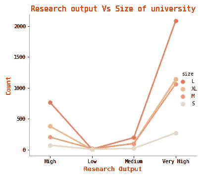

Point plot of research output and size

大学的规模和研究成果之间的关系是相当坦率的。与“中等”和“低”相比，“非常高”和“高”研究产出的大学规模更大。

如果你不确定如何解释一个点图，这里有一个简单的介绍

> 点图通过使用散点图点来显示数值变量的平均值估计值。这对于比较分类变量的不同级别特别有用。连接点图的线可以用来容易地判断斜率之间的差异。

欲了解更多信息，请点击此处的。

## 学生-教员比率

学生教员比率是一个有趣的指标。根据 QS 的说法，“它通常被学生们作为对他们来说最重要的衡量标准”。比率越小，性能越高。分配给他们的学生人数较少的教师可以将更多的注意力集中在每个学生身上。

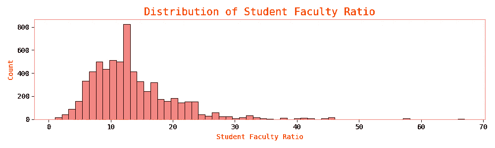

Histogram of Student-Faculty Ratio

在顶尖大学中，

*   每个系平均有 13 名学生。
*   有些大学的每个院系只有 1 名学生。
*   同时也有大学的每个院系有 67 名学生。
*   大多数大学每个院系有 5 到 20 名学生。

学生在学术研究中也扮演着重要的角色。

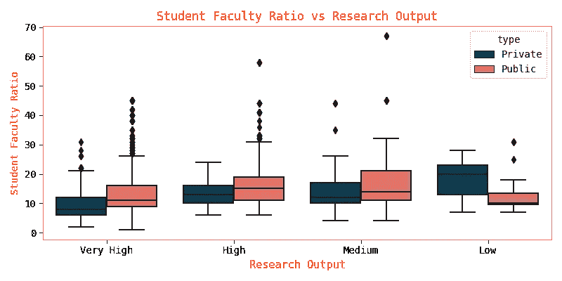

Student Faculty Ratio vs Research Output

显然，与其他大学相比，研究成果“非常高”的大学的“学生-教师比率”非常低。

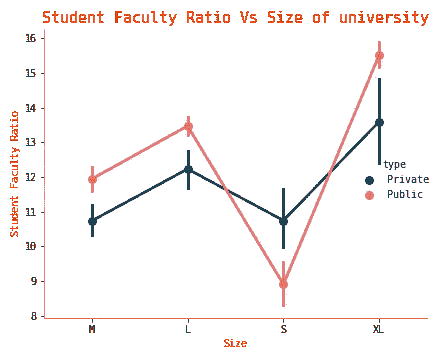

Student Faculty Ratio Vs Size

就规模而言，私立大学比公立大学少得多。另一个有趣的观察是，随着大学 T2 的增加，平均 T1 似乎也在增加。

## 国际学生

一所吸引世界各地学生的大学展现了全球视野，并拥有多元文化的校园。

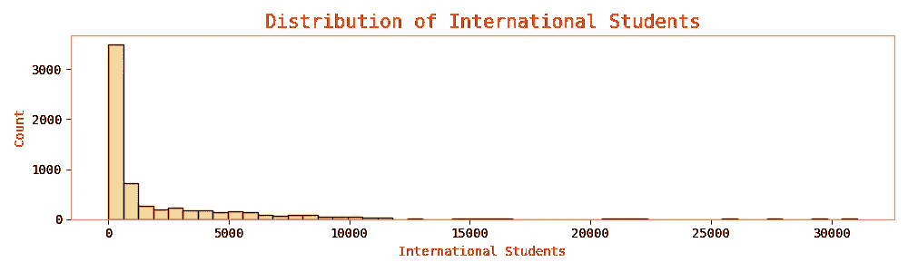

Histogram of International students

*   平均而言，排名靠前的大学往往有 1900+的国际学生。
*   有一所大学，国际生录取人数高达 31000+。
*   大多数大学的招生人数在 0 到 5000 人之间。

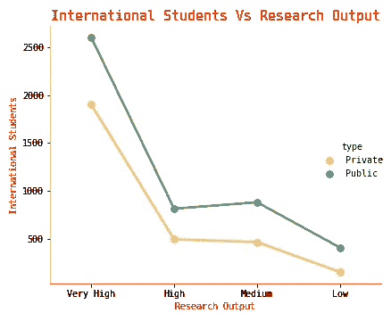

International students Vs Research output

国际学生倾向于选择研究成果“非常高”的公立大学。因为学费比私立学校低？也许吧。此外，正如我们之前看到的，公立大学比私立大学更擅长`research_output`。

我想探索的另一件有趣的事情是，国际学生选择的热门国家。

在进一步阅读之前，你能猜到吗？

Gif: [Source](https://giphy.com/gifs/season-17-the-simpsons-17x4-3o6Mbdr0AHyzqCTgHK)

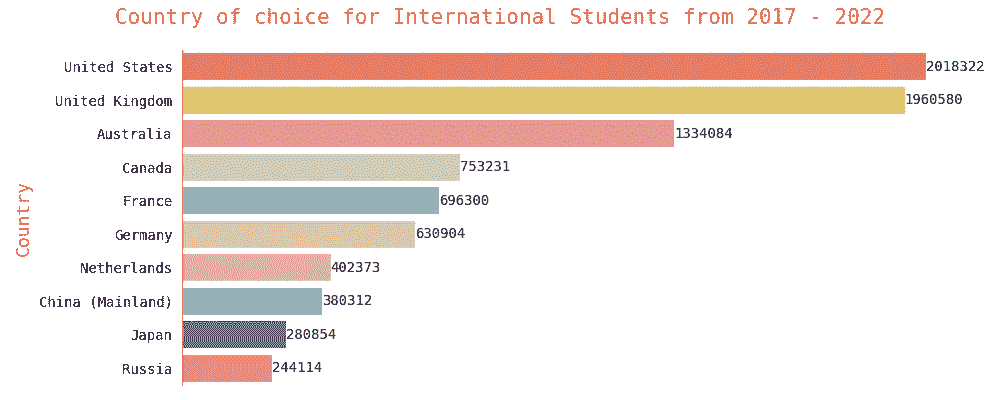

Country of choice

2017 年至 2022 年间，美国一流大学招收了近 200 万名国际学生，而英国有近 190 万名。

## 批评和局限

这项分析是为了探究 QS 公布的排名。许多学者、学者和经济学家[表达了对 QS 排名方法的担忧。所以，你应该记住，从这些排名中得出的任何结论或见解都是模棱两可的。此外，这个数据集的范围非常有限。我的特征只占调查方法的 45%。](https://en.wikipedia.org/wiki/QS_World_University_Rankings#Criticisms)

我希望你喜欢阅读这篇文章！探索这个数据集非常有趣，我希望你在阅读它的时候也是如此。

[***你可以在这里找到用于可视化的数据和代码。***](https://www.kaggle.com/padhmam/qs-world-university-rankings-eda-visualization/notebook)

请在评论中告诉我你的观点、担忧或任何反馈。

 [## Mlearning.ai 提交建议

### 如何成为 Mlearning.ai 上的作家

medium.com](/mlearning-ai/mlearning-ai-submission-suggestions-b51e2b130bfb) 

🔵 [**成为作家**](/mlearning-ai/mlearning-ai-submission-suggestions-b51e2b130bfb)