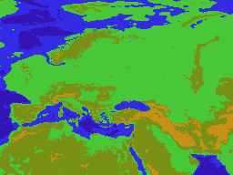
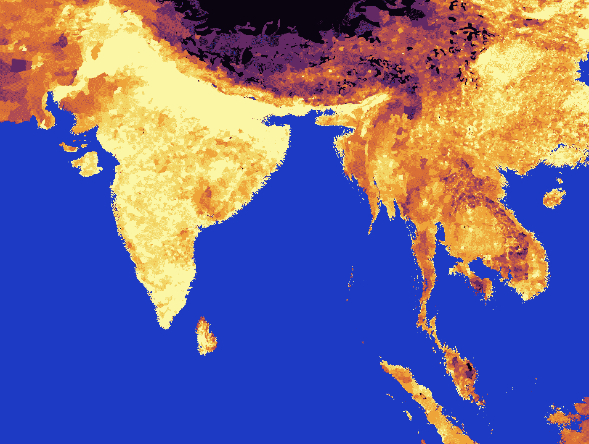
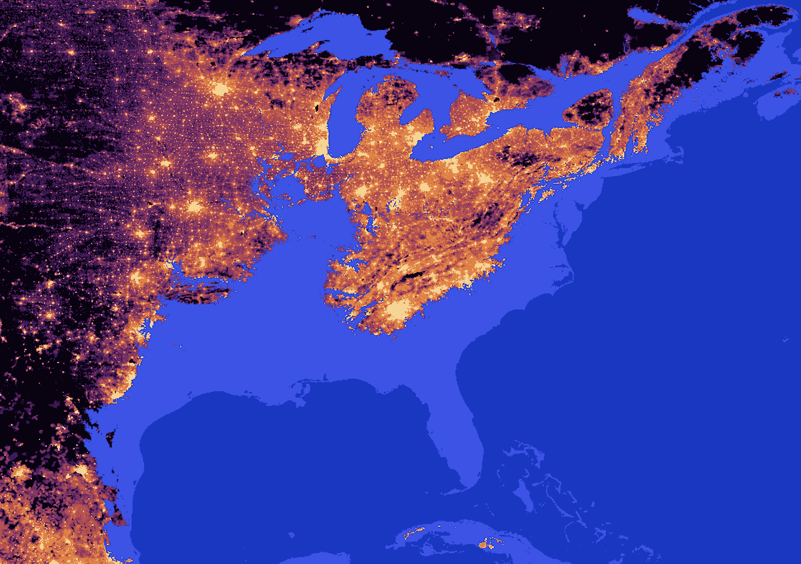
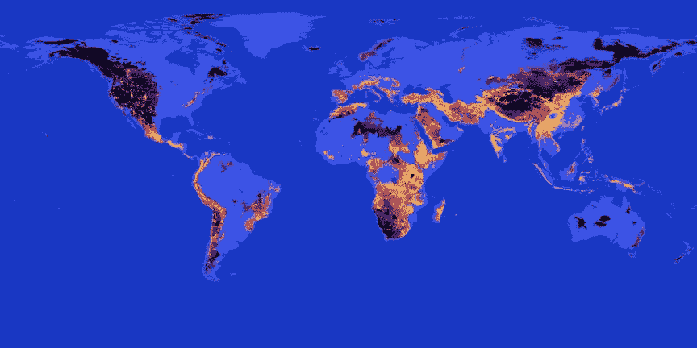
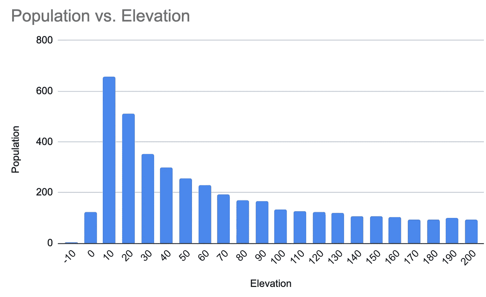
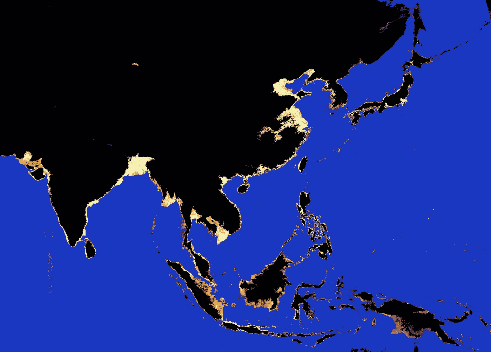

# 可视化海平面上升

> 原文：<https://medium.com/mlearning-ai/visualizing-sea-level-rise-ca24428c3e98?source=collection_archive---------1----------------------->

大约 15 年前，我收集了一些我在网上找到的包含欧洲海拔的地理数据，并制作了一个 GIF 图，展示了欧洲在不同程度的海平面上升下会受到怎样的影响。人们喜欢它——这是一个简单的时代，能够用数据创建 GIF 使你成为数据向导。

Look! it is a GiF!

它总是模糊地困扰着我，虽然它只覆盖了欧洲，所以我很高兴地看到 [MapBox 发布了一个全球海拔数据集](https://blog.mapbox.com/global-elevation-data-6689f1d0ba65)。如果你在想，难道美国国家航空航天局没有像 T3 一样的 T2 数据集，你当然是完全正确的。这些都是棘手的过程，因为它只是模糊地困扰着我，这足以阻止我，直到 MapBox 做了大概棘手的工作。

At 50m a lot of Bangladesh is under threat

虽然创建一个覆盖整个地球的更大的 GIF 现在已经触手可及，但这似乎并不是最好的方法。显示地球上哪些地方容易受到海平面上升的影响当然有些有趣，但真正重要的是有多少人真正生活在那里。国际地球科学信息网络中心发布了一个包含全球人口密度的简洁数据集，因此我们可以将两者结合起来。

At 200m all of the Eastern US is exposed

其结果就是[新海平面项目。这基本上是 9 张高分辨率的地图(8k x 4k ),显示了地球不同的水位，根据人口密度给陆地涂上颜色。500 米图多为参考；我认为即使是最悲观的模型也不会认为海平面会上升那么多。](https://douwe.com/projects/sealevel)

The 500m version truly shows a water world

哦，还有一个视频:

Going from 0 to 500 in a minute

# 更多数据乐趣

当然，我们可以直接绘制数据，根据海拔高度预测人口。下图显示了每隔 10 米有多少只生活在这个范围内。10 米以下的人不多，但实际上下降了不少；死海位于零下 430 米，它周围的密度相当大。直到 1 亿左右，人数下降得相当快，但随后稳定下来，有点出乎意料。

120M people live below sea level already. Another 650M below 10m

我们也可以颠倒颜色；我们可以显示没有危险的区域的人口密度，而不是显示没有危险的区域的人口密度，并以相同的方式给它们着色-留下不仅仅是黑暗的区域。尤其是在海平面上升较低的情况下，它更清楚地显示了风险所在，因为沿海城市的照明非常清晰。

The coastal areas in India and China are very densely populated. Less so in Indonesia apart from Java

# 这是如何工作的

实现这一点的代码可以在 GitHub 上找到[，并且非常简单。](https://github.com/DOsinga/sealevel) [Rasterio](https://rasterio.readthedocs.io/en/latest/quickstart.html) 让我们将地理标志读取为 numpy 数组，一旦我们有了这些，我们就可以开始比赛了。可能有一种更好的方法将数据转换为 RGB，比如将高程和人口数据自动映射为整数并进行查找，但逐个像素地填充位图也是可行的——这需要几分钟时间，虽然很慢，但比做聪明的事情要快。

类似地，我最终将来自 MapBox 的高程数据重新投影到用于人口数据的投影中；第一种是在 web mercator 中，而后者只是将 lat/lng 对作为位图的索引。数学很简单，互联网上的其他建议只会导致沮丧。