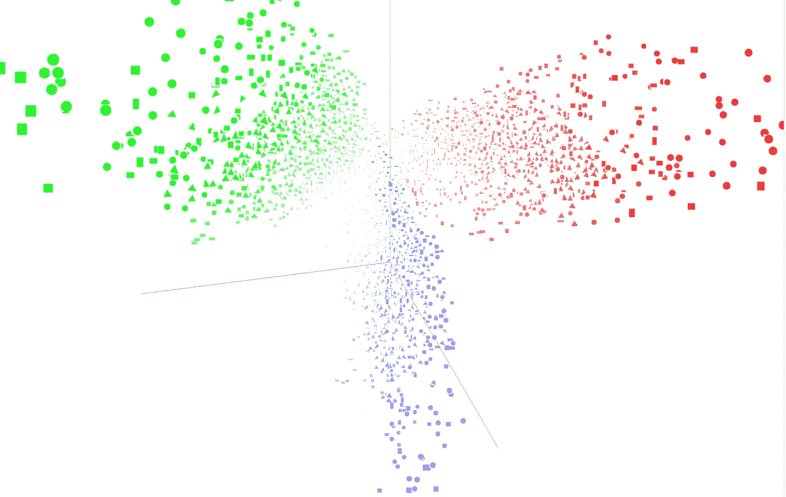
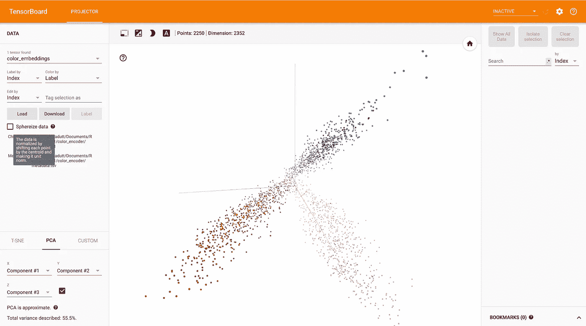
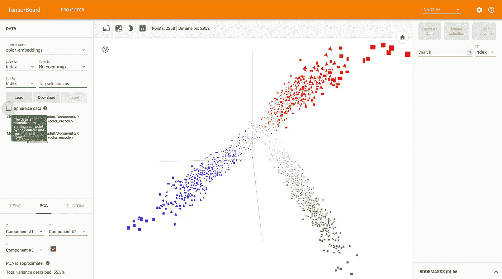
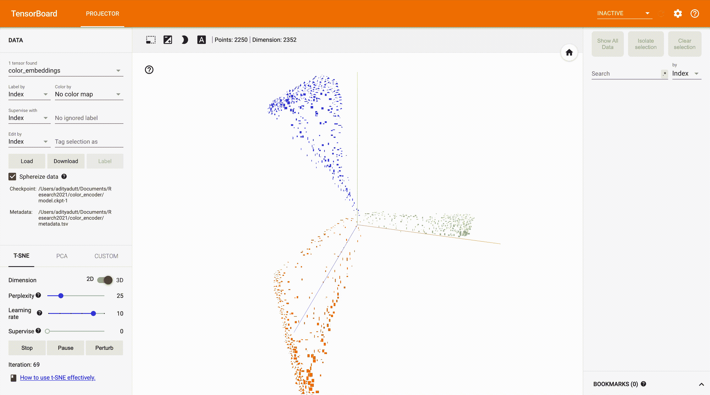

# 使用 TensorBoard 可视化您的深度学习功能

> 原文：<https://medium.com/mlearning-ai/visualizing-your-deep-learning-features-using-tensorboard-8356ffd745e0?source=collection_archive---------3----------------------->

# 介绍

传感器板是一种工具，它提供机器学习工作流程中所需的测量和可视化。

在本教程中，我将给出一个如何在 TensorBoard 上可视化你的特征向量的快速教程。使用机器学习模型，有时我们想要学习不同类的嵌入。嵌入是将不同的输入(如图像、文本等)映射到多维向量的一种方式。使用 TensorBoard，您可以可视化表示或特征向量。您也可以直接可视化输入数据。TensorBoard 还提供了像 PCA 和 t-SNE 这样的降维方法。只需一次点击，您就可以轻松地将 PCA 和 t-SNE 应用于您的数据，并查看 2D 和 3D 的可视化效果。

# 问题陈述是什么？

*我们有一个不同形状(圆形、三角形、矩形)不同颜色(红色、绿色、蓝色)的小型数据集。假设我们想根据颜色对形状进行分类。所以，有* ***3 个目标输出*** *:* ***红色*** *，* ***绿色*** *，* *和* ***蓝色*** *。使用机器学习模型，我们已经在对颜色进行分类时学习了颜色的表示/嵌入。现在，我们想看看这些表示的效果如何？*

因此，我们将在 TensorBoard 上可视化这些嵌入。

下面是使用的数据集。

 [## AdityaDutt 多色-形状-数据库

### 测试不同机器学习任务的小型数据库。它包含不同颜色的简单形状。…

github.com](https://github.com/AdityaDutt/MultiColor-Shapes-Database) 

# 要求

> **注:**我们将使用 *tensorflow.contrib* ，这就是为什么需要版本 *1.13.2* 的原因。在 *2.0* 版本中，已经不存在了。

# 履行

1.  **创建没有精灵的可视化效果。**

> 精灵是以网格形式排列的几个图像的块。请看下图中的例子。精灵使视觉效果更加令人印象深刻和直观。

首先，我将通过每个步骤来创建代码。**在此之后，完整的代码也是可用的。如果只是想用的话可以直接跳转到那个**。

步骤 1:首先，导入库。

步骤 2:设置元数据、模型和检查点路径。

步骤 3:设置文件编写器和配置。

步骤 4:以 CKPT 格式将数据写入绘图

步骤 5:以 TSV 格式编写元数据

在 TSV 文件中，对应于数据索引写入标签。完成这一步后，我们就可以开始绘图了。

**这里是完整的代码**:

**运行步骤:**

1.  打开终端，输入:*python visualize _ without _ sprite . py*
2.  现在，输入:*tensor board—logdir # YOUR _ LOG _ DIR _ PATH #—host = 127 . 0 . 0 . 1*

现在，在 web 浏览器上打开本地主机。你现在会看到 TensorBoard。

TensorBoard 上的输出可视化如下所示。

Visualization on Tensorboard without sprites. Each class is shown in a different color.

2.使用精灵创建可视化效果。

一切都是一样的，除了我们添加精灵的部分。我们添加下面几行来创建精灵。

在**第 4 行**，我们现在也设置精灵的路径。在第 6 行中，我们设置了要显示的单个图像的形状。

在**第 9 行**中，我们设置了**变量，该变量包含要可视化的输入图像**。

在**第 20 行**中，我们为所有精灵图像创建一个空模板。并且，从**第 22 行**开始，我们在每个情节中设置一个图像。(类似于我们在 Matplotlib 中创建支线剧情的做法)。

按照相同的步骤运行代码。

这里是完整的代码。

带有精灵的输出可视化如下所示。你现在也可以看到三角形和正方形的图像，而不是点的散点图。

我们的目标是对不同颜色的图像进行分类。你可以看到相同颜色的形状聚集在一起。

Visualizing features with sprites. You can see the original input images in the scatter plot now.

您也可以将 T-SNE 应用于数据。

Demo of using T-SNE on TensorBoard

现在，我们知道如何使用 TensorBoard 可视化特征。

# 结论

我演示了如何可视化嵌入在 Tensorboard 上的特性，包括有精灵和没有精灵的情况。你可以在我的 GitHub 档案上查看完整的代码。

 [## AdityaDutt/tensor board _ visualize

### 这是这个代码在介质上的教程…

github.com](https://github.com/AdityaDutt/Tensorboard_visualize) 

> 感谢阅读！希望有帮助。
> 
> 如果你喜欢这篇文章，请推荐并分享。