# 语音化:视觉和语言的多模态学习

> 原文：<https://medium.com/mlearning-ai/vokenization-multimodel-learning-for-vision-and-language-84e62f2dc808?source=collection_archive---------0----------------------->

机器学习@伯克利博客上的原始帖子:

 [## 语音化:视觉和语言的多模式学习

### 💡计算机视觉遇到自然语言处理语音化是视觉监督语言和计算机语言之间的桥梁

ml.berkeley.edu](https://ml.berkeley.edu/blog/posts/vokens/) 

# 简介:人类学习

人类是如何学习语言的？

当人类辨别单词时，他们会听基于时间和频率的差异来确定正在说什么。当我们蹒跚学步时，我们通过被动地*倾听*父母的谈话来习得我们的第一语言。随着年龄的增长，我们学会了与周围的人进行*阅读*、*写作*和*交谈*。这四个组成部分(听、读、写、说)帮助我们与世界互动，更好地了解我们的周围环境。如果有办法跨越所有这些领域，像人类一样更好地理解计算机模型中的语言，会怎么样？

❗️Spoiler 警报:vokenization(继续阅读了解更多)

# 计算机视觉和自然语言处理背景

在我们进入什么是 vokenization 以及它是如何工作的之前，让我们了解一下 CV 和 NLP 中的一些关键概念和模型。

NLP 的突破使机器能够理解人类语言，包括文本预测、情感分析和语音识别等任务。一些流行的预训练 NLP 模型是深度学习文本生成框架 OpenAI 的 GPT-3，以及谷歌的 BERT，它在提供的句子上下文中生成代表每个单词的嵌入。

计算机视觉和深度学习的进步通常来自于只处理一个领域的数据。例如，StyleGAN 模型，一种用于在每个卷积层调整图像样式的 GAN，仅在视觉图像数据上训练。

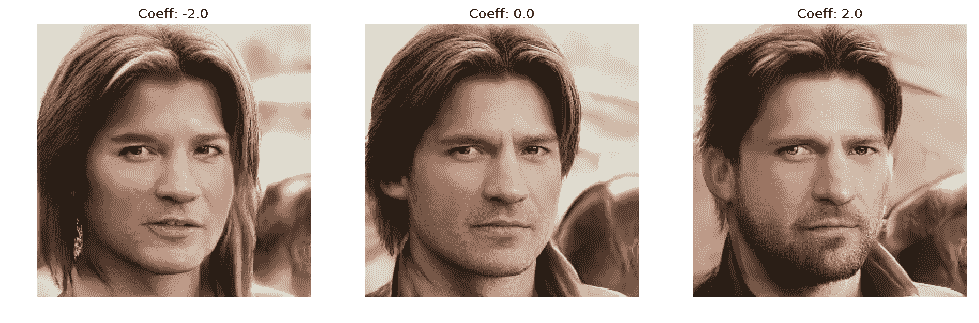

> 图 NVIDIA 研究人员为 GANs (StyleGAN)创建的基于风格的生成器架构，用于生成人工图像，有时看起来比原始图像更真实。

类似地，被认为是 2021 年最强大的语言模型的 GPT-3 只在文本数据上进行训练。尽管如此，有人对伯特和 GPT-3 语言模型提出了批评，因为很难从纯文本输入中学习单词的意思。这些自我监督的框架不考虑来自外部视觉世界的信息。如果人类不仅仅通过阅读来学习，那么为什么现有的语言模型仅仅基于纯文本的自我监督？

为了解决这一问题，人工智能社区对创建视觉语言表示学习的兴趣越来越大，利用来自图像的信息来学习语言表示，反之亦然。

# ✨Vokenization✨

到目前为止，基于视觉的语言数据集和纯语言数据集是有区别的。为了弥补这一差距，一种被称为 Vokenization 的新技术被开发出来。随着其他图像-文本神经网络在 NLP 中的突破，如 OpenAI 的 DALL-E 和 CLIP，Vokenization 是视觉语言多模态建模的最新进展之一。

名字 vokenization 名字源于视觉和记号的结合，形成 vokens。voken 是与给定语言标记相对应的图像，并且可以被认为是标记的可视化。

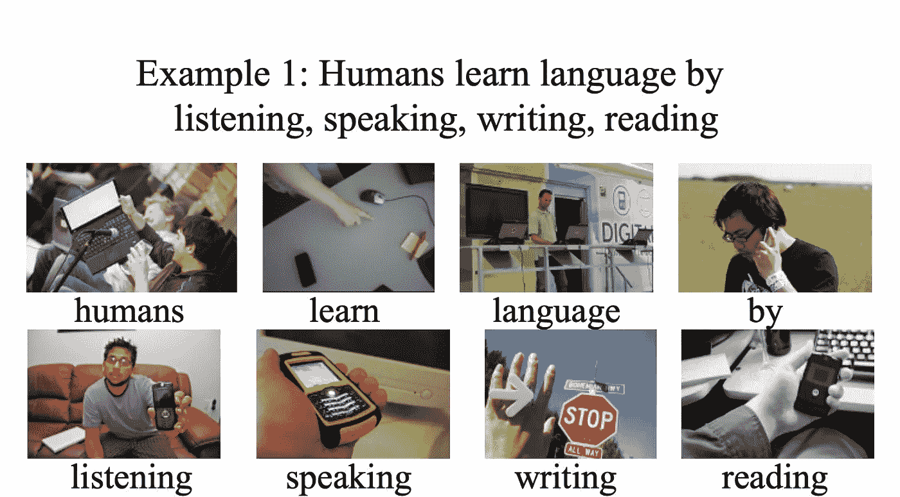

> 图 2:模型生成的 voken 的可视化，其中模型对与语言标记相对应的视觉 voken 进行分类。

动词化利用视觉信息监督语言学习。它通过上下文映射语言标记到 vokens，一个标记的相关图像，将多模态比对外推至纯语言数据。从两个各自的深度神经网络中检索图像和标记嵌入，然后对齐嵌入。

语音化技术的新颖之处在于，不仅预测语言标记，还预测图像标记，这是普通 BERT 模型无法生成的。此外，无需对架构进行任何更改，预训练的 BERT 模型就可以在 Voken 分类上进行训练，从而提高情感分类等纯语言任务的性能。

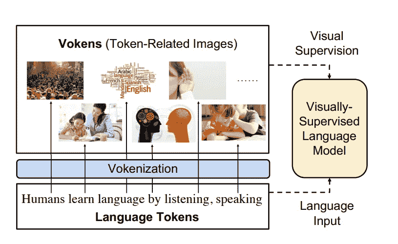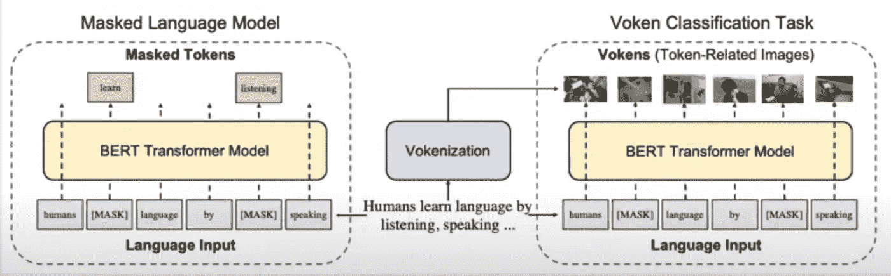

> 图 3:语言标记和标记相关图像的组合。语言模型由与标记相关的图像(称为 vokens)进行视觉监督。语音化过程生成这些上下文标记图像对的数据集。

# 这有什么意义呢？

平均而言，具有 voken 分类任务的 BERT 模型比没有 voken 分类的 BERT 模型平均高出约 3%(这对于平均值来说是巨大的！)

# Vokenization 过程

总的来说，动词化过程是一个上下文标记到图像的匹配模型。

当前的挑战:

1.  基础语言更喜欢简短和有启发性的描述，因此句子长度和活跃词的分布与其他语言类型不同。
2.  自然语言中的大多数单词都没有视觉基础(在英文维基百科中只有 28%)。

我们分两部分来解决两个挑战:

挑战 1

*   我们使用我们的 vokenization 方法，其中我们使用相对较小的数据集来训练 vokenizer (vokenization 处理器)。然后，我们为像英语维基百科这样的大型语言语料库生成语音。视觉监督语言模型然后将从大型数据集获取输入。这有助于弥合不同数据源之间的差距，有助于解决挑战 1。

挑战 2

*   在考虑句子的上下文时，可以将一些视觉上不接地的标记映射到相关图像。vokenizer 内部的上下文标记-图像匹配模型通过查看上下文将标记映射到图像，这允许我们为英文维基百科生成标记。

传统的语言模型预测语言标记。但是使用动词化，不仅仅预测语言符号，还预测图像符号。图像标记是从图像的一组预定义的固定词汇/语音中分类的。本质上，语言模型具有不同记号的词汇集，这些记号被映射到嵌入表，然后被映射到其他记号的预测中。

输入:模型接受一个由一系列标记组成的句子和一幅图像。

输出:图像与其句子上下文中的每个标记之间的相关性分数

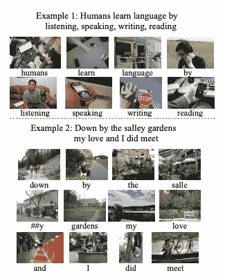

> 将语言符号的例子映射到被分类的图像中。voken BERT 模型对哪个 voken 对应于语言标记进行分类。例如，上图的示例 1，口语令牌与手中的电话相匹配。

考虑到图像的上下文，该模型沿着图像对整个句子进行交叉注意，以预测 voken。上图显示了示例 1 和示例 2 中的语言标记“by”。然而，在第一个句子(示例 1)的上下文中,“by”图像标记是正在打电话的人，而在示例 2 中,“by”被映射到公园的长椅上。这种视觉信息有助于模型进一步区分上下文中的单词，并导致改进。

首先，我们得到一个投票者的数据集，然后我们可以训练真正的投票者。

警告:下一部分将深入模型。让我们深入了解一下这个过程的难点！

# 令牌和图像关联:

# 建模

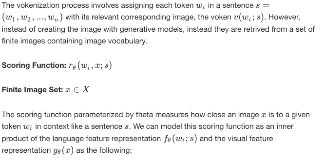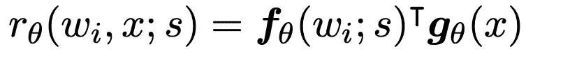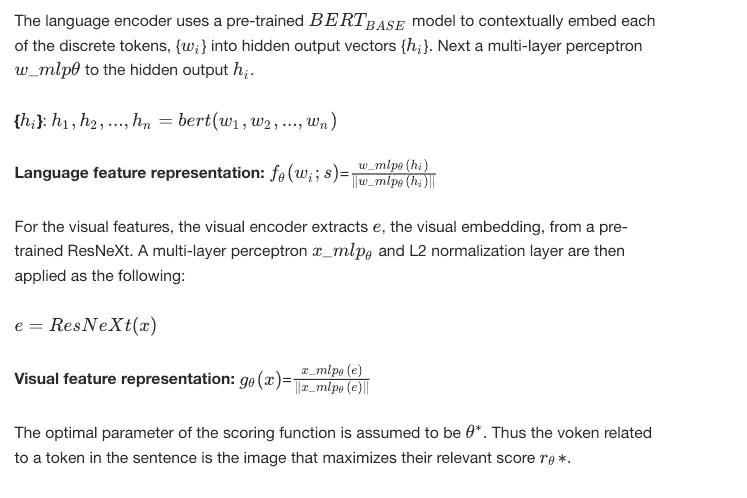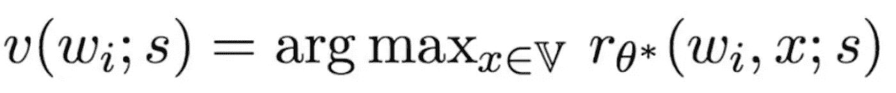

这类似于 OpenAI 最近在 CLIP 上的工作，该工作将图像分类转化为文本相似性问题。

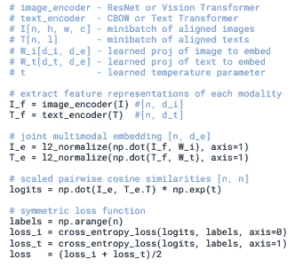

> 以上是 OpenAI 的片段中的部分代码。请注意图像和文本嵌入之间的内积的相似性。

# 培训:监管不力

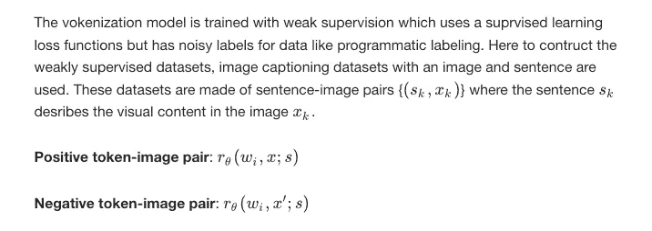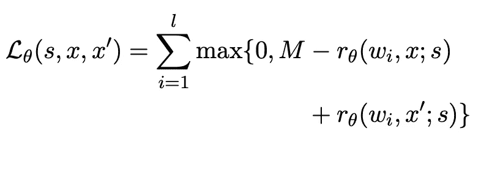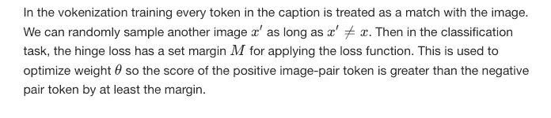

# 推理

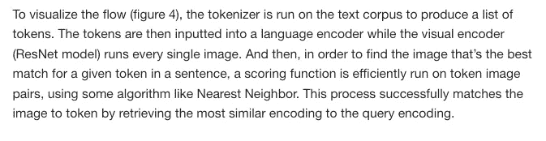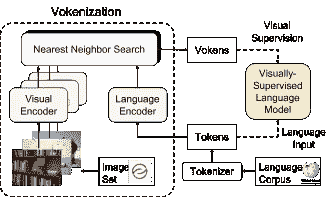

> 图 4:为了实现动词化过程，对于语言语料库中的标记，使用类似最近邻算法的东西从作为动词的图像集中检索图像。这些生成的标记用于从视觉监督到语言模型

# Vokenization 过程概述

1.  该模型接受一个句子(由标记组成)和一个图像作为输入。
2.  将句子中的每个单词分配给其对应的相关图像
3.  该句子在 vokenizer 中变成一系列记号，这输出了该句子上下文中记号和图像的相关性分数。

# 结果:

## 表 1(具有和不具有 voken 分类的预训练模型):

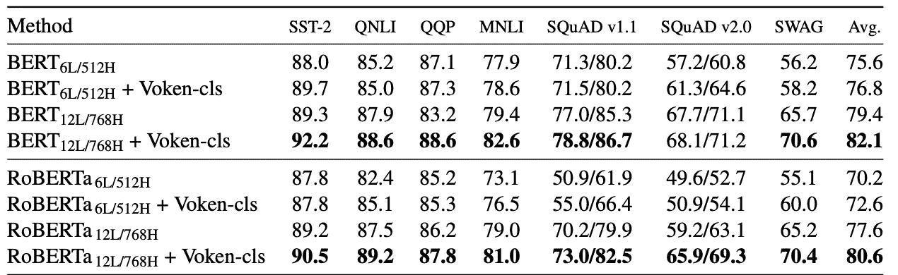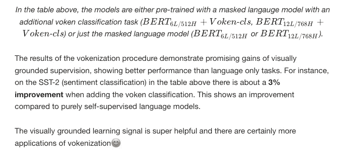

# 应用:

将视觉和语言学习相结合的想法将在医学成像应用中流行，特别是用于自动医学图像诊断的视觉表示。例如，本文[从成对的图像和文本](https://https//paperswithcode.com/paper/contrastive-learning-of-medical-visual)中对比学习医学视觉表示，探索了具有短文本描述的射线照片图像，其中语义分割是耗时的。这种语音化技术有可能引导这些表示，并使用文本信息来改进自动医学成像。

vokens 和其他基础语言系统的应用还有很多其他的可能性(下面仅举几个例子)。

*   机器人视觉触摸
*   视觉-听觉
*   语言-音频

随着自然语言处理和计算机视觉的不断进步，未来一定会一片光明！

## 来源:

*   [原始研究论文](https://arxiv.org/pdf/2010.06775v1.pdf):动词化:通过语境化、基于视觉的监督提高语言理解
*   [什么是动词化及其对自然语言处理应用的意义](https://analyticsindiamag.com/what-is-vokenization-image-text-nlp/)
*   《麻省理工科技评论》:这可能会导致常识人工智能的下一个重大突破