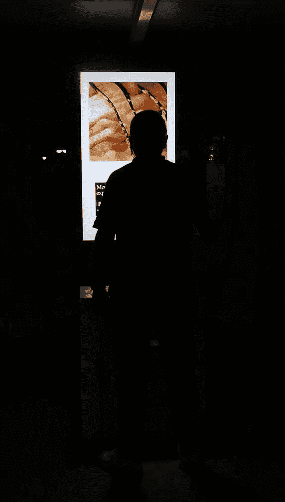
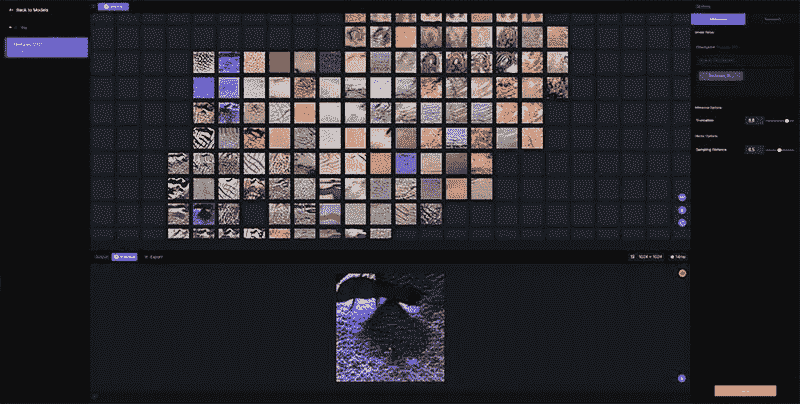
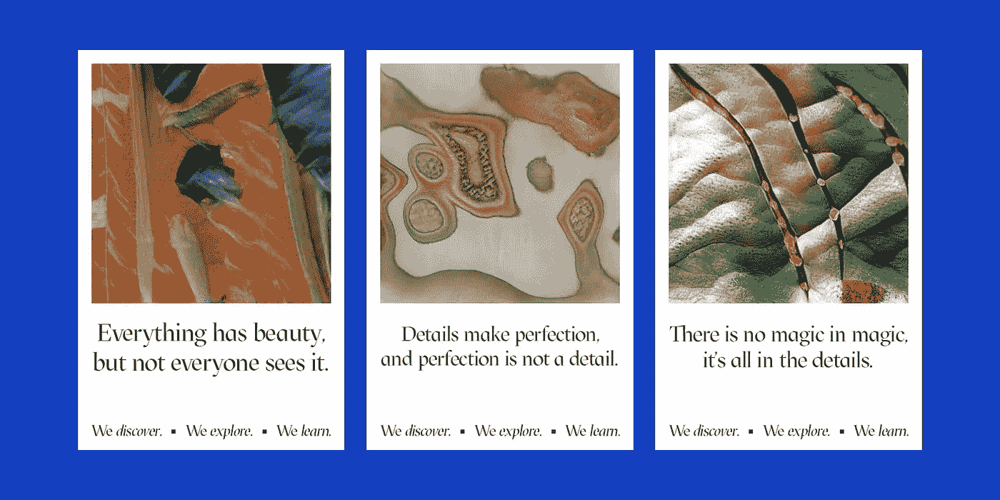
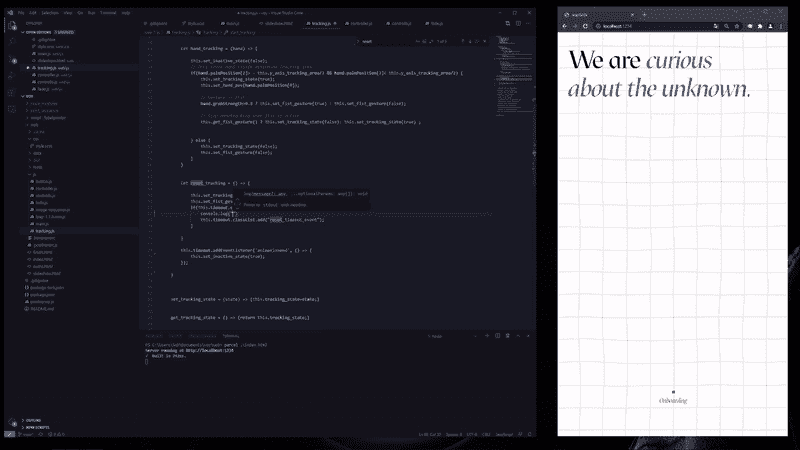
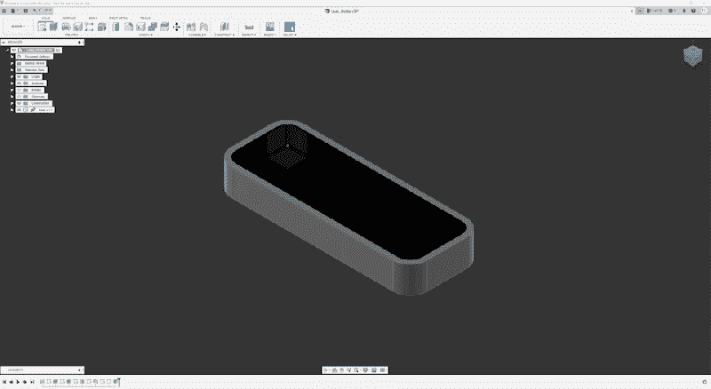
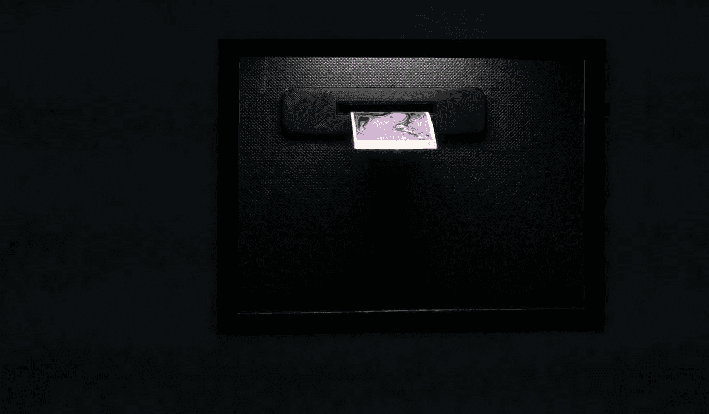
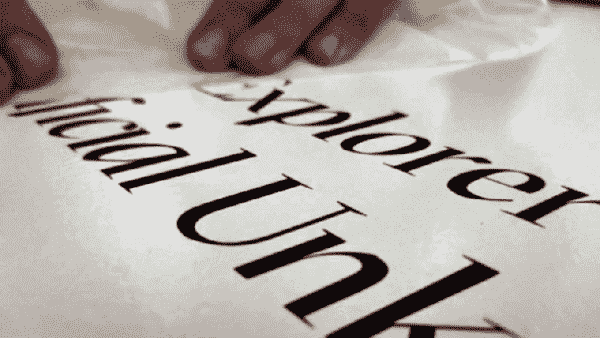
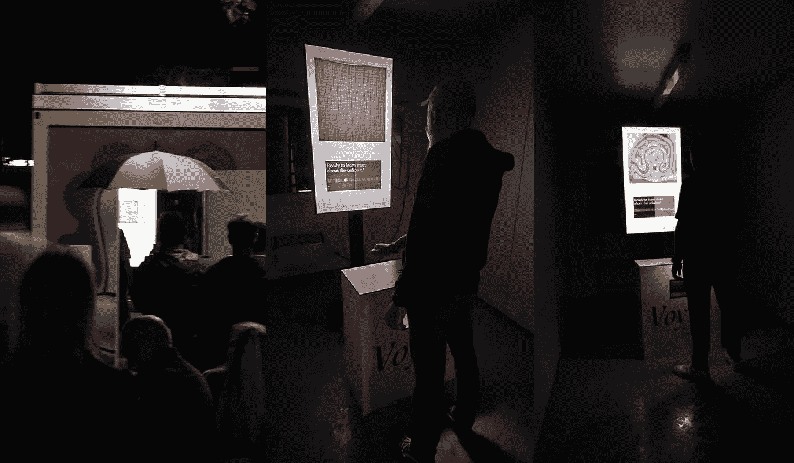

# voy——一个数据驱动的艺术装置。

> 原文：<https://medium.com/mlearning-ai/voy-a-data-driven-art-installation-489737fa2e9b?source=collection_archive---------2----------------------->

Explore the artificial unknown.

Voy 使所有参与者能够通过在半空中使用预定的手势来探索数据驱动的计算机生成图像的美。

如果我们能探索一些美丽的东西呢？隐藏在多维空间里的神奇的东西？为了回答这些问题，我们想带您进行一次小小的旅行，让您对我们的流程有一些了解。

今年早些时候，我们接到一位大学老朋友的电话，他邀请我们参加他的艺术文化节。他想让我们创造一些特别的东西。主要的想法是激励节日的所有游客参与进来，成为整体体验的一部分。

这通电话还表明，在提出想法或潜在解决方案方面没有任何限制。我们从一开始就被点燃了，对这个机会感到惊讶。

准备好纸和笔后，我们立即开始了接下来几天的创作和头脑风暴。在此期间，我们讨论合适的发展战略和即将到来的技术趋势。我们做了大量的研究，并开始创建一个准确的图片，如何将所有部分组合在一起。在此期间的第一个成果是，这项工作应该有能力产生一个物理输出，每个参与者都建立一个情感纽带。

我们想到了幸运饼干的机制。你时不时会抓一个这样的饼干，你真的很在乎里面的小纸上写了什么。也许这些话整天萦绕在你的脑海里…所以，如果我们能做到让所有参与者都想起甚至想起他们曾经拥有的美好经历，尽管这已经结束了，但工作已经完成了。但是由于我们是视觉驱动的，纯文本在我们的例子中不适用。某种赏心悦目的成分不应该缺失。

在我们做了所有的研究之后，我们想到了利用机器学习和图像处理来生成独特内容的想法。就其本身而言，如果你想取得相当好的结果，这个主题已经意味着大量的工作。幸运的是，我们发现了一个名为 RunwayML 的惊人工具，这是一个由机器学习驱动的视频编辑引擎。

RunwayML, model output overview.

在 Runway 的帮助下，我们很容易就接触到了各种预先训练好的 StyleGAN2 模特。使用这些模型，我们创建了大量计算机生成的图像，完全符合我们的需求。视觉产生了对其创作过程的整体意识，并激发了对其无数细节、未知形式、图案和色彩的探索。

Three examples of our experience souvenirs.

基于这些迷人和不可预测的形式，我们继续制作我们的幸运饼纸，我们的纪念品。如上所示，我们的纪念品由一幅图像和一条鼓舞人心的标语组成。最后，在底部，是我们艺术装置的指导原则。

> 我们发现了 T2。我们探索*。我们*学*。*

我们以用户为导向，旨在结合几种技术来创造一个整体的体验。因此，我们希望所有参与者都能够用手控制和导航我们的装置。不需要其他物理设备。

特别是在黑暗的照明条件下，我们必须确保易用性不会下降。考虑到这一需求，我们决定利用基于红外的手跟踪。

Infrared-based tracking enables predetermined hand gestures.

使用这种跟踪，我们限制了预定的手势进行控制。还有 **1。松开手**和 **2。握紧拳头**。在使用过程中，张开的手会影响屏幕上图像的播放方向。定位极右就是打前进方向，极左代表反方向。甚至可以控制播放速度。快速的回放速度意味着屏幕上的视觉效果更加和谐。越深入追踪区域的中间，速度就变得越慢。这种机制也反过来工作。

如果你遇到一些视觉上吸引人的东西，握紧拳头有可能获得更详细的视图。最后，如果你被你在屏幕上看到的东西迷住了，并决定把它变成你自己的，再次抓住你的第一个，等待印刷开始。

Great achievement. Wait for the print to start.

从开发的角度来看，我们保持我们的技术堆栈清晰和最新。选择 web 技术给了我们优势，可以将曾经开发的应用程序部署到不同类型的渠道。例如，我们可以在一个物理设备中实现这个应用程序，但在位置和参与者数量上有所限制。

或者，我们可以让互联网上的许多人都可以使用这个应用程序，不受时间和地点的限制。为了实现对事物如何协同工作的整体观感，我们计划并模拟了现场安装的所有组件的安排。

Using web technologies for the most flexibility.

该设置包括一个 60 英寸的 4K 显示器，一个基于红外的手跟踪，一台打印机，一台非常强大的计算机以及应用程序本身。独立式石碑的外观主要灵感来自作品 [*模块*](https://de.wikipedia.org/wiki/Modulor) 。

这项工作为我们提供了一些很好的参考点，以确定手跟踪传感器的实际高度和最终位置。它的视觉来源于之前精心设计的设计方向。

Planning of several components for the installation.

最后，所有功能的测试是工作流程的关键部分。我们必须确保一切按预期进行。尤其是打印机的功能。因此，我们多次评估我们的工作，并在设计和开发期间经历了许多迭代步骤。

The souvenir is printed, everything works as expected.

在节日期间，在我们最终开始工作之前，我们有一个紧张的时间表和一些其他的任务要处理。塞巴斯蒂安和我从德国北部的汉堡出发，在几个小时内到达了这个国家的中西部。幸运的是，我们按时到达，做了一些最后的调整，以确保一切正常工作。

Final adjustments before the festival start.

最终的调整已经完成，测试程序已经完成，我们确信，一切都如预期的那样工作。

如你所见，容器的大小正好适合我们的设置。此外，它足够大，一次只能容纳一个人在装置的内部和前面。

由于目前的情况，这是一个强制性的程序，节日期间的参与者人数是很容易管理的。

Moments we captured during the festival event.

最后，我们都玩得很开心。但最重要的是，我们为我们的大学老朋友和他的艺术文化节做了这项工作，他对结果非常满意！

我们希望情况会很快恢复正常，我们都可以开始以一种更加和谐和轻松的方式享受艺术和文化。

保持更新✌

推特:
[https://twitter.com/tmjns92](https://twitter.com/tmjns92)
[https://twitter.com/Sebasti20083087](https://twitter.com/Sebasti20083087)

更多视觉效果:
[https://vimeo.com/user125935172](https://vimeo.com/user125935172)

链接:
https://runwayml.com/

 [## Mlearning.ai 提交建议

### 如何成为 Mlearning.ai 上的作家

medium.com](/mlearning-ai/mlearning-ai-submission-suggestions-b51e2b130bfb)