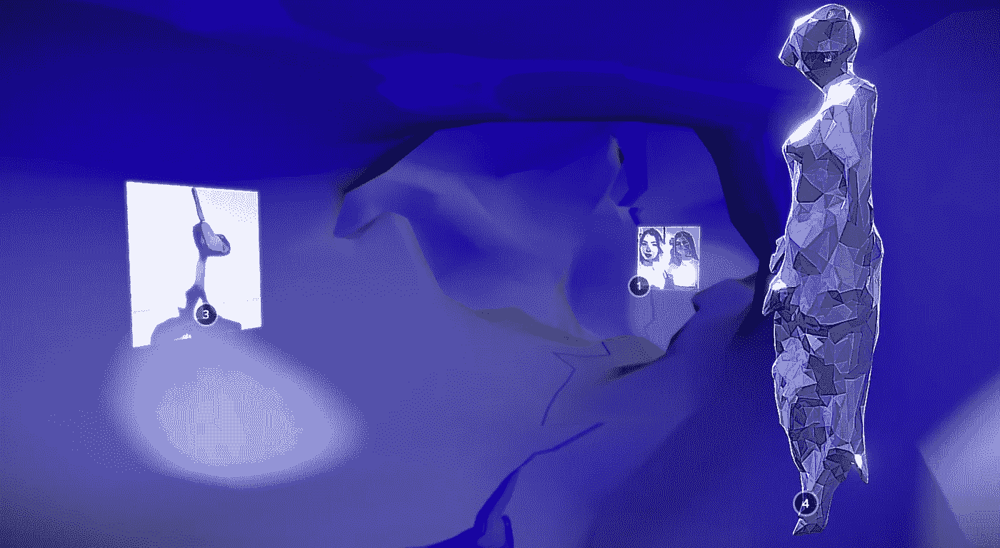

# VR 机器学习故事

> 原文：<https://medium.com/mlearning-ai/vr-machine-learning-stories-ce5f532dd7ee?source=collection_archive---------6----------------------->

## 认识一下 [MLearning.ai 顶级作家](https://medium.com/mlearning-ai/top/home)

[vRooML!](https://skfb.ly/6ZGBz)

3 拥有最好的移动学习 ai 故事的第三展厅。vRoomL！是一个展示数字艺术的空间(例如 [Panna — DATAsculpture](https://skfb.ly/6ZDzs) )，在我们的画廊中，我们还展示—在机器学习的帮助下以图像形式创作的 MLstories。所有的 VRspace 都是由 MLearning.ai 模型生成的。