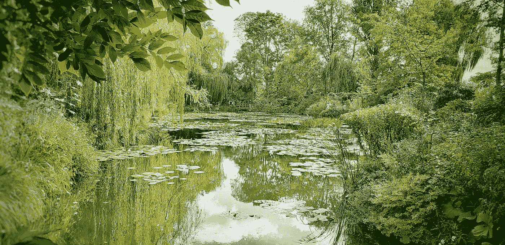
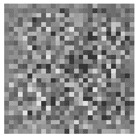
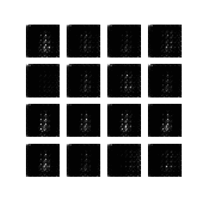
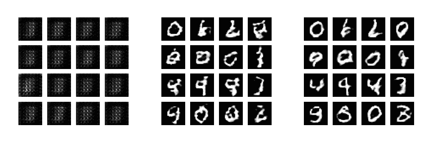
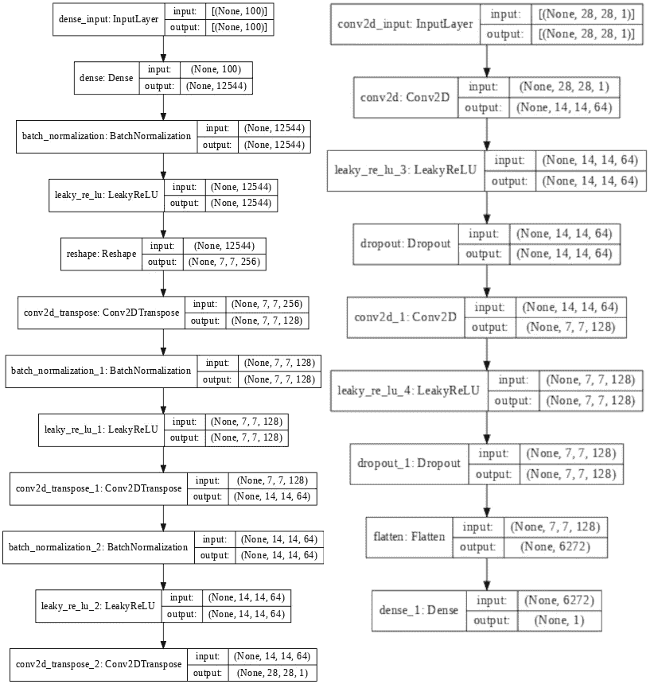
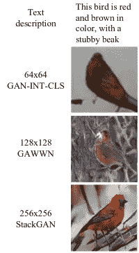

# 等等，那是莫奈的画吗？或者是电脑在它的阿甘！

> 原文：<https://medium.com/mlearning-ai/wait-is-that-a-monet-or-is-the-computer-at-it-a-gan-b9a56006a013?source=collection_archive---------0----------------------->

抱歉的双关语，但它不能帮助。我们今天在这里谈论你的计算机可以使用生成性对抗网络，或者更普遍地被称为 GANs，来创建令人惊奇的艺术品。

Photo by [Ricardo Isotton](https://unsplash.com/@isotton?utm_source=medium&utm_medium=referral) on [Unsplash](https://unsplash.com?utm_source=medium&utm_medium=referral)

## 甘是什么，跟莫奈有什么关系？

最初由 Goodfellow 在 2014 年与同事合作发表的一篇名为[生殖对抗网络](https://arxiv.org/abs/1406.2661)的论文中提出，作为他博士学位的一部分。

生成对抗网络(GANs)是指两个模型被开发出来并相互协调训练。这些模型要么是一个生成器，试图制作看起来真实的图像，要么是一个鉴别器，试图找出生成器制作的假图像。

一个很好的例子是，如果一个艺术家(创造者)试图复制一幅莫奈的画，而一个艺术评论家(鉴别者)试图辨别这幅画是莫奈的真迹还是赝品。

## 那么 GANs 是如何工作的呢？

一个制作赝品的艺术家会越做越好，特别是如果他们有一个艺术评论家给他们提供反馈的话。最终，艺术家创作出如此精美的赝品，以至于即使是最好的艺术评论家也无法分辨赝品和真品。

同样，发生器最终会变得如此擅长制造赝品，以至于鉴别器将无法确定哪个是赝品，哪个是真品。

GAN layout. Source [O’Reilly](https://www.oreilly.com/content/generative-adversarial-networks-for-beginners/)

上面的图像显示了一个 GAN 的通用版本，其中生成器网络从一个噪声向量开始，经过许多代，试图产生假图像。每次生成器生成新图像时，都会将其发送到鉴别器，鉴别器会将其与来自训练数据集的真实图像进行比较。

根据这一信息，鉴别器根据设置将图像标记为假的或非假的，或者两者的某种可能性。这个信息然后反馈给再次尝试的生成器，以此类推。

Starting noise image for generator by author.

所以我们从一个噪声向量开始，当可视化时，它看起来就像上面的图像。然后经过多次迭代(历元)，它开始形成一个类似目标的图像，在这种情况下是一组数字。下一张 GIF 展示了 75 个历元的结果，同时试图得到一组数字，目的是欺骗鉴别器。

Generated image using GAN from TensorFlow tutorial ([link](https://www.tensorflow.org/tutorials/generative/dcgan))

正如你所看到的，要得到一个完美的产品还有很多工作要做，但是你应该已经能够看到这些网络可以改善得多快。

为了进一步对比(或者如果 GIF 对你不起作用),这里是在 1、30 和 75 纪元时拍摄的过程快照。

GAN generated image showing epoch 1, 30, and 75

## 那么模特长什么样呢？

生成器结合了层、标准化和激活函数的阶段，将输入转换成类似于目标图像的东西。

另一方面，鉴别器使用卷积神经网络对照其训练数据检查输入，以查看是否看到假货。鉴别器因不正确的分类(即当它看到真实图像时称其为假的)而受到惩罚，而生成器因未能欺骗鉴别器而受到惩罚。

用于制作上述 GIF 的模型概述如下。当我们更详细地查看生成器和鉴别器时，将在后面的博客文章中讨论各个阶段的细节。

GAN generator (left) and discriminator (right) models

## 甘斯在哪里用过？

所以你可能会想，GANs 只能用来伪造图像，现在不是了。gan 在许多领域都有应用，每天都有更多的用途被发现。

例如，如果你喜欢最终幻想(想想 FF VIII，IX)游戏，那么你可能听说过它们的重制版。如果你知道重制版本中更新的图像很大程度上是由于 GANs，你会感到震惊吗？

你喜欢口袋妖怪吗？这里有一些有趣的例子，甘被用来制作新的口袋妖怪角色，就像这篇文章中的一样:

 [## 如何使用 GANs 创建独特的神奇宝贝

### 以及如何让它变得更好的想法

towardsdatascience.com](https://towardsdatascience.com/how-to-create-unique-pok%C3%A9mon-using-gans-ea1cb6b6a5c2) 

他们使用存储在 Kaggle 数据集中的口袋妖怪图像(链接如下),你可以随心所欲地使用它。

 [## 完整的口袋妖怪图像数据集

### 2，500 多张干净的贴有标签的图片，全部为官方艺术作品，适用于第 1 代到第 8 代。

www.kaggle.com](https://www.kaggle.com/hlrhegemony/pokemon-image-dataset) 

你有没有你最喜欢的书中的一小段文字，你希望你能看到它的图片？作者是否用大量细节描述了一个场景(如描述一个森林或花园)？然后 GANs 可以帮你把文字变成图片。

这方面的一个例子来自一组研究人员，他们使用了一种叫做 StackGAN 的 GAN，这种 GAN 将生成过程分成几个阶段，以产生更好的结果。他们的论文概述了使用这些模型来获取文本，如“这只鸟是红色和棕色的，有一个短粗的喙”和输出

Image from [StackGAN: Text to Photo-realistic Image Synthesis
with Stacked Generative Adversarial Networks](https://arxiv.org/pdf/1612.03242.pdf)

很不可思议，不是吗？好了，甘斯的介绍到此结束。我希望您现在已经更好地理解了什么是 GAN，以及随着每天都有越来越多的应用程序被开发出来，它们可以有各种各样的使用方式。

我期待着在未来更详细地探讨这个话题。如果你想阅读更多关于机器学习和数据科学的内容，那么就去看看我的其他帖子吧。

 [## 监督、非监督和强化学习。机器学习的三大支柱。

### 当人们谈论机器学习时，你有没有听到过他们提到监督学习或无监督学习…

medium.com](/mlearning-ai/supervised-unsupervised-and-reinforcement-learning-the-three-pillars-of-machine-learning-fd898f0c7c81)  [## 面向儿童的机器学习—决策树

medium.com](/mlearning-ai/machine-learning-for-kids-decision-trees-db9853dca27d)  [## 我会得到多少鸡蛋？线性回归可以告诉你。

### 你听说过这样一句话吗？不要在小鸡孵出来之前数你的小鸡。嗯，现在你不必用线性…

medium.com](/mlearning-ai/how-many-eggs-will-i-get-linear-regression-can-tell-you-d7d0e5968a4c)  [## 面向儿童的数据科学——如何让他们入门

### 机器学习领域在最近几年有了爆炸性的发展，所以为什么不教你的孩子使用简单的工具呢…

allanbond.medium.com](https://allanbond.medium.com/machine-learning-for-kids-1f47d656bee0)  [## 使用《我的世界》教儿童编程

### 学习编码几乎是我们的孩子的一个要求，随着劳动力从传统角色转向…

allanbond.medium.com](https://allanbond.medium.com/teaching-children-programming-using-minecraft-6a537d38f4dd) 

如果你喜欢这篇文章，请通过 [LinkedIn](http://linkedin.com/in/allanbond) 或 [Twitter](https://twitter.com/AllanJBond) 与我联系。