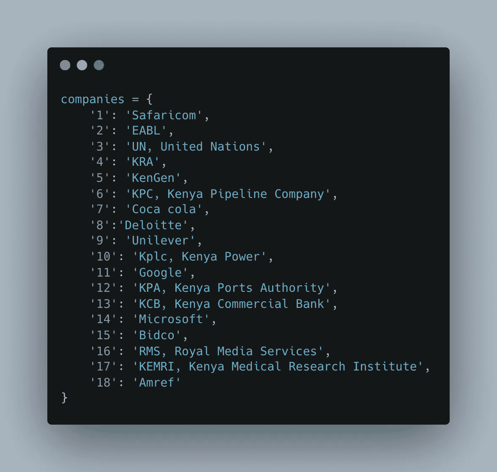
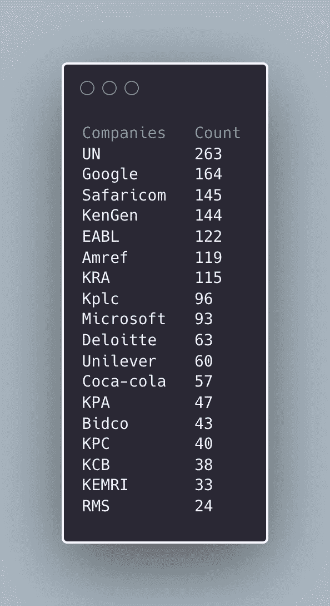
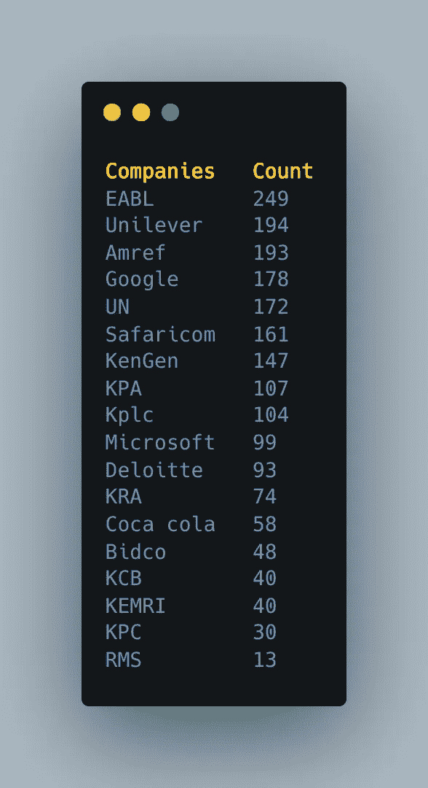

# 万吉库工作满意度指数

> 原文：<https://medium.com/mlearning-ai/wanjiku-job-desirability-index-ec1af4702078?source=collection_archive---------12----------------------->

twitter 上有一个名为“@ [wanjikureports](https://twitter.com/WanjikuReports/status/1473929269319553026) ”的账号发了一条有趣的推文，在 Twitter 上询问肯尼亚人想要的工作场所列表。

TL；博士找到笔记本用来制作下图的[这里的](https://github.com/dakn2005/wanjiru_report_job_index)

> 这篇文章已经更新

*编辑输出:*


*先前输出:*


Image by author

在这篇文章中，我描述了一个用于分析回复的过程的高级概述。

**第一步**

选择您的工具。我选了 Jupyter 笔记本，python，熊猫；您可以使用其他 BI 工具，如 tableau 和 power BI 等。

创建一个公司列表或字典，用来比较 tweet 回复。回复本身有不同的格式——文本*和数字*都有。下面是[推文](https://twitter.com/WanjikuReports/status/1473929269319553026)的截图供参考


下面是推文中提到的公司生产的字典。



Image by author

**第二步**

使用 Twitter API，检索对 tweet 的回复。为此，我使用了 postman，以 json 格式保存回复。在此阶段执行文本处理；这包括:

*   创建包含回复的列表
*   删除特殊字符，包括表情符号、象形图、标志等
*   删除停用词(如有必要)

**请注意**文本处理有细微差别，取决于手头的任务

第三步

到目前为止，您会注意到回复无法与公司列表完全匹配(一对一映射)。为了获得匹配，我们对每个回复进行标记化，并将每个标记上的部分匹配交叉引用到我们之前创建的字典中的每个公司。

对于部分匹配，根据分析要求使用了几种算法——根据本项目的要求，简单的部分匹配就足够了。为此选择的算法产生 0 到 1 之间的相似性指数，此后我们必须为匹配设置一个阈值(我将其设置为 0.75)。

```
if prob < 0.75 and len(splt) > 1:
    prob = similar(thestr, splt[1].lower())
if prob >= .75:
    output = selected
```

对于用数字表示的回复，直接使用这个数字作为字典中的关键字来检索公司名称。这算一个匹配

```
def returnFromNumeric(numstr):
    if 1 <= int(numstr) <= 18: #bounded range by dictionary keys
      splt = companies[numstr].split(',')
      return splt[0]
```

一旦建立了匹配，匹配的公司将被附加到输出列表中。

**第四步**

将输出列表转换为 pandas 数据框。按公司名称对每个清单进行分组，以获得最终的理货清单。

*请注意，这些排名并不科学，我在下面描述如何添加科学严谨性*

> 此输出已被编辑

*编辑输出:*



*之前的输出:*



Image by author

**第五步**

你可以用不同的格式来表示最终的列表，例如表格、文字云、条形图等。如前所述，产生的排名没有经过科学验证，因此我们进入第 6 步

**第六步**

为了给我们的排名增加科学的严谨性，我们必须使用不同的基于文本的定性数据分析方法进行进一步的分析。

这将包括[分析同现](https://tm4ss.github.io/docs/Tutorial_5_Co-occurrence.html)和词汇网络——使用 N 元图，这可以进一步建立在使用极性测量进行情感分析的基础上。

因为极性测量依赖于用英语表达的回复，所以当分析非英语回复时，它可能不那么有效。我们可以使用情感分析和共现的组合来更好地了解推断出的情感。

就是这样！所有工作(步骤 1-5)的笔记本可以在[这里](https://github.com/dakn2005/wanjiru_report_job_index)找到

敬快乐的 2022 年

[](/mlearning-ai/mlearning-ai-submission-suggestions-b51e2b130bfb) [## Mlearning.ai 提交建议

### 如何成为 Mlearning.ai 上的作家

medium.com](/mlearning-ai/mlearning-ai-submission-suggestions-b51e2b130bfb)