# 利用历史数据预测水的可利用性

> 原文：<https://medium.com/mlearning-ai/water-availability-prediction-using-historical-data-b9044bfddd76?source=collection_archive---------1----------------------->

Here we try to preserve the **“blue gold”** using data to forecast water level throughout the year and better regulate the daily supply over different regions

# 目录

1.  [问题](#2282)
2.  [背后的挑战](#6306)
3.  [数据收集和描述](#4e00)
4.  [预期结果](#b5aa)
5.  [基本工作流程](#a063)
6.  [已经探索了一些类似的方法](#8a53)
7.  [我们的解决方案路线图](#7505)

*   [EDA](#27ea)
*   [使用的指标](#90e7)
*   [数据预处理](#014f)
*   [特色工程](#940f)
*   [型号](#2cea)

8.[改进的范围](#e034)

9.[参考文献](#300b)

# 1.问题是

Acea 集团是意大利供水服务领域最大的多公用事业运营商之一，为 900 万居民供水。它在 Kaggle 上组织了这场比赛，以帮助预测一年中不同季节各种类型水体的水位。对于供水公司来说，预测水体*(水泉、湖泊、河流或含水层)*中的水位以处理日常用水至关重要。

在秋季和冬季，水体被补充，但在春季和夏季，它们开始排水，这种情况可能会变得乏味。为了帮助保护这些水体的健康，根据一年中每天的水位和水流预测最有效的水资源是非常重要的。

# 2.后面的挑战

Acea 小组提供了 4 种水体的数据，即水泉、湖泊、河流和含水层。虽然主要目的是相同的，即预测水的可用性，但事实是**每个水体都有如此独特的特征，以至于它们的属性相互之间没有联系**。这个问题使用的是完全相互独立的数据集。由于每个水体各不相同，相关的特征也各不相同。

确定这些特征如何影响每个水体的水可用性是一个挑战。因此，我们希望设计一种解决方案，帮助更好地了解水量，以便我们能够确保一年中每个时间间隔(日/月)的水可用性。

最重要的是要注意到一些特征，如**降雨量**和**温度**，它们出现在每个数据集**中，并不伴随日期**。事实上，降雨量和温度都会影响水位特征。这意味着，例如，1 月 1 日的降雨不会在同一天影响上述特征，而是在一段时间后。由于**我们不知道多少天/周/月之后的降雨会影响这些特征**，这是分析数据集时需要考虑的另一个方面。

# 3.数据收集和描述

数据已在[https://www.kaggle.com/c/acea-water-prediction/data](https://www.kaggle.com/c/acea-water-prediction/data)提供

有*九个不同的数据集*，完全**独立**且互不链接。Acea 小组处理四种不同类型的水体:泉水(*三个*数据集)、湖泊(*一个*数据集)、河流(*一个*数据集)和含水层(*四个*数据集)。每一个的简要说明:[链接](https://www.kaggle.com/c/acea-water-prediction/data)。

# 4.期待结果

下表显示了每个水体的预期特征。

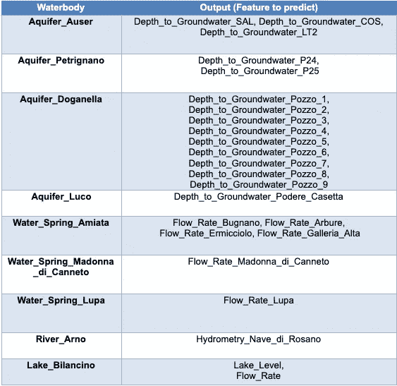

总之，我们想要生成四个数学模型，每一类水体(含水层、水泉、河流、湖泊)一个，可能适用于每一个单独的水体。

# 5.基本工作流程

预期管道的概述如下所示:

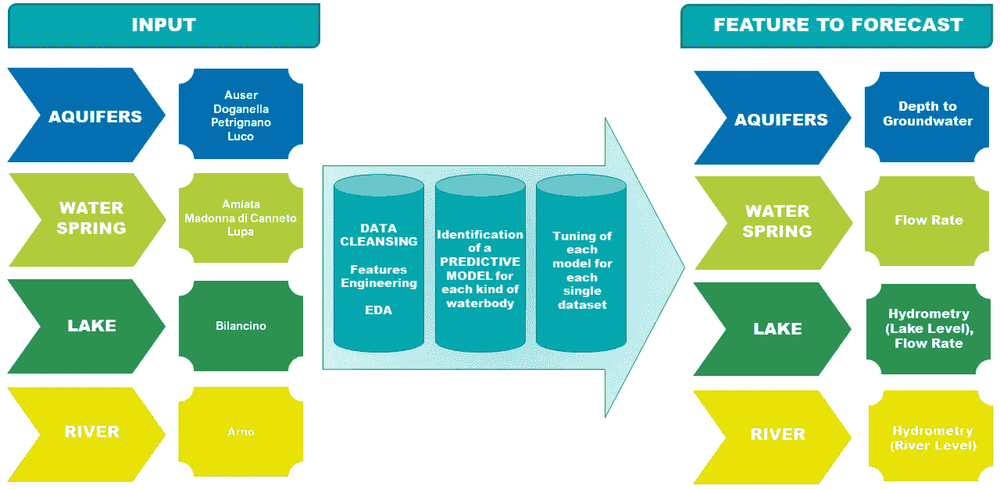

Input, Data Processing, and output for the four water bodies

# 6.已经探索了一些类似的方法

在以一种或另一种形式预测一个区域中的水位的领域中，已经进行了各种研究工作和实验。其中一些总结如下，以给出范围的简要概述:

*   *使用神经网络和神经模糊方法的短期水位预测，由 Bunchingiv Bazartseren，Gerald Hildebrandt，k .-p . Holz(*[*Link*](https://www.researchgate.net/publication/223259105_Short-term_water_level_prediction_using_neural_networks_and_neuro-fuzzy_approach)*):*本文演示了使用神经网络和神经模糊系统以及线性统计模型、自回归移动平均(ARMA)和自回归外生(ARX)进行水位的短期预测。验证期开始时线性模型的不稳定结果，以及对较长预测跨度的延迟响应，导致了较低的性能属性。选择人工神经网络模型是因为其预测能力优于所考虑的其他模型。
*   *使用机器学习开发湿地水位预测模型:韩国 Upo 湿地案例研究，作者:Changhyun Choi、Jungwook Kim、Heechan Han、Daegun Han 和 Hung Soo Kim(*[*Link*](https://www.mdpi.com/2073-4441/12/1/93?type=check_update&version=1)*):*本文使用各种机器学习模型，如 ann、DTs、RFs、SVMs。由于它具有许多非线性关系的变量，因此使用 **MI(互信息)**而不是常用的皮尔逊相关性来检查因变量和自变量之间的相关性。两个随机变量 X 和 Y 之间的互信息已经根据它们的联合概率分布 p(x，Y)来定义，如下所示:

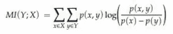

根据预测性能评估结果，随机森林最适合模拟水位。

*   *c . Castillo-botón、D.Casillas-Pérez、C. Casanova-Mateo、L. M. Moreno-Saavedra、B. Morales-Díaz、J .桑斯-高山重友、P. A. Gutiérrez 和 s . sal cedo-桑斯利用机器学习和基于持久性的技术对水电站大坝水位进行分析和预测* ( [*链接*](https://www.mdpi.com/2073-4441/12/6/1528/htm) ):本文涵盖长期和短期预测测试了一组模型，包括不同类型的神经网络、支持向量回归(SVR)或高斯过程。原始数据是每日的，因此为长期和短期分析进行了**每周汇总**。*这改善了水库蓄水位变化差异的表现；否则，较小时间范围内(每天或每小时)的差异将太小且不稳定，无法正确训练模型。*根据变量的类型，执行平均值或总和。根据 RMSE(均方根误差)的最佳总体结果是通过配置季节数据、时间分区获得的，该配置为每个季节使用四种不同的 ML 模型。根据 MAE(平均绝对误差),使用配置标准数据，使用 SVR 算法进行时间分区，获得了最好的总体结果。

# 7.我们的解决方案路线图

为了设计有效的解决方案，首先，我们使用探索性数据分析(EDA)来深入分析数据集中的相互关系。

## 电子设计自动化(Electronic Design Automation)

当每个数据集中的特征按照其各自的目标特征进行检查时，得出以下见解(请参考 GitHub [链接](https://github.com/prachij94/Acea-smart-water-analytics)中的 EDA 笔记本):

*   *在含水层(~60%到 85%)、湖泊(~85%)、河流(~85%)、泉水(~55%到 75%)的大部分数据集中，都有很大比例的* ***缺失值*** *，包括地下水埋深、降雨量、温度、流量等主要特征。*

查看以下图表，了解每个水体数据集中每个要素的**缺失值**的百分比-

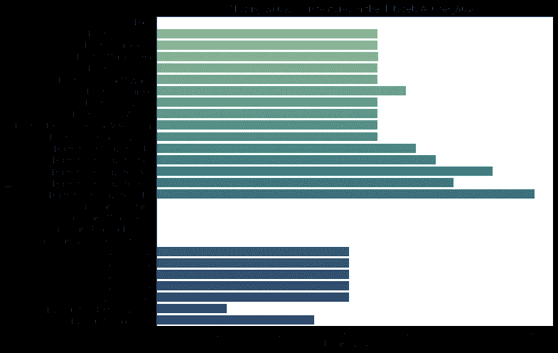

Aquifer Auser missing values

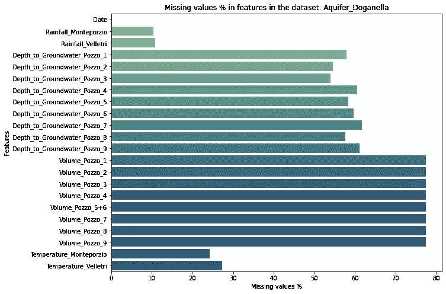

Aquifer Doganella missing values

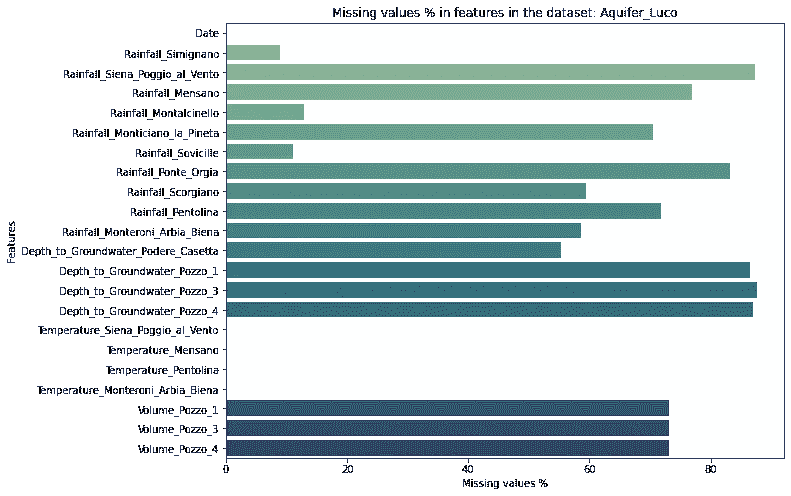

Aquifer Luco missing values

Aquifer Petrignano missing values

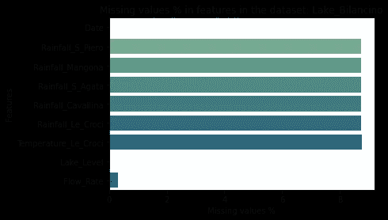

Lake Bilancino missing values

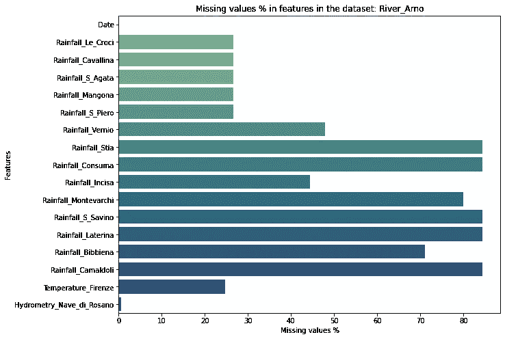

River Arno missing values

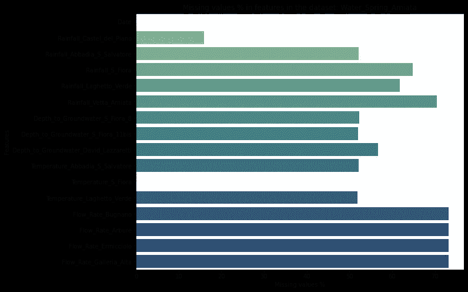

Water Spring Amiata missing values

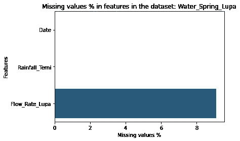

Water Spring Lupa missing values

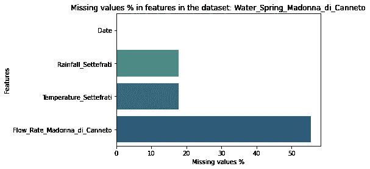

Water Spring Madonna Di Cannneto missing values

参见示例热图，研究以下每种水体类型的**相关性**:

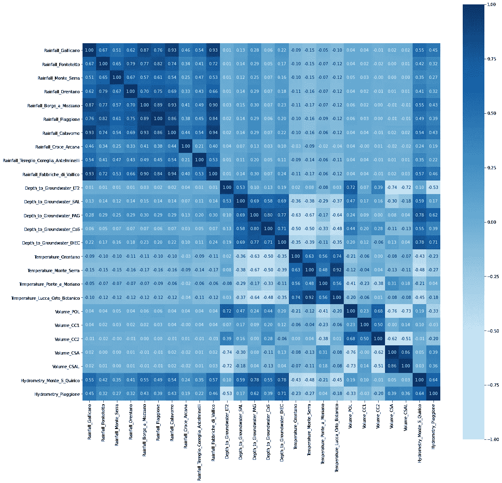

Aquifer Auser correlation (refer EDA pynb [GitHub](https://github.com/prachij94/Acea-smart-water-analytics) for a clearer plot)

*   *大多数含水层与降雨量和温度特征呈正相关，与深度、水文测验和体积特征呈负相关。*

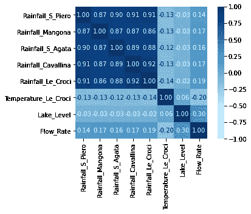

Lake Bilancino correlation

*   *湖泊与降雨量正相关。*

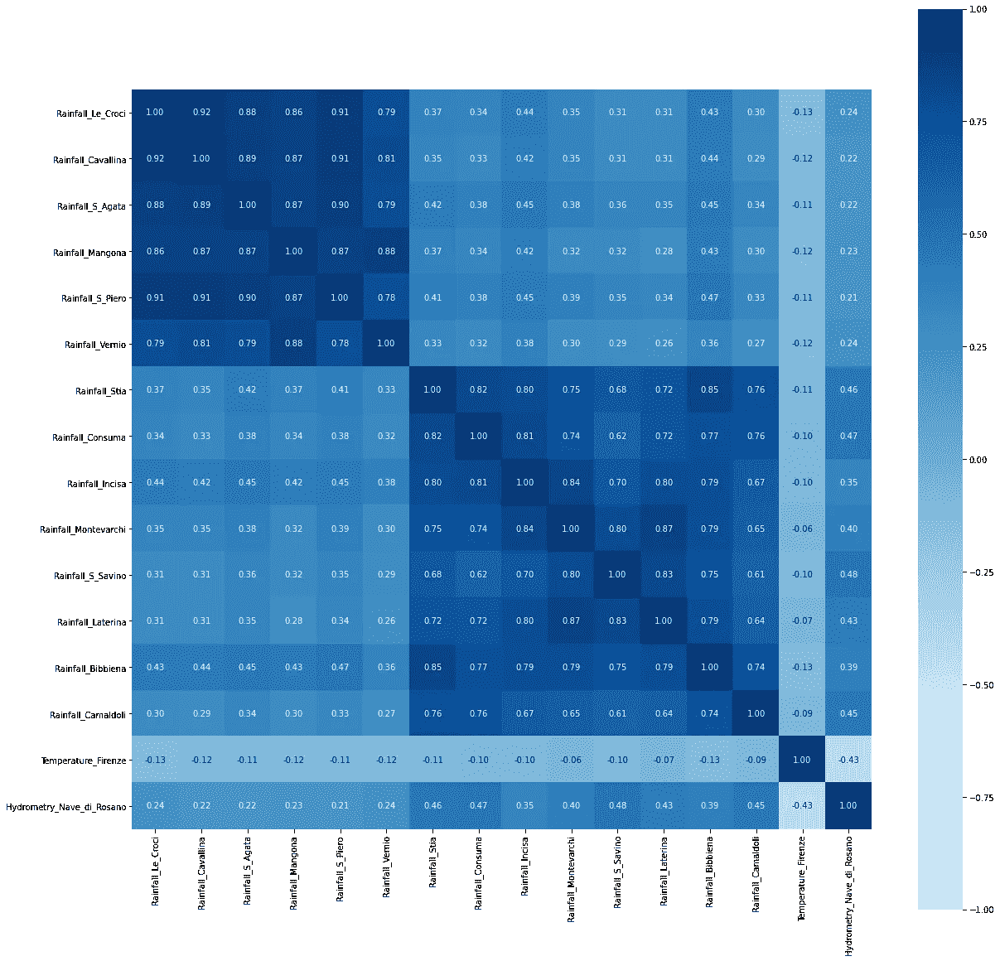

River Arno correlation (refer EDA pynb [GitHub](https://github.com/prachij94/Acea-smart-water-analytics) for a clearer plot)

*   *河流与降雨量呈正相关，与气温呈弱负相关。*

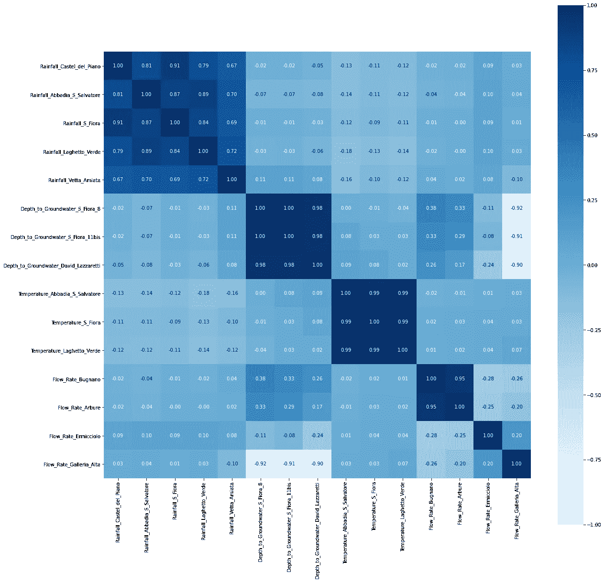

Water Spring Amiata correlation (refer EDA pynb [GitHub](https://github.com/prachij94/Acea-smart-water-analytics) for a clearer plot)

*   *对于水泉，降雨量、温度与地下水埋深、流量特征呈强正相关，弱负相关。*

查看**单变量分析**的图，了解下面含水层 Auser 中的一个特征。参考 EDA [pynb](https://github.com/prachij94/Acea-smart-water-analytics) 了解所有其他类似的图。

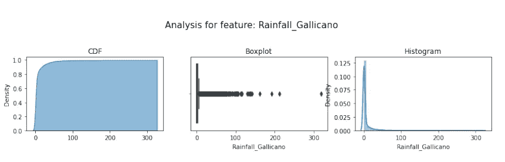

Aquifer Auser Rainfall feature univariate analysis

**观察:**

*   *在 100 毫米至 300 毫米的降雨特征中有相当数量的异常值，而在含水层的水文测验、体积特征中则很少。*
*   *在湖泊中，降雨量和流量特征存在大量的异常值。*
*   *在阿诺河，在降雨特征中，有相当数量的异常值，范围达到 120 mm，在水文测验特征中有一些异常值。*
*   *水泉在降雨量特征方面有相当数量的异常值，其范围可达 130 毫米。*

现在让我们评估单个水体的**年度**和**月度**观测值，例如含水层 Auser(参考 [GitHub](https://github.com/prachij94/Acea-smart-water-analytics) 了解所有其他地块及其各自的观测值):

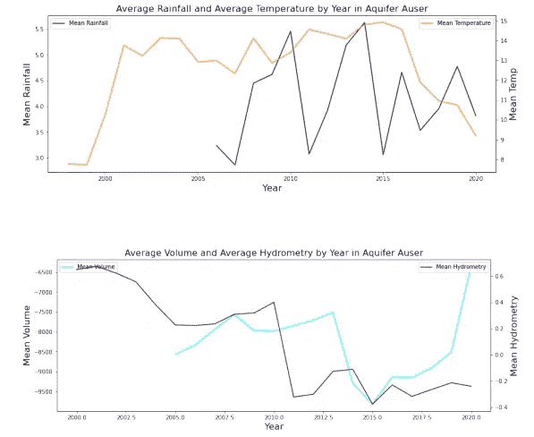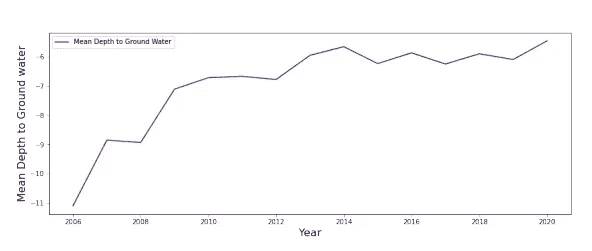

*   *地下水每年的平均深度持续下降&到 2020 年平均下降到-6 毫米。当平均降雨量和温度分别为 4 毫米和 9 度时，这种情况就会发生，与其他年份的平均值相比，这是适中的。此外，2020 年的平均体积和平均水文密度分别为-6500 cm 和-0.2 m，这是非常低的。*

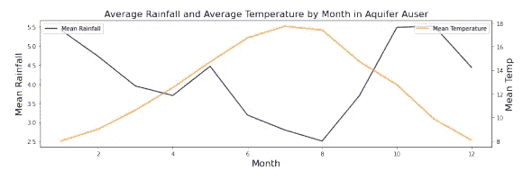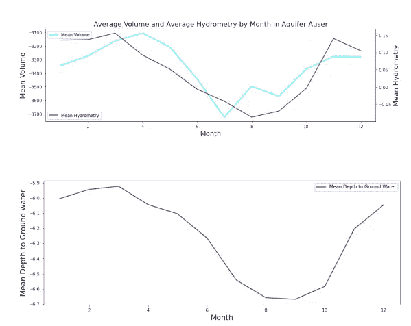

*   平均最大平均降雨量记录在 10 月或 11 月。最高温度出现在七月或八月。7 月和 8 月的平均体积也最高，为-8700 cm，平均水文测验为-0.10 m。与此同时，地下水的平均深度最大为-6.7 米

## 使用的指标

我们为这个问题选择了自己的度量:**中值绝对误差(MAE)、均方根对数误差(RMSLE)和 R 平方(R )** ，原因如下-

*   *MAE* 对异常值稳健，而 RMSE 则不然。使用中间值是修整极值的一种极端方法。因此，中位数绝对误差减少了偏向低预测。此外，从解释的角度来看，MAE 非常适合。
*   *使用 RMSLE* 是因为目标变量的低估是不可接受的，但高估是可以容忍的。RMLSE 因低估实际值而招致更大的损失。此外，当预测值和实际值都是巨大的数字时，我们不想惩罚预测值和实际值之间的巨大差异。RMSLE 度量(与 RMSE 不同)只考虑预测值与实际值之间的相对误差，误差的大小并不显著。
*   高 *R* 意味着观察值和预测值之间的相关性高。它显示了我们的回归模型与一个非常简单的模型相比有多好，该模型仅预测来自作为预测的训练集的目标的平均值。

## 数据预处理

现在处理数据，以消除 EDA 中发现的异常。

首先，解决了所有数据集中缺失值的主要问题。它分两步进行预处理:

*   最初只获取目标要素不为空的行。使用具有选定最小误差 k 值的 ***knn 插补*** 对独立特征中的缺失值进行插补(这是通过用我们选定的指标绘制 k 值来完成的，即 *MAE、RMSLE 和 R2 评分)*
*   使用完整的数据集(具有填充的要素)通过随机森林或其他基线模型(如线性回归、决策树或 KNN)来预测相应目标要素中的缺失值。

检查以下代码片段和一个水体的绘图:

For Aquifer Auser

然后我们会看到不同的图表来比较这些模型误差指标:

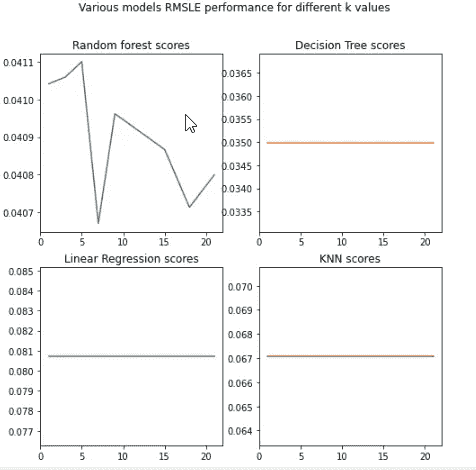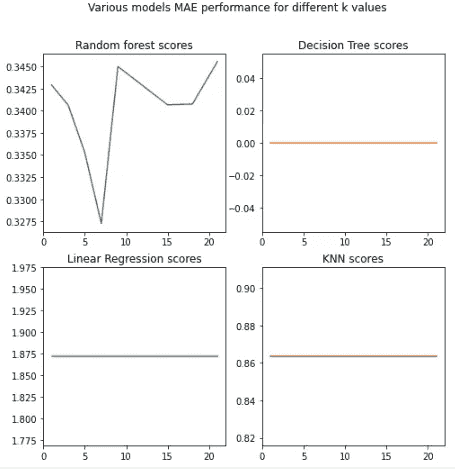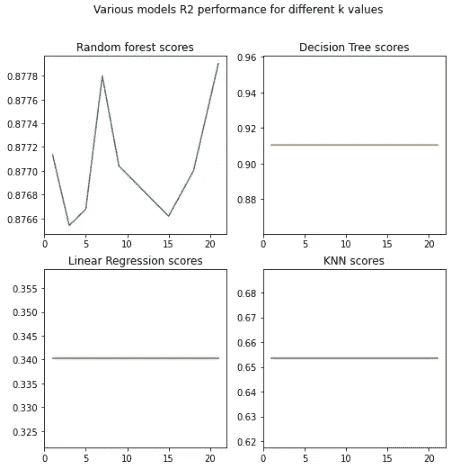

然后，我们从所有 3 个度量中获得的最佳模型和 k 值用于预测目标特征中的缺失值。在本例中，使用随机森林回归量得出 k=15。

这样，我们可以得到 9 个 100%填充值的数据集。

## 特征工程

主要目标是最终有 4 个模型，每个水体一个。此外，我们必须考虑到由于降雨和温度的影响，变量中可能存在的延迟。因此，我们根据不同的持续时间(即每天、每周、每月和每年)取*平均值*，将数据集整合到各自的水体类型中。

然后，我们找出当变量被*移动*几天、几周或几个月时，每个持续时间模型中的*中位数绝对误差趋势*。因此，每个水体的最终数据将具有受降雨量和温度影响的目标变量的实际值。

例如，在含水层中，我们首先取每个含水层数据集中所有降雨、温度、体积、水文测验和深度特征的平均值，然后将它们合并，再根据日期列取日平均值、周平均值或月平均值。这为我们提供了含水层每日、含水层每周和含水层每月的数据集。

在每个新数据集中，我们将每个特征值移动 1 到 31 天、1 到 52 周和 1 到 12 个月。然后使用随机森林回归器，记录 MAE 最低的持续时间，以预测变化的特征(即降雨和温度效应最合适)。

用于移位的示例代码片段:

观察 26 天(含水层 _ 每日)、8 周(含水层 _ 每周)和 2 个月(含水层 _ 每月)的最佳结果，我们通过向后移动 56 天(8 周或 2 个月)的值来制作最终含水层数据集。

同样，对所有水体进行分析，最终得到 4 个具有降雨和温度真实影响的特征工程数据集。

## 模型

数据集首先*归一化*以去除负值。然后尝试几种类型的模型以获得最小误差度量/最佳预测。在 GridSearchCV 中，尝试了 knn、线性回归、随机森林、SGRegression、决策树、XGBoost、Adaboost 以及严格的超参数调优。但是最好的结果是在使用多层感知器时观察到的。这是通过使用层数、漏失、优化器、自定义损失函数&指标(此处为 RMSLE)、batch_size、每个水体的时期等的最佳组合实现的。

四个水体的*训练和验证图*也可以在 [GitHub](https://github.com/prachij94/Acea-smart-water-analytics) 中的 pynb 模型中找到。以下是他们的一些快照:

**含水层模型**(在此找到其完整的张量板

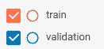

color coding for the graphs

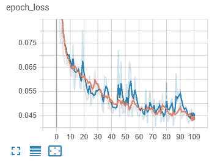

Aquifer model loss per epoch

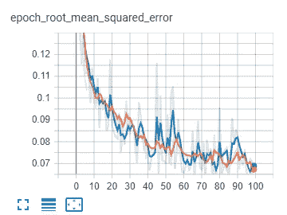

Aquifer model rmse per epoch

**湖模型**(此处可找到其完整的冲浪板

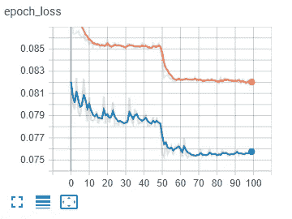

Lakes model loss per epoch

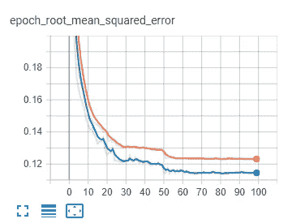

Lakes model rmse per epoch

**河模型**(此处找到其完整的张量板

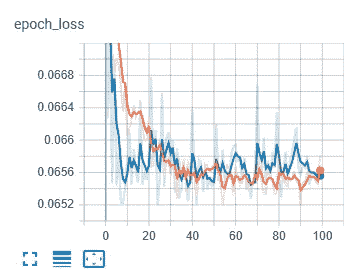

Rivers model loss per epoch

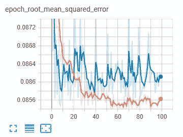

Rivers model rmse per epoch

**水泉型号**(在此找到其完整的张量板

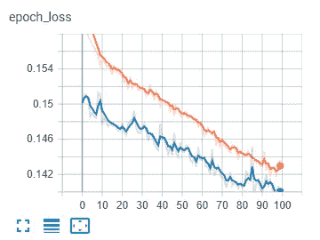

Water Springs model loss per epoch

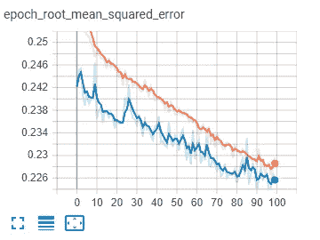

Water Springs model rmse per epoch

虽然大多数算法在预测含水层方面表现良好，但 MLP 能够捕捉到每种水体类型的最少预测。下面是不同型号的 R2 分数的对比总结。

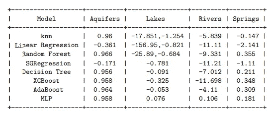

因此，在训练时，最好的 MLP 模型的日志和权重被保存下来，以便将来更快地访问模型。

保存的权重用于在问题的 flask 应用程序中加载相应的模型。它已经部署在 [Heroku](https://www.heroku.com/) 上。该应用程序可在[https://acea-flask-api.herokuapp.com/index](https://acea-flask-api.herokuapp.com/index)访问。请看下面的快照。

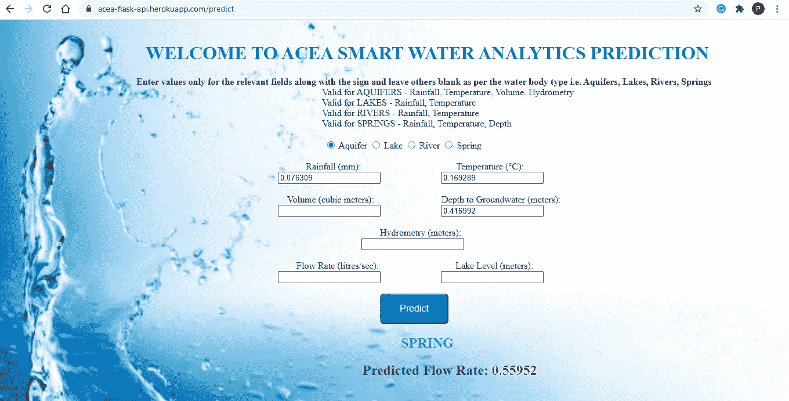

The web application to access the predictions

# 8.改进的余地

已经探索了各种类型的机器学习算法和 MLP 来解决该问题。因此，现在可以说探索更多像 CNN 或 LSTMs 这样的神经网络可以产生良好的结果。此外，还可以测试线性统计模型，如自回归移动平均(ARMA)和自回归外生(ARX ),以捕捉数据集中的季节性趋势。

# 9.参考

*   [https://www . research gate . net/publication/223259105 _ 短期 _ 水位 _ 预测 _ 使用 _ 神经网络 _ 和 _ 神经模糊 _ 方法](https://www.researchgate.net/publication/223259105_Short-term_water_level_prediction_using_neural_networks_and_neuro-fuzzy_approach)
*   [https://www.mdpi.com/2073-4441/12/1/93?type=check_update&版本=1](https://www.mdpi.com/2073-4441/12/1/93?type=check_update&version=1)
*   [https://www.mdpi.com/2073-4441/12/6/1528/htm](https://www.mdpi.com/2073-4441/12/6/1528/htm)
*   [https://www . research gate . net/publication/328086006 _ 短期 _ 用水 _ 需求 _ 预测 _ 使用 _ 机器 _ 学习 _ 技术](https://www.researchgate.net/publication/328086006_Short-term_water_demand_forecasting_using_machine_learning_techniques)
*   [https://skemman.is/bitstream/1946/32366/1/HallaMarinos.pdf](https://skemman.is/bitstream/1946/32366/1/HallaMarinos.pdf)
*   [https://machine learning mastery . com/KNN-attraction-for-missing-values-in-machine-learning/](https://machinelearningmastery.com/knn-imputation-for-missing-values-in-machine-learning/)
*   【https://www.techiediaries.com/flask-tutorial-templates/ 
*   [https://www . geeks forgeeks . org/python-pandas-data frame-ffill/](https://www.geeksforgeeks.org/python-pandas-dataframe-ffill/)
*   [https://keras.io/api/losses/#creating-custom-losses](https://keras.io/api/losses/#creating-custom-losses)
*   [https://www.appliedaicourse.com/](https://www.appliedaicourse.com/)

问题的所有 pynb 都可以在 **GitHub** 链接找到:[https://github.com/prachij94/Acea-smart-water-analytics](https://github.com/prachij94/Acea-smart-water-analytics)

谢谢你一直读到最后！请在我的 **LinkedIn** 个人资料:[https://in.linkedin.com/in/prachi-jain-bb3750102](https://in.linkedin.com/in/prachi-jain-bb3750102)中分享你的疑问、反馈或任何能帮助我更好地学习一二的东西