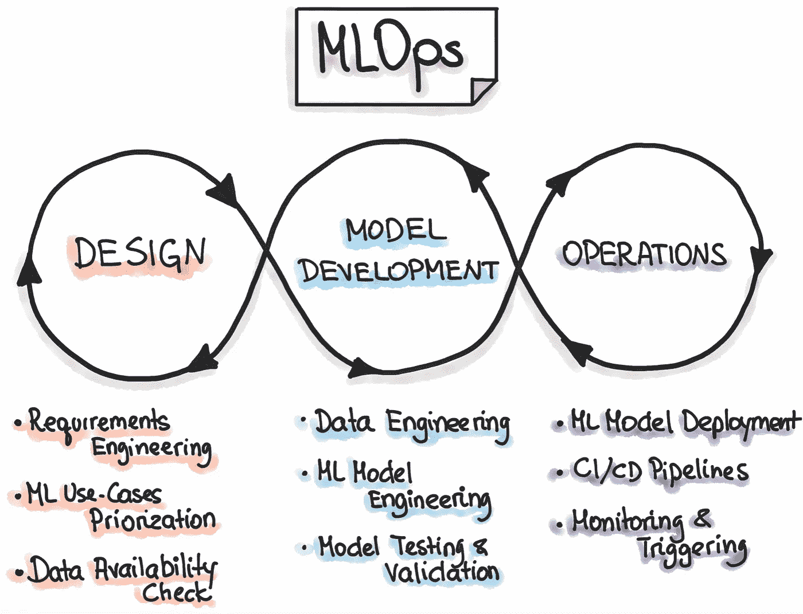
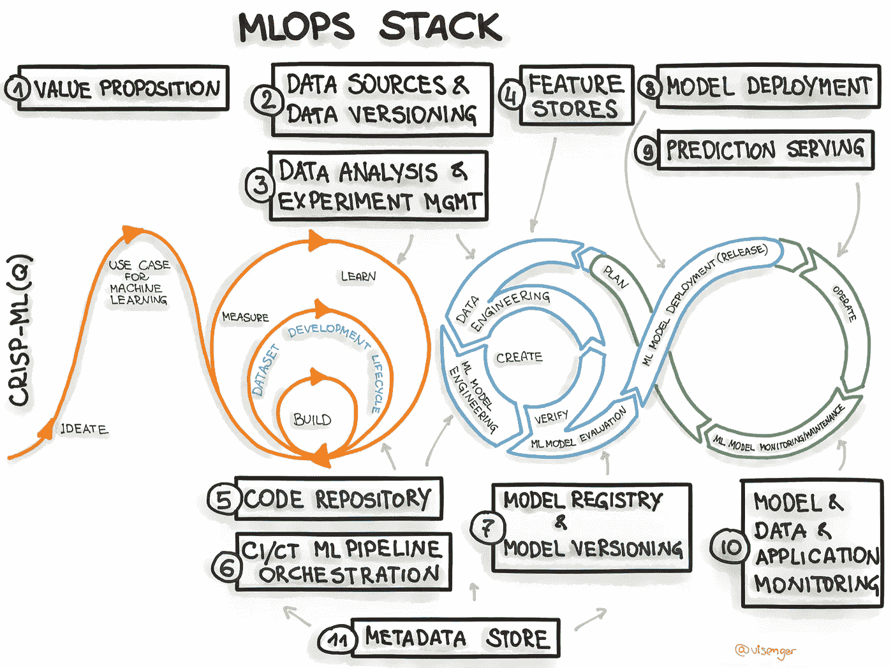

# 使用 MLOps 在模型管理中获得更大成功的方法

> 原文：<https://medium.com/mlearning-ai/ways-to-achieve-greater-success-in-model-management-with-mlops-ee4475ac04bb?source=collection_archive---------4----------------------->

Source: <a href=”[https://www.vecteezy.com/free-vector/woman](https://www.vecteezy.com/free-vector/woman)">Woman Vectors by Vecteezy</a>

# 介绍

如今，数据科学家的角色越来越多样化。处理数据清理、分析、特征工程和数据建模只是数据科学项目的一个阶段。下一阶段涉及模型的运作。在这个阶段，数据科学家需要与软件工程师合作，帮助将建模管道部署到生产中。

当涉及到数据科学项目管理时，很少会出现问题。

1.  如何维护用于训练模型的特征？
2.  如何对模型训练和推理管道的代码做更好的版本控制？
3.  模型需要重新训练的频率是多少？
4.  如何维护模型版本并比较旧模型和新模型的性能？
5.  如何管理模型构建版本的部署？
6.  如何在生产中监控模型性能？

所有这些问题的答案都可以通过实现机器学习模型操作化管理(MLOps)框架来解决。让我们从理论上了解一下 MLOps。

# MLOps 过程

随着机器学习和人工智能在软件产品和服务中变得越来越普遍，我们必须开发最佳实践和工具来测试、部署、管理和监控现实世界生产中的 ML 模型。

MLOps 过程可以分为三个基本阶段。让我们逐一研究每个阶段。

1.  **设计**:收集需求，理解数据，检查数据可用性，并对我们的需求进行优先排序。
2.  **开发:**建立数据工程管道(将数据从源系统带到分析系统的 ETL 过程)、特征工程、模型训练和验证。
3.  **实施:**部署最新的模型版本，创建 CI/CD 管道，触发新的构建并监控模型的性能。

这里有一个图表可以帮助你更好地理解这个过程。

mlops process. source: [https://ml-ops.org](https://ml-ops.org)

# MLOps 组件

现在，您已经了解了 MLOps 流程，让我们来看看在该流程中有用的不同组件。

1.  **自动化&连续 X:** 用 CI/CD 管道将自动化引入模型训练和模型部署过程。CI/CD 管道通常与软件构建和部署过程相关。这里，我们使用 CI/CD 管道来构建和部署 ML 资产。这可以称为持续培训(CT)和持续监控(CM)。
2.  **版本控制:**使用版本控制工具如 git 来存储代码文件，并使用 DVC 来维护数据版本。
3.  **监控:**模型性能随时间而下降。这就是所谓的模型漂移。实现实验跟踪，以存储对监控模型性能至关重要的模型度量。还需要跟踪数据质量，以确保数据配置文件与模型训练时的数据配置文件相似。这就是所谓的数据漂移。有不同的工具和方法可以用来监控数据漂移。
4.  **再现性:**在机器学习流水线中，再现性意味着给定类似的输入，数据处理、ML 模型训练和 ML 模型部署的每个阶段都应该交付相同的结果。这有助于您维护所使用的功能集和功能工程技术。

mlops stack. source: [https://ml-ops.org](https://ml-ops.org)

# 结论

我希望这篇文章能让您对 MLOps 有所了解，并了解它如何提高数据科学项目的生产率。这是对 MLOps 的一个简短总结，我鼓励你通过这个[链接](https://ml-ops.org)了解更多。

 [## Mlearning.ai 提交建议

### 如何成为 Mlearning.ai 上的作家

medium.com](/mlearning-ai/mlearning-ai-submission-suggestions-b51e2b130bfb)