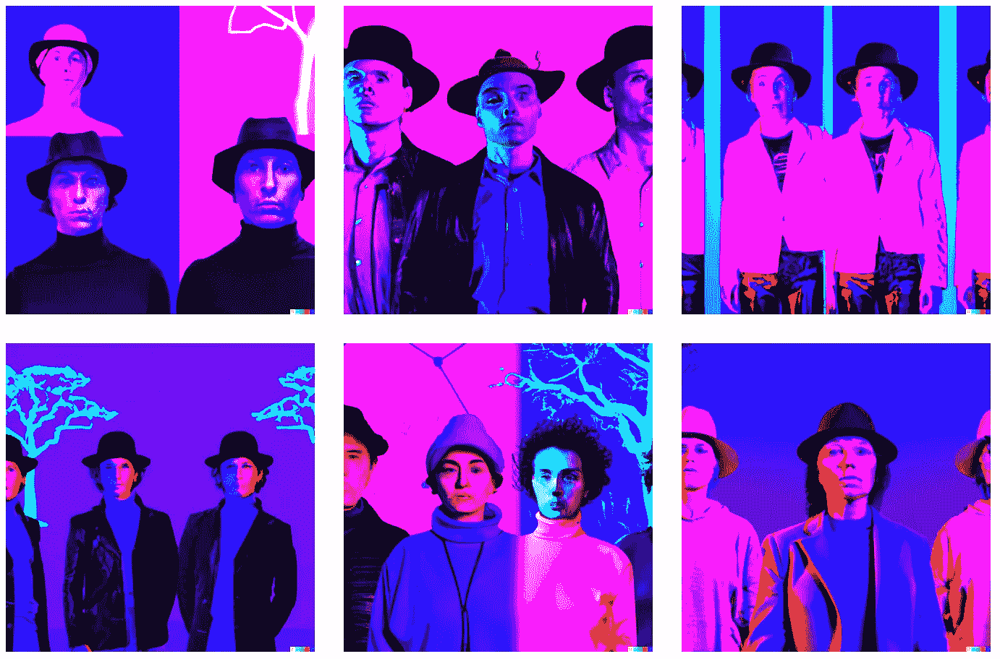

# 我们都是人工智能艺术家

> 原文：<https://medium.com/mlearning-ai/we-are-all-ai-artists-f4c16c28712c?source=collection_archive---------4----------------------->

## [机器学习艺术](https://mlearning.substack.com/p/train-your-ai-art-generator-from?r=z7zu8&s=w&utm_campaign=post&utm_medium=web)

## 你的人工智能艺术之旅从这里[开始](https://mlearning.substack.com)

[**“**Every man is an artist.**”** Joseph Beuys — AI artists](/mlearning-ai/is-ai-art-really-art-a363073d62d0)

在 2019 年人工智能 artists.org 发布会上，[Dariusz Gross # data cultor](https://medium.com/u/6d3244e0bdcd?source=post_page-----f4c16c28712c--------------------------------)预测“**我们都将成为人工智能艺术家**”

约瑟夫·博伊于斯的宣言每个人都是艺术家。**实现了。 [**机器学习**](https://mlearning.substack.com/p/train-your-ai-art-generator-from?r=z7zu8&s=w&utm_campaign=post&utm_medium=web) 已经成为一种民主可用的工具，可以唤醒任何人天生的创造需求…**