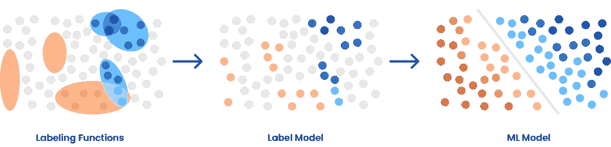
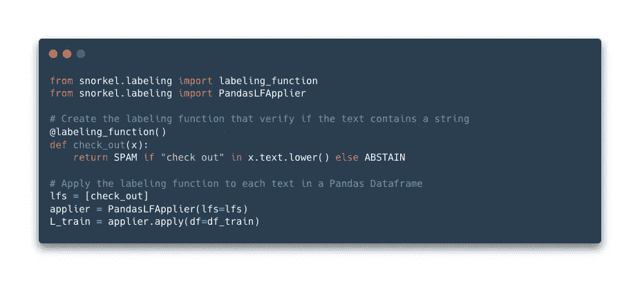

# 监管不力—从更少的信息中学习

> 原文：<https://medium.com/mlearning-ai/weak-supervision-learn-from-less-information-dcc8fe54e2a5?source=collection_archive---------6----------------------->

这篇文章是我上一篇关于[半监督学习](/mlearning-ai/semi-supervised-learning-making-the-most-of-noisy-data-5fbc711d2384)的延续。它旨在通过引入扩展到半监督学习之外的**弱监督**的概念来进一步探索未标记数据的问题。

Photo by [Benjamin Smith](https://unsplash.com/es/@ifbdesign?utm_source=medium&utm_medium=referral) on [Unsplash](https://unsplash.com?utm_source=medium&utm_medium=referral)

在机器学习中，**弱监督**是一种技术，在这种技术中，给机器学习算法很少的信息来学习。这与传统的监督学习形成对比，在传统的监督学习中，机器学习算法被给予一大组训练数据，以及每个数据点的正确答案。

弱监管是一种相对较新的技术，为了确定它的有效性，还有很多研究要做。然而，早期的结果表明，这是一种有前途的方法，它可能能够用更少的数据获得与传统监督学习类似的结果。

弱监督的一个主要优点是，它可以用来**从传统监督学习**中难以或不可能获得的数据中学习。例如，可能很难或不可能获得某个数据点的正确答案，因为答案是未知的。在这种情况下，弱监督可以用来从数据本身学习，不需要知道答案。

监管不力背后的一个重要动机是...

> 手工标记的成本和不灵活性是实际部署机器学习的关键瓶颈( [*弱监督:机器学习的新编程范例*](https://dawn.cs.stanford.edu/2017/07/16/weak-supervision/) *)*

此外，机器学习和深度学习模型今天试图解决的问题**如此复杂**以至于它们需要大量的数据。

侧重于优先考虑数据而不是模型本身的方法，这种方法近年来发展很快；被称为**以数据为中心的一个** I

# 以数据为中心的人工智能和弱标签

谷歌大脑研究实验室的创始人吴恩达是将数据置于机器学习中心这一理念的先驱之一。

AI 应用(基于机器学习模型)面临的一个主要问题是**标注**。事实上，对同一分类问题的不同标注导致了一个混乱的模型。例如，如果两家公司用不同的标签注册相同的产品，人工智能系统将无法看到这些产品是相同的，也无法将它们归类在一起。

弱监管开始在这场辩论中占据一席之地，因为它旨在重新设计标签，并拥有更好地理解数据的模型，而不是简单地依赖数据集的纯标签。

那些新标签被称为**弱标签**，因为*它们有额外的信息，这些信息并不直接表明我们想要预测的* ( [弱监管简介](https://www.oreilly.com/library/view/practical-weak-supervision/9781492077053/ch01.html#:~:text=What%20Is%20Weak%20Supervision%3F,inexact%2C%20or%20otherwise%20less%20accurate))。它们也被认为是有噪声的，因为它们的分布有一定的误差。

然而，即使这些标签看起来对要训练的模型是不好的，但是在强标签旁边使用弱标签可以改善学习，尤其是如果问题很复杂并且有许多特征的话。请注意，弱标签并不是使用弱监管的唯一方式，让我们深入了解不同的类型和技术…

# 弱监管的不同类型和技术

按照定义的方式，弱监管仍在发展中。有人把半监督学习放在弱监督领域，有人不放。在这里，我们的想法是对弱监督的应用及其背后的技术有一个全面的概述。

监管不力可适用于三种情况:

*   **不完全监督**:最常见的情况是一小部分训练数据被标记，而另一部分没有被标记。我在我的[上一篇文章](/mlearning-ai/semi-supervised-learning-making-the-most-of-noisy-data-5fbc711d2384)中介绍了超越它的主要技术，但是我将在以后回忆它们。
*   **监督不准确**:标签在那里，但没有提供问题所需的准确信息的情况。例如，预测特定品牌的汽车价格，但只有其他品牌的数据。这仍然是有用的信息，但不准确。
*   **监督不准确**:标签包含错误的情况，众包经常出现这种情况。的确，**众包**就是对来自有偿工作者的数据进行标注。*亚马逊的 Mechanical Turk* 是众包最著名的例子平台。然而，一些标记数据集的工作人员可能是垃圾邮件发送者，或者只是在处理过程中分心，从而导致标签中的错误。

现在让我们看看****技法**背后的那些情景:**

**对于不完全监督，**半监督学习**、**主动学习**和**迁移学习**是解决标签缺失问题的三种技术。**

*   ****半监督学习**是一组方法，通过将预测作为伪标签，使用已经标记的数据来创建和扩展数据集。因此，可以基于具有强标签和伪标签(来自先前的预测)的新训练数据集来训练模型。**
*   ****主动学习**是之前一套方法的扩展，在人类的帮助下，旨在通过关注能够为模型提供最多信息的未标记数据点来获得更多标记数据。因此，由于这些新标签，模型表现得更好。**
*   ****迁移学习**是一种技术，包括使用已经在另一个数据集上训练过的模型，将它们应用于感兴趣的问题。这称为微调，两个数据集必须相似。**

**在不精确的监督情况下，使用**多实例学习**是获得大多数不精确标签的最佳技术。**

*   ****多实例学习**是*一种弱监督学习，适用于我们有训练样本但对这些训练样本的标签不完全了解的情况。这些训练示例被分组为称为* ***包*** *的集合。在某个包内，******虽然彼此不同，都是*** ***还是类似的*** *。* ***一个标签*** *是为 t* ***他整个包*** *而不是那个包*内的具体实例提供的([弱监督介绍](https://www.oreilly.com/library/view/practical-weak-supervision/9781492077053/ch01.html#:~:text=What%20Is%20Weak%20Supervision%3F,inexact%2C%20or%20otherwise%20less%20accurate))。因此，可以对与包中的实例相似的实例进行分类。****

****最后，对于不准确的监管，将不好的标签分组在一起，用**数据工程**或者更好的**众包流程**进行纠正。这个想法是要么防止众包的错误，要么建立数据审计，以便识别和修复错误。****

# ****数据编程和通气管流量****

******数据编程**是创建**标签函数**为模型的训练实例获取更多标签的过程。数据编程和弱监督相关联，以从预先构建的标记函数中有效地创建那些弱标记。****

****在机器学习到来之前，区分经典编程中使用的**数据编程**和**基于规则的分类器**非常重要。事实上，基于规则的分类器是一个程序，它将根据一些明确编写的规则对数据点进行分类。这不是数据编程所做的，因为它不直接对数据点进行分类，而是创建用于训练模型的标签，该模型将对数据点进行分类。****

********

****From [Snorkel.ai](http://Snorkel.ai) [article](https://snorkel.ai/weak-supervision/)****

****[**通气管流**](https://snorkel.ai/) 是一个平台/python 库，允许创建标签函数或使用现有模型(标签模型算法)来构建或扩展训练数据集。****

****通气管 API 的标签函数(LFs)示例:****

********

****Made with [carbon](https://carbon.now.sh)****

****[在这里](https://github.com/snorkel-team/snorkel-tutorials)你可以找到浮潜团队制作的很棒的教程。****

# ****结论****

******监管不力**在今天显得尤为重要，因为我们的世界是由大量数据组成的，而标签却很少。事实上，任何拍摄的照片都不会被标记，除非模型被直接集成到相机中(这是任何最新 iPhone 的情况，因为它们能够识别照片上的元素)。因此，监督模型的学习过程非常重要，这就是弱监督的意义所在。****

****适用情况可分为**监督不到位**、**监督不到位**和**监督不到位**。他们都有各种有用的技术，可以让一个模型训练，变得有效率。****

******数据编程**正在成为驯服带有未标记数据的数据集的真正方式，而**通气管流**则通向正确的路径。****

****感谢你阅读这篇文章，我希望你喜欢它，并发现了许多关于什么是监管不力的事情！如果你对数据科学和机器学习感兴趣，可以在这里查看我的文章。****

## ****资源****

**** [## [PDF]弱监督学习简介|语义学者

### 本文综述了弱监督学习的一些研究进展，重点介绍了弱监督学习的三种典型类型

semanticscholar.org](https://semanticscholar.org/paper/3adcfd254b271bcc2fb7e2a62d750db17e6c2c08)  [## 弱监督:机器学习的新编程范式

### 由 Alex Ratner、Stephen Bach、Paroma Varma 和 Chris Ré制作的标签化训练数据已成为关键发展…

dawn.cs.stanford.edu](https://dawn.cs.stanford.edu/2017/07/16/weak-supervision/)  [## 以数据为中心的人工智能与浮潜人工智能:企业人工智能平台

### 以数据为中心的人工智能企业平台展示:人工智能潜流

pub.towardsai.net](https://pub.towardsai.net/data-centric-ai-with-snorkel-ai-the-enterprise-ai-platform-a8ed0803c24c)  [## 实际监管不力

### 深度学习是数据饥渴的。训练深度学习模型需要大量的数据。成长中的…

www.oreilly.com](https://www.oreilly.com/library/view/practical-weak-supervision/9781492077053/ch01.html#:~:text=What%20Is%20Weak%20Supervision?,inexact,%20or%20otherwise%20less%20accurate)  [## 为什么是“以数据为中心的人工智能”的时候了

### 在过去的 10 年里，人工智能取得了巨大的发展。消费互联网公司聚集了…

mitsloan.mit.edu](https://mitsloan.mit.edu/ideas-made-to-matter/why-its-time-data-centric-artificial-intelligence)  [## Mlearning.ai 提交建议

### 如何成为 Mlearning.ai 上的作家

medium.com](/mlearning-ai/mlearning-ai-submission-suggestions-b51e2b130bfb)****