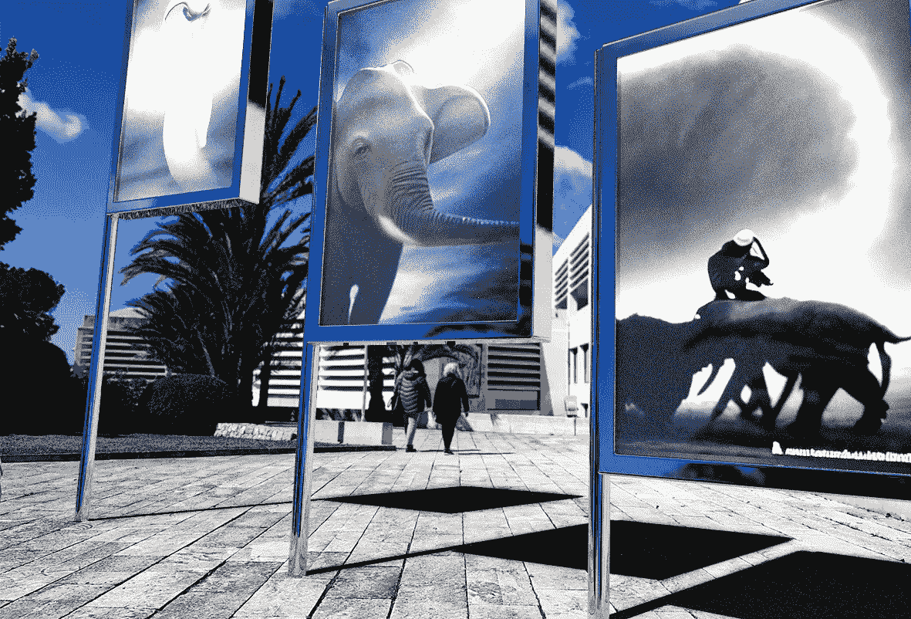

# 网络图片的可信度被毁了

> 原文：<https://medium.com/mlearning-ai/web-pictures-credibility-is-ruined-3e9ff7119a92?source=collection_archive---------2----------------------->

## [机器学习艺术](https://mlearning.substack.com/p/dalle2s-competitive-quick-and-free?r=z7zu8&s=w&utm_campaign=post&utm_medium=web)

## 更快、更好、更自由，Dalle2 的竞争对手

[https://mlearning.substack.com](https://mlearning.substack.com)

AI 艺术品是一个 [**机器学习**](https://mlearning.substack.com) 创造东西的过程。创作艺术品始于决定你想做什么，是一幅油画，一幅素描，还是一件雕塑。一旦你心中有了一个想法，你就开始使用创成技术进行创作。