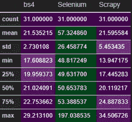
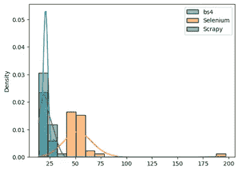
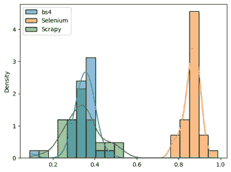

# 刮刀滚道

> 原文：<https://medium.com/mlearning-ai/web-scraper-race-e345fdd161bc?source=collection_archive---------6----------------------->

相对较小的项目使用 ***【美苏】【刺儿】*******硒*** 。*

*我们需要数据来进行数据科学项目。幸运的是，互联网充满了数据。我们可以通过从数据源获取现成的数据或调用 API 来获得这些数据。有时他们在付费墙后面，或者数据不是最新的。那么获取数据的唯一途径就是从网站。对于简单的任务，复制和粘贴就行了。但是对于跨多个页面的大型数据来说，这是不切实际的。在这些情况下，网络抓取可以帮助你提取任何你想要数据。这可以通过几种方式来实现。python 有几个包可以满足这一特定需求。*

*在这些套装中***beautiful soup***和 ***Scrapy*** 是最受欢迎的。Scrapy 是一个专门为从网络下载、清理和保存数据而创建的工具，它将端到端地帮助你；BeautifulSoup 是一个较小的软件包，它只能帮助你从网页中获取信息，而对于其他任务，它依赖于其他软件包。另一方面，Scrapy 有一个围绕这个特定目的构建的框架。另一个流行的选择是 ***硒*** 。尽管 Selenium 不是为此而构建的，但它是用于自动化网站测试的。这样做的一个副产品是，我们可以用它来清理网页。*

*在本文中，我将通过抓取一个目标网站来分析 Python 中三个最流行的 web 抓取工具，这样你就可以选择最适合你的项目的工具。作为旁注，在抓取时要始终保持尊重和道德意识，并遵守目标网站根目录上 robots.txt 中的说明。*

*现在让我解释一下我的过程。我没有为 Beautifulsoup 使用多重处理，多重处理可以一次发送多个请求，从而加快处理速度。我也不会为 Scrapy 部署蜘蛛，尽管这不是首选方式。本文的目的是获得相对较小的项目的性能度量。在这个测试中，两者都利用请求库来获取 html，然后处理响应。*

*我用 jupyter 笔记本进行分析。我的目标网站是 http://books.toscrape.com/。我用 Beautifulsoup，Selenium 和 Scrapy 刮了 31 次前 20 页。然后看处理时间。所有的处理时间都以秒为单位。Beautifulsoup 正在使用 bs4 昵称。*

*这是平均值、标准差、最小值、最大值和四分位数。对于高到低值，颜色代码在行之间从绿色变为深紫色。*

**

*performance metrics*

*从表中，我们看到 bs4 和 scrapy 通过查看平均值，以巨大的优势击败了 selenium。Scrapy 在原始数方面更快。**scrapy 和 bs4 在这个设置上的差别并不大**。*

*Scrapy 可以更快，如果使用其全部潜力，即设置蜘蛛和运行没有依赖，我用了。然而，对于较小的项目来说，这有点矫枉过正。对于不需要经常单独使用的较小项目，则没有必要。Scrapy 太强大了，因此设置起来更复杂。*

*为了可视化，这里是这些数据点的分布，仓大小为 15。这再次证实了调查结果。*

**

*distribution of run time in seconds*

*此外，这里是这些数据点的归一化密度，仓大小为 15。*

**

*normalized distribution of run time*

*让我们概括一下比较:*

# ***美丽的声音:***

**

*bs4*

***优点**它速度快，用户友好，效率高。*

*缺点是它不能解析使用 JavaScript 的现代网页，没有很多可用的插件，不能处理 XPath 表达式等等。*

***使用**进行快速定位。*

# ***刺儿头:***

**

*scrapy*

***优点**它速度快、效率高、具有强大的后处理、自动化、管道和中间件、恢复能力、可以一次处理多个请求、拥有强大的社区和良好的文档记录。*

*缺点是对初学者不友好，学习曲线更陡，不需要太多资源。*

***需要可复用的抓取脚本时使用**，最适合复杂的抓取。*

# ***硒:***

**

*selenium*

***优点**它能处理基于核心 JavaScript 的 web 应用，能发出 AJAX/PJAX 请求，用户输入处理更好。*

***缺点**它不是为报废而造的，对报废来说效率不高。*

*当这是从复杂网站提取数据的唯一选项时使用。*

*所以，归根结底是你的用例场景，没有一个最终的解决方案。当情况需要时，将所有这些保存在您的数据科学工具包中会很方便。他们都有自己的长处和短处。*

*另一方面，熊猫可以用来刮网站，如果它包含表。*

```
*import pandas as pd# get data and store to dataframe
df = pd.read_html('http://example.com/')*
```

*现在，既然这个问题已经解决了，让我们来看看我用来得到结果的代码。文件可以在 GitHub 的这里[找到。](https://github.com/tamjid-ahsan/web-scraper-race)*

***美丽的声音:***

***硒:***

***刺儿头:***

*现在我已经有了所有的列表，让我们把它们转换成 pandas 数据框架并做一些分析。*

*这就是我如何得出以上所有发现和数据的。*

*今天到此为止。下次见！*